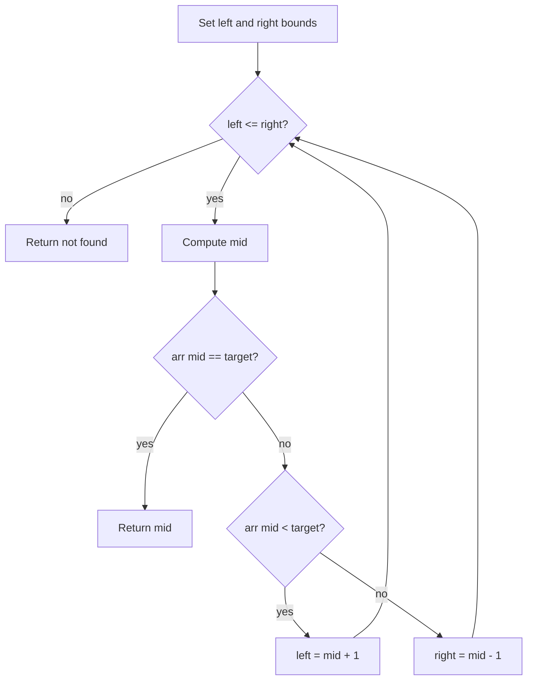

# Binary Search 이진 탐색 학습 및 기록 노트

> 💡 **이 글을 쓰는 이유:** 이진 탐색은 정렬된 공간에서 후보 범위를 절반씩 버리며 O(log N)에 답을 찾는다. 하지만 정렬 전제, 포인터 갱신, 종료 조건 중 하나라도 틀리면 무한 루프나 off-by-one 버그가 바로 생긴다.

---

## 1. 왜 필요한가? (Pain Point & Motivation)

* **이 개념이 구원해 줄 문제:** 정렬된 배열이나 단조 조건을 가진 탐색 공간에서 빠르게 특정 값 또는 경계점을 찾아야 할 때 필요하다.
* **대안들의 한계 (기존의 똥떵어리들):** 선형 탐색은 이해하기 쉽지만 N이 커질수록 느리다. 정렬되어 있다는 정보를 쓰지 않으면 매번 모든 후보를 확인하게 된다.

## 2. 현재 나의 상태 (Baseline)

* **여기까진 안다 (익숙한 땅):** `left`, `right`, `mid` 포인터로 탐색 구간을 관리하고, 중간값과 target을 비교한다.
* **뇌정지 오는 부분 (안개 속):** `left <= right`와 `left < right`, `right = mid - 1`과 `right = mid` 같은 경계 규칙이 문제 유형마다 달라진다.
* **아직은 무리 (워너비):** 단순 값 찾기뿐 아니라 lower bound, upper bound, parametric search로 확장할 때 불변식을 유지해야 한다.

## 3. 도달하고 싶은 목표 (Target State)

* **이 글을 끝내고 할 수 있는 일:** 탐색 구간 안에 답이 남아 있다는 불변식을 기준으로 포인터를 갱신할 수 있다.
* **이것만은 건지자 (최소 성공 기준):** 배열이 정렬되어 있어야 하며, 매 반복마다 탐색 구간이 반드시 줄어들어야 한다는 사실을 코드로 지킨다.

## 4. 시스템 번역 (Data Flow)

*이 개념을 하나의 살아있는 함수나 파이프라인으로 바라보고 해부해 봅니다.*

* **📥 인풋 (Input):** 정렬된 배열, 찾을 값, 또는 참/거짓이 단조로 바뀌는 조건 함수
* **⚙️ 프로세스 (Processing):** 중간 후보를 검사하고, target이 있을 수 없는 절반을 버린 뒤 남은 구간에서 반복한다.
* **📤 아웃풋 (Output):** target의 인덱스, 없으면 실패 값, 또는 조건을 만족하는 첫/마지막 위치
* **💾 상태 (State):** `left`, `right`, `mid`, 현재 탐색 구간, 비교 결과
* **🚨 터지는 조건 (Exception):** 정렬되지 않은 입력, 잘못된 포인터 갱신, 구간이 줄지 않는 mid 처리, 중복 값 경계 처리 누락

## 5. 핵심 구성요소 (Building Blocks)

* **레고 블록 1 (Sorted Predicate):** 왼쪽과 오른쪽 중 어느 구간을 버릴 수 있는지 보장해 주는 정렬/단조 전제다.
* **레고 블록 2 (Bounds):** `left`와 `right`가 현재 살아 있는 후보 구간을 나타낸다.
* **레고 블록 3 (Midpoint Decision):** `arr[mid]`와 target 또는 조건 함수 결과를 비교해 다음 구간을 결정한다.
* **서로 어떻게 맞물려 돌아가는가?:** 정렬 전제가 버릴 절반을 알려 주고, bounds가 후보 공간을 보존하며, midpoint decision이 매번 구간을 줄인다.

## 6. 상태 전이 (State Transition)

*상태가 어떻게 변하는지 흐름을 한눈에 보여줍니다. (표 안의 문장은 짧고 직관적으로!)*

| 초기 상태 | 이벤트 (트리거) | 전이 조건 | 변경 후 상태 | "바뀐 걸 어떻게 알지?" (관찰 방법) |
| :--- | :--- | :--- | :--- | :--- |
| `READY` | 구간 초기화 | 배열 길이가 주어짐 | `RANGE_ACTIVE` | `left=0`, `right=n-1` |
| `RANGE_ACTIVE` | mid 계산 | `left <= right` | `CHECKING` | `mid=(left+right)//2` |
| `CHECKING` | 비교 | `arr[mid] == target` | `FOUND` | `mid` 반환 |
| `CHECKING` | 비교 | `arr[mid] < target` | `RIGHT_HALF` | `left = mid + 1` |
| `CHECKING` | 비교 | `arr[mid] > target` | `LEFT_HALF` | `right = mid - 1` |
| `RANGE_ACTIVE` | 구간 소진 | `left > right` | `NOT_FOUND` | 실패 값 반환 |

## 7. 불변식 (Invariant: 절대 깨지면 안 되는 규칙)

* **하늘이 무너져도 지켜야 할 조건:** target이 존재한다면 항상 현재 탐색 구간 `[left, right]` 안에 남아 있어야 한다.
* **이게 깨지면 생기는 대참사:** 정답 후보를 잘못 버려 실제 target이 있는데도 찾지 못하거나, 구간이 줄지 않아 무한 루프가 생긴다.
* **수수방관 금지 (검증법):** 길이 0, 길이 1, target이 첫/끝/중간/없음, 중복 값 케이스를 모두 테스트한다.

## 8. 가장 작은 예제 (Minimal Viable Example)

* **뇌컴파일이 가능한 수준의 인풋:** `arr = [1, 3, 5, 7, 9]`, `target = 7`
* **한 스텝씩 뜯어보기:** 처음 `mid=2`이고 값은 5다. 7은 더 크므로 왼쪽 절반을 버리고 `left=3`으로 옮긴다. 다음 `mid=3`의 값이 7이라 찾는다.
* **해피 엔딩 (결과):** 인덱스 `3`을 반환한다.



```python
def binary_search(arr, target):
    left, right = 0, len(arr) - 1

    while left <= right:
        mid = (left + right) // 2

        if arr[mid] == target:
            return mid
        if arr[mid] < target:
            left = mid + 1
        else:
            right = mid - 1

    return -1
```

## 9. 실패 사례 (What could go wrong?)

* **폭망 시나리오 1:** 정렬되지 않은 배열에 이진 탐색을 적용해 엉뚱한 절반을 버린다.
* **폭망 시나리오 2:** `left = mid`처럼 구간이 줄지 않는 갱신을 해 무한 루프가 난다.
* **폭망 시나리오 3:** 중복 값에서 첫 번째 위치를 찾아야 하는데 단순 발견 즉시 반환을 사용한다.
* **범인 검거 (어떤 불변식이 깨졌나?):** target이 존재한다면 현재 구간 안에 남아 있어야 한다는 7번 불변식이 깨졌다.

## 10. 뇌 확장하기 (Evolution & Variants)

* **조건을 살짝 바꾸면?:** "값을 찾기"가 아니라 "조건을 처음 만족하는 지점"을 찾는 lower bound에서는 발견 즉시 끝내지 않고 오른쪽 경계를 줄인다.
* **비슷한 놈들과 계급장 떼고 비교하기:** 선형 탐색은 정렬 전제가 없어도 되지만 O(N)이고, 이진 탐색은 정렬/단조 전제가 있을 때 O(log N)이다.
* **다른 데서 써먹기:** 정답 범위 이분 탐색, 최소 가능 용량 찾기, 날짜 경계 찾기, API 결과 페이지 탐색에 응용할 수 있다.

## 11. 최종 체크리스트 (Definition of Done)

*글 작성 후 아래 항목을 채웠는지 확인하는 셀프 검토용 목록이다.*

- [x] 1초 만에 이해하는 한 문장 요약이 있는가?
- [x] 일목요연한 상태 전이 표를 채웠는가?
- [x] 머릿속 그림을 표현한 구조도(다이어그램)가 포함되었는가?
- [x] 직접 굴려본 실습 결과(코드/로그)를 첨부했는가?
- [x] 에러를 마주하고 해결한 오답 노트가 있는가?
- [x] 주니어 동료에게 막힘없이 설명할 수 있는 수준인가?

## 12. 뇌에 새기는 복습 문장 (TL;DR Blank)

*복습 시 이 문장만 보고도 핵심을 떠올릴 수 있도록 빈칸을 채운다.*

> 이 개념은 결국 **정렬된 후보 공간에서 답을 빠르게 찾는 문제**를 해결하기 위해 태어났고,
> 우리가 계속 감시해야 할 핵심 상태는 **left, right, mid가 가리키는 탐색 구간** 이며,
> **중간 후보와 target을 비교하는** 조건이 발동할 때 상태가 바뀐다.
> 그리고 무슨 일이 있어도 **target이 존재한다면 항상 현재 탐색 구간 안에 남아 있어야 한다** 라는 불변식은 반드시 유지되어야만 한다!
