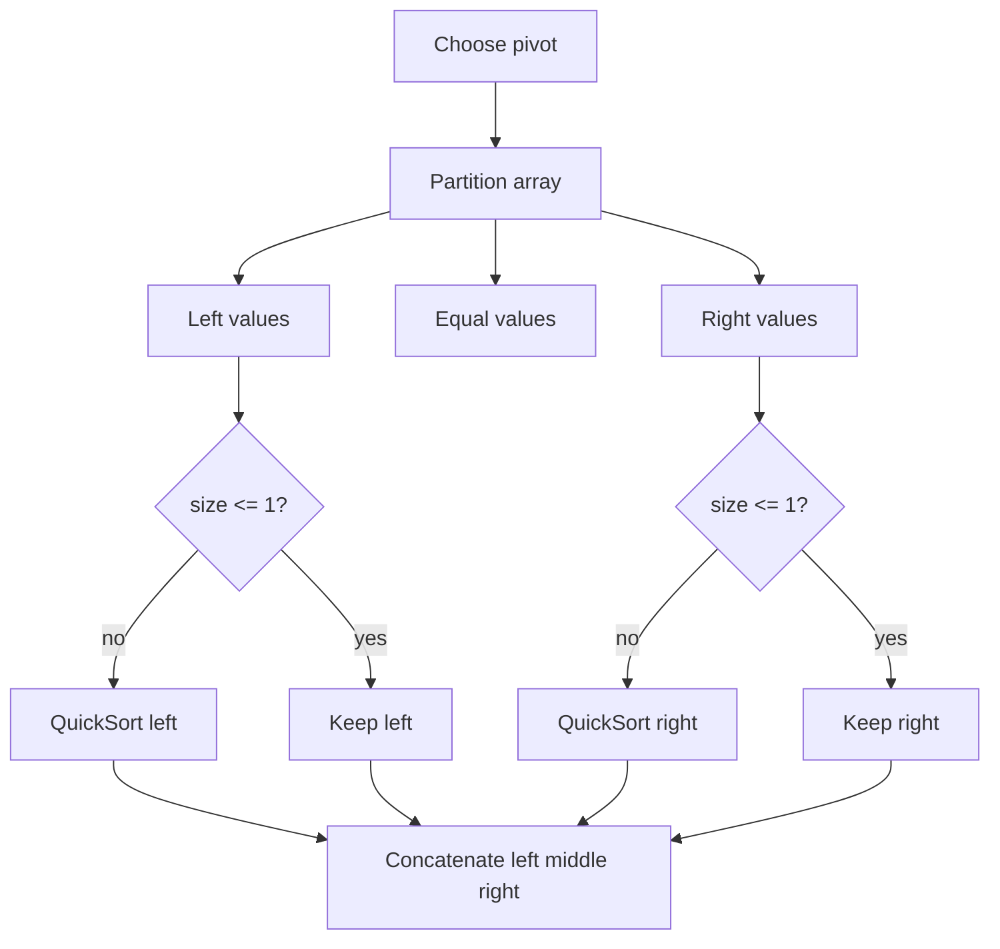

# Quick Sort 퀵 정렬 학습 및 기록 노트

> 💡 **이 글을 쓰는 이유:** Quick Sort는 피벗을 기준으로 작은 값과 큰 값을 나누고, 각 부분을 다시 정렬하는 분할 정복 알고리즘이다. 평균적으로 빠르지만 피벗 선택이 나쁘면 O(N^2)까지 무너진다. 빠른 이유와 터지는 조건을 함께 기억해야 한다.

---

## 1. 왜 필요한가? (Pain Point & Motivation)

* **이 개념이 구원해 줄 문제:** 큰 배열을 평균 O(N log N)에 정렬하고 싶을 때, 특히 비교 기반 정렬의 분할 정복 구조를 이해하는 데 필요하다.
* **대안들의 한계 (기존의 똥떵어리들):** 단순 선택/삽입 정렬은 구현은 쉽지만 O(N^2)이라 큰 입력에 약하다. 병합 정렬은 안정적이지만 추가 메모리가 필요하고, Quick Sort는 피벗만 잘 잡으면 현장에서 매우 빠르다.

## 2. 현재 나의 상태 (Baseline)

* **여기까진 안다 (익숙한 땅):** 피벗을 고르고, 피벗보다 작은 그룹과 큰 그룹으로 분할한 뒤 재귀적으로 정렬한다.
* **뇌정지 오는 부분 (안개 속):** 피벗과 같은 값을 어떻게 처리할지, 이미 정렬된 입력에서 왜 최악이 되는지 헷갈릴 수 있다.
* **아직은 무리 (워너비):** 제자리 partition, 랜덤 피벗, tail recursion 제거 같은 실전 최적화를 상황에 맞게 선택해야 한다.

## 3. 도달하고 싶은 목표 (Target State)

* **이 글을 끝내고 할 수 있는 일:** Quick Sort의 partition 결과가 왜 재귀 정렬 후 전체 정렬을 보장하는지 설명할 수 있다.
* **이것만은 건지자 (최소 성공 기준):** 분할 후 `left < pivot`, `middle == pivot`, `right > pivot` 관계가 반드시 유지되어야 한다는 점을 이해한다.

## 4. 시스템 번역 (Data Flow)

*이 개념을 하나의 살아있는 함수나 파이프라인으로 바라보고 해부해 봅니다.*

* **📥 인풋 (Input):** 비교 가능한 원소 배열
* **⚙️ 프로세스 (Processing):** 피벗을 선택하고 배열을 피벗 기준으로 분할한 뒤, 좌우 부분 배열을 재귀적으로 정렬한다.
* **📤 아웃풋 (Output):** 오름차순 또는 비교 함수 기준으로 정렬된 배열
* **💾 상태 (State):** 현재 부분 배열, 피벗, `left/middle/right` partition, 재귀 호출 스택
* **🚨 터지는 조건 (Exception):** 피벗이 계속 한쪽 끝으로 치우치거나, 중복 값을 처리하지 않거나, 재귀 깊이가 입력 크기까지 커지는 경우

## 5. 핵심 구성요소 (Building Blocks)

* **레고 블록 1 (Pivot):** 배열을 둘 또는 셋으로 나누는 기준 원소다.
* **레고 블록 2 (Partition):** 피벗보다 작은 값, 같은 값, 큰 값을 분리한다.
* **레고 블록 3 (Recursive Conquer):** 분할된 좌우 배열을 같은 방식으로 정렬한다.
* **서로 어떻게 맞물려 돌아가는가?:** partition이 피벗의 상대적 위치를 보장하고, 재귀가 각 부분 배열을 정렬하면 `left + middle + right`가 전체 정렬 결과가 된다.

## 6. 상태 전이 (State Transition)

*상태가 어떻게 변하는지 흐름을 한눈에 보여줍니다. (표 안의 문장은 짧고 직관적으로!)*

| 초기 상태 | 이벤트 (트리거) | 전이 조건 | 변경 후 상태 | "바뀐 걸 어떻게 알지?" (관찰 방법) |
| :--- | :--- | :--- | :--- | :--- |
| `UNSORTED` | 배열 입력 | 길이 2 이상 | `PIVOT_CHOSEN` | 피벗 값 선택 |
| `PIVOT_CHOSEN` | partition 실행 | 모든 원소를 피벗과 비교 | `PARTITIONED` | left/middle/right 그룹 생성 |
| `PARTITIONED` | 재귀 호출 | left 또는 right 크기 2 이상 | `RECURSING` | 부분 배열에 quick sort 적용 |
| `RECURSING` | base case 도달 | 길이 0 또는 1 | `SORTED_PART` | 그대로 반환 |
| `SORTED_PART` | 결과 결합 | 좌우 정렬 완료 | `SORTED` | `left + middle + right` 반환 |

## 7. 불변식 (Invariant: 절대 깨지면 안 되는 규칙)

* **하늘이 무너져도 지켜야 할 조건:** partition 후에는 모든 `left` 원소가 피벗보다 작고, 모든 `right` 원소가 피벗보다 커야 한다.
* **이게 깨지면 생기는 대참사:** 재귀가 아무리 잘 돌아도 결합 결과가 정렬되지 않는다.
* **수수방관 금지 (검증법):** 중복 값, 이미 정렬된 배열, 역정렬 배열, 모든 원소가 같은 배열을 테스트한다.

## 8. 가장 작은 예제 (Minimal Viable Example)

* **뇌컴파일이 가능한 수준의 인풋:** `[5, 1, 4, 2, 3]`
* **한 스텝씩 뜯어보기:** 피벗을 4로 잡으면 `left=[1, 2, 3]`, `middle=[4]`, `right=[5]`가 된다. `left`를 다시 정렬하고 세 그룹을 결합한다.
* **해피 엔딩 (결과):** `[1, 2, 3, 4, 5]`



```python
def quick_sort(arr):
    if len(arr) <= 1:
        return arr

    pivot = arr[len(arr) // 2]
    left = [x for x in arr if x < pivot]
    middle = [x for x in arr if x == pivot]
    right = [x for x in arr if x > pivot]

    return quick_sort(left) + middle + quick_sort(right)
```

## 9. 실패 사례 (What could go wrong?)

* **폭망 시나리오 1:** 첫 원소를 피벗으로 고정한 상태에서 이미 정렬된 배열이 들어와 분할이 한쪽으로만 치우친다.
* **폭망 시나리오 2:** 피벗과 같은 값을 따로 처리하지 않아 중복 값 입력에서 무한 재귀 또는 값 누락이 생긴다.
* **폭망 시나리오 3:** 재귀 깊이가 커져 호출 스택 한계를 넘는다.
* **범인 검거 (어떤 불변식이 깨졌나?):** partition 후 좌우 그룹의 피벗 기준 관계를 유지해야 한다는 7번 불변식이 깨졌다.

## 10. 뇌 확장하기 (Evolution & Variants)

* **조건을 살짝 바꾸면?:** 최악 케이스를 줄이려면 랜덤 피벗, median-of-three, 작은 구간 삽입 정렬 전환 같은 전략을 쓴다.
* **비슷한 놈들과 계급장 떼고 비교하기:** Merge Sort는 항상 O(N log N)이지만 추가 메모리가 필요하고, Quick Sort는 평균적으로 빠르지만 피벗 선택에 민감하다.
* **다른 데서 써먹기:** Quickselect, 순위 통계, in-place partition 기반 필터링, 데이터베이스 partition 아이디어에 응용할 수 있다.

## 11. 최종 체크리스트 (Definition of Done)

*글 작성 후 아래 항목을 채웠는지 확인하는 셀프 검토용 목록이다.*

- [x] 1초 만에 이해하는 한 문장 요약이 있는가?
- [x] 일목요연한 상태 전이 표를 채웠는가?
- [x] 머릿속 그림을 표현한 구조도(다이어그램)가 포함되었는가?
- [x] 직접 굴려본 실습 결과(코드/로그)를 첨부했는가?
- [x] 에러를 마주하고 해결한 오답 노트가 있는가?
- [x] 주니어 동료에게 막힘없이 설명할 수 있는 수준인가?

## 12. 뇌에 새기는 복습 문장 (TL;DR Blank)

*복습 시 이 문장만 보고도 핵심을 떠올릴 수 있도록 빈칸을 채운다.*

> 이 개념은 결국 **정렬 문제를 피벗 기준으로 쪼개 빠르게 해결하는 문제**를 해결하기 위해 태어났고,
> 우리가 계속 감시해야 할 핵심 상태는 **pivot과 partition 결과** 이며,
> **현재 부분 배열을 피벗 기준으로 나누는** 조건이 발동할 때 상태가 바뀐다.
> 그리고 무슨 일이 있어도 **partition 후 left는 피벗보다 작고 right는 피벗보다 커야 한다** 라는 불변식은 반드시 유지되어야만 한다!
