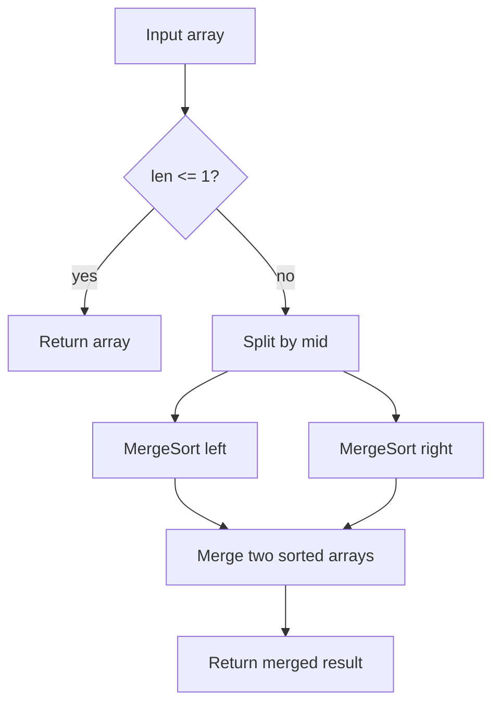

# Merge Sort 병합 정렬 학습 및 기록 노트

> 💡 **이 글을 쓰는 이유:** Merge Sort는 배열을 반으로 쪼개 정렬한 뒤, 두 정렬된 배열을 안정적으로 합치는 분할 정복 정렬이다. 최악의 경우에도 O(N log N)을 보장하지만, 병합을 위한 O(N) 추가 공간이 필요하다.

---

## 1. 왜 필요한가? (Pain Point & Motivation)

* **이 개념이 구원해 줄 문제:** 입력 상태와 무관하게 안정적인 O(N log N) 정렬이 필요하거나, 안정 정렬이 중요한 경우에 필요하다.
* **대안들의 한계 (기존의 똥떵어리들):** Quick Sort는 평균적으로 빠르지만 피벗에 따라 최악 O(N^2)이 될 수 있다. 단순 정렬은 큰 입력에 느리다. Merge Sort는 추가 공간을 쓰는 대신 예측 가능한 시간 복잡도를 준다.

## 2. 현재 나의 상태 (Baseline)

* **여기까진 안다 (익숙한 땅):** 배열을 반으로 나누고, 왼쪽과 오른쪽을 재귀 정렬한 뒤 병합한다.
* **뇌정지 오는 부분 (안개 속):** 병합 단계에서 왜 두 포인터만으로 전체 순서를 만들 수 있는지, 안정성이 어디서 보장되는지 헷갈릴 수 있다.
* **아직은 무리 (워너비):** in-place 병합, linked list 병합 정렬, 외부 정렬 같은 변형까지 자연스럽게 연결해야 한다.

## 3. 도달하고 싶은 목표 (Target State)

* **이 글을 끝내고 할 수 있는 일:** 분할, 재귀 정복, 병합 단계가 각각 어떤 상태를 만들고 보존하는지 설명할 수 있다.
* **이것만은 건지자 (최소 성공 기준):** 병합 함수의 입력 두 배열은 이미 정렬되어 있어야 하며, 작은 값을 앞에서부터 꺼내면 결과도 정렬된다는 불변식을 이해한다.

## 4. 시스템 번역 (Data Flow)

*이 개념을 하나의 살아있는 함수나 파이프라인으로 바라보고 해부해 봅니다.*

* **📥 인풋 (Input):** 비교 가능한 원소 배열
* **⚙️ 프로세스 (Processing):** 배열을 반으로 나누고, 각 절반을 재귀적으로 정렬한 뒤, 두 정렬 배열을 포인터로 비교하며 병합한다.
* **📤 아웃풋 (Output):** 안정적으로 정렬된 배열
* **💾 상태 (State):** 현재 부분 배열, `left/right` 절반, 병합 포인터 `i/j`, 결과 배열
* **🚨 터지는 조건 (Exception):** 병합 입력이 정렬되어 있지 않거나, 잔여 원소를 붙이지 않거나, 추가 메모리 제약이 엄격한 경우

## 5. 핵심 구성요소 (Building Blocks)

* **레고 블록 1 (Divide):** 배열을 거의 같은 크기의 왼쪽/오른쪽 절반으로 나눈다.
* **레고 블록 2 (Conquer):** 각 절반을 같은 방식으로 재귀 정렬한다.
* **레고 블록 3 (Merge):** 이미 정렬된 두 배열을 하나의 정렬 배열로 합친다.
* **서로 어떻게 맞물려 돌아가는가?:** Divide가 문제 크기를 줄이고, Conquer가 작은 정렬 결과를 만들며, Merge가 두 정렬 결과를 보존된 순서로 합쳐 전체 정렬을 만든다.

## 6. 상태 전이 (State Transition)

*상태가 어떻게 변하는지 흐름을 한눈에 보여줍니다. (표 안의 문장은 짧고 직관적으로!)*

| 초기 상태 | 이벤트 (트리거) | 전이 조건 | 변경 후 상태 | "바뀐 걸 어떻게 알지?" (관찰 방법) |
| :--- | :--- | :--- | :--- | :--- |
| `UNSORTED` | 입력 배열 확인 | 길이 2 이상 | `SPLIT` | mid 기준으로 left/right 생성 |
| `SPLIT` | 재귀 호출 | 부분 배열 길이 2 이상 | `SORTING_PARTS` | left/right에 merge sort 적용 |
| `SORTING_PARTS` | base case | 길이 0 또는 1 | `SORTED_PART` | 그대로 반환 |
| `SORTED_PART` | merge 실행 | 두 입력이 정렬됨 | `MERGING` | 작은 값부터 result에 추가 |
| `MERGING` | 잔여 처리 완료 | 한쪽 포인터가 끝에 도달 | `SORTED` | result 길이가 원본 길이와 같음 |

## 7. 불변식 (Invariant: 절대 깨지면 안 되는 규칙)

* **하늘이 무너져도 지켜야 할 조건:** merge 함수가 받는 `left`와 `right`는 각각 이미 정렬되어 있어야 한다.
* **이게 깨지면 생기는 대참사:** 병합 결과가 정렬되지 않고, 재귀 결합 단계 전체가 무너진다.
* **수수방관 금지 (검증법):** `left`, `right`, `result`를 출력하며 병합 포인터가 증가하는 순서를 추적하고, 중복 값의 상대 순서가 유지되는지 확인한다.

## 8. 가장 작은 예제 (Minimal Viable Example)

* **뇌컴파일이 가능한 수준의 인풋:** `[4, 1, 3, 2]`
* **한 스텝씩 뜯어보기:** `[4, 1]`과 `[3, 2]`로 나눈다. 각각 `[1, 4]`, `[2, 3]`으로 정렬된다. 병합 단계에서 1, 2, 3, 4 순서로 결과에 들어간다.
* **해피 엔딩 (결과):** `[1, 2, 3, 4]`



```python
def merge_sort(arr):
    if len(arr) <= 1:
        return arr

    mid = len(arr) // 2
    left = merge_sort(arr[:mid])
    right = merge_sort(arr[mid:])

    return merge(left, right)


def merge(left, right):
    result = []
    i = j = 0

    while i < len(left) and j < len(right):
        if left[i] <= right[j]:
            result.append(left[i])
            i += 1
        else:
            result.append(right[j])
            j += 1

    result.extend(left[i:])
    result.extend(right[j:])
    return result
```

## 9. 실패 사례 (What could go wrong?)

* **폭망 시나리오 1:** 병합 후 남은 왼쪽 또는 오른쪽 원소를 붙이지 않아 값이 사라진다.
* **폭망 시나리오 2:** 중복 값에서 `left[i] <= right[j]` 대신 불필요하게 오른쪽을 먼저 선택해 안정성이 깨진다.
* **폭망 시나리오 3:** 큰 입력에서 매번 slicing으로 새 배열을 만들어 메모리 사용량이 커진다.
* **범인 검거 (어떤 불변식이 깨졌나?):** merge 입력이 이미 정렬되어 있어야 한다는 7번 불변식 또는 병합 결과 길이가 보존되어야 한다는 조건이 깨졌다.

## 10. 뇌 확장하기 (Evolution & Variants)

* **조건을 살짝 바꾸면?:** 메모리를 줄이려면 인덱스 범위를 넘기고 보조 배열을 재사용하는 구현을 고려한다.
* **비슷한 놈들과 계급장 떼고 비교하기:** Quick Sort는 평균적으로 빠르고 in-place 구현이 쉽지만 최악 케이스가 있고, Merge Sort는 추가 공간을 쓰는 대신 안정성과 최악 O(N log N)을 보장한다.
* **다른 데서 써먹기:** 연결 리스트 정렬, 외부 정렬, inversion count, 정렬된 로그/파일 병합에 적용할 수 있다.

## 11. 최종 체크리스트 (Definition of Done)

*글 작성 후 아래 항목을 채웠는지 확인하는 셀프 검토용 목록이다.*

- [x] 1초 만에 이해하는 한 문장 요약이 있는가?
- [x] 일목요연한 상태 전이 표를 채웠는가?
- [x] 머릿속 그림을 표현한 구조도(다이어그램)가 포함되었는가?
- [x] 직접 굴려본 실습 결과(코드/로그)를 첨부했는가?
- [x] 에러를 마주하고 해결한 오답 노트가 있는가?
- [x] 주니어 동료에게 막힘없이 설명할 수 있는 수준인가?

## 12. 뇌에 새기는 복습 문장 (TL;DR Blank)

*복습 시 이 문장만 보고도 핵심을 떠올릴 수 있도록 빈칸을 채운다.*

> 이 개념은 결국 **안정적이고 예측 가능한 정렬을 분할 정복으로 수행하는 문제**를 해결하기 위해 태어났고,
> 우리가 계속 감시해야 할 핵심 상태는 **정렬된 left/right와 merge pointer** 이며,
> **두 정렬 배열을 병합하는** 조건이 발동할 때 상태가 바뀐다.
> 그리고 무슨 일이 있어도 **merge 함수가 받는 left와 right는 각각 이미 정렬되어 있어야 한다** 라는 불변식은 반드시 유지되어야만 한다!
