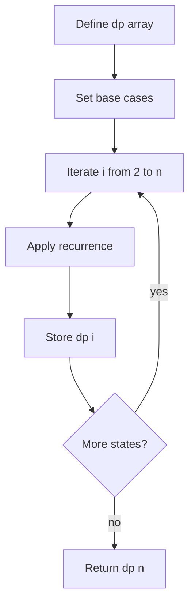

# 1D Dynamic Programming 학습 및 기록 노트

> 💡 **이 글을 쓰는 이유:** 1차원 DP는 이전 상태들의 답을 저장해 두고 현재 상태를 빠르게 계산하는 방식이다. 피보나치, 계단 오르기, 최대 부분합처럼 "이전 몇 칸만 알면 현재 답이 정해지는" 문제에서 중복 계산을 제거한다.

---

## 1. 왜 필요한가? (Pain Point & Motivation)

* **이 개념이 구원해 줄 문제:** 같은 부분 문제를 반복해서 계산하는 재귀를 빠르게 바꾸고 싶을 때 필요하다.
* **대안들의 한계 (기존의 똥떵어리들):** 순수 재귀는 같은 상태를 계속 다시 계산해 지수 시간으로 터진다. 감으로 반복문을 만들면 상태 정의와 점화식이 어긋나서 엉뚱한 값을 저장하기 쉽다.

## 2. 현재 나의 상태 (Baseline)

* **여기까진 안다 (익숙한 땅):** `dp[i]` 같은 배열 칸에 i번째 상태의 정답을 저장한다.
* **뇌정지 오는 부분 (안개 속):** `dp[i]`가 정확히 무엇을 의미하는지 정하지 않은 채 점화식부터 쓰면 인덱스와 base case가 흔들린다.
* **아직은 무리 (워너비):** 공간 최적화로 배열 대신 변수 두세 개만 남길 수 있는지 판단해야 한다.

## 3. 도달하고 싶은 목표 (Target State)

* **이 글을 끝내고 할 수 있는 일:** 상태 정의, base case, 점화식, 계산 순서를 분리해 1차원 DP를 설계할 수 있다.
* **이것만은 건지자 (최소 성공 기준):** `dp[i]`의 의미를 한 문장으로 정의하고, `dp[i]`를 계산하기 전에 필요한 이전 상태들이 이미 계산되어 있어야 한다는 규칙을 지킨다.

## 4. 시스템 번역 (Data Flow)

*이 개념을 하나의 살아있는 함수나 파이프라인으로 바라보고 해부해 봅니다.*

* **📥 인풋 (Input):** 문제 크기 `n`, 초기 조건, 이전 상태에서 현재 상태를 만드는 규칙
* **⚙️ 프로세스 (Processing):** DP 배열을 만들고 base case를 채운 뒤, 작은 인덱스부터 큰 인덱스로 점화식을 적용한다.
* **📤 아웃풋 (Output):** `dp[n]` 또는 전체 DP 테이블
* **💾 상태 (State):** `dp` 배열, 현재 인덱스 `i`, 참조하는 이전 상태들
* **🚨 터지는 조건 (Exception):** base case 누락, 잘못된 인덱스, 계산 순서 오류, 상태 정의와 점화식 불일치

## 5. 핵심 구성요소 (Building Blocks)

* **레고 블록 1 (State Definition):** `dp[i]`가 의미하는 값을 정확히 정한다.
* **레고 블록 2 (Base Case):** 더 작은 상태로 쪼갤 수 없는 시작 값을 채운다.
* **레고 블록 3 (Recurrence):** 이전 상태들로부터 현재 상태를 계산하는 식이다.
* **서로 어떻게 맞물려 돌아가는가?:** 상태 정의가 배열 칸의 의미를 고정하고, base case가 계산의 출발점을 만들며, 점화식이 순서대로 테이블을 채운다.

## 6. 상태 전이 (State Transition)

*상태가 어떻게 변하는지 흐름을 한눈에 보여줍니다. (표 안의 문장은 짧고 직관적으로!)*

| 초기 상태 | 이벤트 (트리거) | 전이 조건 | 변경 후 상태 | "바뀐 걸 어떻게 알지?" (관찰 방법) |
| :--- | :--- | :--- | :--- | :--- |
| `UNDEFINED` | 상태 정의 | `dp[i]` 의미가 정해짐 | `STATE_DEFINED` | 한 문장 정의 가능 |
| `STATE_DEFINED` | base case 입력 | 최소 상태 값이 알려짐 | `BASE_READY` | `dp[0]`, `dp[1]` 등 채워짐 |
| `BASE_READY` | 반복 시작 | 필요한 이전 상태가 계산됨 | `COMPUTING` | `i`가 증가하며 점화식 적용 |
| `COMPUTING` | 점화식 적용 | `dp[i-1]`, `dp[i-2]` 등 참조 가능 | `FILLED` | `dp[i]` 값 저장 |
| `FILLED` | 마지막 인덱스 도달 | `i == n` | `DONE` | `dp[n]` 반환 |

## 7. 불변식 (Invariant: 절대 깨지면 안 되는 규칙)

* **하늘이 무너져도 지켜야 할 조건:** `dp[i]`를 계산할 때 참조하는 모든 이전 상태는 이미 올바르게 계산되어 있어야 한다.
* **이게 깨지면 생기는 대참사:** 초기값이 없는 상태를 읽거나, 잘못된 순서로 계산해 전체 테이블이 오염된다.
* **수수방관 금지 (검증법):** 작은 `n`에 대해 손으로 계산한 테이블과 코드 출력의 `dp` 배열을 비교한다.

## 8. 가장 작은 예제 (Minimal Viable Example)

* **뇌컴파일이 가능한 수준의 인풋:** 계단을 한 번에 1칸 또는 2칸 오를 수 있고, `n=4`일 때 방법 수를 구한다.
* **한 스텝씩 뜯어보기:** `dp[i]`를 i번째 계단에 도달하는 방법 수로 둔다. `dp[0]=1`, `dp[1]=1`이다. `dp[2]=2`, `dp[3]=3`, `dp[4]=5`가 된다.
* **해피 엔딩 (결과):** 4번째 계단에 도달하는 방법은 5가지다.



```python
def count_steps(n):
    dp = [0] * (n + 1)
    dp[0] = 1
    if n >= 1:
        dp[1] = 1

    for i in range(2, n + 1):
        dp[i] = dp[i - 1] + dp[i - 2]

    return dp[n]
```

## 9. 실패 사례 (What could go wrong?)

* **폭망 시나리오 1:** `n=0`이나 `n=1` 같은 작은 입력에서 base case 배열 접근이 터진다.
* **폭망 시나리오 2:** `dp[i]` 의미를 "i번째까지의 답"인지 "i번째에서 끝나는 답"인지 섞어 점화식이 틀린다.
* **폭망 시나리오 3:** 이전 상태만 필요함에도 전체 배열을 유지해 불필요한 메모리를 쓴다.
* **범인 검거 (어떤 불변식이 깨졌나?):** 현재 상태 계산 전에 필요한 이전 상태가 올바르게 준비되어 있어야 한다는 7번 불변식이 깨졌다.

## 10. 뇌 확장하기 (Evolution & Variants)

* **조건을 살짝 바꾸면?:** 이전 두 상태만 필요하다면 `prev2`, `prev1` 변수로 공간을 O(1)로 줄일 수 있다.
* **비슷한 놈들과 계급장 떼고 비교하기:** 1D DP는 상태 축이 하나이고, 2D DP는 위치/용량/구간처럼 상태 축이 둘 이상으로 늘어난다.
* **다른 데서 써먹기:** 피보나치, 계단 오르기, 최대 부분합, 최소 비용 누적, 문자열 prefix 문제에 적용할 수 있다.

## 11. 최종 체크리스트 (Definition of Done)

*글 작성 후 아래 항목을 채웠는지 확인하는 셀프 검토용 목록이다.*

- [x] 1초 만에 이해하는 한 문장 요약이 있는가?
- [x] 일목요연한 상태 전이 표를 채웠는가?
- [x] 머릿속 그림을 표현한 구조도(다이어그램)가 포함되었는가?
- [x] 직접 굴려본 실습 결과(코드/로그)를 첨부했는가?
- [x] 에러를 마주하고 해결한 오답 노트가 있는가?
- [x] 주니어 동료에게 막힘없이 설명할 수 있는 수준인가?

## 12. 뇌에 새기는 복습 문장 (TL;DR Blank)

*복습 시 이 문장만 보고도 핵심을 떠올릴 수 있도록 빈칸을 채운다.*

> 이 개념은 결국 **중복되는 부분 문제를 저장해서 빠르게 계산하는 문제**를 해결하기 위해 태어났고,
> 우리가 계속 감시해야 할 핵심 상태는 **dp[i]의 의미와 이전 상태 값** 이며,
> **점화식으로 현재 인덱스를 채우는** 조건이 발동할 때 상태가 바뀐다.
> 그리고 무슨 일이 있어도 **dp[i]를 계산할 때 참조하는 모든 이전 상태는 이미 올바르게 계산되어 있어야 한다** 라는 불변식은 반드시 유지되어야만 한다!
