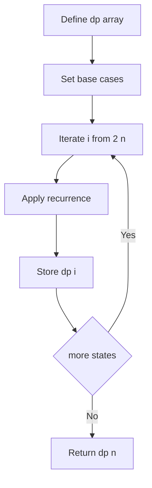
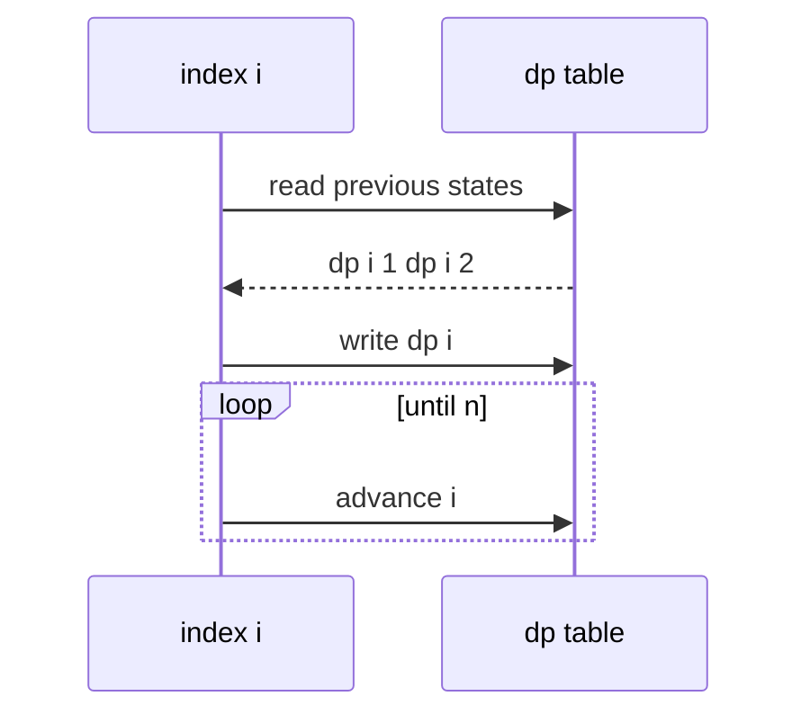

# 1차원 DP (1D Dynamic Programming) - GitHub Pages 해설

## 문서 목적
- 원본 템플릿 `03-dynamic-programming/01-dp-1d.md` 의 내부 동작을 GitHub Markdown에서 바로 읽을 수 있게 설명합니다.
- 코드 레이어(초기화/루프/조건/갱신/종료)를 분해하고, Mermaid로 제어 흐름을 시각화합니다.
- 실전 문제에 붙일 때 반드시 수정해야 하는 지점을 체크리스트로 제공합니다.

## 입력 계약과 완료 판정

현재 코드는 `dp[i] = dp[i-1] + dp[i-2]`, `dp[0] = dp[1] = 1`인 한 가지 수열 예시입니다. “1차원 DP”라는 이름만으로 피보나치, 계단 오르기, 최대 부분 합에 같은 초기값과 점화식을 사용할 수 있다는 뜻이 아닙니다.

- 상태 `dp[i]`의 의미를 먼저 한 문장으로 정의합니다.
- 유효 입력을 `n >= 0`으로 정하고 `n=0`, `n=1`을 배열 생성 전에 처리합니다.
- 점화식이 참인 구간과 필요한 이전 상태를 증명합니다.
- 값이 커질 때 정수 범위나 모듈러 연산 요구를 확인합니다.

완료 조건은 베이스 케이스와 작은 입력을 손으로 계산한 값이 일치하고, 각 반복에서 현재 상태가 이미 계산된 상태만 읽는 것입니다.

## 원본 템플릿
- Source: [03-dynamic-programming/01-dp-1d.md](https://github.com/choisimo/document/blob/main/code/templates/algorithm-architect/03-dynamic-programming/01-dp-1d.md)

## 내부 메커니즘 (Flow)


## 내부 상호작용 (Sequence)


## 핵심 코드
```python
# [1D DP 템플릿: 아키텍트 버전]
# Use Case: 피보나치, 계단 오르기, 최대 부분 합
# Components: DP Table (1차원 배열)
# Constraint: 이전 상태로부터 현재 상태 도출

def dp_1d_template(n):
    if n < 0:
        raise ValueError("n must be non-negative")
    if n <= 1:
        return 1

    # 1. 초기화 (Initialization Layer)
    #    - DP 테이블 생성 및 베이스 케이스 설정
    dp = [0] * (n + 1)
    dp[0] = 1  # 이 예제 수열의 베이스 케이스
    dp[1] = 1
    
    # 2. 상향식 계산 (Bottom-Up Calculation)
    for i in range(2, n + 1):
        # 3. 점화식 (Recurrence Relation)
        #    - 이전 상태들로부터 현재 상태 계산
        dp[i] = dp[i-1] + dp[i-2]  # 예: 피보나치
    
    return dp[n]
```

## 코드 레이어 해설
- **Initialization**: 상태 테이블/포인터/큐/스택/부모 배열 등 탐색의 기준 상태를 만든다.
- **Process Loop / Recursion**: 입력 공간을 순회하며 상태 전이를 반복한다.
- **Decision Rule**: 분기 조건(완화 가능 여부, 유효 선택 여부, 종료 조건)을 적용한다.
- **State Update**: 거리/DP/집합/결과 배열을 갱신하고 다음 단계로 전달한다.
- **Termination**: 목표 도달, 범위 소진, 큐/스택 고갈, 사이클 검출 등으로 종료한다.

## 실전 적용 체크리스트
- 입력 자료구조 형식(인접 리스트, 간선 리스트, 정렬 여부, 1-index/0-index)을 먼저 고정한다.
- 시간 복잡도 한계에 맞게 자료구조를 교체한다 (`list.pop(0)` -> `deque.popleft` 등).
- 실패/예외 경로를 명시한다 (도달 불가, 음수 사이클, 빈 결과, 사이클 존재).
- 테스트는 최소 3개: 정상 케이스, 경계 케이스, 반례 케이스를 포함한다.
