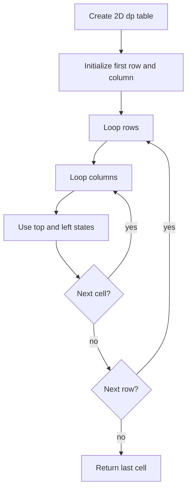

# 2D Dynamic Programming 격자형 학습 및 기록 노트

> 💡 **이 글을 쓰는 이유:** 2차원 DP는 상태가 하나의 인덱스로 끝나지 않을 때 사용한다. 격자 경로, LCS, 편집 거리처럼 `i`와 `j` 두 축이 동시에 의미를 가지는 문제에서는 테이블의 각 칸이 어떤 부분 문제를 뜻하는지 정확히 잡아야 한다.

---

## 1. 왜 필요한가? (Pain Point & Motivation)

* **이 개념이 구원해 줄 문제:** 위치가 행/열로 나뉘거나, 두 문자열/두 배열의 prefix 관계를 비교해야 하는 문제를 체계적으로 푼다.
* **대안들의 한계 (기존의 똥떵어리들):** 재귀로 모든 경로를 탐색하면 같은 칸이나 같은 prefix 조합을 반복 계산한다. 1D DP로 억지로 줄이면 상태 의미가 사라지고 점화식이 꼬일 수 있다.

## 2. 현재 나의 상태 (Baseline)

* **여기까진 안다 (익숙한 땅):** `dp[i][j]`처럼 두 축을 가진 테이블에 부분 문제의 답을 저장한다.
* **뇌정지 오는 부분 (안개 속):** 첫 행과 첫 열 같은 경계 초기화가 내부 점화식과 다르다는 점을 놓치기 쉽다.
* **아직은 무리 (워너비):** 격자 경로 외에 LCS, edit distance처럼 `dp[i][j]` 의미가 달라지는 문제에 맞춰 전이 방향을 재설계해야 한다.

## 3. 도달하고 싶은 목표 (Target State)

* **이 글을 끝내고 할 수 있는 일:** `dp[i][j]`의 의미, 초기 테두리, 내부 전이식을 분리해 설명할 수 있다.
* **이것만은 건지자 (최소 성공 기준):** 현재 칸을 계산하기 전에 참조하는 위쪽/왼쪽/대각선 칸이 이미 계산되어 있어야 한다는 계산 순서를 지킨다.

## 4. 시스템 번역 (Data Flow)

*이 개념을 하나의 살아있는 함수나 파이프라인으로 바라보고 해부해 봅니다.*

* **📥 인풋 (Input):** 격자, 두 문자열, 두 배열, 또는 두 축으로 표현되는 상태 공간
* **⚙️ 프로세스 (Processing):** 2차원 DP 테이블을 만들고 경계값을 채운 뒤, 각 칸을 이전에 계산된 인접 상태로부터 채운다.
* **📤 아웃풋 (Output):** 마지막 칸의 값, 전체 테이블, 또는 테이블을 역추적한 경로/해
* **💾 상태 (State):** `dp[i][j]`, 현재 행/열, 위쪽/왼쪽/대각선 상태, 원본 grid 값
* **🚨 터지는 조건 (Exception):** 빈 입력, 첫 행/열 초기화 누락, 참조 순서 오류, 상태 정의와 전이식 불일치

## 5. 핵심 구성요소 (Building Blocks)

* **레고 블록 1 (2D State Definition):** `dp[i][j]`가 어떤 부분 문제의 답인지 고정한다.
* **레고 블록 2 (Boundary Initialization):** 첫 행, 첫 열, 또는 빈 prefix 같은 시작 조건을 채운다.
* **레고 블록 3 (Transition Rule):** 위/왼쪽/대각선 등 이미 계산된 상태를 조합해 현재 칸을 계산한다.
* **서로 어떻게 맞물려 돌아가는가?:** 상태 정의가 칸의 의미를 만들고, 경계값이 테이블의 출발점을 만들며, 전이식이 행과 열을 따라 답을 확장한다.

## 6. 상태 전이 (State Transition)

*상태가 어떻게 변하는지 흐름을 한눈에 보여줍니다. (표 안의 문장은 짧고 직관적으로!)*

| 초기 상태 | 이벤트 (트리거) | 전이 조건 | 변경 후 상태 | "바뀐 걸 어떻게 알지?" (관찰 방법) |
| :--- | :--- | :--- | :--- | :--- |
| `UNDEFINED` | 상태 정의 | 두 축의 의미가 정해짐 | `STATE_DEFINED` | `dp[i][j]`를 문장으로 설명 |
| `STATE_DEFINED` | 테이블 생성 | 행/열 크기가 유효함 | `TABLE_READY` | 2D 배열 생성 |
| `TABLE_READY` | 경계 초기화 | 첫 행/열 또는 빈 prefix 존재 | `BOUNDARY_READY` | 테두리 값이 채워짐 |
| `BOUNDARY_READY` | 내부 칸 계산 | 참조 칸이 이미 계산됨 | `CELL_FILLED` | `dp[i][j]` 갱신 |
| `CELL_FILLED` | 마지막 칸 도달 | 모든 상태 계산 완료 | `DONE` | 답 반환 |

## 7. 불변식 (Invariant: 절대 깨지면 안 되는 규칙)

* **하늘이 무너져도 지켜야 할 조건:** `dp[i][j]`를 계산할 때 참조하는 모든 선행 칸은 이미 올바르게 계산되어 있어야 한다.
* **이게 깨지면 생기는 대참사:** 아직 채워지지 않은 값을 읽어 최솟값/최댓값이 왜곡되고, 테이블 전체가 틀어진다.
* **수수방관 금지 (검증법):** 2x2 또는 3x3 예제로 테이블을 손으로 채운 뒤 코드의 중간 테이블과 비교한다.

## 8. 가장 작은 예제 (Minimal Viable Example)

* **뇌컴파일이 가능한 수준의 인풋:** 오른쪽/아래로만 이동 가능한 비용 격자 `[[1, 3], [2, 1]]`
* **한 스텝씩 뜯어보기:** `dp[0][0]=1`, 첫 행은 `4`, 첫 열은 `3`이 된다. 마지막 칸은 `grid[1][1] + min(dp[0][1], dp[1][0]) = 1 + min(4, 3) = 4`다.
* **해피 엔딩 (결과):** 최소 경로 비용은 4다.



```python
def min_path_sum(grid):
    rows, cols = len(grid), len(grid[0])
    dp = [[0] * cols for _ in range(rows)]
    dp[0][0] = grid[0][0]

    for j in range(1, cols):
        dp[0][j] = dp[0][j - 1] + grid[0][j]

    for i in range(1, rows):
        dp[i][0] = dp[i - 1][0] + grid[i][0]

    for i in range(1, rows):
        for j in range(1, cols):
            dp[i][j] = grid[i][j] + min(dp[i - 1][j], dp[i][j - 1])

    return dp[rows - 1][cols - 1]
```

## 9. 실패 사례 (What could go wrong?)

* **폭망 시나리오 1:** 빈 grid를 고려하지 않아 `grid[0]` 접근에서 터진다.
* **폭망 시나리오 2:** 첫 행/첫 열을 내부 점화식으로 처리하다가 음수 인덱스나 잘못된 참조가 발생한다.
* **폭망 시나리오 3:** `dp[i][j]` 의미를 경로 비용으로 정해 놓고 전이식은 경로 개수처럼 작성한다.
* **범인 검거 (어떤 불변식이 깨졌나?):** 현재 칸이 참조하는 선행 칸이 이미 올바르게 계산되어 있어야 한다는 7번 불변식이 깨졌다.

## 10. 뇌 확장하기 (Evolution & Variants)

* **조건을 살짝 바꾸면?:** 이전 행만 필요하면 rolling array로 공간을 O(cols)까지 줄일 수 있다.
* **비슷한 놈들과 계급장 떼고 비교하기:** 1D DP는 한 축의 순서만 관리하고, 2D DP는 두 축의 조합 상태를 관리한다.
* **다른 데서 써먹기:** 최단 격자 경로, LCS, edit distance, 정규식 매칭, 구간 DP의 기본 감각으로 이어진다.

## 11. 최종 체크리스트 (Definition of Done)

*글 작성 후 아래 항목을 채웠는지 확인하는 셀프 검토용 목록이다.*

- [x] 1초 만에 이해하는 한 문장 요약이 있는가?
- [x] 일목요연한 상태 전이 표를 채웠는가?
- [x] 머릿속 그림을 표현한 구조도(다이어그램)가 포함되었는가?
- [x] 직접 굴려본 실습 결과(코드/로그)를 첨부했는가?
- [x] 에러를 마주하고 해결한 오답 노트가 있는가?
- [x] 주니어 동료에게 막힘없이 설명할 수 있는 수준인가?

## 12. 뇌에 새기는 복습 문장 (TL;DR Blank)

*복습 시 이 문장만 보고도 핵심을 떠올릴 수 있도록 빈칸을 채운다.*

> 이 개념은 결국 **두 축을 가진 부분 문제를 중복 계산 없이 채우는 문제**를 해결하기 위해 태어났고,
> 우리가 계속 감시해야 할 핵심 상태는 **dp[i][j]와 그 선행 칸들** 이며,
> **경계값을 채우고 내부 칸을 전이식으로 계산하는** 조건이 발동할 때 상태가 바뀐다.
> 그리고 무슨 일이 있어도 **dp[i][j]를 계산할 때 참조하는 모든 선행 칸은 이미 올바르게 계산되어 있어야 한다** 라는 불변식은 반드시 유지되어야만 한다!
