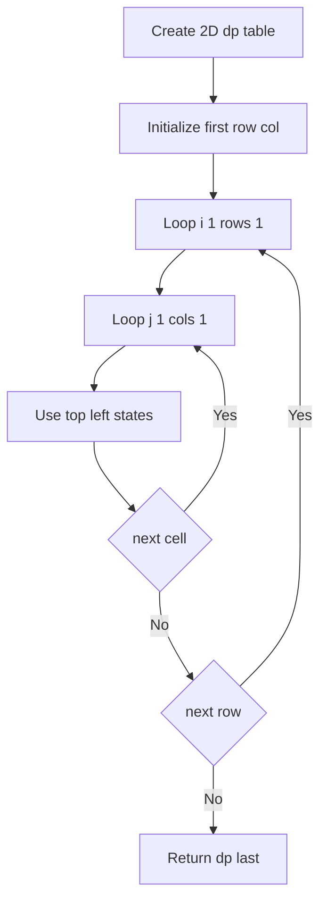
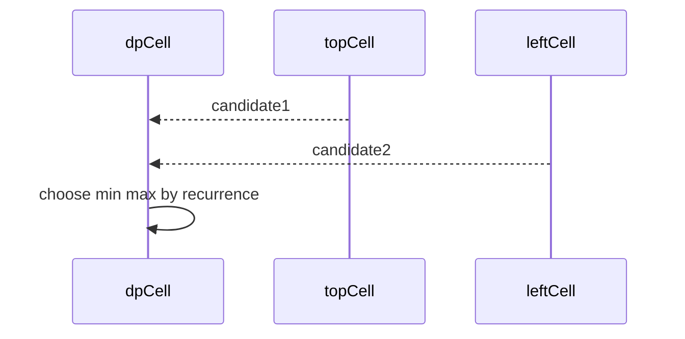

# 2차원 DP (2D Dynamic Programming - 격자형) - GitHub Pages 해설

## 문서 목적
- 원본 템플릿 `03-dynamic-programming/02-dp-2d.md` 의 내부 동작을 GitHub Markdown에서 바로 읽을 수 있게 설명합니다.
- 코드 레이어(초기화/루프/조건/갱신/종료)를 분해하고, Mermaid로 제어 흐름을 시각화합니다.
- 실전 문제에 붙일 때 반드시 수정해야 하는 지점을 체크리스트로 제공합니다.

## 입력 계약과 완료 판정

현재 코드는 위쪽 또는 왼쪽에서만 이동하는 격자의 경로 누적값 예시입니다. LCS와 편집 거리는 상태 의미, 축, 베이스 케이스, 점화식이 다르므로 이 코드를 이름만 바꿔 사용하지 않습니다.

- `grid`는 비어 있지 않고 모든 행의 열 수가 같은 직사각형이어야 합니다.
- 셀 값의 의미, 허용 이동, 장애물, 최소·최대 중 선택 기준을 정의합니다.
- 첫 행과 첫 열 초기화가 시작점에서의 유일한 이동 규칙과 일치해야 합니다.
- 전체 표가 필요한지 마지막 행만으로 공간을 줄일 수 있는지 출력 계약에 따라 선택합니다.

완료 조건은 `1x1`, 한 행, 한 열, 작은 격자의 손 계산 결과가 코드와 일치하고, 각 셀이 이미 확정된 선행 상태만 참조하는 것입니다.

## 원본 템플릿
- Source: [03-dynamic-programming/02-dp-2d.md](https://github.com/choisimo/document/blob/main/code/templates/algorithm-architect/03-dynamic-programming/02-dp-2d.md)

## 내부 메커니즘 (Flow)


## 내부 상호작용 (Sequence)


## 핵심 코드
```python
# [2D DP 템플릿: 아키텍트 버전]
# Use Case: 격자 경로, LCS, 편집 거리
# Components: 2D DP Table
# Constraint: 2차원 상태 관리

def dp_2d_grid(grid):
    if not grid or not grid[0] or any(len(row) != len(grid[0]) for row in grid):
        raise ValueError("grid must be a non-empty rectangle")

    # 1. 초기화 (Initialization Layer)
    rows, cols = len(grid), len(grid[0])
    dp = [[0] * cols for _ in range(rows)]
    
    # 2. 베이스 케이스 (Base Case)
    dp[0][0] = grid[0][0]
    
    # 첫 행 초기화
    for j in range(1, cols):
        dp[0][j] = dp[0][j-1] + grid[0][j]
    
    # 첫 열 초기화
    for i in range(1, rows):
        dp[i][0] = dp[i-1][0] + grid[i][0]
    
    # 3. 2중 루프 (Double Loop)
    for i in range(1, rows):
        for j in range(1, cols):
            # 4. 점화식 (Recurrence)
            #    - 위에서 오거나 왼쪽에서 오거나
            dp[i][j] = grid[i][j] + min(dp[i-1][j], dp[i][j-1])
    
    return dp[rows-1][cols-1]
```

## 코드 레이어 해설
- **Initialization**: 상태 테이블/포인터/큐/스택/부모 배열 등 탐색의 기준 상태를 만든다.
- **Process Loop / Recursion**: 입력 공간을 순회하며 상태 전이를 반복한다.
- **Decision Rule**: 분기 조건(완화 가능 여부, 유효 선택 여부, 종료 조건)을 적용한다.
- **State Update**: 거리/DP/집합/결과 배열을 갱신하고 다음 단계로 전달한다.
- **Termination**: 목표 도달, 범위 소진, 큐/스택 고갈, 사이클 검출 등으로 종료한다.

## 실전 적용 체크리스트
- 입력 자료구조 형식(인접 리스트, 간선 리스트, 정렬 여부, 1-index/0-index)을 먼저 고정한다.
- 시간 복잡도 한계에 맞게 자료구조를 교체한다 (`list.pop(0)` -> `deque.popleft` 등).
- 실패/예외 경로를 명시한다 (도달 불가, 음수 사이클, 빈 결과, 사이클 존재).
- 테스트는 최소 3개: 정상 케이스, 경계 케이스, 반례 케이스를 포함한다.
