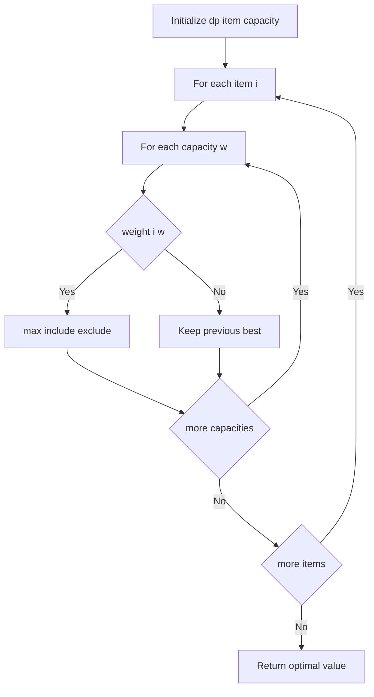
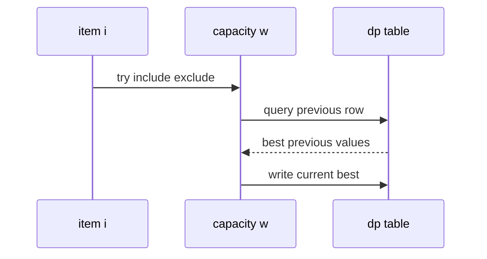

# 냅색 문제 (Knapsack) - GitHub Pages 해설

## 문서 목적
- 원본 템플릿 `03-dynamic-programming/03-knapsack.md` 의 내부 동작을 GitHub Markdown에서 바로 읽을 수 있게 설명합니다.
- 코드 레이어(초기화/루프/조건/갱신/종료)를 분해하고, Mermaid로 제어 흐름을 시각화합니다.
- 실전 문제에 붙일 때 반드시 수정해야 하는 지점을 체크리스트로 제공합니다.

## 원본 템플릿
- Source: [03-dynamic-programming/03-knapsack.md](https://github.com/choisimo/document/blob/main/code/templates/algorithm-architect/03-dynamic-programming/03-knapsack.md)

## 내부 메커니즘 (Flow)


## 내부 상호작용 (Sequence)


## 핵심 코드
```python
# [0/1 Knapsack 템플릿: 아키텍트 버전]
# Use Case: 배낭에 물건 넣기 (각 물건 0개 또는 1개)
# Components: 2D DP (items x capacity)
# Constraint: 무게 제한 내 최대 가치

def knapsack_01(weights, values, capacity):
    # 1. 초기화 (Initialization Layer)
    n = len(weights)
    dp = [[0] * (capacity + 1) for _ in range(n + 1)]
    
    # 2. 2중 루프 (Double Loop)
    #    - i: 물건 인덱스
    #    - w: 현재 용량
    for i in range(1, n + 1):
        for w in range(1, capacity + 1):
            # 3. 선택 로직 (Choice Logic)
            #    - 물건을 넣을 수 있는가?
            if weights[i-1] <= w:
                # 넣는 경우 vs 안 넣는 경우
                include = values[i-1] + dp[i-1][w - weights[i-1]]
                exclude = dp[i-1][w]
                dp[i][w] = max(include, exclude)
            else:
                # 넣을 수 없으면 이전 값 유지
                dp[i][w] = dp[i-1][w]
    
    return dp[n][capacity]
```

## 적용 계약
- **입력**: `weights`와 `values`는 길이가 같고, `capacity`는 0 이상의 정수이며, 이 구현에서는 각 무게를 양의 정수로 제한한다.
- **상태**: `dp[i][w]`는 앞의 `i`개 물건만 고려했을 때 용량 `w`에서 얻는 최대 가치다. 각 물건은 최대 한 번만 선택한다.
- **출력**: 최대 가치만 반환하며 선택한 물건 목록은 복원하지 않는다.
- **비용**: 물건 수를 `n`, 용량을 `C`라 할 때 시간과 공간은 `O(nC)`다. `C`의 숫자 크기에 의존하는 의사 다항 시간 알고리즘이다.

## 완료 증거
- 두 입력 배열의 길이 불일치와 음수·비정수 용량을 어떻게 처리할지 호출 계약에 명시한다.
- 빈 물건 목록, 용량 0, 어떤 물건도 담을 수 없는 경우, 넣기와 제외가 경합하는 경우의 기대값을 확인한다.
- 선택 목록이 필요한 문제라면 역추적 정보 또는 별도 복원 단계를 추가한 뒤 완료로 판정한다.
