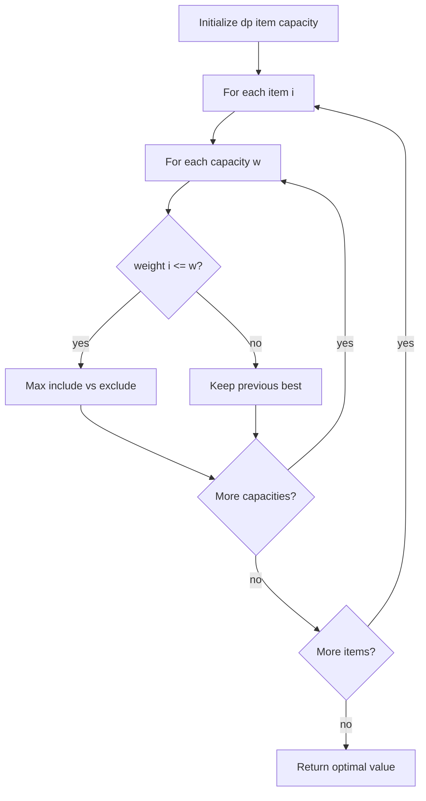

# 0/1 Knapsack 냅색 문제 학습 및 기록 노트

> 💡 **이 글을 쓰는 이유:** 0/1 Knapsack은 제한된 용량 안에서 물건을 넣을지 말지 결정해 최대 가치를 만드는 DP 문제다. 각 물건은 한 번만 선택할 수 있기 때문에 "이전 물건까지만 고려한 상태"를 참조해야 한다는 점이 핵심이다.

---

## 1. 왜 필요한가? (Pain Point & Motivation)

* **이 개념이 구원해 줄 문제:** 무게 제한, 예산 제한, 시간 제한처럼 자원이 정해져 있고 각 후보를 선택/비선택해야 하는 최적화 문제를 푼다.
* **대안들의 한계 (기존의 똥떵어리들):** 모든 조합을 완전 탐색하면 물건 수가 늘어날 때 2^N으로 터진다. 탐욕적으로 가치가 큰 물건이나 가치/무게 비율이 좋은 물건만 고르면 0/1 조건에서는 최적해를 놓칠 수 있다.

## 2. 현재 나의 상태 (Baseline)

* **여기까진 안다 (익숙한 땅):** `dp[i][w]`는 앞에서 i개 물건만 고려하고 용량이 w일 때의 최대 가치로 둘 수 있다.
* **뇌정지 오는 부분 (안개 속):** 물건을 넣는 경우는 `i-1`행의 남은 용량을 참조해야 한다. 같은 행을 참조하면 같은 물건을 여러 번 쓰는 unbounded knapsack이 되어 버린다.
* **아직은 무리 (워너비):** 1차원 배열로 최적화할 때 용량을 왜 역순으로 순회해야 하는지 정확히 이해해야 한다.

## 3. 도달하고 싶은 목표 (Target State)

* **이 글을 끝내고 할 수 있는 일:** include/exclude 선택이 DP 테이블에서 어떤 셀을 참조하는지 설명할 수 있다.
* **이것만은 건지자 (최소 성공 기준):** 0/1 Knapsack에서는 각 물건을 한 번만 사용할 수 있으므로 현재 물건을 넣는 계산은 이전 행의 값을 참조해야 한다.

## 4. 시스템 번역 (Data Flow)

*이 개념을 하나의 살아있는 함수나 파이프라인으로 바라보고 해부해 봅니다.*

* **📥 인풋 (Input):** 물건별 무게 배열, 가치 배열, 배낭 용량
* **⚙️ 프로세스 (Processing):** 물건을 하나씩 고려하며 각 용량마다 "넣는 경우"와 "안 넣는 경우" 중 더 큰 가치를 저장한다.
* **📤 아웃풋 (Output):** 용량 제한 안에서 얻을 수 있는 최대 가치, 필요하면 선택한 물건 목록
* **💾 상태 (State):** `dp[i][w]`, 현재 물건 `i`, 현재 용량 `w`, include/exclude 후보 값
* **🚨 터지는 조건 (Exception):** 현재 행을 잘못 참조해 같은 물건을 중복 사용하거나, 무게/가치 배열 길이가 다르거나, 용량 순회를 잘못해 최적화 버전이 깨지는 경우

## 5. 핵심 구성요소 (Building Blocks)

* **레고 블록 1 (Item Index):** 지금까지 고려한 물건의 개수를 나타낸다.
* **레고 블록 2 (Capacity):** 현재 사용할 수 있는 배낭 용량이다.
* **레고 블록 3 (Choice):** 현재 물건을 넣을지 말지 결정하는 include/exclude 비교다.
* **서로 어떻게 맞물려 돌아가는가?:** 물건 인덱스가 선택 후보 범위를 제한하고, 용량이 넣을 수 있는지 결정하며, choice가 현재 셀의 최대 가치를 만든다.

## 6. 상태 전이 (State Transition)

*상태가 어떻게 변하는지 흐름을 한눈에 보여줍니다. (표 안의 문장은 짧고 직관적으로!)*

| 초기 상태 | 이벤트 (트리거) | 전이 조건 | 변경 후 상태 | "바뀐 걸 어떻게 알지?" (관찰 방법) |
| :--- | :--- | :--- | :--- | :--- |
| `EMPTY_TABLE` | DP 테이블 생성 | 물건 수와 용량이 주어짐 | `BASE_READY` | 0행/0열이 0 |
| `BASE_READY` | 물건 i 선택 | `1 <= i <= n` | `ITEM_ACTIVE` | 현재 물건 무게/가치 확인 |
| `ITEM_ACTIVE` | 용량 w 검사 | `weight[i-1] <= w` | `CAN_INCLUDE` | include 후보 계산 |
| `ITEM_ACTIVE` | 용량 w 검사 | `weight[i-1] > w` | `EXCLUDE_ONLY` | 이전 행 값 유지 |
| `CAN_INCLUDE` | max 선택 | include/exclude 비교 완료 | `CELL_FILLED` | `dp[i][w]` 저장 |
| `CELL_FILLED` | 마지막 셀 도달 | 모든 물건/용량 처리 | `DONE` | `dp[n][capacity]` 반환 |

## 7. 불변식 (Invariant: 절대 깨지면 안 되는 규칙)

* **하늘이 무너져도 지켜야 할 조건:** `dp[i][w]`는 i번째 물건까지 고려했을 때 용량 w에서 가능한 최대 가치여야 한다.
* **이게 깨지면 생기는 대참사:** 같은 물건을 여러 번 쓰거나, 선택 가능한 물건을 빼먹어 최적값이 실제보다 커지거나 작아진다.
* **수수방관 금지 (검증법):** 작은 물건 2~3개로 모든 조합을 손으로 나열하고 DP 테이블 값과 비교한다.

## 8. 가장 작은 예제 (Minimal Viable Example)

* **뇌컴파일이 가능한 수준의 인풋:** 무게 `[2, 3]`, 가치 `[4, 5]`, 용량 `3`
* **한 스텝씩 뜯어보기:** 첫 물건만 보면 용량 2 이상에서 가치는 4다. 두 번째 물건은 용량 3에서 넣을 수 있고 가치 5가 된다. 두 물건을 함께 넣으면 무게 5라 불가능하다.
* **해피 엔딩 (결과):** 최대 가치는 5다.



```python
def knapsack_01(weights, values, capacity):
    n = len(weights)
    dp = [[0] * (capacity + 1) for _ in range(n + 1)]

    for i in range(1, n + 1):
        weight = weights[i - 1]
        value = values[i - 1]
        for w in range(1, capacity + 1):
            if weight <= w:
                include = value + dp[i - 1][w - weight]
                exclude = dp[i - 1][w]
                dp[i][w] = max(include, exclude)
            else:
                dp[i][w] = dp[i - 1][w]

    return dp[n][capacity]
```

## 9. 실패 사례 (What could go wrong?)

* **폭망 시나리오 1:** include 계산에서 `dp[i][w-weight]`를 참조해 같은 물건을 여러 번 선택한다.
* **폭망 시나리오 2:** 1차원 최적화에서 용량을 오름차순으로 순회해 unbounded knapsack처럼 바뀐다.
* **폭망 시나리오 3:** 무게와 가치 배열 길이가 달라 인덱스가 어긋난다.
* **범인 검거 (어떤 불변식이 깨졌나?):** `dp[i][w]`가 i번째 물건까지 고려한 최대 가치여야 한다는 7번 불변식이 깨졌다.

## 10. 뇌 확장하기 (Evolution & Variants)

* **조건을 살짝 바꾸면?:** 물건을 무한히 쓸 수 있으면 unbounded knapsack이 되고, 1D DP에서 용량을 오름차순으로 순회한다.
* **비슷한 놈들과 계급장 떼고 비교하기:** 0/1 Knapsack은 각 물건을 선택하거나 말거나이고, fractional knapsack은 쪼갤 수 있어서 탐욕이 통한다.
* **다른 데서 써먹기:** 예산 배분, 작업 선택, 제한된 시간 안의 점수 최대화, 메모리 제한 최적화 문제에 적용할 수 있다.

## 11. 최종 체크리스트 (Definition of Done)

*글 작성 후 아래 항목을 채웠는지 확인하는 셀프 검토용 목록이다.*

- [x] 1초 만에 이해하는 한 문장 요약이 있는가?
- [x] 일목요연한 상태 전이 표를 채웠는가?
- [x] 머릿속 그림을 표현한 구조도(다이어그램)가 포함되었는가?
- [x] 직접 굴려본 실습 결과(코드/로그)를 첨부했는가?
- [x] 에러를 마주하고 해결한 오답 노트가 있는가?
- [x] 주니어 동료에게 막힘없이 설명할 수 있는 수준인가?

## 12. 뇌에 새기는 복습 문장 (TL;DR Blank)

*복습 시 이 문장만 보고도 핵심을 떠올릴 수 있도록 빈칸을 채운다.*

> 이 개념은 결국 **제한된 용량 안에서 선택 조합의 최대 가치를 찾는 문제**를 해결하기 위해 태어났고,
> 우리가 계속 감시해야 할 핵심 상태는 **dp[i][w]의 물건 범위와 용량** 이며,
> **현재 물건을 넣을 수 있는지 비교하는** 조건이 발동할 때 상태가 바뀐다.
> 그리고 무슨 일이 있어도 **dp[i][w]는 i번째 물건까지 고려했을 때 용량 w에서 가능한 최대 가치여야 한다** 라는 불변식은 반드시 유지되어야만 한다!
