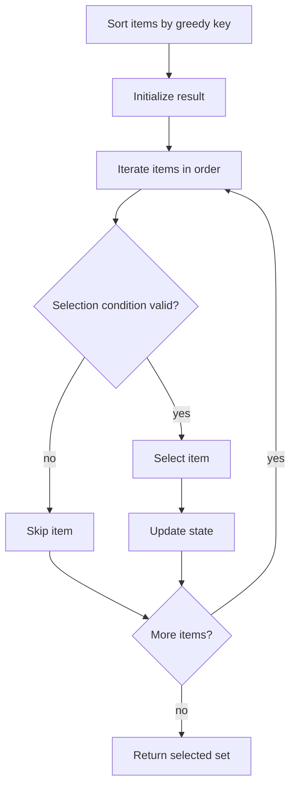

# Greedy 탐욕 알고리즘 학습 및 기록 노트

> 💡 **이 글을 쓰는 이유:** Greedy는 매 순간 가장 좋아 보이는 선택을 하면서 전체 최적해를 얻으려는 전략이다. 구현은 짧지만, 탐욕 선택이 왜 전체 최적을 보장하는지 증명하지 못하면 그저 운 좋은 휴리스틱이 된다.

---

## 1. 왜 필요한가? (Pain Point & Motivation)

* **이 개념이 구원해 줄 문제:** 모든 조합을 탐색하지 않고도 정렬과 선택 규칙만으로 최적해를 구할 수 있는 문제를 빠르게 해결한다.
* **대안들의 한계 (기존의 똥떵어리들):** 완전 탐색은 후보가 많으면 터지고, DP는 상태가 커질 수 있다. 하지만 탐욕 조건이 성립하지 않는 문제에 Greedy를 쓰면 빠르게 틀린 답을 낸다.

## 2. 현재 나의 상태 (Baseline)

* **여기까진 안다 (익숙한 땅):** 보통 정렬 기준을 정하고, 앞에서부터 가능한 후보를 선택한다.
* **뇌정지 오는 부분 (안개 속):** "지금 최선"이 "전체 최선"이 되는 이유를 교환 논증이나 귀납으로 설명해야 한다.
* **아직은 무리 (워너비):** 문제마다 어떤 정렬 키가 맞는지, Greedy가 아니라 DP가 필요한 반례는 무엇인지 판단해야 한다.

## 3. 도달하고 싶은 목표 (Target State)

* **이 글을 끝내고 할 수 있는 일:** Greedy 알고리즘을 적용하기 전에 탐욕적 선택 속성과 최적 부분 구조를 점검할 수 있다.
* **이것만은 건지자 (최소 성공 기준):** 정렬 기준, 선택 조건, 상태 업데이트를 분리하고, 반례로 검증한다.

## 4. 시스템 번역 (Data Flow)

*이 개념을 하나의 살아있는 함수나 파이프라인으로 바라보고 해부해 봅니다.*

* **📥 인풋 (Input):** 후보 목록, 각 후보의 비용/시간/가치, 선택 가능 조건
* **⚙️ 프로세스 (Processing):** 탐욕 기준으로 후보를 정렬하고, 순서대로 보며 현재 상태에서 유효한 후보를 선택한다.
* **📤 아웃풋 (Output):** 선택된 후보 집합, 총 비용/가치, 또는 최적 판정 결과
* **💾 상태 (State):** 정렬된 후보 목록, 현재 결과, 마지막 선택, 남은 자원, 선택 가능 조건
* **🚨 터지는 조건 (Exception):** 정렬 기준이 틀리거나, 탐욕 선택 속성이 성립하지 않거나, 선택 후 상태 갱신을 누락하는 경우

## 5. 핵심 구성요소 (Building Blocks)

* **레고 블록 1 (Greedy Key):** 후보를 어떤 기준으로 볼지 결정하는 정렬 키다.
* **레고 블록 2 (Selection Condition):** 현재 후보를 선택해도 제약을 깨지 않는지 확인한다.
* **레고 블록 3 (Exchange Argument):** 지금 선택한 후보가 최적해의 어떤 후보와 바뀌어도 손해가 없음을 설명하는 증명 도구다.
* **서로 어떻게 맞물려 돌아가는가?:** 정렬 키가 후보 순서를 만들고, 선택 조건이 유효한 후보만 결과에 넣으며, 교환 논증이 그 선택이 최적해를 잃지 않는다는 근거가 된다.

## 6. 상태 전이 (State Transition)

*상태가 어떻게 변하는지 흐름을 한눈에 보여줍니다. (표 안의 문장은 짧고 직관적으로!)*

| 초기 상태 | 이벤트 (트리거) | 전이 조건 | 변경 후 상태 | "바뀐 걸 어떻게 알지?" (관찰 방법) |
| :--- | :--- | :--- | :--- | :--- |
| `UNSORTED` | 기준 선택 | 탐욕 키가 정해짐 | `SORTED` | 후보가 key 순서로 정렬됨 |
| `SORTED` | 후보 검사 | 선택 조건을 만족함 | `SELECTED` | result에 후보 추가 |
| `SORTED` | 후보 검사 | 제약을 깨뜨림 | `SKIPPED` | result 변화 없음 |
| `SELECTED` | 상태 갱신 | 선택이 확정됨 | `STATE_UPDATED` | 마지막 선택/남은 자원 갱신 |
| `STATE_UPDATED` | 모든 후보 처리 | 더 볼 후보 없음 | `DONE` | 선택 집합 반환 |

## 7. 불변식 (Invariant: 절대 깨지면 안 되는 규칙)

* **하늘이 무너져도 지켜야 할 조건:** 선택된 후보 집합은 항상 문제의 제약 조건을 만족해야 한다.
* **이게 깨지면 생기는 대참사:** 결과가 빠르게 만들어져도 유효하지 않은 해가 되거나, 최적성 증명을 할 수 없다.
* **수수방관 금지 (검증법):** 작은 입력에서 모든 조합을 완전 탐색한 최적해와 Greedy 결과를 비교하고, 의도적으로 반례를 만들어 본다.

## 8. 가장 작은 예제 (Minimal Viable Example)

* **뇌컴파일이 가능한 수준의 인풋:** 회의 `(시작, 종료)` 목록 `[(1, 3), (2, 4), (3, 5)]`
* **한 스텝씩 뜯어보기:** 종료 시간이 빠른 순서로 정렬한다. `(1, 3)`을 선택하면 다음에는 시작 시간이 3 이상인 `(3, 5)`만 선택할 수 있다.
* **해피 엔딩 (결과):** 서로 겹치지 않는 회의 2개를 선택한다.



```python
def select_meetings(meetings):
    meetings = sorted(meetings, key=lambda item: item[1])
    result = []
    last_end = None

    for start, end in meetings:
        if last_end is None or start >= last_end:
            result.append((start, end))
            last_end = end

    return result
```

## 9. 실패 사례 (What could go wrong?)

* **폭망 시나리오 1:** 회의실 문제에서 시작 시간이 빠른 순서로 고르다가 더 많은 회의를 놓친다.
* **폭망 시나리오 2:** 0/1 Knapsack을 가치/무게 비율 Greedy로 풀어 최적해를 놓친다.
* **폭망 시나리오 3:** 선택 후 상태를 갱신하지 않아 이후 후보의 유효성 검사가 틀어진다.
* **범인 검거 (어떤 불변식이 깨졌나?):** 선택된 후보 집합이 항상 제약 조건을 만족해야 한다는 7번 불변식 또는 탐욕 선택의 최적성 근거가 깨졌다.

## 10. 뇌 확장하기 (Evolution & Variants)

* **조건을 살짝 바꾸면?:** 후보를 쪼갤 수 있는 fractional knapsack은 Greedy가 통하지만, 쪼갤 수 없는 0/1 knapsack은 DP가 필요하다.
* **비슷한 놈들과 계급장 떼고 비교하기:** Greedy는 선택을 되돌리지 않고, DP는 여러 상태의 최적값을 저장해 비교한다.
* **다른 데서 써먹기:** 회의실 배정, 동전 거스름돈의 특정 조건, Huffman coding, MST의 Kruskal/Prim 같은 알고리즘에서 사용된다.

## 11. 최종 체크리스트 (Definition of Done)

*글 작성 후 아래 항목을 채웠는지 확인하는 셀프 검토용 목록이다.*

- [x] 1초 만에 이해하는 한 문장 요약이 있는가?
- [x] 일목요연한 상태 전이 표를 채웠는가?
- [x] 머릿속 그림을 표현한 구조도(다이어그램)가 포함되었는가?
- [x] 직접 굴려본 실습 결과(코드/로그)를 첨부했는가?
- [x] 에러를 마주하고 해결한 오답 노트가 있는가?
- [x] 주니어 동료에게 막힘없이 설명할 수 있는 수준인가?

## 12. 뇌에 새기는 복습 문장 (TL;DR Blank)

*복습 시 이 문장만 보고도 핵심을 떠올릴 수 있도록 빈칸을 채운다.*

> 이 개념은 결국 **모든 조합을 보지 않고도 최적 선택을 빠르게 만드는 문제**를 해결하기 위해 태어났고,
> 우리가 계속 감시해야 할 핵심 상태는 **정렬된 후보와 선택된 결과 집합** 이며,
> **탐욕 기준에 따라 후보를 선택하거나 건너뛰는** 조건이 발동할 때 상태가 바뀐다.
> 그리고 무슨 일이 있어도 **선택된 후보 집합은 항상 문제의 제약 조건을 만족해야 한다** 라는 불변식은 반드시 유지되어야만 한다!
