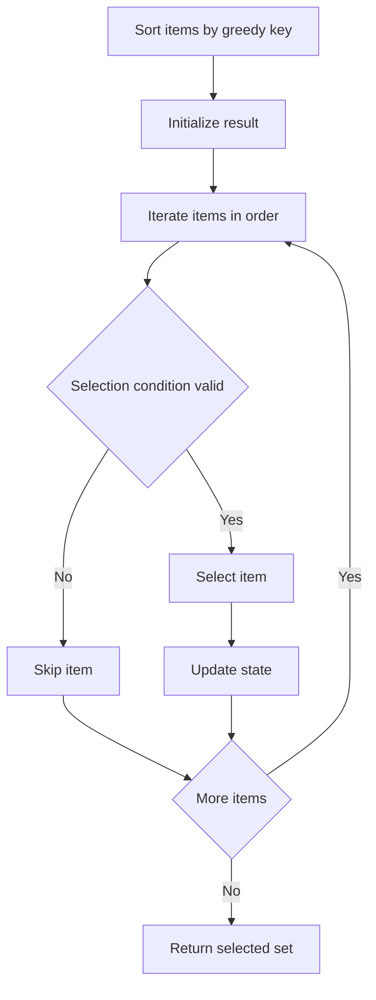
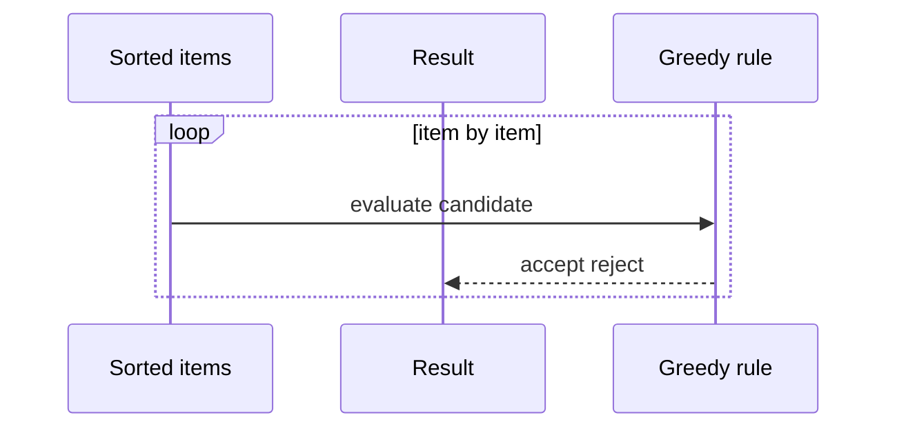

# 그리디 (Greedy) - GitHub Pages 해설

## 문서 목적
- 원본 템플릿 `04-greedy/01-greedy.md` 의 내부 동작을 GitHub Markdown에서 바로 읽을 수 있게 설명합니다.
- 코드 레이어(초기화/루프/조건/갱신/종료)를 분해하고, Mermaid로 제어 흐름을 시각화합니다.
- 실전 문제에 붙일 때 반드시 수정해야 하는 지점을 체크리스트로 제공합니다.

## 원본 템플릿
- Source: [04-greedy/01-greedy.md](https://github.com/choisimo/document/blob/main/code/templates/algorithm-architect/04-greedy/01-greedy.md)

## 내부 메커니즘 (Flow)


## 내부 상호작용 (Sequence)


## 핵심 코드
```python
# [Greedy 템플릿: 아키텍트 버전]
# Use Case: 최적 부분 구조, 탐욕적 선택 속성
# Components: Sorting (대부분), Selection Logic
# Constraint: 매 순간 최선의 선택이 전체 최적해 보장해야 함

def greedy_template(items):
    # 1. 정렬 레이어 (Sorting Layer)
    #    - 그리디 기준에 따라 정렬
    items.sort(key=lambda x: x[1])  # 예: 종료 시간 기준
    
    # 2. 초기화 (Initialization)
    result = []
    last_selected = None
    
    # 3. 순차 선택 (Sequential Selection)
    for item in items:
        # 4. 선택 조건 (Selection Condition)
        #    - 탐욕적 규칙에 부합하는지 확인
        if is_valid(item, last_selected):
            result.append(item)
            last_selected = item
    
    return result

def is_valid(item, last_selected):
    # 선택 가능 여부 판단 로직
    if last_selected is None:
        return True
    return item[0] >= last_selected[1]  # 예: 시작 시간 >= 이전 종료 시간
```

## 코드 레이어 해설
- **Initialization**: 상태 테이블/포인터/큐/스택/부모 배열 등 탐색의 기준 상태를 만든다.
- **Process Loop / Recursion**: 입력 공간을 순회하며 상태 전이를 반복한다.
- **Decision Rule**: 분기 조건(완화 가능 여부, 유효 선택 여부, 종료 조건)을 적용한다.
- **State Update**: 거리/DP/집합/결과 배열을 갱신하고 다음 단계로 전달한다.
- **Termination**: 목표 도달, 범위 소진, 큐/스택 고갈, 사이클 검출 등으로 종료한다.

## 실전 적용 체크리스트
- 입력 자료구조 형식(인접 리스트, 간선 리스트, 정렬 여부, 1-index/0-index)을 먼저 고정한다.
- 시간 복잡도 한계에 맞게 자료구조를 교체한다 (`list.pop(0)` -> `deque.popleft` 등).
- 실패/예외 경로를 명시한다 (도달 불가, 음수 사이클, 빈 결과, 사이클 존재).
- 테스트는 최소 3개: 정상 케이스, 경계 케이스, 반례 케이스를 포함한다.
