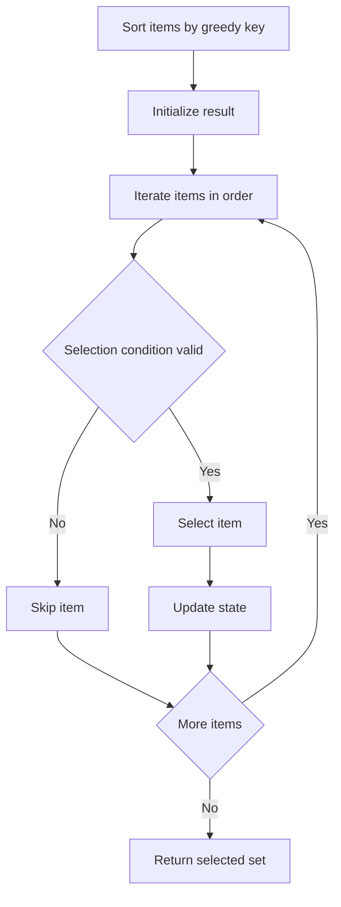
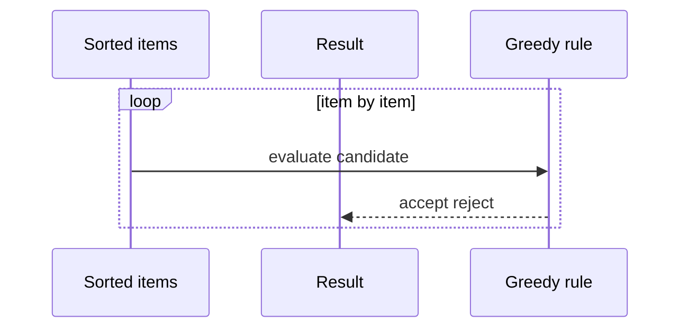

# 그리디 (Greedy) - GitHub Pages 해설

## 문서 목적
- 원본 템플릿 `04-greedy/01-greedy.md` 의 내부 동작을 GitHub Markdown에서 바로 읽을 수 있게 설명합니다.
- 코드 레이어(초기화/루프/조건/갱신/종료)를 분해하고, Mermaid로 제어 흐름을 시각화합니다.
- 실전 문제에 붙일 때 반드시 수정해야 하는 지점을 체크리스트로 제공합니다.

## 원본 템플릿
- Source: [04-greedy/01-greedy.md](https://github.com/choisimo/document/blob/main/code/templates/algorithm-architect/04-greedy/01-greedy.md)

## 내부 메커니즘 (Flow)


## 내부 상호작용 (Sequence)


## 핵심 코드
```python
# [Greedy 템플릿: 아키텍트 버전]
# Use Case: 최적 부분 구조, 탐욕적 선택 속성
# Components: Sorting (대부분), Selection Logic
# Constraint: 매 순간 최선의 선택이 전체 최적해 보장해야 함

def greedy_template(items):
    # 1. 정렬 레이어 (Sorting Layer)
    #    - 그리디 기준에 따라 정렬
    items.sort(key=lambda x: x[1])  # 예: 종료 시간 기준
    
    # 2. 초기화 (Initialization)
    result = []
    last_selected = None
    
    # 3. 순차 선택 (Sequential Selection)
    for item in items:
        # 4. 선택 조건 (Selection Condition)
        #    - 탐욕적 규칙에 부합하는지 확인
        if is_valid(item, last_selected):
            result.append(item)
            last_selected = item
    
    return result

def is_valid(item, last_selected):
    # 선택 가능 여부 판단 로직
    if last_selected is None:
        return True
    return item[0] >= last_selected[1]  # 예: 시작 시간 >= 이전 종료 시간
```

## 적용 계약
- **문제 범위**: 이 코드는 종료 시간이 이른 순서로 고르는 구간 스케줄링 예제다. 임의의 그리디 문제에 그대로 적용하는 범용 최적화 함수가 아니다.
- **입력**: 각 항목은 비교 가능한 `(시작, 종료)` 값을 제공하고 `시작 <= 종료`를 만족해야 한다. `items.sort(...)`가 호출자의 목록을 제자리에서 변경한다.
- **정당성**: 최대 개수의 겹치지 않는 구간이라는 목적에서는 earliest-finish 선택의 교환 논증이 필요하다. 목적 함수나 제약이 바뀌면 같은 선택 규칙이 최적해를 보장하지 않는다.
- **비용**: 정렬 `O(n log n)`과 순회 `O(n)`, 결과 저장 `O(n)`이다.

## 완료 증거
- 최적화 목표, 동률 정렬 규칙, 경계가 맞닿은 구간을 허용하는지 먼저 고정한다.
- 빈 입력, 동일 종료 시각, 완전 중첩, 끝점이 같은 구간과 선택 규칙의 반례를 확인한다.
- 새로운 문제에 사용할 때는 교환 논증 또는 반례 탐색으로 그리디 선택 속성을 입증한 경우에만 완료로 판정한다.
