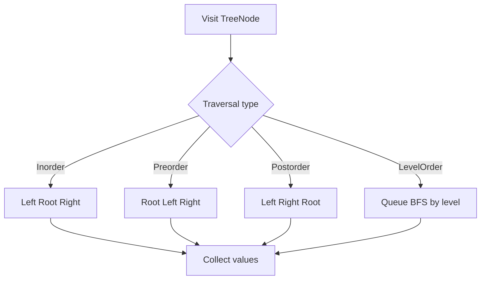
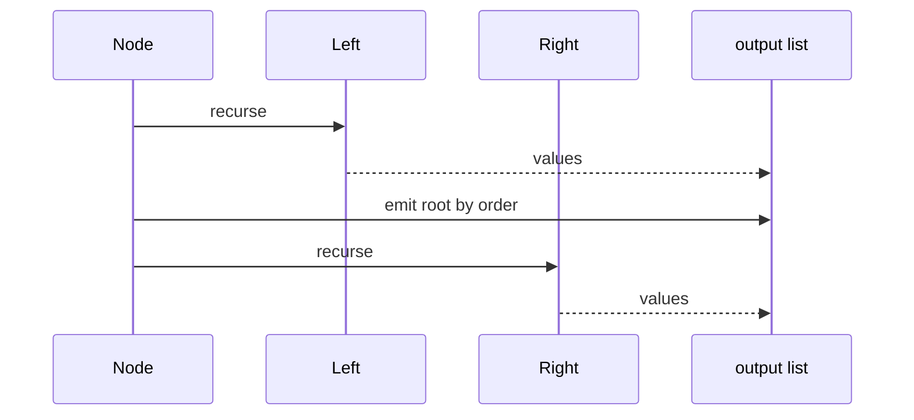

# 트리 순회 (Tree Traversal) - GitHub Pages 해설

## 문서 목적
- 원본 템플릿 `05-tree/01-tree-traversal.md` 의 내부 동작을 GitHub Markdown에서 바로 읽을 수 있게 설명합니다.
- 코드 레이어(초기화/루프/조건/갱신/종료)를 분해하고, Mermaid로 제어 흐름을 시각화합니다.
- 실전 문제에 붙일 때 반드시 수정해야 하는 지점을 체크리스트로 제공합니다.

## 원본 템플릿
- Source: [05-tree/01-tree-traversal.md](https://github.com/choisimo/document/blob/main/code/templates/algorithm-architect/05-tree/01-tree-traversal.md)

## 내부 메커니즘 (Flow)


## 내부 상호작용 (Sequence)


## 핵심 코드
```python
class TreeNode:
    def __init__(self, val=0, left=None, right=None):
        self.val = val
        self.left = left
        self.right = right
```

## 적용 계약
- **현재 산출물**: 핵심 코드는 `TreeNode` 자료형만 정의한다. 전위·중위·후위·레벨 순회 함수는 다이어그램에만 있고 구현에는 포함되지 않았다.
- **입력**: 사이클이 없는 이진 트리와 `None` 루트를 처리할 규칙이 필요하다. 일반 그래프나 부모 포인터가 있는 구조에는 방문 집합 없이 적용하지 않는다.
- **비용**: 구현할 각 순회는 노드 수 `n`에 대해 `O(n)` 시간이다. 재귀 순회는 높이 `h`만큼의 호출 스택, 레벨 순회는 최대 너비만큼의 큐 공간을 사용한다.

## 완료 증거
- 필요한 순회 순서마다 실제 함수를 추가하고 빈 트리, 단일 노드, 편향 트리, 완전 이진 트리의 출력 순서를 확인한다.
- 깊이가 Python 재귀 한계를 넘을 수 있으면 반복형 스택 구현을 선택한다.
- 레벨 순회는 큐의 제거 비용이 상수 시간이 되는 자료구조를 사용한 뒤 완료로 판정한다.
