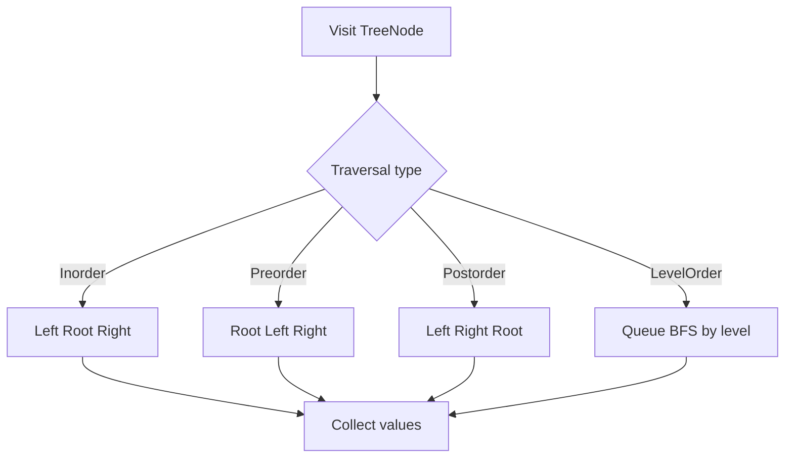

# Tree Traversal 트리 순회 학습 및 기록 노트

> 💡 **이 글을 쓰는 이유:** 트리 순회는 트리의 모든 노드를 어떤 순서로 방문할지 정하는 기본 기술이다. 전위, 중위, 후위, 레벨 순회는 모두 같은 노드를 보지만 "언제 루트를 처리하느냐"가 다르기 때문에 문제의 의미가 완전히 달라진다.

---

## 1. 왜 필요한가? (Pain Point & Motivation)

* **이 개념이 구원해 줄 문제:** 트리 구조를 탐색하며 값을 출력하거나, 식을 계산하거나, 구조를 직렬화하거나, 레벨별 정보를 모아야 할 때 필요하다.
* **대안들의 한계 (기존의 똥떵어리들):** 무작정 DFS/BFS라고만 생각하면 루트 처리 시점이 흐려진다. 중위 순회가 BST에서 정렬 결과를 만드는 이유, 후위 순회가 삭제/계산에 유리한 이유를 놓치게 된다.

## 2. 현재 나의 상태 (Baseline)

* **여기까진 안다 (익숙한 땅):** 트리는 루트, 왼쪽 자식, 오른쪽 자식으로 구성되고 재귀로 자연스럽게 탐색할 수 있다.
* **뇌정지 오는 부분 (안개 속):** 전위/중위/후위의 차이는 코드 한 줄 위치 차이지만, 결과 순서와 사용처는 크게 달라진다.
* **아직은 무리 (워너비):** 재귀 대신 스택이나 큐로 구현할 때도 같은 방문 순서를 유지해야 한다.

## 3. 도달하고 싶은 목표 (Target State)

* **이 글을 끝내고 할 수 있는 일:** 루트를 언제 output에 넣는지 기준으로 순회 종류를 구분하고, 작은 트리의 방문 순서를 손으로 적을 수 있다.
* **이것만은 건지자 (최소 성공 기준):** preorder는 `root-left-right`, inorder는 `left-root-right`, postorder는 `left-right-root`, level order는 큐 기반 BFS라는 규칙을 외우는 데서 끝내지 않고 왜 그런지 설명한다.

## 4. 시스템 번역 (Data Flow)

*이 개념을 하나의 살아있는 함수나 파이프라인으로 바라보고 해부해 봅니다.*

* **📥 인풋 (Input):** 트리 루트 노드, 순회 방식, 출력 리스트 또는 처리 함수
* **⚙️ 프로세스 (Processing):** 순회 방식에 따라 루트 처리, 왼쪽 서브트리 방문, 오른쪽 서브트리 방문의 순서를 조합한다.
* **📤 아웃풋 (Output):** 방문 순서 리스트, 레벨별 목록, 계산 결과, 직렬화 문자열
* **💾 상태 (State):** 현재 노드, 재귀 호출 스택, 출력 리스트, level order의 큐
* **🚨 터지는 조건 (Exception):** `None` 노드 처리 누락, 순회 순서 착각, 깊은 트리에서 재귀 깊이 초과, level order에서 큐 대신 스택 사용

## 5. 핵심 구성요소 (Building Blocks)

* **레고 블록 1 (TreeNode):** 값과 자식 포인터를 가진 트리의 기본 단위다.
* **레고 블록 2 (Visit Timing):** 루트 값을 언제 처리할지 결정한다.
* **레고 블록 3 (Traversal State):** 재귀 스택 또는 큐가 다음에 방문할 노드를 관리한다.
* **서로 어떻게 맞물려 돌아가는가?:** TreeNode 관계를 따라 내려가고, visit timing이 출력 위치를 정하며, traversal state가 전체 방문 흐름을 유지한다.

## 6. 상태 전이 (State Transition)

*상태가 어떻게 변하는지 흐름을 한눈에 보여줍니다. (표 안의 문장은 짧고 직관적으로!)*

| 초기 상태 | 이벤트 (트리거) | 전이 조건 | 변경 후 상태 | "바뀐 걸 어떻게 알지?" (관찰 방법) |
| :--- | :--- | :--- | :--- | :--- |
| `READY` | 루트 입력 | 루트가 `None`이 아님 | `VISITING` | 현재 노드가 설정됨 |
| `VISITING` | preorder | 루트를 먼저 처리 | `ROOT_EMITTED` | output에 루트 값 추가 |
| `VISITING` | inorder | 왼쪽을 먼저 처리 | `LEFT_DONE` | 왼쪽 서브트리 값이 먼저 출력 |
| `VISITING` | postorder | 좌우를 먼저 처리 | `CHILDREN_DONE` | 루트 값이 마지막에 출력 |
| `VISITING` | level order | 큐에서 노드를 꺼냄 | `LEVEL_EMITTED` | 같은 깊이 노드가 순서대로 출력 |

## 7. 불변식 (Invariant: 절대 깨지면 안 되는 규칙)

* **하늘이 무너져도 지켜야 할 조건:** 각 노드는 정확히 한 번 방문되고, 순회 방식이 정한 루트 처리 시점이 지켜져야 한다.
* **이게 깨지면 생기는 대참사:** 값이 중복 출력되거나 누락되고, BST 중위 순회처럼 순서 의미가 있는 결과가 깨진다.
* **수수방관 금지 (검증법):** 노드 3~5개짜리 작은 트리로 전위/중위/후위/레벨 순서 결과를 손으로 적고 코드 출력과 비교한다.

## 8. 가장 작은 예제 (Minimal Viable Example)

* **뇌컴파일이 가능한 수준의 인풋:** 루트 `1`, 왼쪽 자식 `2`, 오른쪽 자식 `3`
* **한 스텝씩 뜯어보기:** 전위는 루트 1을 먼저 보고 2, 3으로 간다. 중위는 2를 보고 1, 3으로 간다. 후위는 2, 3을 보고 마지막에 1을 본다.
* **해피 엔딩 (결과):** preorder `[1, 2, 3]`, inorder `[2, 1, 3]`, postorder `[2, 3, 1]`



```python
class TreeNode:
    def __init__(self, val=0, left=None, right=None):
        self.val = val
        self.left = left
        self.right = right


def preorder(node, output):
    if node is None:
        return
    output.append(node.val)
    preorder(node.left, output)
    preorder(node.right, output)
```

## 9. 실패 사례 (What could go wrong?)

* **폭망 시나리오 1:** `None` 자식 처리를 하지 않아 attribute error가 난다.
* **폭망 시나리오 2:** BST에서 중위 순회 대신 전위 순회를 사용해 정렬된 결과를 기대한다.
* **폭망 시나리오 3:** 깊게 치우친 트리를 재귀로만 순회하다가 recursion limit에 걸린다.
* **범인 검거 (어떤 불변식이 깨졌나?):** 각 노드를 정확히 한 번 방문하고 루트 처리 시점을 지켜야 한다는 7번 불변식이 깨졌다.

## 10. 뇌 확장하기 (Evolution & Variants)

* **조건을 살짝 바꾸면?:** 트리가 아니라 일반 그래프라면 방문 집합이 필요하고, 부모로 되돌아가는 간선을 조심해야 한다.
* **비슷한 놈들과 계급장 떼고 비교하기:** 전위는 복사/직렬화에, 중위는 BST 정렬 출력에, 후위는 삭제/후위 계산에, 레벨 순회는 깊이별 처리에 어울린다.
* **다른 데서 써먹기:** AST 해석, 파일 시스템 탐색, HTML DOM 처리, 조직도/카테고리 트리 출력에 적용할 수 있다.

## 11. 최종 체크리스트 (Definition of Done)

*글 작성 후 아래 항목을 채웠는지 확인하는 셀프 검토용 목록이다.*

- [x] 1초 만에 이해하는 한 문장 요약이 있는가?
- [x] 일목요연한 상태 전이 표를 채웠는가?
- [x] 머릿속 그림을 표현한 구조도(다이어그램)가 포함되었는가?
- [x] 직접 굴려본 실습 결과(코드/로그)를 첨부했는가?
- [x] 에러를 마주하고 해결한 오답 노트가 있는가?
- [x] 주니어 동료에게 막힘없이 설명할 수 있는 수준인가?

## 12. 뇌에 새기는 복습 문장 (TL;DR Blank)

*복습 시 이 문장만 보고도 핵심을 떠올릴 수 있도록 빈칸을 채운다.*

> 이 개념은 결국 **트리의 모든 노드를 목적에 맞는 순서로 방문하는 문제**를 해결하기 위해 태어났고,
> 우리가 계속 감시해야 할 핵심 상태는 **현재 노드와 재귀 스택 또는 큐** 이며,
> **루트를 처리하는 시점을 전위/중위/후위/레벨 중 하나로 정하는** 조건이 발동할 때 상태가 바뀐다.
> 그리고 무슨 일이 있어도 **각 노드는 정확히 한 번 방문되고 순회 방식이 정한 루트 처리 시점이 지켜져야 한다** 라는 불변식은 반드시 유지되어야만 한다!
