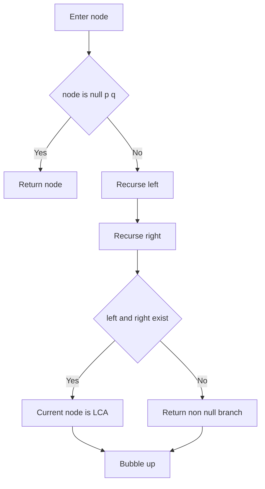
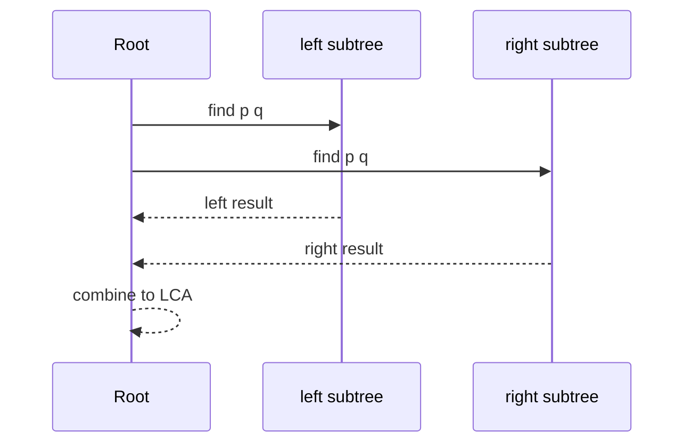

# 최소 공통 조상 (LCA - Lowest Common Ancestor) - GitHub Pages 해설

## 문서 목적
- 원본 템플릿 `05-tree/02-lca.md` 의 내부 동작을 GitHub Markdown에서 바로 읽을 수 있게 설명합니다.
- 코드 레이어(초기화/루프/조건/갱신/종료)를 분해하고, Mermaid로 제어 흐름을 시각화합니다.
- 실전 문제에 붙일 때 반드시 수정해야 하는 지점을 체크리스트로 제공합니다.

## 원본 템플릿
- Source: [05-tree/02-lca.md](https://github.com/choisimo/document/blob/main/code/templates/algorithm-architect/05-tree/02-lca.md)

## 내부 메커니즘 (Flow)


## 내부 상호작용 (Sequence)


## 핵심 코드
```python
# [LCA 템플릿: 아키텍트 버전]
# Use Case: 두 노드의 공통 조상 찾기
# Components: Tree Structure, Parent Tracking
# Constraint: 트리 구조 필수

def lowest_common_ancestor(root, p, q):
    # 1. 베이스 케이스 (Base Case)
    if not root or root == p or root == q:
        return root
    
    # 2. 재귀 탐색 (Recursive Search)
    left = lowest_common_ancestor(root.left, p, q)
    right = lowest_common_ancestor(root.right, p, q)
    
    # 3. 판단 로직 (Decision Logic)
    if left and right:
        return root  # 양쪽에 모두 있으면 현재 노드가 LCA
    
    return left if left else right  # 한쪽에만 있으면 그쪽 반환
```

## 적용 계약
- **입력**: `root`, `p`, `q`는 같은 이진 트리의 노드 객체이며 비교는 값이 아니라 객체 동일성에 의존한다.
- **전제**: 현재 구현은 `p`와 `q`가 모두 트리에 존재한다고 가정한다. 하나만 존재하면 그 노드를 반환할 수 있으므로 존재 검증이 필요한 API에는 그대로 사용할 수 없다.
- **출력**: 두 노드가 서로 다른 하위 트리에서 발견되면 현재 노드, 한쪽에서 함께 발견되면 해당 하위 결과를 반환한다.
- **비용**: 노드 수 `n`에 대해 `O(n)` 시간, 트리 높이 `h`에 대해 `O(h)` 호출 스택을 사용한다.

## 완료 증거
- `p == q`, 한 노드가 다른 노드의 조상인 경우, 한쪽 또는 양쪽 노드가 없는 경우의 계약을 정한다.
- 중복 값을 가진 노드에서도 객체 식별 기준으로 기대 LCA가 반환되는지 확인한다.
- 깊은 편향 트리를 허용한다면 반복형 또는 부모 배열 방식의 필요성을 판정한다.
