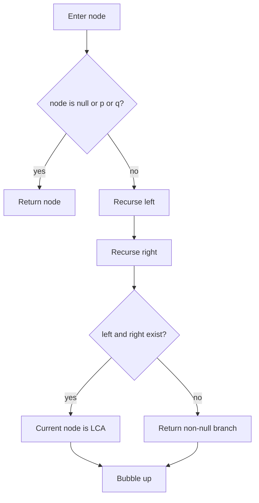

# LCA 최소 공통 조상 학습 및 기록 노트

> 💡 **이 글을 쓰는 이유:** LCA는 트리에서 두 노드를 모두 자손으로 가지는 가장 낮은 조상을 찾는 문제다. 재귀 풀이의 핵심은 왼쪽과 오른쪽 서브트리에서 각각 목표 노드를 찾은 결과를 현재 노드에서 합치는 것이다.

---

## 1. 왜 필요한가? (Pain Point & Motivation)

* **이 개념이 구원해 줄 문제:** 트리에서 두 노드의 관계, 거리, 경로, 공통 상위 범주를 빠르게 찾아야 할 때 필요하다.
* **대안들의 한계 (기존의 똥떵어리들):** 각 노드의 조상 목록을 매번 만들고 비교하면 반복 쿼리에 비효율적이다. 단순 DFS로 한 노드만 찾으면 두 노드가 어디서 갈라지는지 알 수 없다.

## 2. 현재 나의 상태 (Baseline)

* **여기까진 안다 (익숙한 땅):** 트리는 루트에서 자식으로 내려가는 계층 구조이고, 조상은 어떤 노드의 부모 방향에 있는 노드다.
* **뇌정지 오는 부분 (안개 속):** 재귀가 `p` 또는 `q`를 발견하면 그 노드를 반환하고, 양쪽에서 하나씩 올라오면 현재 노드가 LCA라는 결합 규칙이 직관적으로 헷갈릴 수 있다.
* **아직은 무리 (워너비):** 한 번만 물어보는 LCA와 여러 번 물어보는 LCA에서 다른 전처리 전략을 선택해야 한다.

## 3. 도달하고 싶은 목표 (Target State)

* **이 글을 끝내고 할 수 있는 일:** 재귀 LCA가 왼쪽 결과와 오른쪽 결과를 어떻게 합쳐 최소 공통 조상을 찾는지 설명할 수 있다.
* **이것만은 건지자 (최소 성공 기준):** 왼쪽과 오른쪽에서 모두 non-null 결과가 나오면 현재 노드가 두 노드가 갈라지는 지점이라는 사실을 이해한다.

## 4. 시스템 번역 (Data Flow)

*이 개념을 하나의 살아있는 함수나 파이프라인으로 바라보고 해부해 봅니다.*

* **📥 인풋 (Input):** 트리 루트, 찾을 두 노드 `p`, `q`
* **⚙️ 프로세스 (Processing):** 현재 노드가 `None`, `p`, `q`인지 검사하고, 왼쪽/오른쪽 서브트리에서 각각 LCA 후보를 재귀적으로 찾은 뒤 결과를 결합한다.
* **📤 아웃풋 (Output):** 두 노드의 최소 공통 조상 노드 또는 발견된 단일 목표 노드
* **💾 상태 (State):** 현재 노드, 왼쪽 재귀 결과, 오른쪽 재귀 결과, 반환 후보
* **🚨 터지는 조건 (Exception):** `p` 또는 `q`가 트리에 없거나, 트리가 아닌 그래프 입력이거나, 깊은 트리에서 재귀 깊이를 넘는 경우

## 5. 핵심 구성요소 (Building Blocks)

* **레고 블록 1 (Base Case):** 현재 노드가 없거나 `p/q`라면 그대로 반환한다.
* **레고 블록 2 (Subtree Search):** 왼쪽과 오른쪽 서브트리에서 목표 노드를 찾는다.
* **레고 블록 3 (Combine Rule):** 양쪽에서 결과가 나오면 현재 노드, 한쪽만 나오면 그 결과를 반환한다.
* **서로 어떻게 맞물려 돌아가는가?:** base case가 발견 신호를 만들고, subtree search가 신호를 부모로 올리며, combine rule이 두 신호가 만나는 가장 낮은 지점을 LCA로 확정한다.

## 6. 상태 전이 (State Transition)

*상태가 어떻게 변하는지 흐름을 한눈에 보여줍니다. (표 안의 문장은 짧고 직관적으로!)*

| 초기 상태 | 이벤트 (트리거) | 전이 조건 | 변경 후 상태 | "바뀐 걸 어떻게 알지?" (관찰 방법) |
| :--- | :--- | :--- | :--- | :--- |
| `ENTER` | 현재 노드 검사 | `root is None` | `RETURN_NONE` | 빈 서브트리 반환 |
| `ENTER` | 현재 노드 검사 | `root == p or root == q` | `FOUND_TARGET` | 현재 노드 반환 |
| `ENTER` | 재귀 탐색 | 일반 노드 | `SEARCH_CHILDREN` | left/right 호출 |
| `SEARCH_CHILDREN` | 결과 결합 | left와 right 모두 존재 | `FOUND_LCA` | 현재 노드 반환 |
| `SEARCH_CHILDREN` | 결과 결합 | 한쪽만 존재 | `BUBBLE_UP` | non-null 결과 반환 |

## 7. 불변식 (Invariant: 절대 깨지면 안 되는 규칙)

* **하늘이 무너져도 지켜야 할 조건:** 재귀 호출의 반환값은 해당 서브트리 안에서 발견된 `p`, `q`, 또는 그 둘의 LCA 중 하나여야 한다.
* **이게 깨지면 생기는 대참사:** 부모 호출이 왼쪽/오른쪽 결과를 잘못 결합해 실제 공통 조상이 아닌 노드를 반환한다.
* **수수방관 금지 (검증법):** 두 노드가 서로 다른 서브트리에 있는 경우, 한 노드가 다른 노드의 조상인 경우, 둘 중 하나가 없는 경우를 테스트한다.

## 8. 가장 작은 예제 (Minimal Viable Example)

* **뇌컴파일이 가능한 수준의 인풋:** 루트 `1`, 왼쪽 `2`, 오른쪽 `3`이고 `p=2`, `q=3`
* **한 스텝씩 뜯어보기:** 왼쪽 재귀는 `2`를 반환하고 오른쪽 재귀는 `3`을 반환한다. 루트 `1`은 양쪽에서 결과를 받았으므로 LCA다.
* **해피 엔딩 (결과):** 최소 공통 조상은 `1`이다.



```python
def lowest_common_ancestor(root, p, q):
    if root is None or root == p or root == q:
        return root

    left = lowest_common_ancestor(root.left, p, q)
    right = lowest_common_ancestor(root.right, p, q)

    if left and right:
        return root

    return left if left else right
```

## 9. 실패 사례 (What could go wrong?)

* **폭망 시나리오 1:** 두 노드가 반드시 트리에 존재한다는 전제를 확인하지 않아, 하나만 있어도 그 노드를 LCA처럼 반환한다.
* **폭망 시나리오 2:** 트리가 아니라 부모로 되돌아가는 그래프 구조에서 방문 집합 없이 재귀를 돌린다.
* **폭망 시나리오 3:** 쿼리가 매우 많은데 매번 O(N) 재귀 LCA를 실행해 시간 초과가 난다.
* **범인 검거 (어떤 불변식이 깨졌나?):** 반환값이 서브트리 안에서 발견된 목표 또는 LCA여야 한다는 7번 불변식이 깨졌다.

## 10. 뇌 확장하기 (Evolution & Variants)

* **조건을 살짝 바꾸면?:** 여러 LCA 쿼리를 빠르게 처리하려면 depth와 parent table을 만든 뒤 binary lifting을 사용한다.
* **비슷한 놈들과 계급장 떼고 비교하기:** 단일 쿼리 재귀 LCA는 구현이 간단하고, binary lifting은 전처리 비용을 내고 쿼리를 빠르게 만든다.
* **다른 데서 써먹기:** 조직도 공통 관리자, 파일 경로 공통 prefix, 계층형 카테고리 공통 상위, 트리에서 두 노드 거리 계산에 활용할 수 있다.

## 11. 최종 체크리스트 (Definition of Done)

*글 작성 후 아래 항목을 채웠는지 확인하는 셀프 검토용 목록이다.*

- [x] 1초 만에 이해하는 한 문장 요약이 있는가?
- [x] 일목요연한 상태 전이 표를 채웠는가?
- [x] 머릿속 그림을 표현한 구조도(다이어그램)가 포함되었는가?
- [x] 직접 굴려본 실습 결과(코드/로그)를 첨부했는가?
- [x] 에러를 마주하고 해결한 오답 노트가 있는가?
- [x] 주니어 동료에게 막힘없이 설명할 수 있는 수준인가?

## 12. 뇌에 새기는 복습 문장 (TL;DR Blank)

*복습 시 이 문장만 보고도 핵심을 떠올릴 수 있도록 빈칸을 채운다.*

> 이 개념은 결국 **트리에서 두 노드가 처음 만나는 가장 낮은 조상을 찾는 문제**를 해결하기 위해 태어났고,
> 우리가 계속 감시해야 할 핵심 상태는 **left/right 재귀 결과** 이며,
> **양쪽 서브트리에서 각각 목표 신호가 올라오는** 조건이 발동할 때 상태가 바뀐다.
> 그리고 무슨 일이 있어도 **재귀 호출의 반환값은 해당 서브트리 안에서 발견된 p, q, 또는 그 둘의 LCA 중 하나여야 한다** 라는 불변식은 반드시 유지되어야만 한다!
