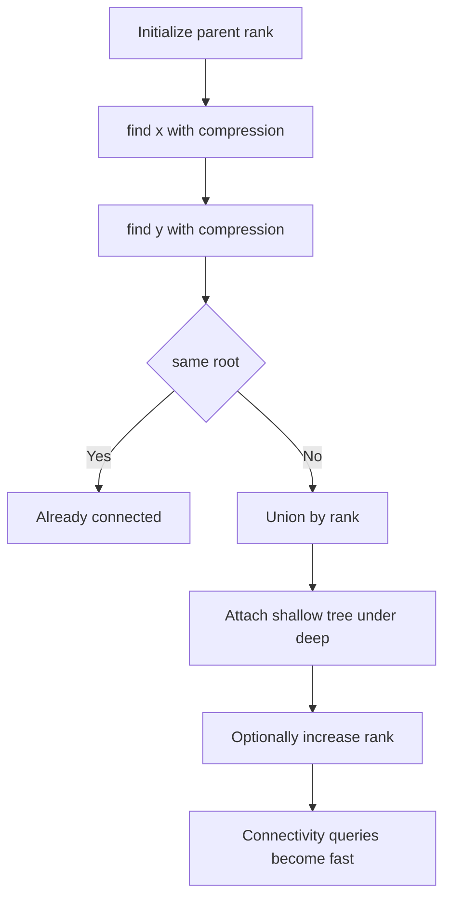
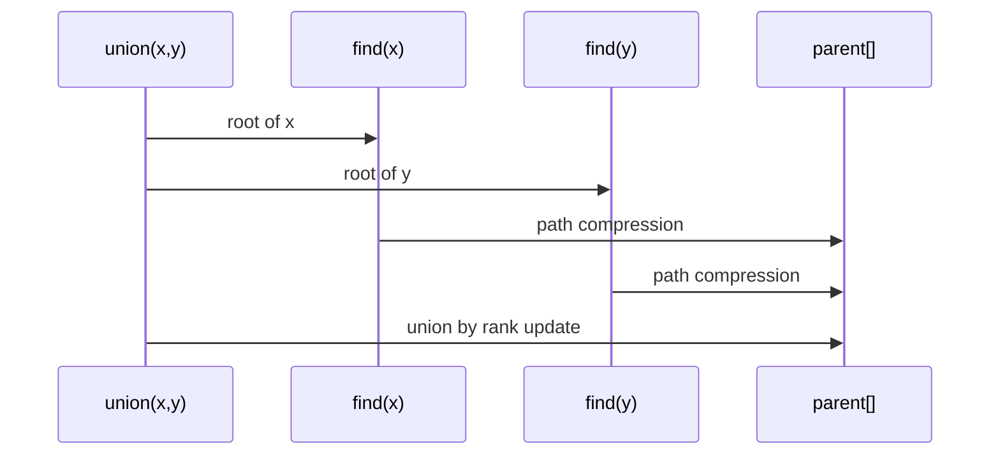

# 유니온 파인드 (Union-Find / Disjoint Set) - GitHub Pages 해설

## 문서 목적
- 원본 템플릿 `06-union-find/01-union-find.md` 의 내부 동작을 GitHub Markdown에서 바로 읽을 수 있게 설명합니다.
- 코드 레이어(초기화/루프/조건/갱신/종료)를 분해하고, Mermaid로 제어 흐름을 시각화합니다.
- 실전 문제에 붙일 때 반드시 수정해야 하는 지점을 체크리스트로 제공합니다.

## 원본 템플릿
- Source: [06-union-find/01-union-find.md](https://github.com/choisimo/document/blob/main/code/templates/algorithm-architect/06-union-find/01-union-find.md)

## 내부 메커니즘 (Flow)


## 내부 상호작용 (Sequence)


## 핵심 코드
```python
# [Union-Find 템플릿: 아키텍트 버전]
# Use Case: 집합 합치기, 연결 요소 판별, 크루스칼 알고리즘
# Components: Parent Array, Rank Array (최적화)
# Constraint: Path Compression + Union by Rank

class UnionFind:
    def __init__(self, n):
        # 1. 초기화 (Initialization Layer)
        #    - 각 노드가 자기 자신을 부모로
        self.parent = list(range(n))
        self.rank = [0] * n
    
    # 2. Find 연산 (Find Operation)
    #    - 경로 압축(Path Compression) 적용
    def find(self, x):
        if self.parent[x] != x:
            self.parent[x] = self.find(self.parent[x])  # 경로 압축
        return self.parent[x]
    
    # 3. Union 연산 (Union Operation)
    #    - Rank 기반 합치기
    def union(self, x, y):
        root_x = self.find(x)
        root_y = self.find(y)
        
        if root_x == root_y:
            return False  # 이미 같은 집합
        
        # 4. Rank 비교 (Union by Rank)
        if self.rank[root_x] < self.rank[root_y]:
            self.parent[root_x] = root_y
        elif self.rank[root_x] > self.rank[root_y]:
            self.parent[root_y] = root_x
        else:
            self.parent[root_y] = root_x
            self.rank[root_x] += 1
        
        return True
    
    # 5. 연결 여부 확인 (Connected Check)
    def is_connected(self, x, y):
        return self.find(x) == self.find(y)
```

## 코드 레이어 해설
- **Initialization**: 상태 테이블/포인터/큐/스택/부모 배열 등 탐색의 기준 상태를 만든다.
- **Process Loop / Recursion**: 입력 공간을 순회하며 상태 전이를 반복한다.
- **Decision Rule**: 분기 조건(완화 가능 여부, 유효 선택 여부, 종료 조건)을 적용한다.
- **State Update**: 거리/DP/집합/결과 배열을 갱신하고 다음 단계로 전달한다.
- **Termination**: 목표 도달, 범위 소진, 큐/스택 고갈, 사이클 검출 등으로 종료한다.

## 실전 적용 체크리스트
- 입력 자료구조 형식(인접 리스트, 간선 리스트, 정렬 여부, 1-index/0-index)을 먼저 고정한다.
- 시간 복잡도 한계에 맞게 자료구조를 교체한다 (`list.pop(0)` -> `deque.popleft` 등).
- 실패/예외 경로를 명시한다 (도달 불가, 음수 사이클, 빈 결과, 사이클 존재).
- 테스트는 최소 3개: 정상 케이스, 경계 케이스, 반례 케이스를 포함한다.
