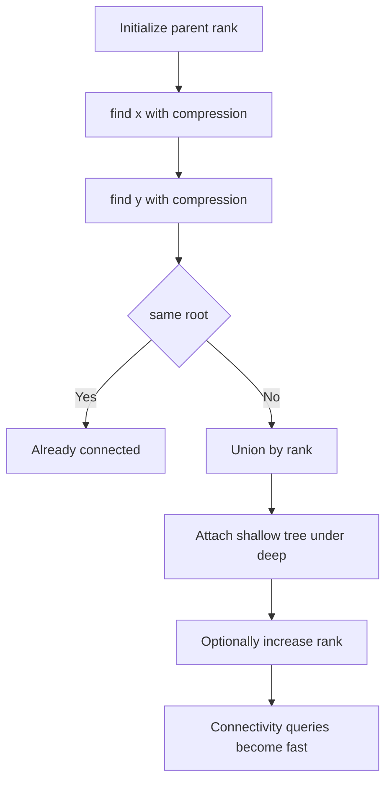
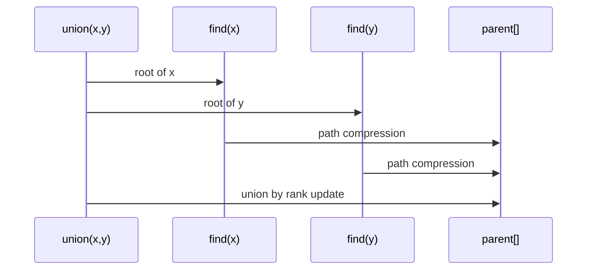

# 유니온 파인드 (Union-Find / Disjoint Set) - GitHub Pages 해설

## 문서 목적
- 원본 템플릿 `06-union-find/01-union-find.md` 의 내부 동작을 GitHub Markdown에서 바로 읽을 수 있게 설명합니다.
- 코드 레이어(초기화/루프/조건/갱신/종료)를 분해하고, Mermaid로 제어 흐름을 시각화합니다.
- 실전 문제에 붙일 때 반드시 수정해야 하는 지점을 체크리스트로 제공합니다.

## 원본 템플릿
- Source: [06-union-find/01-union-find.md](https://github.com/choisimo/document/blob/main/code/templates/algorithm-architect/06-union-find/01-union-find.md)

## 내부 메커니즘 (Flow)


## 내부 상호작용 (Sequence)


## 핵심 코드
```python
# [Union-Find 템플릿: 아키텍트 버전]
# Use Case: 집합 합치기, 연결 요소 판별, 크루스칼 알고리즘
# Components: Parent Array, Rank Array (최적화)
# Constraint: Path Compression + Union by Rank

class UnionFind:
    def __init__(self, n):
        # 1. 초기화 (Initialization Layer)
        #    - 각 노드가 자기 자신을 부모로
        self.parent = list(range(n))
        self.rank = [0] * n
    
    # 2. Find 연산 (Find Operation)
    #    - 경로 압축(Path Compression) 적용
    def find(self, x):
        if self.parent[x] != x:
            self.parent[x] = self.find(self.parent[x])  # 경로 압축
        return self.parent[x]
    
    # 3. Union 연산 (Union Operation)
    #    - Rank 기반 합치기
    def union(self, x, y):
        root_x = self.find(x)
        root_y = self.find(y)
        
        if root_x == root_y:
            return False  # 이미 같은 집합
        
        # 4. Rank 비교 (Union by Rank)
        if self.rank[root_x] < self.rank[root_y]:
            self.parent[root_x] = root_y
        elif self.rank[root_x] > self.rank[root_y]:
            self.parent[root_y] = root_x
        else:
            self.parent[root_y] = root_x
            self.rank[root_x] += 1
        
        return True
    
    # 5. 연결 여부 확인 (Connected Check)
    def is_connected(self, x, y):
        return self.find(x) == self.find(y)
```

## 적용 계약
- **입력**: `n`은 0 이상의 정수이고 모든 원소 ID는 `0 <= x < n` 범위여야 한다. 범위 밖 ID는 현재 Python 구현에서 `IndexError`가 난다.
- **상태**: `parent`와 `rank`는 연산에 따라 변한다. `rank`는 실제 높이와 항상 같지 않으며 합치기 방향을 정하는 상한 정보다.
- **출력**: `union`은 새로 합치면 `True`, 이미 같은 집합이면 `False`를 반환한다.
- **비용**: 경로 압축과 rank 합치기를 함께 쓰면 연속 연산의 상각 비용은 `O(alpha(n))`이며 엄밀한 상수 시간 보장은 아니다.

## 완료 증거
- 단일 원소, 반복 union, 두 연결 요소의 병합, 경로 압축 전후 연결성 결과를 확인한다.
- 잘못된 ID를 예외로 둘지 사전 검증할지 API 계약에 명시한다.
- 동적으로 새 원소를 추가하거나 집합 크기를 조회해야 하면 별도 상태를 구현한 뒤 완료로 판정한다.
