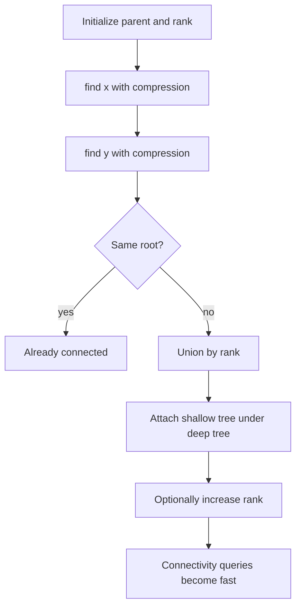

# Union-Find Disjoint Set 학습 및 기록 노트

> 💡 **이 글을 쓰는 이유:** Union-Find는 여러 원소가 어떤 집합에 속하는지 빠르게 합치고 확인하는 자료구조다. 연결 요소 판별, 사이클 검출, Kruskal MST처럼 "두 원소가 이미 같은 그룹인가?"를 반복해서 묻는 문제에서 핵심이 된다.

---

## 1. 왜 필요한가? (Pain Point & Motivation)

* **이 개념이 구원해 줄 문제:** 동적으로 집합을 합치면서 두 원소의 연결 여부를 빠르게 확인해야 하는 문제를 해결한다.
* **대안들의 한계 (기존의 똥떵어리들):** 매번 DFS/BFS로 연결 여부를 확인하면 쿼리가 많을 때 느리다. 단순 parent chain만 쓰면 트리가 길어져 find가 선형 시간까지 나빠질 수 있다.

## 2. 현재 나의 상태 (Baseline)

* **여기까진 안다 (익숙한 땅):** 각 원소는 parent를 가지고, 대표 root가 같으면 같은 집합이다.
* **뇌정지 오는 부분 (안개 속):** path compression과 union by rank가 왜 같이 쓰이는지, rank가 실제 높이와 항상 같은지는 헷갈릴 수 있다.
* **아직은 무리 (워너비):** Kruskal 알고리즘, 네트워크 연결, 동적 컴포넌트 수 계산에서 union 결과를 어떻게 해석할지 익숙해져야 한다.

## 3. 도달하고 싶은 목표 (Target State)

* **이 글을 끝내고 할 수 있는 일:** `find`, `union`, `is_connected`의 상태 변화를 parent 배열 기준으로 추적할 수 있다.
* **이것만은 건지자 (최소 성공 기준):** `find(x)`는 x가 속한 집합의 대표 root를 반환하고, 경로 압축으로 다음 질의를 빠르게 만든다는 점을 이해한다.

## 4. 시스템 번역 (Data Flow)

*이 개념을 하나의 살아있는 함수나 파이프라인으로 바라보고 해부해 봅니다.*

* **📥 인풋 (Input):** 원소 수, union 요청 `(x, y)`, connected 질의 `(x, y)`
* **⚙️ 프로세스 (Processing):** `find`로 각 원소의 root를 찾고, root가 다르면 rank 기준으로 한 root를 다른 root 밑에 붙인다.
* **📤 아웃풋 (Output):** 합치기 성공 여부, 연결 여부, 최종 parent/rank 배열
* **💾 상태 (State):** `parent[]`, `rank[]`, 각 집합의 root, 컴포넌트 수
* **🚨 터지는 조건 (Exception):** 경로 압축 누락, rank 갱신 오류, 0-index/1-index 혼동, root가 아닌 노드를 직접 붙이는 경우

## 5. 핵심 구성요소 (Building Blocks)

* **레고 블록 1 (Parent Array):** 각 원소가 가리키는 부모를 저장한다.
* **레고 블록 2 (Find with Path Compression):** root를 찾으면서 중간 노드의 parent를 root로 바로 바꾼다.
* **레고 블록 3 (Union by Rank):** 얕은 트리를 깊은 트리 밑에 붙여 parent tree가 길어지는 것을 막는다.
* **서로 어떻게 맞물려 돌아가는가?:** parent 배열이 집합 구조를 표현하고, find가 대표자를 찾으며, union이 두 대표자를 하나로 합친다.

## 6. 상태 전이 (State Transition)

*상태가 어떻게 변하는지 흐름을 한눈에 보여줍니다. (표 안의 문장은 짧고 직관적으로!)*

| 초기 상태 | 이벤트 (트리거) | 전이 조건 | 변경 후 상태 | "바뀐 걸 어떻게 알지?" (관찰 방법) |
| :--- | :--- | :--- | :--- | :--- |
| `INIT` | 생성자 실행 | 원소 수 n이 주어짐 | `SEPARATE_SETS` | `parent[i] = i` |
| `SEPARATE_SETS` | `find(x)` | parent chain 존재 | `ROOT_FOUND` | root 값 반환 |
| `ROOT_FOUND` | path compression | 중간 parent가 root가 아님 | `COMPRESSED` | parent가 root로 단축 |
| `COMPRESSED` | `union(x, y)` | root가 다름 | `MERGED` | 한 root의 parent가 다른 root로 변경 |
| `COMPRESSED` | `union(x, y)` | root가 같음 | `ALREADY_CONNECTED` | parent 변화 없음 |

## 7. 불변식 (Invariant: 절대 깨지면 안 되는 규칙)

* **하늘이 무너져도 지켜야 할 조건:** 같은 집합의 모든 원소는 `find` 결과가 같은 root여야 한다.
* **이게 깨지면 생기는 대참사:** 연결 여부 질의가 틀리고, Kruskal에서 사이클 간선을 선택하거나 필요한 간선을 놓친다.
* **수수방관 금지 (검증법):** union 후 `is_connected`를 양방향으로 확인하고, 여러 단계 parent chain에서 `find` 후 parent 배열이 압축되는지 확인한다.

## 8. 가장 작은 예제 (Minimal Viable Example)

* **뇌컴파일이 가능한 수준의 인풋:** 원소 `0, 1, 2`, 연산 `union(0, 1)`, `union(1, 2)`
* **한 스텝씩 뜯어보기:** 처음에는 모두 자기 자신이 root다. `union(0,1)` 후 0과 1의 root가 같아진다. `union(1,2)`는 1의 root와 2의 root를 합쳐 세 원소를 같은 집합으로 만든다.
* **해피 엔딩 (결과):** `is_connected(0, 2)`가 `True`를 반환한다.



```python
class UnionFind:
    def __init__(self, n):
        self.parent = list(range(n))
        self.rank = [0] * n

    def find(self, x):
        if self.parent[x] != x:
            self.parent[x] = self.find(self.parent[x])
        return self.parent[x]

    def union(self, x, y):
        root_x = self.find(x)
        root_y = self.find(y)

        if root_x == root_y:
            return False

        if self.rank[root_x] < self.rank[root_y]:
            self.parent[root_x] = root_y
        elif self.rank[root_x] > self.rank[root_y]:
            self.parent[root_y] = root_x
        else:
            self.parent[root_y] = root_x
            self.rank[root_x] += 1

        return True

    def is_connected(self, x, y):
        return self.find(x) == self.find(y)
```

## 9. 실패 사례 (What could go wrong?)

* **폭망 시나리오 1:** root가 아니라 입력 노드 x/y를 직접 parent로 붙여 집합 대표가 꼬인다.
* **폭망 시나리오 2:** path compression 없이 긴 chain을 방치해 많은 질의에서 느려진다.
* **폭망 시나리오 3:** 문제 입력은 1번부터 시작하는데 parent 배열은 0-index로 만들어 범위가 어긋난다.
* **범인 검거 (어떤 불변식이 깨졌나?):** 같은 집합의 모든 원소가 같은 root를 반환해야 한다는 7번 불변식이 깨졌다.

## 10. 뇌 확장하기 (Evolution & Variants)

* **조건을 살짝 바꾸면?:** 집합 크기가 필요하면 rank 대신 size를 관리하고, union 때 크기를 합산한다.
* **비슷한 놈들과 계급장 떼고 비교하기:** DFS/BFS는 현재 그래프를 직접 탐색하고, Union-Find는 합쳐진 연결 관계를 대표 root로 압축해 관리한다.
* **다른 데서 써먹기:** Kruskal MST, 친구 네트워크, 섬 개수 합치기, 동적 연결성, 사이클 검출에 적용할 수 있다.

## 11. 최종 체크리스트 (Definition of Done)

*글 작성 후 아래 항목을 채웠는지 확인하는 셀프 검토용 목록이다.*

- [x] 1초 만에 이해하는 한 문장 요약이 있는가?
- [x] 일목요연한 상태 전이 표를 채웠는가?
- [x] 머릿속 그림을 표현한 구조도(다이어그램)가 포함되었는가?
- [x] 직접 굴려본 실습 결과(코드/로그)를 첨부했는가?
- [x] 에러를 마주하고 해결한 오답 노트가 있는가?
- [x] 주니어 동료에게 막힘없이 설명할 수 있는 수준인가?

## 12. 뇌에 새기는 복습 문장 (TL;DR Blank)

*복습 시 이 문장만 보고도 핵심을 떠올릴 수 있도록 빈칸을 채운다.*

> 이 개념은 결국 **동적으로 합쳐지는 집합의 연결 여부를 빠르게 묻는 문제**를 해결하기 위해 태어났고,
> 우리가 계속 감시해야 할 핵심 상태는 **parent 배열과 root 대표자** 이며,
> **find로 root를 찾거나 union으로 두 root를 합치는** 조건이 발동할 때 상태가 바뀐다.
> 그리고 무슨 일이 있어도 **같은 집합의 모든 원소는 find 결과가 같은 root여야 한다** 라는 불변식은 반드시 유지되어야만 한다!
