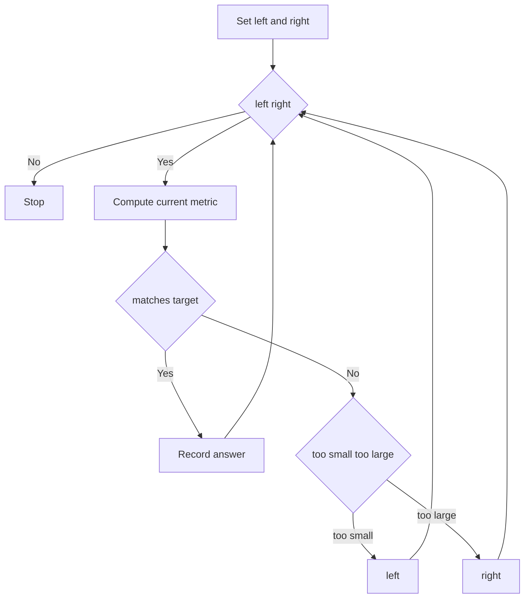
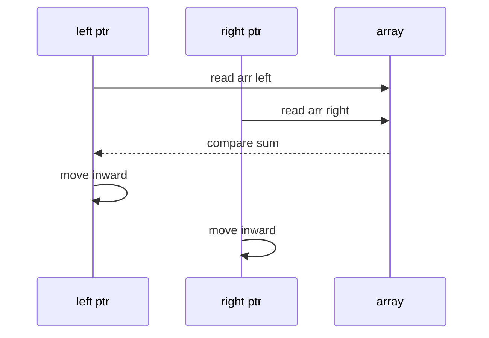

# 투 포인터 (Two Pointers) - GitHub Pages 해설

## 문서 목적
- 원본 템플릿 `07-two-pointers/01-two-pointers.md` 의 내부 동작을 GitHub Markdown에서 바로 읽을 수 있게 설명합니다.
- 코드 레이어(초기화/루프/조건/갱신/종료)를 분해하고, Mermaid로 제어 흐름을 시각화합니다.
- 실전 문제에 붙일 때 반드시 수정해야 하는 지점을 체크리스트로 제공합니다.

## 원본 템플릿
- Source: [07-two-pointers/01-two-pointers.md](https://github.com/choisimo/document/blob/main/code/templates/algorithm-architect/07-two-pointers/01-two-pointers.md)

## 내부 메커니즘 (Flow)


## 내부 상호작용 (Sequence)


## 핵심 코드
```python
# [Two Pointers 템플릿: 아키텍트 버전]
# Use Case: 정렬된 배열에서 합/차 찾기, 부분 배열
# Components: Left, Right 포인터
# Constraint: 정렬 필수 (대부분)

def two_pointers_template(arr, target):
    # 1. 초기화 (Initialization Layer)
    left, right = 0, len(arr) - 1
    
    # 2. 포인터 이동 루프 (Pointer Movement Loop)
    while left < right:
        # 3. 계산 레이어 (Calculation Layer)
        current_sum = arr[left] + arr[right]
        
        # 4. 조건 판단 (Condition Check)
        if current_sum == target:
            return (left, right)
        elif current_sum < target:
            left += 1   # 합을 키워야 함
        else:
            right -= 1  # 합을 줄여야 함
    
    return None
```

## 코드 레이어 해설
- **Initialization**: 상태 테이블/포인터/큐/스택/부모 배열 등 탐색의 기준 상태를 만든다.
- **Process Loop / Recursion**: 입력 공간을 순회하며 상태 전이를 반복한다.
- **Decision Rule**: 분기 조건(완화 가능 여부, 유효 선택 여부, 종료 조건)을 적용한다.
- **State Update**: 거리/DP/집합/결과 배열을 갱신하고 다음 단계로 전달한다.
- **Termination**: 목표 도달, 범위 소진, 큐/스택 고갈, 사이클 검출 등으로 종료한다.

## 실전 적용 체크리스트
- 입력 자료구조 형식(인접 리스트, 간선 리스트, 정렬 여부, 1-index/0-index)을 먼저 고정한다.
- 시간 복잡도 한계에 맞게 자료구조를 교체한다 (`list.pop(0)` -> `deque.popleft` 등).
- 실패/예외 경로를 명시한다 (도달 불가, 음수 사이클, 빈 결과, 사이클 존재).
- 테스트는 최소 3개: 정상 케이스, 경계 케이스, 반례 케이스를 포함한다.
