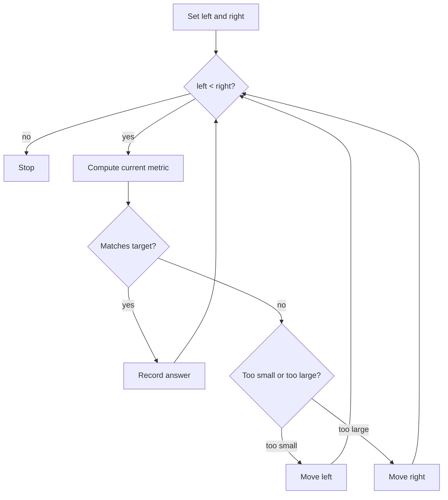

# Two Pointers 투 포인터 학습 및 기록 노트

> 💡 **이 글을 쓰는 이유:** 투 포인터는 배열이나 문자열에서 두 위치를 움직이며 후보 공간을 한 번에 훑는 기법이다. 정렬된 배열의 두 수 합, 양끝에서 좁히는 탐색, 연속 구간 문제에서 중첩 반복문을 O(N) 또는 O(N log N) 수준으로 줄여 준다.

---

## 1. 왜 필요한가? (Pain Point & Motivation)

* **이 개념이 구원해 줄 문제:** 모든 쌍을 직접 비교하면 O(N^2)이 되는 문제에서, 포인터 이동 규칙으로 불가능한 후보를 통째로 버릴 수 있다.
* **대안들의 한계 (기존의 똥떵어리들):** 이중 루프는 단순하지만 입력이 커지면 느리다. 정렬 또는 단조 조건이 있는데도 쓰지 않으면 이미 배제 가능한 후보를 계속 검사하게 된다.

## 2. 현재 나의 상태 (Baseline)

* **여기까진 안다 (익숙한 땅):** 보통 `left`는 앞에서, `right`는 뒤에서 시작하고 조건에 따라 한쪽 포인터를 이동한다.
* **뇌정지 오는 부분 (안개 속):** 언제 `left`를 움직이고 언제 `right`를 움직여야 후보를 놓치지 않는지, 그 판단 근거를 불변식으로 설명해야 한다.
* **아직은 무리 (워너비):** 정렬 배열의 양끝 포인터, 같은 방향 포인터, 중복 제거, 모든 쌍 수집처럼 변형별 규칙을 구분해야 한다.

## 3. 도달하고 싶은 목표 (Target State)

* **이 글을 끝내고 할 수 있는 일:** 포인터가 가리키는 후보 구간과 이동 후 버려지는 후보들이 왜 답이 될 수 없는지 설명할 수 있다.
* **이것만은 건지자 (최소 성공 기준):** 정렬된 배열에서 `sum < target`이면 왼쪽 포인터를 오른쪽으로 옮겨 합을 키우고, `sum > target`이면 오른쪽 포인터를 왼쪽으로 옮겨 합을 줄인다.

## 4. 시스템 번역 (Data Flow)

*이 개념을 하나의 살아있는 함수나 파이프라인으로 바라보고 해부해 봅니다.*

* **📥 인풋 (Input):** 정렬된 배열, target, 또는 단조적으로 좁힐 수 있는 후보 구간
* **⚙️ 프로세스 (Processing):** 두 포인터가 가리키는 현재 후보를 평가하고, 조건에 따라 답이 될 수 없는 방향의 포인터를 이동한다.
* **📤 아웃풋 (Output):** 조건을 만족하는 인덱스 쌍, 개수, 최적 값, 또는 실패 판정
* **💾 상태 (State):** `left`, `right`, 현재 합/차/조건 값, 발견한 답
* **🚨 터지는 조건 (Exception):** 정렬 전제 누락, 포인터 이동 방향 오류, 중복 처리 누락, `left < right` 종료 조건 착각

## 5. 핵심 구성요소 (Building Blocks)

* **레고 블록 1 (Left Pointer):** 후보 구간의 작은 쪽 또는 시작 위치를 관리한다.
* **레고 블록 2 (Right Pointer):** 후보 구간의 큰 쪽 또는 끝 위치를 관리한다.
* **레고 블록 3 (Movement Rule):** 현재 조건이 작거나 큰지에 따라 어느 포인터를 움직일지 결정한다.
* **서로 어떻게 맞물려 돌아가는가?:** 두 포인터가 현재 후보를 만들고, movement rule이 불가능한 후보를 제거하면서 후보 공간을 계속 줄인다.

## 6. 상태 전이 (State Transition)

*상태가 어떻게 변하는지 흐름을 한눈에 보여줍니다. (표 안의 문장은 짧고 직관적으로!)*

| 초기 상태 | 이벤트 (트리거) | 전이 조건 | 변경 후 상태 | "바뀐 걸 어떻게 알지?" (관찰 방법) |
| :--- | :--- | :--- | :--- | :--- |
| `READY` | 포인터 초기화 | 배열이 정렬됨 | `WINDOW_ACTIVE` | `left=0`, `right=n-1` |
| `WINDOW_ACTIVE` | 현재 합 계산 | `arr[left] + arr[right] == target` | `FOUND` | 인덱스 쌍 기록 |
| `WINDOW_ACTIVE` | 현재 합 계산 | 현재 합이 target보다 작음 | `MOVE_LEFT` | `left += 1` |
| `WINDOW_ACTIVE` | 현재 합 계산 | 현재 합이 target보다 큼 | `MOVE_RIGHT` | `right -= 1` |
| `WINDOW_ACTIVE` | 포인터 교차 | `left >= right` | `DONE` | 더 볼 후보 없음 |

## 7. 불변식 (Invariant: 절대 깨지면 안 되는 규칙)

* **하늘이 무너져도 지켜야 할 조건:** 포인터를 이동할 때 버리는 후보들은 더 이상 target을 만들 수 없어야 한다.
* **이게 깨지면 생기는 대참사:** 실제 정답 쌍을 건너뛰거나, 포인터가 잘못 움직여 무한 루프에 빠진다.
* **수수방관 금지 (검증법):** target보다 작은 경우/큰 경우/같은 경우, 중복 값, 길이 0~2 배열을 테스트한다.

## 8. 가장 작은 예제 (Minimal Viable Example)

* **뇌컴파일이 가능한 수준의 인풋:** `arr = [1, 2, 4, 7, 11]`, `target = 9`
* **한 스텝씩 뜯어보기:** `1 + 11 = 12`라서 너무 크다. `right`를 줄여 `1 + 7 = 8`을 본다. 너무 작으므로 `left`를 키워 `2 + 7 = 9`를 찾는다.
* **해피 엔딩 (결과):** 인덱스 `(1, 3)` 또는 값 `(2, 7)`을 반환한다.



```python
def two_sum_sorted(arr, target):
    left, right = 0, len(arr) - 1

    while left < right:
        current_sum = arr[left] + arr[right]

        if current_sum == target:
            return left, right
        if current_sum < target:
            left += 1
        else:
            right -= 1

    return None
```

## 9. 실패 사례 (What could go wrong?)

* **폭망 시나리오 1:** 정렬되지 않은 배열에 양끝 투 포인터를 적용해 포인터 이동 근거가 사라진다.
* **폭망 시나리오 2:** `sum < target`인데 오른쪽 포인터를 줄여 합을 더 작게 만들어 정답을 놓친다.
* **폭망 시나리오 3:** 같은 원소를 두 번 쓰면 안 되는데 `left <= right` 조건을 사용한다.
* **범인 검거 (어떤 불변식이 깨졌나?):** 포인터 이동으로 버리는 후보가 답이 될 수 없어야 한다는 7번 불변식이 깨졌다.

## 10. 뇌 확장하기 (Evolution & Variants)

* **조건을 살짝 바꾸면?:** 모든 쌍을 찾아야 하면 답을 기록한 뒤 중복 값을 건너뛰는 처리가 필요하다.
* **비슷한 놈들과 계급장 떼고 비교하기:** Sliding Window는 연속 구간의 왼쪽/오른쪽 경계를 움직이고, Two Pointers는 더 넓게 두 위치의 상대 이동 규칙을 다룬다.
* **다른 데서 써먹기:** 정렬 배열 two-sum, palindrome 검사, container with most water, 세 수 합의 내부 루프에 활용할 수 있다.

## 11. 최종 체크리스트 (Definition of Done)

*글 작성 후 아래 항목을 채웠는지 확인하는 셀프 검토용 목록이다.*

- [x] 1초 만에 이해하는 한 문장 요약이 있는가?
- [x] 일목요연한 상태 전이 표를 채웠는가?
- [x] 머릿속 그림을 표현한 구조도(다이어그램)가 포함되었는가?
- [x] 직접 굴려본 실습 결과(코드/로그)를 첨부했는가?
- [x] 에러를 마주하고 해결한 오답 노트가 있는가?
- [x] 주니어 동료에게 막힘없이 설명할 수 있는 수준인가?

## 12. 뇌에 새기는 복습 문장 (TL;DR Blank)

*복습 시 이 문장만 보고도 핵심을 떠올릴 수 있도록 빈칸을 채운다.*

> 이 개념은 결국 **두 위치가 만드는 후보를 빠르게 줄이는 문제**를 해결하기 위해 태어났고,
> 우리가 계속 감시해야 할 핵심 상태는 **left/right 포인터와 현재 후보 값** 이며,
> **현재 후보가 target보다 작거나 큰** 조건이 발동할 때 상태가 바뀐다.
> 그리고 무슨 일이 있어도 **포인터를 이동할 때 버리는 후보들은 더 이상 target을 만들 수 없어야 한다** 라는 불변식은 반드시 유지되어야만 한다!
