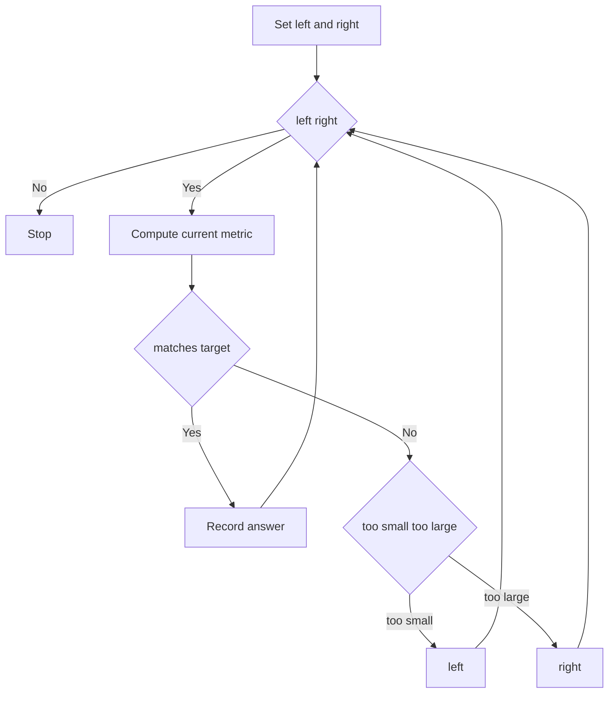
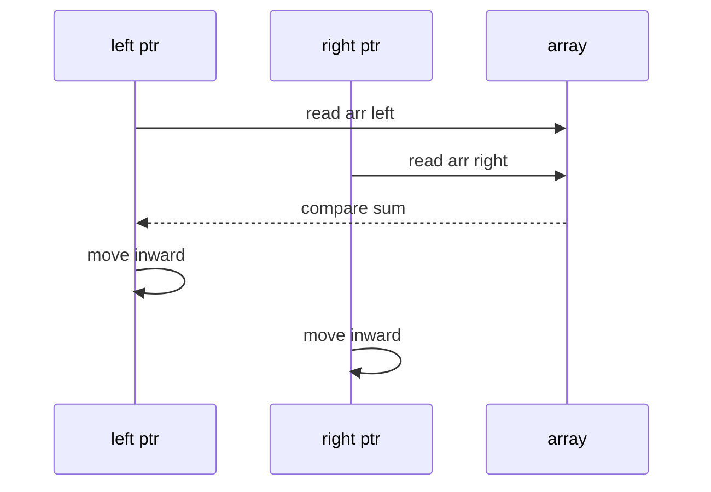

# 투 포인터 (Two Pointers) - GitHub Pages 해설

## 문서 목적
- 원본 템플릿 `07-two-pointers/01-two-pointers.md` 의 내부 동작을 GitHub Markdown에서 바로 읽을 수 있게 설명합니다.
- 코드 레이어(초기화/루프/조건/갱신/종료)를 분해하고, Mermaid로 제어 흐름을 시각화합니다.
- 실전 문제에 붙일 때 반드시 수정해야 하는 지점을 체크리스트로 제공합니다.

## 원본 템플릿
- Source: [07-two-pointers/01-two-pointers.md](https://github.com/choisimo/document/blob/main/code/templates/algorithm-architect/07-two-pointers/01-two-pointers.md)

## 내부 메커니즘 (Flow)


## 내부 상호작용 (Sequence)


## 핵심 코드
```python
# [Two Pointers 템플릿: 아키텍트 버전]
# Use Case: 정렬된 배열에서 합/차 찾기, 부분 배열
# Components: Left, Right 포인터
# Constraint: 정렬 필수 (대부분)

def two_pointers_template(arr, target):
    # 1. 초기화 (Initialization Layer)
    left, right = 0, len(arr) - 1
    
    # 2. 포인터 이동 루프 (Pointer Movement Loop)
    while left < right:
        # 3. 계산 레이어 (Calculation Layer)
        current_sum = arr[left] + arr[right]
        
        # 4. 조건 판단 (Condition Check)
        if current_sum == target:
            return (left, right)
        elif current_sum < target:
            left += 1   # 합을 키워야 함
        else:
            right -= 1  # 합을 줄여야 함
    
    return None
```

## 적용 계약
- **입력**: `arr`는 비감소 순으로 정렬돼 있어야 하고 원소는 덧셈과 `target` 비교가 가능해야 한다. 함수 내부에서는 정렬하지 않는다.
- **출력**: 합이 `target`인 첫 번째 발견 인덱스 쌍을 반환하며, 없으면 `None`이다. 모든 쌍이나 원래 정렬 전 인덱스를 반환하지 않는다.
- **이동 불변식**: 현재 합이 작으면 왼쪽 값을 키우고, 크면 오른쪽 값을 줄여도 해를 건너뛰지 않는다는 정렬 전제에 의존한다.
- **비용**: 시간 `O(n)`, 추가 공간 `O(1)`이다.

## 완료 증거
- 길이 0·1, 중복 값, 음수 포함, 여러 정답, 정답 없음의 반환 계약을 확인한다.
- 정렬되지 않은 입력을 허용하려면 정렬 비용과 원본 인덱스 보존 방식을 별도로 설계한다.
- “부분 배열” 문제에는 이 양끝 합 템플릿이 아니라 연속 구간용 이동 규칙이 필요함을 확인한다.
