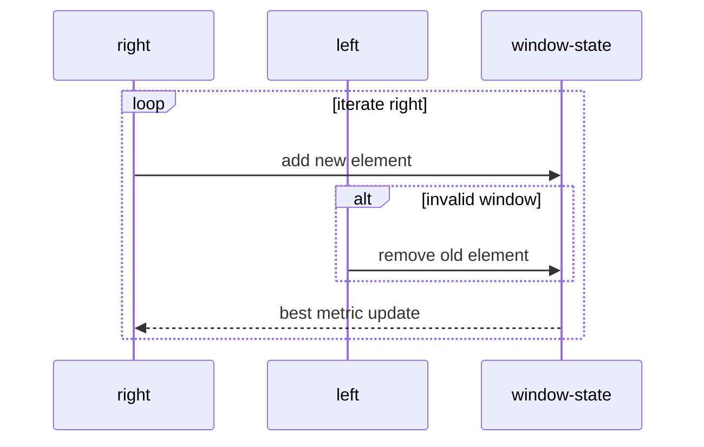

# 슬라이딩 윈도우 (Sliding Window) - GitHub Pages 해설

## 문서 목적
- 원본 템플릿 `08-sliding-window/01-sliding-window.md` 의 내부 동작을 GitHub Markdown에서 바로 읽을 수 있게 설명합니다.
- 코드 레이어(초기화/루프/조건/갱신/종료)를 분해하고, Mermaid로 제어 흐름을 시각화합니다.
- 실전 문제에 붙일 때 반드시 수정해야 하는 지점을 체크리스트로 제공합니다.

## 원본 템플릿
- Source: [08-sliding-window/01-sliding-window.md](https://github.com/choisimo/document/blob/main/code/templates/algorithm-architect/08-sliding-window/01-sliding-window.md)

## 내부 메커니즘 (Flow)


## 내부 상호작용 (Sequence)


## 핵심 코드
```python
# [Sliding Window 템플릿: 아키텍트 버전]
# Use Case: 부분 배열/문자열의 최댓값/최솟값
# Components: Window (Left, Right), HashMap (빈도)
# Constraint: 연속된 구간만 가능

def sliding_window_fixed(arr, k):
    # [고정 크기 윈도우]
    # 1. 초기화 (Initialization Layer)
    window_sum = sum(arr[:k])
    max_sum = window_sum
    
    # 2. 윈도우 이동 (Window Sliding)
    for i in range(k, len(arr)):
        # 3. 업데이트 로직 (Update Logic)
        #    - 새로운 원소 추가, 이전 원소 제거
        window_sum += arr[i] - arr[i - k]
        max_sum = max(max_sum, window_sum)
    
    return max_sum
```

## 적용 계약
- **현재 구현**: 다이어그램은 조건 위반 시 축소하는 가변 윈도우를 설명하지만, 핵심 코드는 길이 `k`인 고정 윈도우의 최대 합만 계산한다.
- **입력**: `arr`는 합산 가능한 값을 가지며 `1 <= k <= len(arr)`를 만족해야 한다. 현재 코드는 이 범위를 직접 검증하지 않는다.
- **출력**: 최대 합만 반환하며 해당 구간의 시작·끝 인덱스는 반환하지 않는다.
- **비용**: 초기 합 `O(k)`와 한 번의 순회로 총 `O(n)` 시간, `O(1)` 추가 공간이다.

## 완료 증거
- `k=1`, `k=len(arr)`, 음수만 있는 배열, 동일 최대 합이 여러 개인 경우를 확인한다.
- `k=0`, 빈 배열, `k>len(arr)`를 예외로 처리할지 호출자가 금지할지 명시한다.
- 가변 윈도우 문제라면 축소 조건과 윈도우 상태 갱신을 별도 구현한 뒤 다이어그램과 코드가 일치할 때 완료로 판정한다.
