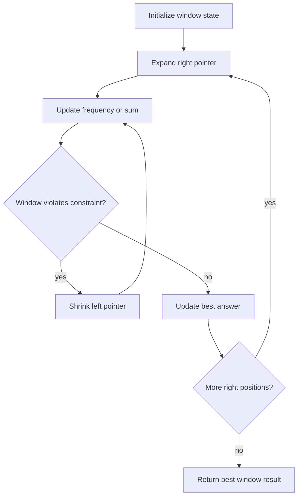

# Sliding Window 슬라이딩 윈도우 학습 및 기록 노트

> 💡 **이 글을 쓰는 이유:** Sliding Window는 연속된 구간의 상태를 유지하면서 오른쪽으로 확장하고 왼쪽을 줄이는 기법이다. 부분 배열/문자열 문제에서 매번 구간을 새로 계산하지 않고, 추가되는 값과 빠지는 값만 반영해 O(N)으로 처리한다.

---

## 1. 왜 필요한가? (Pain Point & Motivation)

* **이 개념이 구원해 줄 문제:** 연속된 부분 배열이나 부분 문자열의 합, 길이, 빈도, 최댓값을 빠르게 계산해야 할 때 필요하다.
* **대안들의 한계 (기존의 똥떵어리들):** 모든 시작/끝 구간을 중첩 반복으로 검사하면 O(N^2)이 된다. 구간 합이나 빈도를 매번 다시 계산하면 이미 알고 있는 상태를 버리는 셈이다.

## 2. 현재 나의 상태 (Baseline)

* **여기까진 안다 (익숙한 땅):** 윈도우는 보통 `[left, right]` 또는 `[left, right)` 구간으로 관리하고, 오른쪽을 늘리며 새 원소를 추가한다.
* **뇌정지 오는 부분 (안개 속):** 고정 크기 윈도우와 가변 크기 윈도우의 축소 조건이 다르다. 특히 "언제 left를 움직일지"가 문제의 제약과 직접 연결된다.
* **아직은 무리 (워너비):** 빈도 맵, 중복 문자, 최소 길이, 최대 길이처럼 윈도우 상태가 복잡해질 때 불변식을 유지해야 한다.

## 3. 도달하고 싶은 목표 (Target State)

* **이 글을 끝내고 할 수 있는 일:** 윈도우에 들어온 원소와 빠진 원소만 반영해 현재 구간 상태를 유지할 수 있다.
* **이것만은 건지자 (최소 성공 기준):** 현재 윈도우 상태는 항상 실제 `arr[left:right]` 또는 `arr[left:right+1]` 구간과 일치해야 한다.

## 4. 시스템 번역 (Data Flow)

*이 개념을 하나의 살아있는 함수나 파이프라인으로 바라보고 해부해 봅니다.*

* **📥 인풋 (Input):** 배열/문자열, 고정 크기 `k`, 또는 가변 제약 조건
* **⚙️ 프로세스 (Processing):** 오른쪽 포인터를 이동하며 새 원소를 상태에 추가하고, 윈도우가 제약을 깨면 왼쪽 포인터를 이동하며 상태에서 제거한다.
* **📤 아웃풋 (Output):** 최댓값/최솟값, 조건을 만족하는 길이, 구간 수, best window
* **💾 상태 (State):** `left`, `right`, window sum, frequency map, 현재 best answer
* **🚨 터지는 조건 (Exception):** 빠지는 원소를 상태에서 제거하지 않거나, 제약 위반 상태에서 답을 갱신하거나, 빈 윈도우/길이 부족 입력을 처리하지 않는 경우

## 5. 핵심 구성요소 (Building Blocks)

* **레고 블록 1 (Window Boundaries):** `left`와 `right`가 현재 연속 구간을 정의한다.
* **레고 블록 2 (Window State):** 합, 빈도, 중복 수처럼 현재 구간의 요약값을 유지한다.
* **레고 블록 3 (Shrink Rule):** 윈도우가 제약을 깨면 왼쪽을 얼마나 줄일지 결정한다.
* **서로 어떻게 맞물려 돌아가는가?:** 오른쪽 확장이 새 후보를 만들고, window state가 현재 구간의 성질을 말해 주며, shrink rule이 유효한 구간으로 되돌린다.

## 6. 상태 전이 (State Transition)

*상태가 어떻게 변하는지 흐름을 한눈에 보여줍니다. (표 안의 문장은 짧고 직관적으로!)*

| 초기 상태 | 이벤트 (트리거) | 전이 조건 | 변경 후 상태 | "바뀐 걸 어떻게 알지?" (관찰 방법) |
| :--- | :--- | :--- | :--- | :--- |
| `EMPTY_WINDOW` | 초기화 | 입력이 유효함 | `WINDOW_READY` | `left=0`, 상태값 초기화 |
| `WINDOW_READY` | right 확장 | 새 원소를 봄 | `EXPANDED` | window state에 원소 추가 |
| `EXPANDED` | 제약 검사 | 윈도우가 제약 위반 | `SHRINKING` | left 원소 제거 후 `left += 1` |
| `EXPANDED` | 제약 검사 | 윈도우가 유효함 | `VALID_WINDOW` | best answer 갱신 가능 |
| `VALID_WINDOW` | right 끝 도달 | 더 볼 원소 없음 | `DONE` | 최종 best 반환 |

## 7. 불변식 (Invariant: 절대 깨지면 안 되는 규칙)

* **하늘이 무너져도 지켜야 할 조건:** window state는 항상 현재 left/right가 가리키는 실제 연속 구간과 일치해야 한다.
* **이게 깨지면 생기는 대참사:** 합이나 빈도 정보가 실제 구간과 달라져 best answer가 잘못 계산된다.
* **수수방관 금지 (검증법):** 각 단계에서 `arr[left:right+1]`를 직접 계산한 값과 window state를 비교하는 작은 테스트를 만든다.

## 8. 가장 작은 예제 (Minimal Viable Example)

* **뇌컴파일이 가능한 수준의 인풋:** `arr = [1, 2, 3, 4]`, 고정 크기 `k = 2`
* **한 스텝씩 뜯어보기:** 처음 윈도우 `[1, 2]`의 합은 3이다. 오른쪽으로 한 칸 밀면 1을 빼고 3을 더해 `[2, 3]`의 합 5가 된다. 다시 2를 빼고 4를 더해 `[3, 4]`의 합 7이 된다.
* **해피 엔딩 (결과):** 크기 2 부분 배열의 최대 합은 7이다.



```python
def sliding_window_fixed(arr, k):
    if k <= 0 or k > len(arr):
        return None

    window_sum = sum(arr[:k])
    max_sum = window_sum

    for right in range(k, len(arr)):
        window_sum += arr[right] - arr[right - k]
        max_sum = max(max_sum, window_sum)

    return max_sum
```

## 9. 실패 사례 (What could go wrong?)

* **폭망 시나리오 1:** 오른쪽 원소를 추가하면서 왼쪽에서 빠지는 원소를 빼지 않아 합이 누적 오염된다.
* **폭망 시나리오 2:** 가변 윈도우에서 제약을 깨는 상태인데 best answer를 먼저 갱신한다.
* **폭망 시나리오 3:** `k > len(arr)` 또는 `k == 0`을 처리하지 않아 잘못된 초기 윈도우가 생긴다.
* **범인 검거 (어떤 불변식이 깨졌나?):** window state가 실제 left/right 구간과 일치해야 한다는 7번 불변식이 깨졌다.

## 10. 뇌 확장하기 (Evolution & Variants)

* **조건을 살짝 바꾸면?:** 고정 크기 문제는 한 칸씩 밀면 되고, 가변 크기 문제는 제약을 만족할 때까지 왼쪽을 여러 번 줄일 수 있다.
* **비슷한 놈들과 계급장 떼고 비교하기:** Two Pointers가 두 위치의 상대 이동을 넓게 다룬다면, Sliding Window는 연속 구간 상태를 유지하는 데 초점이 있다.
* **다른 데서 써먹기:** 최장 부분 문자열, 최소 길이 부분 배열, 고정 길이 최대합, 로그/트래픽의 시간 창 집계에 적용할 수 있다.

## 11. 최종 체크리스트 (Definition of Done)

*글 작성 후 아래 항목을 채웠는지 확인하는 셀프 검토용 목록이다.*

- [x] 1초 만에 이해하는 한 문장 요약이 있는가?
- [x] 일목요연한 상태 전이 표를 채웠는가?
- [x] 머릿속 그림을 표현한 구조도(다이어그램)가 포함되었는가?
- [x] 직접 굴려본 실습 결과(코드/로그)를 첨부했는가?
- [x] 에러를 마주하고 해결한 오답 노트가 있는가?
- [x] 주니어 동료에게 막힘없이 설명할 수 있는 수준인가?

## 12. 뇌에 새기는 복습 문장 (TL;DR Blank)

*복습 시 이 문장만 보고도 핵심을 떠올릴 수 있도록 빈칸을 채운다.*

> 이 개념은 결국 **연속 구간을 매번 새로 계산하지 않고 빠르게 갱신하는 문제**를 해결하기 위해 태어났고,
> 우리가 계속 감시해야 할 핵심 상태는 **left/right와 window state** 이며,
> **오른쪽을 확장하거나 제약 위반으로 왼쪽을 줄이는** 조건이 발동할 때 상태가 바뀐다.
> 그리고 무슨 일이 있어도 **window state는 항상 현재 left/right가 가리키는 실제 연속 구간과 일치해야 한다** 라는 불변식은 반드시 유지되어야만 한다!
