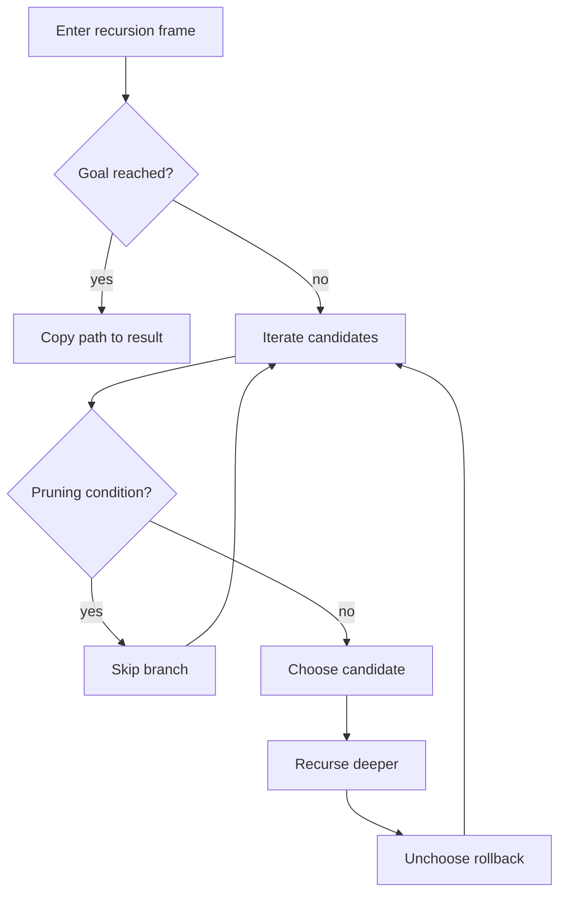

# Backtracking 백트래킹 학습 및 기록 노트

> 💡 **이 글을 쓰는 이유:** 백트래킹은 선택하고, 더 깊이 들어가고, 다시 선택을 되돌리는 방식으로 가능한 해를 탐색한다. 모든 경우를 보되 불가능한 가지는 빨리 잘라내기 때문에 조합, 순열, 퍼즐, 제약 만족 문제에서 핵심이 된다.

---

## 1. 왜 필요한가? (Pain Point & Motivation)

* **이 개념이 구원해 줄 문제:** 모든 후보 조합을 만들어야 하지만, 제약을 깨는 후보는 더 볼 필요가 없는 문제를 해결한다.
* **대안들의 한계 (기존의 똥떵어리들):** 무작정 완전 탐색하면 불가능한 가지까지 끝까지 내려간다. 반대로 Greedy처럼 한 번 선택하고 되돌리지 않으면 가능한 해 전체를 놓친다.

## 2. 현재 나의 상태 (Baseline)

* **여기까진 안다 (익숙한 땅):** 재귀 DFS로 현재 path를 만들고, 목표 조건을 만족하면 결과에 추가한다.
* **뇌정지 오는 부분 (안개 속):** `path.append()` 뒤에는 반드시 `path.pop()`으로 상태를 되돌려야 한다. 결과에 넣을 때도 path 자체가 아니라 복사본을 넣어야 한다.
* **아직은 무리 (워너비):** 중복 후보 제거, 가지치기 조건, start 인덱스, 같은 원소 재사용 여부를 문제마다 정확히 바꿔야 한다.

## 3. 도달하고 싶은 목표 (Target State)

* **이 글을 끝내고 할 수 있는 일:** choose, explore, unchoose 세 단계를 분리해 백트래킹 코드를 설계할 수 있다.
* **이것만은 건지자 (최소 성공 기준):** 재귀 호출이 끝나면 path와 남은 상태가 호출 전 상태로 복구되어야 한다는 규칙을 지킨다.

## 4. 시스템 번역 (Data Flow)

*이 개념을 하나의 살아있는 함수나 파이프라인으로 바라보고 해부해 봅니다.*

* **📥 인풋 (Input):** 후보 목록, 목표 조건, 제약 조건, 현재 path
* **⚙️ 프로세스 (Processing):** 후보를 하나 선택하고 상태를 갱신한 뒤 재귀 탐색하고, 돌아오면 선택을 되돌려 다음 후보를 시도한다.
* **📤 아웃풋 (Output):** 조건을 만족하는 모든 해, 최적 해, 또는 해 존재 여부
* **💾 상태 (State):** 현재 path, start index, remaining target, result, 후보 사용 여부
* **🚨 터지는 조건 (Exception):** 복원 누락, path 복사 누락, 가지치기 조건 오류, 중복 후보 처리 누락

## 5. 핵심 구성요소 (Building Blocks)

* **레고 블록 1 (Choice):** 현재 단계에서 후보 하나를 고른다.
* **레고 블록 2 (Constraint / Pruning):** 이 선택이 목표에 도달할 가능성이 있는지 검사한다.
* **레고 블록 3 (Rollback):** 재귀 호출 뒤 선택 전 상태로 되돌린다.
* **서로 어떻게 맞물려 돌아가는가?:** choice가 경로를 확장하고, pruning이 불필요한 가지를 막고, rollback이 다음 후보 탐색을 안전하게 만든다.

## 6. 상태 전이 (State Transition)

*상태가 어떻게 변하는지 흐름을 한눈에 보여줍니다. (표 안의 문장은 짧고 직관적으로!)*

| 초기 상태 | 이벤트 (트리거) | 전이 조건 | 변경 후 상태 | "바뀐 걸 어떻게 알지?" (관찰 방법) |
| :--- | :--- | :--- | :--- | :--- |
| `FRAME_ENTERED` | 목표 검사 | 목표 조건 만족 | `SOLUTION_FOUND` | path 복사본을 result에 추가 |
| `FRAME_ENTERED` | 후보 순회 | 후보가 제약 위반 | `PRUNED` | 해당 분기 skip |
| `FRAME_ENTERED` | 후보 선택 | 후보가 유효함 | `CHOSEN` | path에 후보 추가 |
| `CHOSEN` | 재귀 호출 | 더 깊은 탐색 필요 | `EXPLORING` | 다음 frame 진입 |
| `EXPLORING` | 재귀 복귀 | 호출 완료 | `ROLLED_BACK` | path에서 후보 제거 |

## 7. 불변식 (Invariant: 절대 깨지면 안 되는 규칙)

* **하늘이 무너져도 지켜야 할 조건:** 한 재귀 frame이 끝나면 path는 그 frame에 들어오기 전 상태로 복구되어야 한다.
* **이게 깨지면 생기는 대참사:** 다음 후보 탐색에 이전 후보가 섞여 결과가 오염되고, 중복/누락 해가 생긴다.
* **수수방관 금지 (검증법):** 재귀 진입/복귀 시 path를 로그로 찍고, 작은 입력의 모든 해를 손으로 나열한 결과와 비교한다.

## 8. 가장 작은 예제 (Minimal Viable Example)

* **뇌컴파일이 가능한 수준의 인풋:** 후보 `[2, 3]`, target `5`
* **한 스텝씩 뜯어보기:** 2를 선택해 remaining 3으로 내려간다. 다시 3을 선택해 remaining 0이 되면 `[2, 3]`을 복사해 저장한다. 이후 3을 pop하고, 2도 pop해 다음 후보를 본다.
* **해피 엔딩 (결과):** 가능한 조합 `[[2, 3]]`을 얻는다.



```python
def combination_sum(candidates, target):
    result = []
    candidates.sort()

    def backtrack(path, start, remaining):
        if remaining == 0:
            result.append(path[:])
            return

        for i in range(start, len(candidates)):
            value = candidates[i]
            if value > remaining:
                break

            path.append(value)
            backtrack(path, i + 1, remaining - value)
            path.pop()

    backtrack([], 0, target)
    return result
```

## 9. 실패 사례 (What could go wrong?)

* **폭망 시나리오 1:** `result.append(path)`로 참조를 저장해 나중에 path가 바뀌며 결과도 같이 바뀐다.
* **폭망 시나리오 2:** `path.pop()`을 빼먹어 다음 분기에 이전 선택이 남는다.
* **폭망 시나리오 3:** 정렬하지 않고 `value > remaining`에서 break해 뒤쪽의 작은 후보를 놓친다.
* **범인 검거 (어떤 불변식이 깨졌나?):** 재귀 frame 종료 후 path가 진입 전 상태로 복구되어야 한다는 7번 불변식이 깨졌다.

## 10. 뇌 확장하기 (Evolution & Variants)

* **조건을 살짝 바꾸면?:** 같은 원소를 재사용할 수 있으면 다음 재귀의 start를 `i`로 두고, 한 번만 사용할 수 있으면 `i + 1`로 둔다.
* **비슷한 놈들과 계급장 떼고 비교하기:** DFS는 깊이 우선 탐색 자체이고, Backtracking은 선택 상태를 되돌리며 가능한 해 공간을 탐색하는 DFS 패턴이다.
* **다른 데서 써먹기:** N-Queen, Sudoku, 순열/조합 생성, 부분집합, 경로 찾기, 제약 만족 문제에 적용할 수 있다.

## 11. 최종 체크리스트 (Definition of Done)

*글 작성 후 아래 항목을 채웠는지 확인하는 셀프 검토용 목록이다.*

- [x] 1초 만에 이해하는 한 문장 요약이 있는가?
- [x] 일목요연한 상태 전이 표를 채웠는가?
- [x] 머릿속 그림을 표현한 구조도(다이어그램)가 포함되었는가?
- [x] 직접 굴려본 실습 결과(코드/로그)를 첨부했는가?
- [x] 에러를 마주하고 해결한 오답 노트가 있는가?
- [x] 주니어 동료에게 막힘없이 설명할 수 있는 수준인가?

## 12. 뇌에 새기는 복습 문장 (TL;DR Blank)

*복습 시 이 문장만 보고도 핵심을 떠올릴 수 있도록 빈칸을 채운다.*

> 이 개념은 결국 **가능한 선택을 탐색하되 불가능한 가지를 되돌리는 문제**를 해결하기 위해 태어났고,
> 우리가 계속 감시해야 할 핵심 상태는 **path와 remaining/start 같은 재귀 상태** 이며,
> **후보를 선택하고 재귀 호출 후 복원하는** 조건이 발동할 때 상태가 바뀐다.
> 그리고 무슨 일이 있어도 **한 재귀 frame이 끝나면 path는 그 frame에 들어오기 전 상태로 복구되어야 한다** 라는 불변식은 반드시 유지되어야만 한다!
