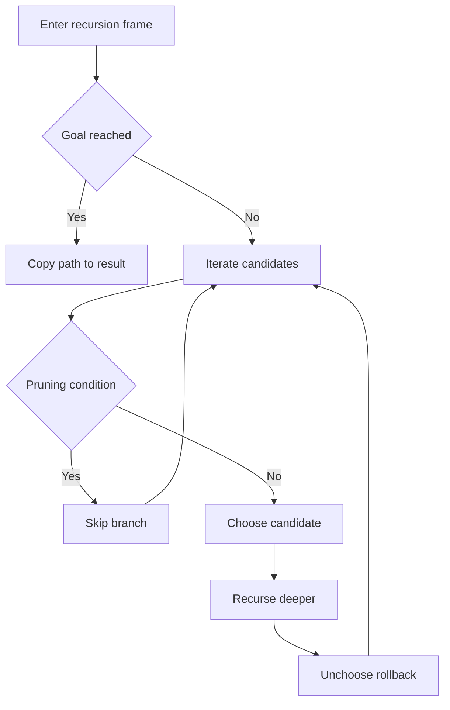
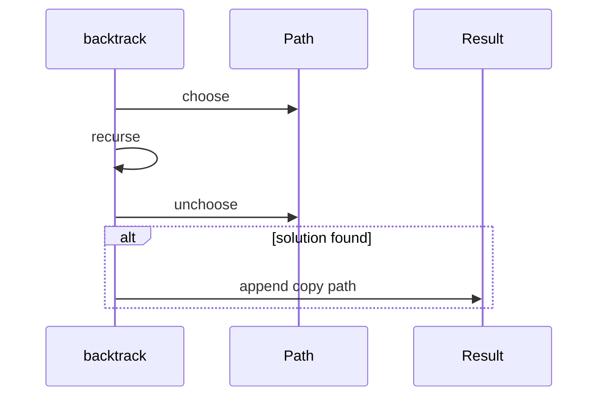

# 백트래킹 (Backtracking) - GitHub Pages 해설

## 문서 목적
- 원본 템플릿 `09-backtracking/01-backtracking.md` 의 내부 동작을 GitHub Markdown에서 바로 읽을 수 있게 설명합니다.
- 코드 레이어(초기화/루프/조건/갱신/종료)를 분해하고, Mermaid로 제어 흐름을 시각화합니다.
- 실전 문제에 붙일 때 반드시 수정해야 하는 지점을 체크리스트로 제공합니다.

## 원본 템플릿
- Source: [09-backtracking/01-backtracking.md](https://github.com/choisimo/document/blob/main/code/templates/algorithm-architect/09-backtracking/01-backtracking.md)

## 내부 메커니즘 (Flow)


## 내부 상호작용 (Sequence)


## 핵심 코드
```python
# [Backtracking 템플릿: 아키텍트 버전]
# Use Case: 모든 경우의 수 탐색, 조합, 순열
# Components: Recursive DFS, Choice, Constraint
# Constraint: 가지치기(Pruning)로 최적화

def backtrack_template(candidates, target):
    # 1. 초기화 (Initialization Layer)
    result = []
    
    # 2. 백트래킹 함수 (Backtracking Function)
    def backtrack(path, start, remaining):
        # 3. 종료 조건 (Base Case)
        if remaining == 0:
            result.append(path[:])  # 복사 필수
            return
        
        # 4. 후보 탐색 (Candidate Exploration)
        for i in range(start, len(candidates)):
            # 5. 가지치기 (Pruning)
            if candidates[i] > remaining:
                break  # 정렬되어 있다면 조기 종료
            
            # 6. 선택 (Choose)
            path.append(candidates[i])
            
            # 7. 재귀 탐색 (Explore)
            backtrack(path, i, remaining - candidates[i])
            
            # 8. 복원 (Unchoose / Backtrack)
            path.pop()
    
    candidates.sort()  # 가지치기 효율화
    backtrack([], 0, target)
    return result
```

## 적용 계약
- **현재 문제**: 정렬된 후보를 제한 없이 재사용해 합이 `target`이 되는 조합을 찾는 형태다. 순열·일회 선택 문제에는 재귀 인덱스 규칙이 다르다.
- **입력**: 종료를 보장하려면 후보를 양의 값으로 제한하고 `target`은 0 이상이어야 한다. 중복 후보를 허용하면 같은 조합이 중복 생성될 수 있다.
- **상태**: `candidates.sort()`가 입력 목록을 제자리에서 변경하며, 결과에는 `path`의 복사본을 저장한다.
- **비용**: 탐색 크기는 후보와 target에 따라 지수적으로 증가하고 결과 개수 자체가 하한이 된다. 단일 고정 복잡도로 축소하지 않는다.

## 완료 증거
- target 0, 해 없음, 후보 중복, 후보 0·음수, 재사용 허용 여부를 입력 계약에 고정한다.
- 중복 제거가 필요하면 같은 깊이의 동일 후보 건너뛰기 규칙을 추가한다.
- 가지치기 전제가 정렬·양수 조건에 의존함을 반례로 확인하고 최대 재귀 깊이가 허용 범위인지 판정한다.
