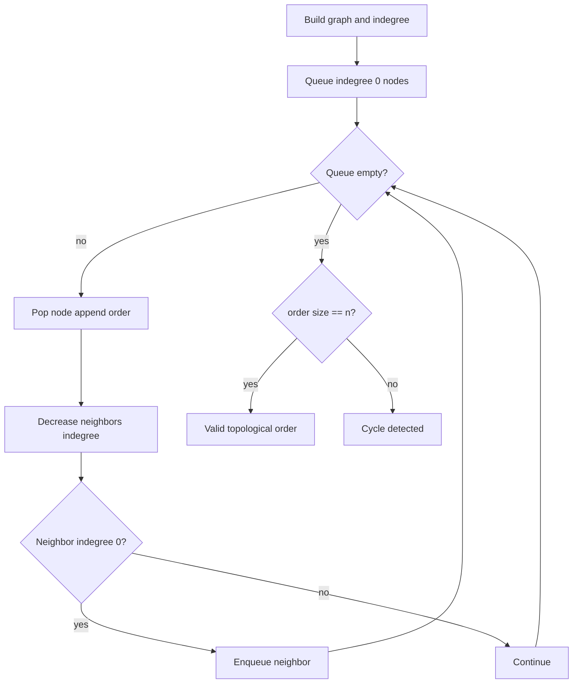

# Topological Sort 위상 정렬 학습 및 기록 노트

> 💡 **이 글을 쓰는 이유:** 위상 정렬은 선후 관계가 있는 작업들을 가능한 순서로 나열하는 알고리즘이다. DAG에서만 가능하며, 진입 차수가 0인 노드부터 제거해 나가면 "먼저 해야 하는 작업이 모두 끝난 노드"만 결과에 들어간다.

---

## 1. 왜 필요한가? (Pain Point & Motivation)

* **이 개념이 구원해 줄 문제:** 선수 과목, 빌드 순서, 작업 의존성처럼 방향성 있는 선후 관계를 만족하는 순서를 만들어야 할 때 필요하다.
* **대안들의 한계 (기존의 똥떵어리들):** 그냥 정렬하면 의존성을 반영할 수 없다. DFS/BFS로 방문 순서만 기록하면 사이클 때문에 완료 불가능한 경우를 놓치거나, 선행 작업이 끝나기 전에 후행 작업을 배치할 수 있다.

## 2. 현재 나의 상태 (Baseline)

* **여기까진 안다 (익숙한 땅):** 방향 그래프에서 `u -> v`는 u가 v보다 먼저 와야 한다는 뜻이다.
* **뇌정지 오는 부분 (안개 속):** 큐에 들어가는 노드는 단순히 방문하지 않은 노드가 아니라, 현재 남은 그래프에서 진입 차수가 0인 노드다.
* **아직은 무리 (워너비):** 결과 길이가 n보다 작을 때 이것이 사이클 존재를 의미한다는 점을 명확히 판정해야 한다.

## 3. 도달하고 싶은 목표 (Target State)

* **이 글을 끝내고 할 수 있는 일:** indegree 배열과 queue가 어떻게 DAG의 선후 관계를 보존하는지 설명할 수 있다.
* **이것만은 건지자 (최소 성공 기준):** 위상 정렬은 DAG에서만 가능하고, 모든 노드를 결과에 넣지 못하면 사이클이 있다는 사실을 이해한다.

## 4. 시스템 번역 (Data Flow)

*이 개념을 하나의 살아있는 함수나 파이프라인으로 바라보고 해부해 봅니다.*

* **📥 인풋 (Input):** 노드 수, 방향 간선 `(선행, 후행)`
* **⚙️ 프로세스 (Processing):** 그래프와 진입 차수를 만들고, 진입 차수 0인 노드를 큐에 넣어 하나씩 제거하며 이웃의 진입 차수를 감소시킨다.
* **📤 아웃풋 (Output):** 선후 관계를 만족하는 순서 또는 사이클 존재 판정
* **💾 상태 (State):** adjacency list, indegree 배열, queue, result order
* **🚨 터지는 조건 (Exception):** 사이클 존재, indegree 감소 누락, 0-index/1-index 혼동, 큐 구현 비효율

## 5. 핵심 구성요소 (Building Blocks)

* **레고 블록 1 (Indegree):** 각 노드 앞에 아직 남아 있는 선행 작업 수를 나타낸다.
* **레고 블록 2 (Zero-Indegree Queue):** 처리 가능한 노드들을 보관한다.
* **레고 블록 3 (Cycle Detection):** 결과에 들어간 노드 수가 전체 노드 수보다 작으면 사이클이 있다고 판단한다.
* **서로 어떻게 맞물려 돌아가는가?:** queue가 처리 가능한 노드를 제공하고, 간선을 제거하는 효과로 indegree가 줄며, 새롭게 0이 된 노드가 다음 처리 후보가 된다.

## 6. 상태 전이 (State Transition)

*상태가 어떻게 변하는지 흐름을 한눈에 보여줍니다. (표 안의 문장은 짧고 직관적으로!)*

| 초기 상태 | 이벤트 (트리거) | 전이 조건 | 변경 후 상태 | "바뀐 걸 어떻게 알지?" (관찰 방법) |
| :--- | :--- | :--- | :--- | :--- |
| `RAW_EDGES` | 그래프 구성 | 간선 목록이 주어짐 | `INDEGREE_READY` | indegree 배열 계산 |
| `INDEGREE_READY` | 초기 큐 구성 | indegree가 0인 노드 존재 | `QUEUE_READY` | queue에 시작 노드들 삽입 |
| `QUEUE_READY` | pop | queue가 비어 있지 않음 | `NODE_OUTPUT` | result에 노드 추가 |
| `NODE_OUTPUT` | 간선 제거 효과 | 이웃 indegree 감소 | `NEIGHBOR_UPDATED` | indegree 값 감소 |
| `NEIGHBOR_UPDATED` | 새 후보 발견 | indegree가 0이 됨 | `ENQUEUED` | queue에 이웃 삽입 |
| `QUEUE_READY` | 큐가 빔 | result 길이 확인 | `DONE_OR_CYCLE` | n개면 성공, 아니면 사이클 |

## 7. 불변식 (Invariant: 절대 깨지면 안 되는 규칙)

* **하늘이 무너져도 지켜야 할 조건:** 결과에 추가되는 노드는 그 시점에 남은 모든 선행 의존성이 제거된 상태여야 한다.
* **이게 깨지면 생기는 대참사:** 아직 끝나지 않은 선행 작업보다 후행 작업이 먼저 나와 순서가 무효가 된다.
* **수수방관 금지 (검증법):** 결과 순서에서 모든 간선 `u -> v`에 대해 u의 위치가 v보다 앞인지 검사한다.

## 8. 가장 작은 예제 (Minimal Viable Example)

* **뇌컴파일이 가능한 수준의 인풋:** `0 -> 2`, `1 -> 2`, `2 -> 3`
* **한 스텝씩 뜯어보기:** 처음 indegree 0인 노드는 0과 1이다. 둘을 처리하면 2의 indegree가 0이 되고, 2를 처리하면 3의 indegree가 0이 된다.
* **해피 엔딩 (결과):** 가능한 위상 순서 중 하나는 `[0, 1, 2, 3]`이다.



```python
from collections import deque


def topological_sort_bfs(n, edges):
    graph = [[] for _ in range(n)]
    indegree = [0] * n

    for u, v in edges:
        graph[u].append(v)
        indegree[v] += 1

    queue = deque(i for i in range(n) if indegree[i] == 0)
    result = []

    while queue:
        current = queue.popleft()
        result.append(current)

        for neighbor in graph[current]:
            indegree[neighbor] -= 1
            if indegree[neighbor] == 0:
                queue.append(neighbor)

    if len(result) != n:
        return []

    return result
```

## 9. 실패 사례 (What could go wrong?)

* **폭망 시나리오 1:** 사이클이 있는데 결과 길이를 확인하지 않아 일부 노드만 담긴 순서를 성공처럼 반환한다.
* **폭망 시나리오 2:** 간선 방향을 반대로 저장해 선행/후행 관계가 뒤집힌다.
* **폭망 시나리오 3:** 이웃의 indegree를 줄이지 않아 새롭게 처리 가능한 노드가 큐에 들어가지 않는다.
* **범인 검거 (어떤 불변식이 깨졌나?):** 결과에 추가되는 노드는 모든 선행 의존성이 제거된 상태여야 한다는 7번 불변식이 깨졌다.

## 10. 뇌 확장하기 (Evolution & Variants)

* **조건을 살짝 바꾸면?:** 가능한 순서가 여러 개일 때 사전순으로 가장 작은 순서를 원하면 queue 대신 priority queue를 사용한다.
* **비슷한 놈들과 계급장 떼고 비교하기:** Kahn 알고리즘은 indegree와 queue를 쓰고, DFS 기반 위상 정렬은 종료 시점을 stack에 쌓아 역순으로 읽는다.
* **다른 데서 써먹기:** 빌드 시스템, 패키지 설치 순서, 과목 선수 조건, 워크플로우 스케줄링에 적용할 수 있다.

## 11. 최종 체크리스트 (Definition of Done)

*글 작성 후 아래 항목을 채웠는지 확인하는 셀프 검토용 목록이다.*

- [x] 1초 만에 이해하는 한 문장 요약이 있는가?
- [x] 일목요연한 상태 전이 표를 채웠는가?
- [x] 머릿속 그림을 표현한 구조도(다이어그램)가 포함되었는가?
- [x] 직접 굴려본 실습 결과(코드/로그)를 첨부했는가?
- [x] 에러를 마주하고 해결한 오답 노트가 있는가?
- [x] 주니어 동료에게 막힘없이 설명할 수 있는 수준인가?

## 12. 뇌에 새기는 복습 문장 (TL;DR Blank)

*복습 시 이 문장만 보고도 핵심을 떠올릴 수 있도록 빈칸을 채운다.*

> 이 개념은 결국 **선후 관계가 있는 작업을 가능한 순서로 나열하는 문제**를 해결하기 위해 태어났고,
> 우리가 계속 감시해야 할 핵심 상태는 **indegree 배열과 zero-indegree queue** 이며,
> **선행 노드를 처리해 이웃의 indegree를 줄이는** 조건이 발동할 때 상태가 바뀐다.
> 그리고 무슨 일이 있어도 **결과에 추가되는 노드는 그 시점에 남은 모든 선행 의존성이 제거된 상태여야 한다** 라는 불변식은 반드시 유지되어야만 한다!
