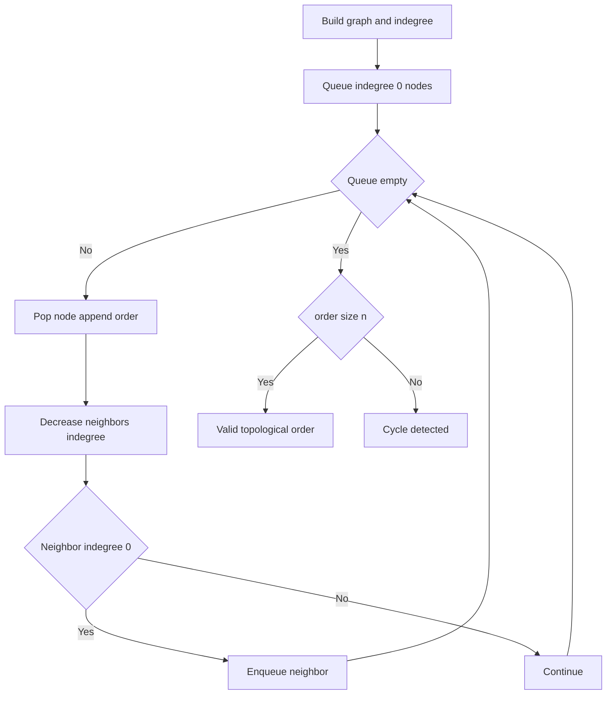
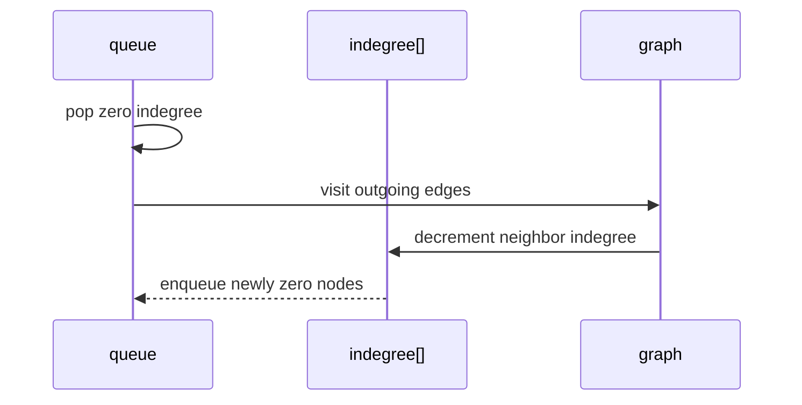

# 위상 정렬 (Topological Sort) - GitHub Pages 해설

## 문서 목적
- 원본 템플릿 `10-topological-sort/01-topological-sort.md` 의 내부 동작을 GitHub Markdown에서 바로 읽을 수 있게 설명합니다.
- 코드 레이어(초기화/루프/조건/갱신/종료)를 분해하고, Mermaid로 제어 흐름을 시각화합니다.
- 실전 문제에 붙일 때 반드시 수정해야 하는 지점을 체크리스트로 제공합니다.

## 원본 템플릿
- Source: [10-topological-sort/01-topological-sort.md](https://github.com/choisimo/document/blob/main/code/templates/algorithm-architect/10-topological-sort/01-topological-sort.md)

## 내부 메커니즘 (Flow)


## 내부 상호작용 (Sequence)


## 핵심 코드
```python
# [Topological Sort 템플릿: 아키텍트 버전]
# Use Case: DAG(방향 비순환 그래프)의 선후 관계 정렬
# Components: Indegree Array, Queue
# Constraint: 사이클이 있으면 불가능

def topological_sort_bfs(n, edges):
    # [Kahn's Algorithm (BFS 기반)]
    
    # 1. 초기화 (Initialization Layer)
    #    - 진입 차수(Indegree) 계산
    graph = [[] for _ in range(n)]
    indegree = [0] * n
    
    for u, v in edges:
        graph[u].append(v)
        indegree[v] += 1
    
    # 2. 진입 차수 0인 노드를 큐에 삽입
    queue = [i for i in range(n) if indegree[i] == 0]
    result = []
    
    # 3. 메인 루프 (Process Loop)
    while queue:
        current = queue.pop(0)
        result.append(current)
        
        # 4. 인접 노드의 진입 차수 감소
        for neighbor in graph[current]:
            indegree[neighbor] -= 1
            
            # 5. 진입 차수가 0이 되면 큐에 추가
            if indegree[neighbor] == 0:
                queue.append(neighbor)
    
    # 6. 사이클 검출 (Cycle Detection)
    if len(result) != n:
        return []  # 사이클 존재
    
    return result
```

## 적용 계약
- **입력**: 노드는 `0..n-1`이고 각 간선 `(u, v)`는 `u`가 `v`보다 앞선다는 뜻이다. 범위 밖 노드와 중복 간선의 처리 정책을 정해야 한다.
- **출력**: DAG이면 가능한 순서 하나를 반환한다. 위상 순서는 유일하지 않을 수 있으며, 사이클이면 `[]`를 반환한다. `n=0`의 정상 결과도 `[]`라서 상태 구분이 필요할 수 있다.
- **비용**: 그래프 구성은 `O(V+E)`지만 현재 `list.pop(0)` 큐는 제거마다 선형 이동이 발생한다. `deque.popleft()`를 사용해야 전체 `O(V+E)`를 보장할 수 있다.

## 완료 증거
- 독립 노드, 복수의 유효 순서, 자기 루프, 여러 노드 사이클, 빈 그래프의 상태를 확인한다.
- 반환 순서의 모든 간선에서 `u`가 `v`보다 앞서는지 검증한다.
- 사이클과 정상 빈 결과를 구분해야 하면 결과와 상태를 함께 반환하도록 계약을 변경한다.
