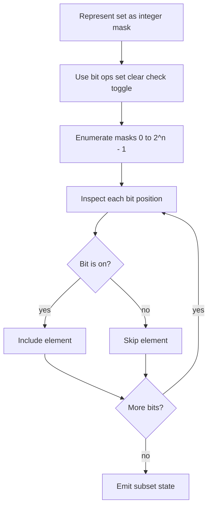

# Bit Masking 비트 마스킹 학습 및 기록 노트

> 💡 **이 글을 쓰는 이유:** 비트 마스킹은 집합 상태를 정수 하나로 압축해 저장하고 조작하는 기법이다. 켜진 비트는 원소 포함, 꺼진 비트는 원소 미포함을 뜻한다. 부분집합 열거, 방문 상태, DP 상태 압축에서 매우 강력하지만 비트 위치와 원소 매핑이 흔들리면 바로 틀린다.

---

## 1. 왜 필요한가? (Pain Point & Motivation)

* **이 개념이 구원해 줄 문제:** 작은 원소 집합의 포함/제외 상태를 빠르게 저장, 검사, 변경, 열거해야 할 때 필요하다.
* **대안들의 한계 (기존의 똥떵어리들):** set/list로 상태를 들고 다니면 비교와 복사가 무거워질 수 있다. 부분집합 DP에서는 상태 수가 많아지므로 정수 mask로 압축하는 편이 훨씬 간단하고 빠르다.

## 2. 현재 나의 상태 (Baseline)

* **여기까진 안다 (익숙한 땅):** `1 << i`는 i번째 비트만 켜진 값을 만들고, `mask & (1 << i)`로 포함 여부를 확인한다.
* **뇌정지 오는 부분 (안개 속):** set, clear, toggle 연산이 각각 어떤 비트만 바꾸고 나머지는 보존하는지 직관이 흐려질 수 있다.
* **아직은 무리 (워너비):** 모든 부분집합 열거, 부분집합의 부분집합 순회, bitmask DP의 상태 전이를 자연스럽게 작성해야 한다.

## 3. 도달하고 싶은 목표 (Target State)

* **이 글을 끝내고 할 수 있는 일:** 정수 mask를 보고 어떤 원소들이 포함되어 있는지 읽고, 특정 원소를 켜고 끄고 토글할 수 있다.
* **이것만은 건지자 (최소 성공 기준):** i번째 비트와 i번째 원소의 매핑을 고정하고, 모든 비트 연산이 그 매핑을 기준으로 동작해야 한다.

## 4. 시스템 번역 (Data Flow)

*이 개념을 하나의 살아있는 함수나 파이프라인으로 바라보고 해부해 봅니다.*

* **📥 인풋 (Input):** 원소 개수 `n`, 현재 mask, 조작할 bit index `i`
* **⚙️ 프로세스 (Processing):** shift로 i번째 비트 마커를 만들고, AND/OR/XOR/NOT 연산으로 확인/설정/해제/토글한다.
* **📤 아웃풋 (Output):** 갱신된 mask, 포함 여부, 켜진 비트 개수, 부분집합 상태
* **💾 상태 (State):** 정수 mask, bit index, 원소와 비트 위치의 매핑
* **🚨 터지는 조건 (Exception):** index 매핑 오류, 연산자 우선순위 착각, 너무 큰 n으로 상태 수 폭발, 음수/부호 있는 정수 처리 혼동

## 5. 핵심 구성요소 (Building Blocks)

* **레고 블록 1 (Mask):** 집합 포함 상태를 담는 정수다.
* **레고 블록 2 (Bit Marker):** `1 << i`로 만든 i번째 위치의 선택자다.
* **레고 블록 3 (Bit Operations):** check, set, clear, toggle, count 같은 상태 조작 연산이다.
* **서로 어떻게 맞물려 돌아가는가?:** bit marker가 바꿀 위치를 지정하고, bit operation이 mask의 해당 위치만 읽거나 갱신한다.

## 6. 상태 전이 (State Transition)

*상태가 어떻게 변하는지 흐름을 한눈에 보여줍니다. (표 안의 문장은 짧고 직관적으로!)*

| 초기 상태 | 이벤트 (트리거) | 전이 조건 | 변경 후 상태 | "바뀐 걸 어떻게 알지?" (관찰 방법) |
| :--- | :--- | :--- | :--- | :--- |
| `MASK_READY` | check | `mask & (1 << i)` 실행 | `BIT_READ` | 결과가 0이면 off, 아니면 on |
| `MASK_READY` | set | `mask | (1 << i)` 실행 | `BIT_ON` | i번째 비트가 1 |
| `MASK_READY` | clear | `mask & ~(1 << i)` 실행 | `BIT_OFF` | i번째 비트가 0 |
| `MASK_READY` | toggle | `mask ^ (1 << i)` 실행 | `BIT_FLIPPED` | i번째 비트가 반전 |
| `MASK_READY` | enumerate | `0..(1<<n)-1` 순회 | `SUBSETS_VISITED` | 모든 부분집합 상태 확인 |

## 7. 불변식 (Invariant: 절대 깨지면 안 되는 규칙)

* **하늘이 무너져도 지켜야 할 조건:** i번째 비트는 항상 i번째 원소의 포함 여부만 의미해야 한다.
* **이게 깨지면 생기는 대참사:** mask는 정수로는 정상이어도 실제 원소 집합 해석이 틀려 DP 상태나 방문 상태가 오염된다.
* **수수방관 금지 (검증법):** 작은 n에서 모든 mask를 원소 목록으로 풀어 쓰고, set/clear/toggle 결과를 손으로 확인한다.

## 8. 가장 작은 예제 (Minimal Viable Example)

* **뇌컴파일이 가능한 수준의 인풋:** 원소 `A, B, C`를 각각 bit `0, 1, 2`에 매핑한다.
* **한 스텝씩 뜯어보기:** `mask = 0`에서 `A`를 넣으면 `001`, `C`를 넣으면 `101`이 된다. `A`를 확인하려면 `mask & 001`을 보고, `B`를 확인하려면 `mask & 010`을 본다.
* **해피 엔딩 (결과):** `mask = 101`은 `{A, C}`를 의미한다.



```python
def check_bit(mask, i):
    return (mask & (1 << i)) != 0


def set_bit(mask, i):
    return mask | (1 << i)


def clear_bit(mask, i):
    return mask & ~(1 << i)


def toggle_bit(mask, i):
    return mask ^ (1 << i)


def count_bits(mask):
    return mask.bit_count()
```

## 9. 실패 사례 (What could go wrong?)

* **폭망 시나리오 1:** 원소는 1번부터 세는데 비트는 0번부터 세는 차이를 놓쳐 한 칸씩 밀린다.
* **폭망 시나리오 2:** `mask & 1 << i`의 우선순위를 착각해 의도와 다른 조건식을 작성한다.
* **폭망 시나리오 3:** n이 너무 큰데 모든 mask를 열거해 `2^n` 시간/메모리 폭발이 난다.
* **범인 검거 (어떤 불변식이 깨졌나?):** i번째 비트가 i번째 원소의 포함 여부만 의미해야 한다는 7번 불변식이 깨졌다.

## 10. 뇌 확장하기 (Evolution & Variants)

* **조건을 살짝 바꾸면?:** 부분집합의 부분집합을 순회하려면 `sub = mask; sub = (sub - 1) & mask` 패턴을 사용한다.
* **비슷한 놈들과 계급장 떼고 비교하기:** boolean 배열은 읽기 쉽고, bitmask는 상태를 정수 하나로 압축해 DP key나 방문 key로 쓰기 좋다.
* **다른 데서 써먹기:** TSP DP, subset DP, 방문 상태 BFS, 권한 플래그, 조합 열거에 적용할 수 있다.

## 11. 최종 체크리스트 (Definition of Done)

*글 작성 후 아래 항목을 채웠는지 확인하는 셀프 검토용 목록이다.*

- [x] 1초 만에 이해하는 한 문장 요약이 있는가?
- [x] 일목요연한 상태 전이 표를 채웠는가?
- [x] 머릿속 그림을 표현한 구조도(다이어그램)가 포함되었는가?
- [x] 직접 굴려본 실습 결과(코드/로그)를 첨부했는가?
- [x] 에러를 마주하고 해결한 오답 노트가 있는가?
- [x] 주니어 동료에게 막힘없이 설명할 수 있는 수준인가?

## 12. 뇌에 새기는 복습 문장 (TL;DR Blank)

*복습 시 이 문장만 보고도 핵심을 떠올릴 수 있도록 빈칸을 채운다.*

> 이 개념은 결국 **집합 상태를 정수 하나로 압축해 빠르게 조작하는 문제**를 해결하기 위해 태어났고,
> 우리가 계속 감시해야 할 핵심 상태는 **mask와 bit index 매핑** 이며,
> **특정 비트를 확인/설정/해제/토글하는** 조건이 발동할 때 상태가 바뀐다.
> 그리고 무슨 일이 있어도 **i번째 비트는 항상 i번째 원소의 포함 여부만 의미해야 한다** 라는 불변식은 반드시 유지되어야만 한다!
