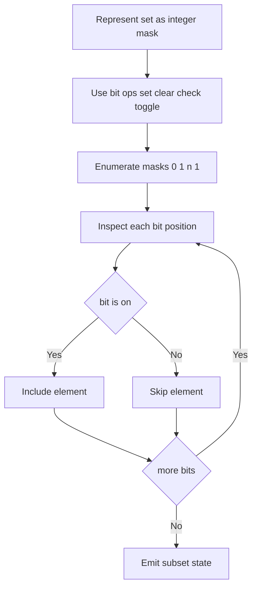
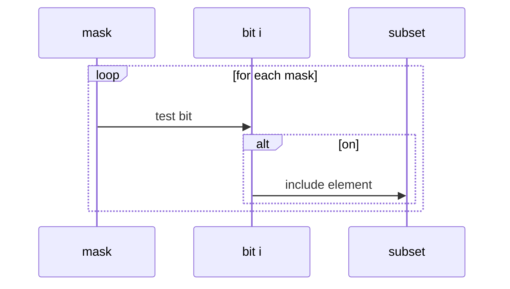

# 비트 마스킹 (Bit Masking) - GitHub Pages 해설

## 문서 목적
- 원본 템플릿 `11-bit-masking/01-bit-masking.md` 의 내부 동작을 GitHub Markdown에서 바로 읽을 수 있게 설명합니다.
- 코드 레이어(초기화/루프/조건/갱신/종료)를 분해하고, Mermaid로 제어 흐름을 시각화합니다.
- 실전 문제에 붙일 때 반드시 수정해야 하는 지점을 체크리스트로 제공합니다.

## 원본 템플릿
- Source: [11-bit-masking/01-bit-masking.md](https://github.com/choisimo/document/blob/main/code/templates/algorithm-architect/11-bit-masking/01-bit-masking.md)

## 내부 메커니즘 (Flow)


## 내부 상호작용 (Sequence)


## 핵심 코드
```python
# [Bit Masking 템플릿: 아키텍트 버전]
# Use Case: 집합 상태 관리, 부분 집합
# Components: Bitmask (정수), Bit Operations
# Constraint: 최대 32~64개 원소

def bit_operations():
    # 1. 기본 비트 연산 (Basic Operations)
    
    # i번째 비트 확인 (Check)
    def check_bit(mask, i):
        return (mask & (1 << i)) != 0
    
    # i번째 비트 설정 (Set)
    def set_bit(mask, i):
        return mask | (1 << i)
    
    # i번째 비트 해제 (Clear)
    def clear_bit(mask, i):
        return mask & ~(1 << i)
    
    # i번째 비트 토글 (Toggle)
    def toggle_bit(mask, i):
        return mask ^ (1 << i)
    
    # 켜진 비트 개수 (Count)
    def count_bits(mask):
        count = 0
        while mask:
            count += mask & 1
            mask >>= 1
        return count
    
    return check_bit, set_bit, clear_bit, toggle_bit, count_bits
```

## 적용 계약
- **입력**: 현재 Python 구현은 `mask >= 0`, `i >= 0`인 정수를 전제로 한다. 음수 mask는 산술 오른쪽 shift 때문에 `count_bits` 루프가 끝나지 않을 수 있다.
- **언어 경계**: Python 정수는 고정 32·64비트로 제한되지 않는다. 실제 한계는 부분집합 열거의 `2^n` 상태 수와 메모리이며, C/C++ 등에서는 정수 폭과 signed 연산 규칙을 별도로 확인한다.
- **출력**: `bit_operations`는 다섯 함수를 반환할 뿐 부분집합을 직접 열거하지 않는다.
- **비용**: 단일 set·clear·check·toggle은 Python 정수 크기의 영향을 받으며, `count_bits`는 mask bit 길이에 비례한다. 전체 부분집합 열거는 `O(n 2^n)`이 될 수 있다.

## 완료 증거
- mask 0, 높은 bit 위치, 이미 켜진 bit 설정, 꺼진 bit 해제, 음수 입력 정책을 확인한다.
- 원소와 bit 위치의 매핑, 최대 `n`, 상태 수에 허용할 메모리·시간을 먼저 정한다.
- 대상 언어가 고정 폭 정수를 쓰면 overflow, sign bit, shift 동작을 별도 테스트한다.
