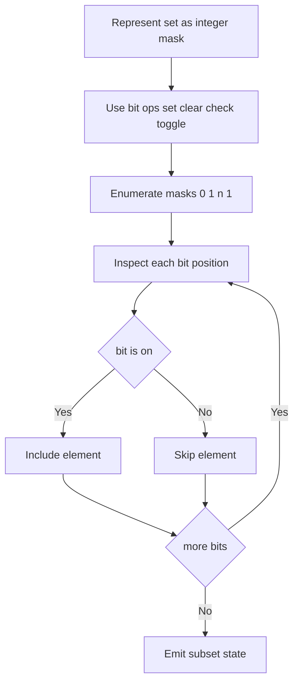
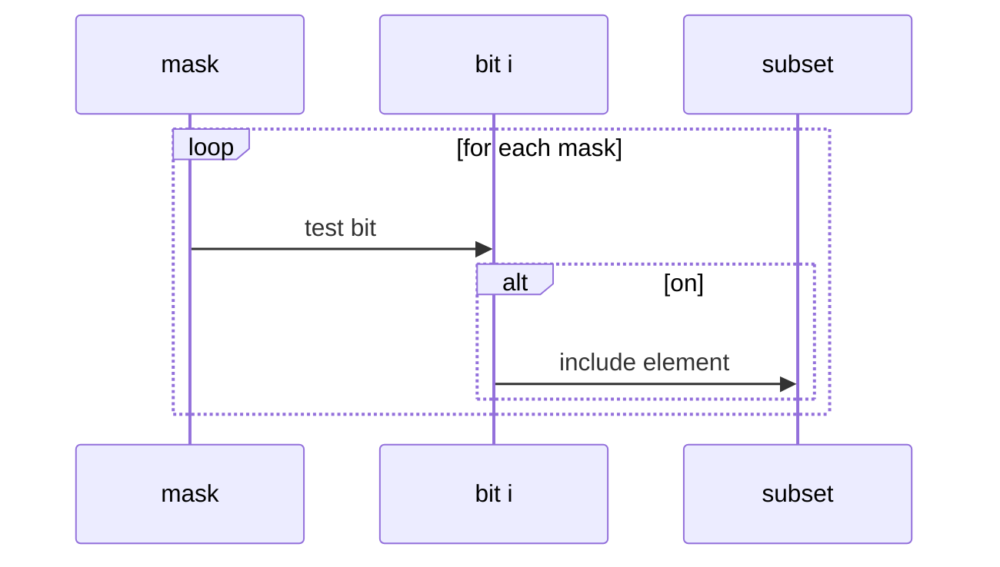

# 비트 마스킹 (Bit Masking) - GitHub Pages 해설

## 문서 목적
- 원본 템플릿 `11-bit-masking/01-bit-masking.md` 의 내부 동작을 GitHub Markdown에서 바로 읽을 수 있게 설명합니다.
- 코드 레이어(초기화/루프/조건/갱신/종료)를 분해하고, Mermaid로 제어 흐름을 시각화합니다.
- 실전 문제에 붙일 때 반드시 수정해야 하는 지점을 체크리스트로 제공합니다.

## 원본 템플릿
- Source: [11-bit-masking/01-bit-masking.md](https://github.com/choisimo/document/blob/main/code/templates/algorithm-architect/11-bit-masking/01-bit-masking.md)

## 내부 메커니즘 (Flow)


## 내부 상호작용 (Sequence)


## 핵심 코드
```python
# [Bit Masking 템플릿: 아키텍트 버전]
# Use Case: 집합 상태 관리, 부분 집합
# Components: Bitmask (정수), Bit Operations
# Constraint: 최대 32~64개 원소

def bit_operations():
    # 1. 기본 비트 연산 (Basic Operations)
    
    # i번째 비트 확인 (Check)
    def check_bit(mask, i):
        return (mask & (1 << i)) != 0
    
    # i번째 비트 설정 (Set)
    def set_bit(mask, i):
        return mask | (1 << i)
    
    # i번째 비트 해제 (Clear)
    def clear_bit(mask, i):
        return mask & ~(1 << i)
    
    # i번째 비트 토글 (Toggle)
    def toggle_bit(mask, i):
        return mask ^ (1 << i)
    
    # 켜진 비트 개수 (Count)
    def count_bits(mask):
        count = 0
        while mask:
            count += mask & 1
            mask >>= 1
        return count
    
    return check_bit, set_bit, clear_bit, toggle_bit, count_bits
```

## 코드 레이어 해설
- **Initialization**: 상태 테이블/포인터/큐/스택/부모 배열 등 탐색의 기준 상태를 만든다.
- **Process Loop / Recursion**: 입력 공간을 순회하며 상태 전이를 반복한다.
- **Decision Rule**: 분기 조건(완화 가능 여부, 유효 선택 여부, 종료 조건)을 적용한다.
- **State Update**: 거리/DP/집합/결과 배열을 갱신하고 다음 단계로 전달한다.
- **Termination**: 목표 도달, 범위 소진, 큐/스택 고갈, 사이클 검출 등으로 종료한다.

## 실전 적용 체크리스트
- 입력 자료구조 형식(인접 리스트, 간선 리스트, 정렬 여부, 1-index/0-index)을 먼저 고정한다.
- 시간 복잡도 한계에 맞게 자료구조를 교체한다 (`list.pop(0)` -> `deque.popleft` 등).
- 실패/예외 경로를 명시한다 (도달 불가, 음수 사이클, 빈 결과, 사이클 존재).
- 테스트는 최소 3개: 정상 케이스, 경계 케이스, 반례 케이스를 포함한다.
