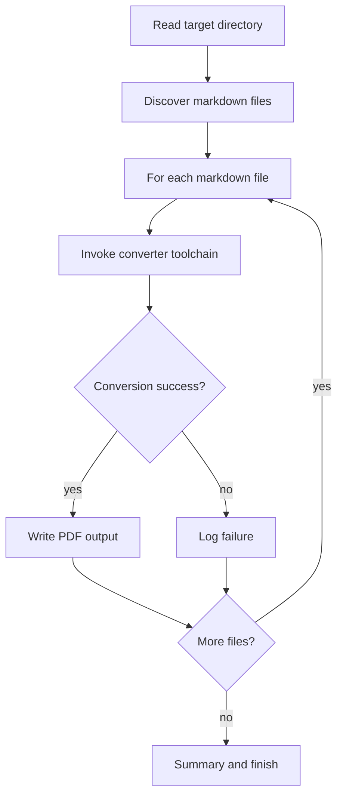

# convert_md_to_pdf.sh 배치 변환 파이프라인 학습 및 기록 노트

> 💡 **이 글을 쓰는 이유:** `convert_md_to_pdf.sh`는 Markdown 파일을 찾아 PDF로 변환하는 배치 스크립트다. 단순히 `pandoc`을 한 번 호출하는 것이 아니라, 대상 디렉터리 탐색, 의존성 확인, 병렬 실행, 실패 로그 처리까지 하나의 파이프라인으로 봐야 안전하게 운영할 수 있다.

---

## 1. 왜 필요한가? (Pain Point & Motivation)

* **이 개념이 구원해 줄 문제:** 여러 Markdown 문서를 PDF로 반복 변환할 때 매번 수동 명령을 치는 비효율을 없앤다.
* **대안들의 한계 (기존의 똥떵어리들):** 파일 하나씩 직접 변환하면 누락이 생기고, 실패한 파일을 추적하기 어렵다. 의존성 확인 없이 실행하면 중간에 `pandoc`이나 `xelatex` 부재로 멈춘다.

## 2. 현재 나의 상태 (Baseline)

* **여기까진 안다 (익숙한 땅):** Markdown에서 PDF로 변환하려면 `pandoc`과 PDF 엔진이 필요하다.
* **뇌정지 오는 부분 (안개 속):** 배치 스크립트에서는 파일 이름 공백, 실패 처리, 병렬 실행, 외부 명령 존재 여부가 모두 실패 지점이 된다.
* **아직은 무리 (워너비):** 실패한 파일을 요약하고 재시도 가능하게 만들며, 병렬 실행 중에도 로그가 추적 가능해야 한다.

## 3. 도달하고 싶은 목표 (Target State)

* **이 글을 끝내고 할 수 있는 일:** Markdown 배치 변환 스크립트의 입력, 처리 단계, 실패 조건, 검증 지점을 설명할 수 있다.
* **이것만은 건지자 (최소 성공 기준):** 변환 전 `pandoc`과 `xelatex`를 확인하고, 대상 디렉터리에서 `.md` 파일을 안전하게 찾아 각 파일을 PDF로 변환하는 흐름을 이해한다.

## 4. 시스템 번역 (Data Flow)

*이 개념을 하나의 살아있는 함수나 파이프라인으로 바라보고 해부해 봅니다.*

* **📥 인풋 (Input):** 대상 디렉터리, Markdown 파일 목록, PDF 엔진 설정, 폰트 설정
* **⚙️ 프로세스 (Processing):** 의존성을 확인하고, `.md` 파일을 찾고, 각 파일마다 `pandoc`을 호출해 `.pdf`를 생성한다.
* **📤 아웃풋 (Output):** 각 Markdown 파일과 같은 위치의 PDF 파일, 성공/실패 로그, 전체 완료 메시지
* **💾 상태 (State):** 현재 처리 파일, 출력 파일 경로, 변환 성공 여부, 병렬 작업 수
* **🚨 터지는 조건 (Exception):** `pandoc` 없음, `xelatex` 없음, 변환 실패, 파일 경로 quoting 오류, 대상 디렉터리에 Markdown 없음

## 5. 핵심 구성요소 (Building Blocks)

* **레고 블록 1 (Dependency Check):** `pandoc`과 `xelatex`가 설치되어 있는지 먼저 확인한다.
* **레고 블록 2 (File Discovery):** 대상 디렉터리 아래의 `.md` 파일을 찾는다.
* **레고 블록 3 (convert_file):** 입력 Markdown 하나를 대응되는 PDF 하나로 변환하는 단위 함수다.
* **서로 어떻게 맞물려 돌아가는가?:** 의존성 검사가 실행 가능성을 보장하고, 파일 탐색이 작업 목록을 만들며, 변환 함수가 각 파일을 독립 작업으로 처리한다.

## 6. 상태 전이 (State Transition)

*상태가 어떻게 변하는지 흐름을 한눈에 보여줍니다. (표 안의 문장은 짧고 직관적으로!)*

| 초기 상태 | 이벤트 (트리거) | 전이 조건 | 변경 후 상태 | "바뀐 걸 어떻게 알지?" (관찰 방법) |
| :--- | :--- | :--- | :--- | :--- |
| `READY` | 스크립트 실행 | 대상 디렉터리 인자 확인 | `CONFIGURED` | DIRECTORY/PDF_ENGINE 값 설정 |
| `CONFIGURED` | 의존성 검사 | `pandoc`, `xelatex` 존재 | `DEPENDENCIES_OK` | command check 통과 |
| `DEPENDENCIES_OK` | 파일 검색 | `.md` 파일 1개 이상 | `FILES_FOUND` | total 개수 출력 |
| `FILES_FOUND` | 변환 시작 | 파일별 pandoc 호출 | `CONVERTING` | 변환 로그 출력 |
| `CONVERTING` | 변환 종료 | 모든 파일 처리 완료 | `DONE` | 완료 메시지 출력 |

## 7. 불변식 (Invariant: 절대 깨지면 안 되는 규칙)

* **하늘이 무너져도 지켜야 할 조건:** 입력 파일 하나는 예측 가능한 출력 PDF 경로 하나에 대응되어야 한다.
* **이게 깨지면 생기는 대참사:** 다른 파일을 덮어쓰거나, 실패 파일을 성공처럼 보거나, 일부 문서가 누락된다.
* **수수방관 금지 (검증법):** 샘플 디렉터리에 Markdown 1~2개를 두고 변환 전후 파일 개수와 파일명을 비교한다.

## 8. 가장 작은 예제 (Minimal Viable Example)

* **뇌컴파일이 가능한 수준의 인풋:** `notes/a.md`, `notes/b.md`가 있는 디렉터리 `notes/`
* **한 스텝씩 뜯어보기:** 스크립트는 `notes/`를 읽고 두 Markdown 파일을 찾는다. 각 파일에 대해 `a.pdf`, `b.pdf`를 출력 파일로 계산하고 `pandoc`을 실행한다.
* **해피 엔딩 (결과):** `notes/a.pdf`, `notes/b.pdf`가 생성되고 변환 완료 메시지가 나온다.



```bash
DIRECTORY="${1:-.}"
PDF_ENGINE="xelatex"
MAIN_FONT="NanumGothic"

convert_file() {
    local input_file="$1"
    local output_file="${input_file%.md}.pdf"

    pandoc "$input_file" \
        -o "$output_file" \
        --pdf-engine="$PDF_ENGINE" \
        -V mainfont="$MAIN_FONT"
}
```

## 9. 실패 사례 (What could go wrong?)

* **폭망 시나리오 1:** `pandoc` 또는 `xelatex`가 없어 첫 변환에서 실패한다.
* **폭망 시나리오 2:** 파일 경로 quoting이 빠져 공백이 있는 파일명이 여러 인자로 쪼개진다.
* **폭망 시나리오 3:** 병렬 변환 로그가 섞여 어떤 파일이 실패했는지 추적하기 어렵다.
* **범인 검거 (어떤 불변식이 깨졌나?):** 입력 파일 하나가 예측 가능한 출력 PDF 하나에 대응되어야 한다는 7번 불변식이 깨졌거나, 실패 상태가 명확히 기록되지 않았다.

## 10. 뇌 확장하기 (Evolution & Variants)

* **조건을 살짝 바꾸면?:** PDF 엔진이나 폰트를 환경 변수로 받을 수 있게 만들면 다른 OS와 문서 언어에 대응하기 쉽다.
* **비슷한 놈들과 계급장 떼고 비교하기:** 단일 파일 변환 명령은 간단하고, 배치 스크립트는 반복 작업과 실패 관리를 표준화한다.
* **다른 데서 써먹기:** Markdown to HTML, 이미지 최적화, 로그 압축, 보고서 일괄 렌더링 같은 배치 파이프라인에 같은 구조를 적용할 수 있다.

## 11. 최종 체크리스트 (Definition of Done)

*글 작성 후 아래 항목을 채웠는지 확인하는 셀프 검토용 목록이다.*

- [x] 1초 만에 이해하는 한 문장 요약이 있는가?
- [x] 일목요연한 상태 전이 표를 채웠는가?
- [x] 머릿속 그림을 표현한 구조도(다이어그램)가 포함되었는가?
- [x] 직접 굴려본 실습 결과(코드/로그)를 첨부했는가?
- [x] 에러를 마주하고 해결한 오답 노트가 있는가?
- [x] 주니어 동료에게 막힘없이 설명할 수 있는 수준인가?

## 12. 뇌에 새기는 복습 문장 (TL;DR Blank)

*복습 시 이 문장만 보고도 핵심을 떠올릴 수 있도록 빈칸을 채운다.*

> 이 개념은 결국 **여러 Markdown 파일을 빠짐없이 PDF로 변환하는 반복 작업 문제**를 해결하기 위해 태어났고,
> 우리가 계속 감시해야 할 핵심 상태는 **입력 파일 경로와 출력 PDF 경로의 대응** 이며,
> **파일을 발견하고 변환기를 호출하는** 조건이 발동할 때 상태가 바뀐다.
> 그리고 무슨 일이 있어도 **입력 파일 하나는 예측 가능한 출력 PDF 경로 하나에 대응되어야 한다** 라는 불변식은 반드시 유지되어야만 한다!
