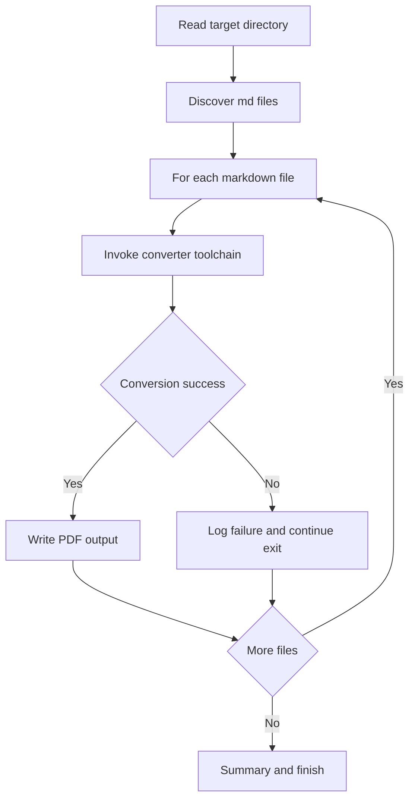
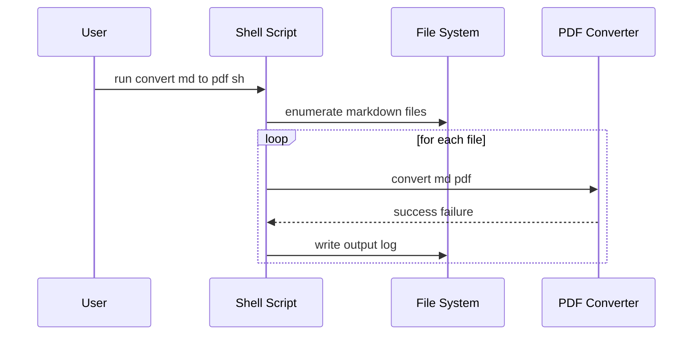

# convert_md_to_pdf.sh - GitHub Pages 해설

## 실제 실행 계약과 문서상 불일치

입력은 존재하고 읽을 수 있는 directory이며, 결과 PDF는 각 Markdown 옆의 같은 basename으로 생성돼 기존 파일을 덮어쓸 수 있다. 필요한 도구는 `pandoc`, `xelatex`, `NanumGothic` font이고 병렬 실행기는 GNU parallel 또는 xargs다. 현재 코드는 변환 stderr를 버리고 `set -euo pipefail` 아래에서 병렬 명령 실패를 집계하지 않으므로, flow의 “실패를 기록하고 계속”과 마지막 실패 목록 checklist를 구현했다고 볼 수 없다. 완료는 발견한 Markdown 수, 생성된 PDF 수, 실패 파일과 실제 진단, 최종 종료 상태를 대조한 경우로 판정한다.

## 문서 목적
- `convert_md_to_pdf.sh` 스크립트의 실행 경로와 변환 파이프라인을 문서화합니다.
- Markdown 파일을 PDF로 배치 변환할 때의 내부 메커니즘과 실패 지점을 시각화합니다.

## 원본 스크립트
- Source: [convert_md_to_pdf.sh](https://github.com/choisimo/document/blob/main/code/templates/algorithm-architect/convert_md_to_pdf.sh)

## 실행 흐름 (Flow)


## 파이프라인 상호작용 (Sequence)


## 핵심 코드
```bash
#!/bin/bash

# convert_md_to_pdf.sh
# Convert all Markdown files to PDF using pandoc with xelatex
# Usage: ./convert_md_to_pdf.sh [directory]

set -euo pipefail

# Configuration
DIRECTORY="${1:-.}"
PDF_ENGINE="xelatex"
MAIN_FONT="NanumGothic"
MAX_JOBS=4

# Colors for output
RED='\033[0;31m'
GREEN='\033[0;32m'
YELLOW='\033[1;33m'
NC='\033[0m' # No Color

# Function to convert a single file
convert_file() {
    local input_file="$1"
    local output_file="${input_file%.md}.pdf"
    
    echo -e "${YELLOW}Converting: $input_file -> $output_file${NC}"
    
    if pandoc "$input_file" \
        -o "$output_file" \
        --pdf-engine="$PDF_ENGINE" \
        -V mainfont="$MAIN_FONT" 2>/dev/null; then
        echo -e "${GREEN}Done: $input_file${NC}"
        return 0
    else
        echo -e "${RED}Failed: $input_file${NC}" >&2
        return 1
    fi
}

export -f convert_file
export PDF_ENGINE MAIN_FONT RED GREEN YELLOW NC

# Check if pandoc is installed
if ! command -v pandoc &> /dev/null; then
    echo -e "${RED}Error: pandoc is not installed${NC}" >&2
    exit 1
fi

# Check if xelatex is installed
if ! command -v xelatex &> /dev/null; then
    echo -e "${RED}Error: xelatex is not installed${NC}" >&2
    exit 1
fi

# Count total files
total=$(find "$DIRECTORY" -type f -name "*.md" | wc -l)

if [ "$total" -eq 0 ]; then
    echo -e "${YELLOW}No .md files found in $DIRECTORY${NC}"
    exit 0
fi

echo "Found $total markdown files. Converting with $MAX_JOBS parallel jobs..."
echo ""

# Export to use in subshell
export total

# Find and convert files in parallel using GNU parallel or xargs
dry_run() {
    while IFS= read -r file; do
        convert_file "$file"
    done
}

if command -v parallel &> /dev/null; then
    # Use GNU parallel for better job control
    find "$DIRECTORY" -type f -name "*.md" -print0 | \
        parallel -0 -j "$MAX_JOBS" convert_file
else
    # Fallback to xargs with proper syntax (no -I with -P)
    # Use a wrapper script approach
    find "$DIRECTORY" -type f -name "*.md" -print0 | \
        xargs -0 -P "$MAX_JOBS" -n 1 bash -c 'convert_file "$@"' _
fi

echo ""
echo -e "${GREEN}Conversion complete!${NC}"
```

## 운영 체크리스트
- 변환기 의존성(예: pandoc, wkhtmltopdf) 설치 여부를 먼저 검증한다.
- 경로에 공백이 포함된 경우 인자 quoting을 강제한다.
- 실패한 파일 목록을 마지막에 요약 출력해 재시도를 쉽게 만든다.
