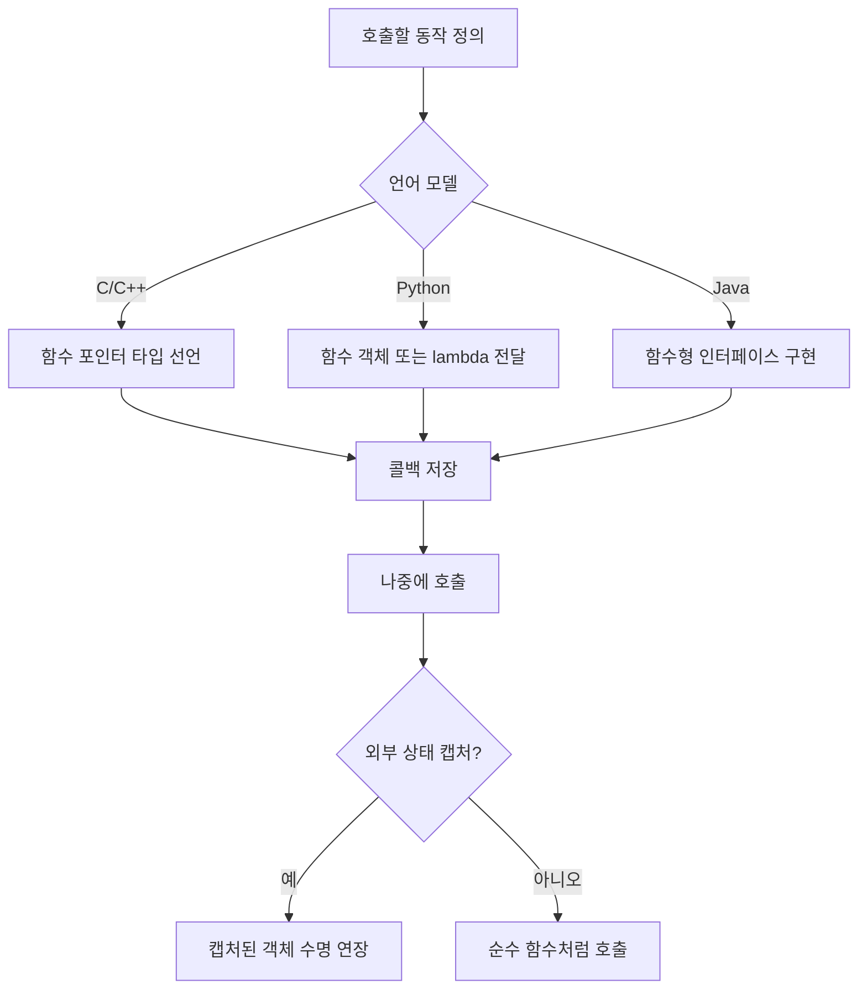
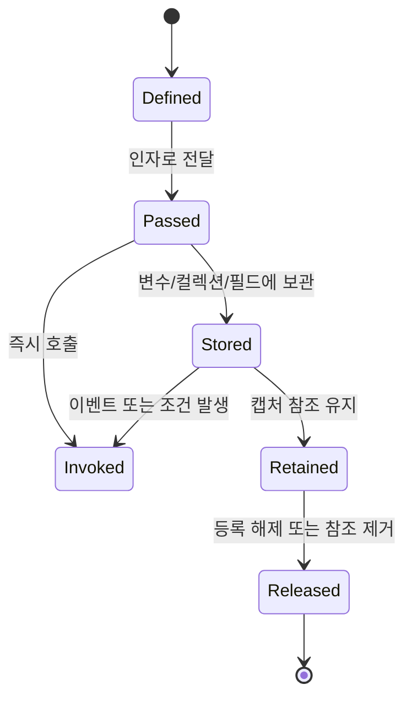

# 함수 포인터와 콜백 학습 및 기록 노트

## 1. 왜 필요한가? (Pain Point & Motivation)

C/C++에서는 함수 이름이 호출 가능한 코드 위치를 가리키고, 함수 포인터로 그 주소를 값처럼 전달할 수 있다. 하지만 Java와 Python에서는 같은 문제를 "함수를 값처럼 전달한다"는 더 높은 수준의 추상화로 해결한다.

혼란은 여기서 생긴다. C의 함수 포인터, Python의 함수 객체, Java의 함수형 인터페이스와 메서드 참조는 문법은 다르지만 모두 "나중에 호출할 동작을 현재 시점에 전달한다"는 모델이다. 차이를 제대로 구분하지 않으면 콜백 수명, 캡처 변수, 객체 참조 유지, GC 대상 여부를 잘못 판단하게 된다.

## 2. 현재 나의 상태 (Baseline)

- C/C++에서는 함수 포인터를 함수 주소로 이해하고 있다.
- Python에서는 함수가 변수에 담기고 인자로 전달된다는 사실은 알고 있다.
- Java에서는 람다와 메서드 참조가 함수 포인터의 대체 개념처럼 쓰인다는 정도로 이해하고 있다.
- 바운드 메서드 참조가 기존 객체를 붙잡는지, 언바운드 메서드 참조는 어떤 인자를 요구하는지 헷갈릴 수 있다.
- 람다와 메서드 참조가 객체 수명과 JVM 메모리에 어떤 영향을 주는지는 아직 명확하지 않다.

## 3. 도달하고 싶은 목표 (Target State)

- C, Python, Java에서 콜백을 전달하는 방식의 공통점과 차이를 설명한다.
- Java 메서드 참조의 정적, 바운드, 언바운드, 생성자, 배열 생성자 형태를 구분한다.
- 람다나 메서드 참조가 외부 값을 캡처할 때 어떤 참조가 유지되는지 추적한다.
- GC가 있더라도 정적 컬렉션, 콜백 등록, 캐시 때문에 객체가 계속 살아남을 수 있음을 이해한다.
- 언어별 예제를 같은 추상 모델로 번역할 수 있다.

## 4. 시스템 번역 (Data Flow)



콜백은 즉시 실행되는 값이 아니라 실행 가능성을 담은 값이다. 따라서 저장 위치와 캡처한 참조의 수명이 중요해진다.

## 5. 핵심 구성요소 (Building Blocks)

| 구성요소 | 언어 | 핵심 의미 |
| --- | --- | --- |
| 함수 포인터 | C/C++ | 특정 시그니처를 가진 함수의 주소를 저장한다. |
| 고차 함수 | Python | 함수를 객체처럼 인자로 받고 반환한다. |
| 함수형 인터페이스 | Java | 추상 메서드 하나를 가진 인터페이스가 람다의 대상 타입이 된다. |
| 람다 | Python/Java/C++ | 짧은 익명 동작을 값처럼 표현한다. |
| 정적 메서드 참조 | Java | 클래스의 정적 메서드를 함수형 인터페이스에 맞춘다. |
| 바운드 인스턴스 메서드 참조 | Java | 이미 존재하는 객체 참조와 메서드를 함께 붙잡는다. |
| 언바운드 인스턴스 메서드 참조 | Java | 호출 시 첫 번째 인자로 receiver 객체를 받는다. |
| 생성자 참조 | Java | 객체 또는 배열 생성을 함수형 인터페이스로 전달한다. |

## 6. 상태 전이 (State Transition)



콜백을 저장하면 콜백 자체뿐 아니라 콜백이 붙잡은 객체도 함께 살아남을 수 있다. Java의 GC는 도달 가능한 객체를 수집하지 않으므로 등록 해제 경로가 중요하다.

## 7. 불변식 (Invariant: 절대 깨지면 안 되는 규칙)

- C 함수 포인터는 선언된 매개변수와 반환 타입이 실제 함수와 맞아야 한다.
- Python 콜백은 호출 가능 객체인지와 예외 전파 방식을 호출자가 알고 있어야 한다.
- Java 람다는 반드시 대상 함수형 인터페이스 타입이 있어야 한다.
- 바운드 메서드 참조는 receiver 객체 참조를 유지한다.
- 언바운드 메서드 참조는 호출 시 receiver가 인자로 공급되어야 한다.
- 콜백 저장소가 오래 살면 캡처된 객체도 오래 살 수 있다.
- GC가 있어도 정적 컬렉션, 리스너 목록, 무제한 캐시는 메모리 누수를 만들 수 있다.

## 8. 가장 작은 예제 (Minimal Viable Example)

### C 함수 포인터

```c
#include <stdio.h>

int add(int a, int b) {
    return a + b;
}

int apply(int (*op)(int, int), int x, int y) {
    return op(x, y);
}

int main(void) {
    printf("%d\n", apply(add, 3, 4));
    return 0;
}
```

### Python 함수 객체

```python
def apply(op, x, y):
    return op(x, y)

def add(a, b):
    return a + b

print(apply(add, 3, 4))
print(apply(lambda a, b: a + b, 3, 4))
```

### Java 함수형 인터페이스와 메서드 참조

```java
import java.util.function.IntBinaryOperator;

class Calculator {
    static int add(int a, int b) {
        return a + b;
    }

    static int apply(IntBinaryOperator op, int x, int y) {
        return op.applyAsInt(x, y);
    }

    public static void main(String[] args) {
        System.out.println(apply(Calculator::add, 3, 4));
        System.out.println(apply((a, b) -> a + b, 3, 4));
    }
}
```

세 예제 모두 `apply`가 "연산 자체"를 인자로 받아 나중에 호출한다. 차이는 C가 함수 주소와 타입을 노출하고, Python은 호출 가능 객체를 직접 전달하며, Java는 함수형 인터페이스 타입을 통해 람다와 메서드 참조를 받는다는 점이다.

## 9. 실패 사례 (What could go wrong?)

### C 함수 포인터 시그니처 불일치

```c
double half(int x) {
    return x / 2.0;
}

int (*op)(int, int) = (int (*)(int, int))half;
```

강제 캐스팅으로 타입을 맞춘 것처럼 보이지만 실제 호출 규약과 반환 타입이 맞지 않아 정의되지 않은 동작을 만들 수 있다.

### Java 바운드 메서드 참조의 객체 유지

```java
class Button {
    void handle(Event event) {
        // 이벤트 처리
    }
}

Button saveButton = new Button();
events.forEach(saveButton::handle);
```

`saveButton::handle`은 원시 주소를 노출하지는 않지만, `saveButton` 객체 참조를 붙잡는다. 콜백 저장소가 오래 살면 해당 객체도 GC 대상이 되지 않을 수 있다.

### Java 리스너 누수

```java
class ListenerRegistry {
    private static final List<Runnable> listeners = new ArrayList<>();

    static void register(Runnable listener) {
        listeners.add(listener);
    }
}
```

정적 컬렉션에 람다나 메서드 참조를 등록하고 제거하지 않으면 캡처된 객체까지 계속 도달 가능해진다.

### 람다 캡처의 수명 착각

```java
Runnable task(User user) {
    return () -> System.out.println(user.name());
}
```

반환된 `Runnable`이 살아 있는 동안 `user`도 함께 참조된다. 지역 변수처럼 보이지만 콜백 객체가 참조를 유지한다.

## 10. 뇌 확장하기 (Evolution & Variants)

- C++에서는 함수 포인터 외에도 `std::function`, 람다, 함수 객체, 멤버 함수 포인터가 있다.
- Python에서는 함수, bound method, callable class, `functools.partial`을 같은 호출 가능 객체 모델로 볼 수 있다.
- Java 메서드 참조는 `Integer::parseInt`, `someObject::method`, `String::toLowerCase`, `TreeMap::new`, `int[]::new`처럼 receiver와 생성 방식이 다르다.
- JVM 메모리 관점에서는 스택의 지역 변수, 힙의 객체, 문자열 풀, GC root, 정적 필드, 스레드 스택을 함께 봐야 한다.
- 메모리 분석이 필요하면 Java Flight Recorder, GC 로그, Native Memory Tracking 같은 도구로 실제 할당과 보존 경로를 확인한다.

## 11. 최종 체크리스트 (Definition of Done)

- [x] C 함수 포인터, Python 함수 객체, Java 함수형 인터페이스를 같은 콜백 모델로 비교했다.
- [x] Java 메서드 참조의 바운드/언바운드 차이를 receiver 참조 관점에서 정리했다.
- [x] 람다와 메서드 참조가 캡처한 객체의 수명을 연장할 수 있음을 설명했다.
- [x] GC가 있어도 리스너와 정적 컬렉션이 누수를 만들 수 있음을 포함했다.
- [x] 원문에 섞여 있던 JVM 메모리 내용을 콜백 수명 문제와 연결했다.

## 12. 뇌에 새기는 복습 문장 (TL;DR Blank)

함수 포인터, 함수 객체, 람다, 메서드 참조는 모두 "나중에 호출할 동작"을 값처럼 전달하는 방법이다. 안전하게 쓰려면 무엇을 호출하는지뿐 아니라 무엇을 붙잡고 얼마나 오래 살아남는지를 추적해야 한다.
