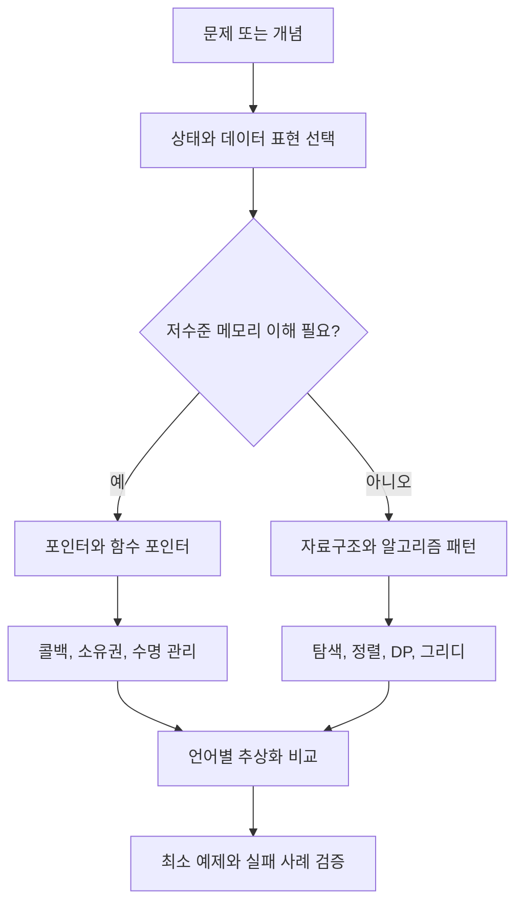
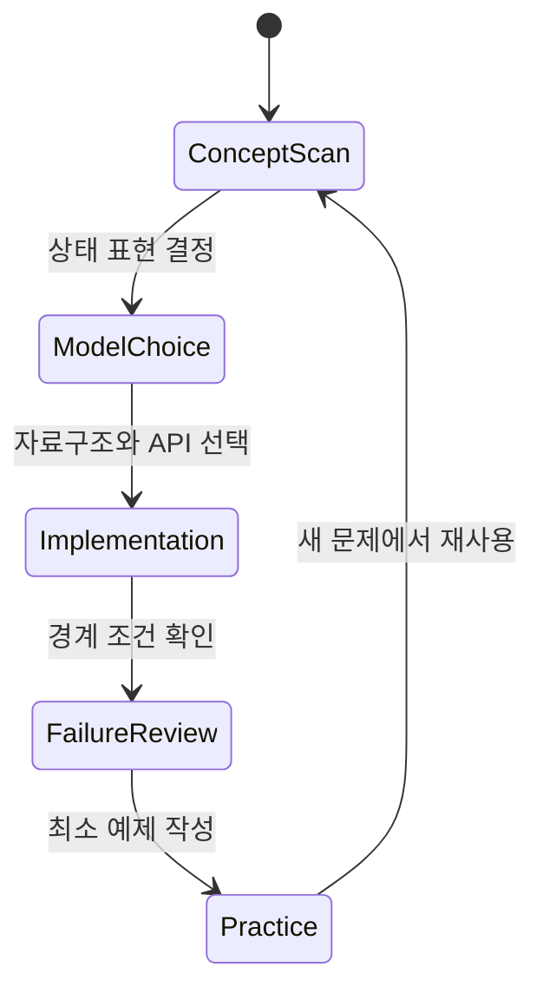

# Algorithms & Data Structures 학습 및 기록 노트

## 1. 왜 필요한가? (Pain Point & Motivation)

알고리즘과 자료구조 문서는 서로 떨어진 개념을 단순 목록으로 모아두면 학습 순서가 흐려진다. 포인터, 함수 포인터, 객체지향 패턴, 그래프와 DP 같은 주제는 모두 "데이터를 어떤 형태로 잡고 어떤 규칙으로 이동시키는가"라는 공통 질문으로 연결된다.

이 인덱스는 개별 문서의 목차 역할만 하지 않고, 메모리 모델에서 설계 패턴까지 이어지는 학습 흐름을 잡기 위한 출발점이다.

## 2. 현재 나의 상태 (Baseline)

- 포인터와 함수 포인터는 문법 예제 중심으로 이해하고 있다.
- 객체지향 패턴은 언어별 차이보다 이름과 의도 위주로 기억하고 있다.
- 알고리즘 문서는 많지만, 어느 문제를 풀 때 어떤 문서로 돌아가야 하는지 연결이 약하다.
- C/C++, Java, Python의 추상화 차이를 한 흐름으로 비교하는 기준이 부족하다.

## 3. 도달하고 싶은 목표 (Target State)

- 메모리 주소, 콜백, 객체 모델, 알고리즘 상태 전이를 하나의 학습 지도에서 추적한다.
- 문제를 보면 필요한 자료구조와 제어 흐름을 빠르게 고른다.
- 구현 언어가 바뀌어도 핵심 불변식과 실패 모드를 먼저 확인한다.
- 각 문서를 읽은 뒤 최소 예제를 직접 작성하고, 체크리스트로 이해 여부를 검증한다.

## 4. 시스템 번역 (Data Flow)



## 5. 핵심 구성요소 (Building Blocks)

| 문서 | 학습 초점 | 먼저 확인할 질문 |
| --- | --- | --- |
| [Pointers](pointers.md) | C/C++ 포인터, 수명, 메모리 안전 | 이 포인터가 가리키는 메모리는 아직 유효한가? |
| [Function Pointers](function-pointers.md) | 콜백, 람다, 메서드 참조 | 호출할 동작을 값처럼 전달하는가? |
| [OOP Patterns](oop-patterns.md) | Python OOP, 타입, 동시성 | 객체 경계와 타입 계약이 명확한가? |
| [Algorithm Architect](algorithm-architect/index.md) | 그래프, 정렬, DP, 트리, 그리디 | 상태 전이와 불변식을 문제에 맞게 잡았는가? |

## 6. 상태 전이 (State Transition)



학습은 선형으로 끝나지 않는다. 한 문서를 읽고 예제를 구현한 뒤 실패 사례를 만나면 다시 상태 표현과 자료구조 선택으로 돌아와야 한다.

## 7. 불변식 (Invariant: 절대 깨지면 안 되는 규칙)

- 알고리즘 문서는 항상 입력, 상태, 전이, 종료 조건을 구분해서 읽는다.
- 포인터 문서는 주소 자체보다 소유권, 수명, 범위가 먼저다.
- 함수 포인터와 람다는 "나중에 호출될 동작"이라는 동일한 모델로 비교한다.
- OOP 패턴은 클래스 이름보다 인터페이스 계약과 변경 가능성을 기준으로 평가한다.
- 최소 예제는 성공 경로만이 아니라 실패 경로도 포함해야 한다.

## 8. 가장 작은 예제 (Minimal Viable Example)

```c
int add(int a, int b) {
    return a + b;
}

int apply(int (*op)(int, int), int x, int y) {
    return op(x, y);
}
```

```python
def apply(op, x, y):
    return op(x, y)

result = apply(lambda a, b: a + b, 3, 4)
```

두 예제 모두 "동작을 인자로 넘겨 나중에 호출한다"는 같은 구조다. C는 함수 주소와 타입 선언이 전면에 드러나고, Python은 함수 객체와 호출 가능성에 집중한다.

## 9. 실패 사례 (What could go wrong?)

- 목차를 순서대로만 읽고 문제 유형별 연결을 만들지 못한다.
- 포인터 문법을 외웠지만 해제 후 접근, NULL 역참조, 범위 초과 같은 실패 모드를 놓친다.
- 람다와 메서드 참조를 단순 축약 문법으로만 이해해 캡처와 객체 수명 문제를 보지 못한다.
- 알고리즘을 구현하면서 시간 복잡도만 보고 상태 불변식과 종료 조건을 검증하지 않는다.
- 언어별 차이를 "좋다/나쁘다"로만 외우고 런타임 모델 차이를 설명하지 못한다.

## 10. 뇌 확장하기 (Evolution & Variants)

- 포인터 학습은 C++ 스마트 포인터, Rust 소유권, Java 참조 모델로 확장할 수 있다.
- 함수 포인터 학습은 전략 패턴, 이벤트 핸들러, 고차 함수, DI 컨테이너로 이어진다.
- OOP 패턴 학습은 정적 타입 언어의 인터페이스와 Python의 프로토콜 비교로 확장한다.
- 알고리즘 학습은 문제 풀이를 넘어 실제 시스템의 큐, 캐시, 그래프 탐색, 스케줄링 설계로 연결한다.

## 11. 최종 체크리스트 (Definition of Done)

- [x] 이 인덱스에서 하위 문서로 이동할 수 있다.
- [x] 각 하위 문서의 학습 목적을 한 문장으로 설명할 수 있다.
- [x] 메모리, 콜백, 객체 모델, 알고리즘 상태 전이를 같은 흐름으로 연결했다.
- [x] 최소 예제를 통해 C와 Python의 콜백 표현 차이를 비교했다.
- [x] 실패 사례와 확장 방향을 함께 정리했다.

## 12. 뇌에 새기는 복습 문장 (TL;DR Blank)

알고리즘 학습은 코드 조각을 외우는 일이 아니라, 데이터를 어떤 상태로 표현하고 어떤 전이 규칙으로 안전하게 움직일지 설명하는 일이다.
