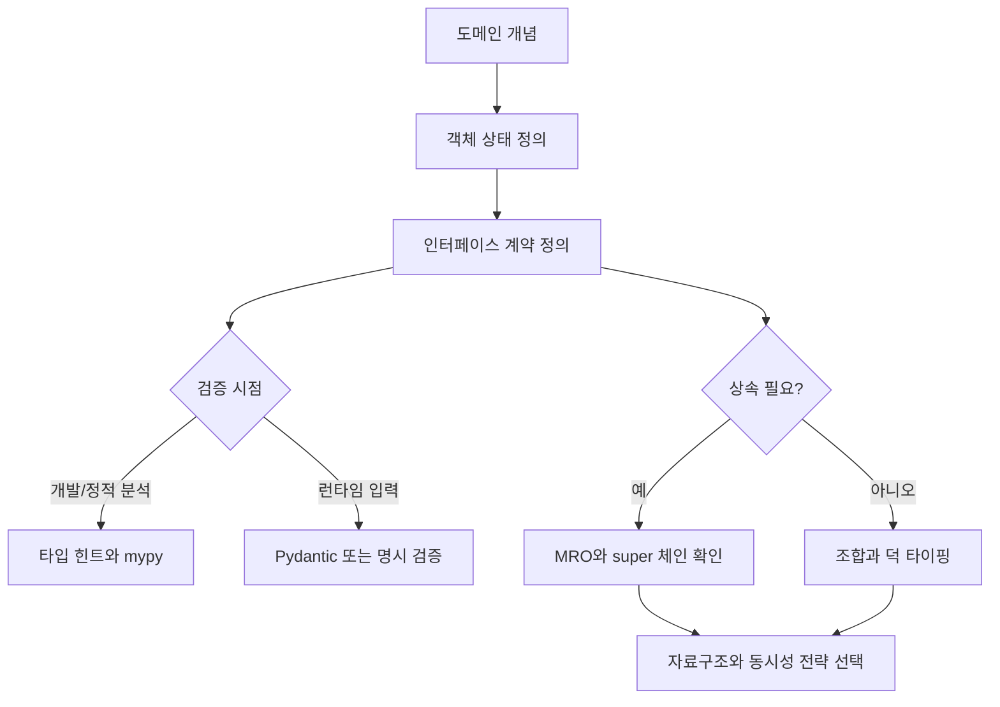
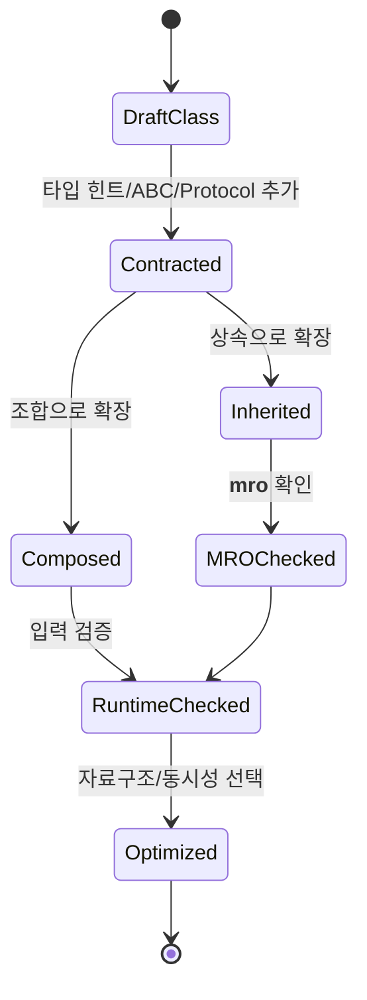

# Python OOP 패턴 학습 및 기록 노트

## 1. 왜 필요한가? (Pain Point & Motivation)

Python은 Java나 C++보다 객체 모델이 유연하다. 다중 상속, 덕 타이핑, 런타임 속성 추가, 함수와 객체의 자유로운 조합이 가능하다. 이 유연성은 빠른 개발에 유리하지만, 프로젝트가 커지면 타입 계약이 흐려지고 상속 순서, 자료구조 선택, 동시성 모델을 잘못 잡아 성능과 유지보수성이 동시에 흔들릴 수 있다.

Python OOP를 제대로 이해하려면 클래스 문법보다 "객체가 어떤 인터페이스를 약속하고, 어떤 상태를 소유하며, 어떤 실행 모델에서 동작하는가"를 먼저 봐야 한다.

## 2. 현재 나의 상태 (Baseline)

- 클래스, 상속, 메서드, `super()`의 기본 사용법은 알고 있다.
- Java/C++과 비교해 Python이 동적 타입 언어라는 점은 알고 있지만 설계 결과까지 연결하지 못한다.
- 다중 상속과 MRO는 존재만 알고 실제 충돌 상황을 설명하기 어렵다.
- 타입 힌트, `mypy`, Pydantic, `abc`, `Protocol`의 역할이 섞여 있다.
- `list`, `deque`, `dict`, `set`의 시간 복잡도와 OOP 설계를 함께 고려하는 습관이 약하다.
- GIL 때문에 CPU 작업과 I/O 작업의 동시성 전략이 달라진다는 점을 정리할 필요가 있다.

## 3. 도달하고 싶은 목표 (Target State)

- Python 상속과 MRO를 Java/C++의 상속 모델과 비교해 설명한다.
- 타입 힌트는 문서화와 정적 분석 계약, Pydantic은 런타임 검증 도구로 분리해 이해한다.
- 자료구조 선택을 객체 설계의 일부로 보고 시간 복잡도 영향을 예측한다.
- CPU 바운드 작업에는 멀티프로세싱, I/O 바운드 작업에는 비동기 또는 스레드를 고려한다.
- ABC, `Protocol`, `__slots__`를 필요한 상황에만 적용한다.

## 4. 시스템 번역 (Data Flow)



## 5. 핵심 구성요소 (Building Blocks)

| 구성요소 | 역할 | 주의할 점 |
| --- | --- | --- |
| 다중 상속 | 여러 기반 클래스의 기능을 조합한다. | MRO와 `super()` 호출 순서를 확인해야 한다. |
| C3 선형화 | Python의 메서드 탐색 순서 계산 방식이다. | 다이아몬드 구조에서 예측 가능성을 제공하지만 설계 복잡도는 남는다. |
| 타입 힌트 | 개발 도구와 정적 분석에 계약을 제공한다. | 런타임에서 자동으로 타입을 강제하지 않는다. |
| Pydantic | 외부 입력을 런타임에 검증하고 변환한다. | 도메인 객체 전체를 검증 모델로 대체하면 결합도가 높아질 수 있다. |
| ABC | 반드시 구현해야 하는 메서드를 명시한다. | 과도하게 쓰면 Python의 유연성을 줄인다. |
| Protocol | 구조적 타입 계약을 표현한다. | 실제 속성/메서드 존재 여부가 핵심이다. |
| `__slots__` | 인스턴스 속성 저장 방식을 제한한다. | 동적 속성 추가가 막히고 상속 설계가 까다로워질 수 있다. |
| GIL | 한 프로세스 안의 Python 바이트코드 실행을 제한한다. | CPU 바운드 병렬성에는 프로세스가 더 적합하다. |

## 6. 상태 전이 (State Transition)



Python 객체 설계는 "클래스를 만들었다"에서 끝나지 않는다. 계약을 세우고, 확장 방식을 고르고, 실행 모델과 자료구조까지 검증해야 안정적인 구조가 된다.

## 7. 불변식 (Invariant: 절대 깨지면 안 되는 규칙)

- 상속을 쓰면 `super()` 체인이 전체 MRO에서 깨지지 않아야 한다.
- 타입 힌트는 런타임 검증이 아니라 정적 계약이라는 사실을 잊지 않는다.
- 외부 입력은 타입 힌트만 믿지 말고 런타임 검증을 적용한다.
- 큐처럼 앞쪽 삽입/삭제가 많은 구조에는 `list.insert(0, value)`를 반복하지 않는다.
- CPU 바운드 작업을 스레드만으로 병렬화한다고 가정하지 않는다.
- ABC나 `Protocol`은 호출자가 의존하는 최소 인터페이스만 표현한다.
- `__slots__`를 쓰면 동적 속성 추가와 일부 상속 패턴이 제한된다는 점을 문서화한다.

## 8. 가장 작은 예제 (Minimal Viable Example)

```python
from abc import ABC, abstractmethod
from collections import deque
from typing import Protocol


class Repository(Protocol):
    def save(self, item: str) -> None:
        ...


class QueueProcessor(ABC):
    def __init__(self, repository: Repository) -> None:
        self._repository = repository
        self._queue: deque[str] = deque()

    def add(self, item: str) -> None:
        self._queue.append(item)

    def flush(self) -> None:
        while self._queue:
            self._repository.save(self.transform(self._queue.popleft()))

    @abstractmethod
    def transform(self, item: str) -> str:
        ...


class UppercaseProcessor(QueueProcessor):
    def transform(self, item: str) -> str:
        return item.upper()
```

이 예제는 `Protocol`로 저장소 계약을 만들고, `ABC`로 하위 클래스가 구현해야 하는 변환 로직을 강제하며, 큐 자료구조에는 `deque`를 사용한다.

## 9. 실패 사례 (What could go wrong?)

### `super()` 누락

```python
class Base:
    def __init__(self) -> None:
        self.value = 0


class Derived(Base):
    def __init__(self) -> None:
        self.extra = 42
```

`Derived`는 `Base.__init__()`을 호출하지 않으므로 `value`가 초기화되지 않는다. 다중 상속에서는 이런 누락이 MRO 전체를 깨뜨릴 수 있다.

### 타입 힌트를 런타임 검증으로 착각

```python
def add(a: int, b: int) -> int:
    return a + b


print(add("5", "3"))
```

타입 힌트는 실행 중 자동으로 `int`를 강제하지 않는다. 외부 입력이라면 Pydantic이나 명시 검증이 필요하다.

### 잘못된 큐 구현

```python
queue: list[int] = []
for value in range(1_000_000):
    queue.insert(0, value)
```

`list.insert(0, value)`는 기존 요소 이동이 필요하므로 반복 사용 시 비용이 커진다. 앞쪽 삽입/삭제가 많다면 `collections.deque`가 적합하다.

### CPU 바운드 작업에 스레드만 적용

```python
import threading

def compute(n: int) -> int:
    return sum(i * i for i in range(n))

threads = [threading.Thread(target=compute, args=(10_000_000,)) for _ in range(4)]
for thread in threads:
    thread.start()
```

CPython에서는 GIL 때문에 순수 Python CPU 바운드 작업이 기대만큼 병렬화되지 않을 수 있다. 이 경우 `multiprocessing`이나 네이티브 확장을 검토한다.

## 10. 뇌 확장하기 (Evolution & Variants)

- Java의 인터페이스는 명시적 구현 계약이고, Python의 `Protocol`은 구조적 계약에 가깝다.
- C++의 다중 상속은 가상 상속과 객체 레이아웃 이슈가 있고, Python의 다중 상속은 MRO와 협력적 `super()` 호출이 핵심이다.
- Pydantic 모델은 API 입력/출력 경계에서 강하고, 도메인 내부 객체는 더 단순한 dataclass나 일반 클래스로 둘 수 있다.
- I/O 바운드 작업은 `asyncio`, 스레드, 작업 큐 중 호출 대상 라이브러리의 특성에 맞춰 선택한다.
- 메모리 민감 객체가 아주 많이 생성될 때만 `__slots__`를 검토하고, 먼저 프로파일링으로 병목을 확인한다.

## 11. 최종 체크리스트 (Definition of Done)

- [x] Python 상속과 MRO를 Java/C++ 상속 모델과 비교하는 기준을 만들었다.
- [x] 타입 힌트, 런타임 검증, ABC, Protocol의 역할을 분리했다.
- [x] 자료구조 선택과 시간 복잡도를 객체 설계의 일부로 포함했다.
- [x] GIL, 멀티프로세싱, 비동기 I/O의 적용 조건을 정리했다.
- [x] 실패 사례를 통해 `super()` 누락, 타입 힌트 오해, 잘못된 큐 구현을 확인했다.

## 12. 뇌에 새기는 복습 문장 (TL;DR Blank)

Python OOP의 강점은 유연성이고, 그 유연성을 안전하게 쓰는 방법은 명확한 인터페이스 계약, 검증 경계, 자료구조 선택, 실행 모델을 함께 설계하는 것이다.
