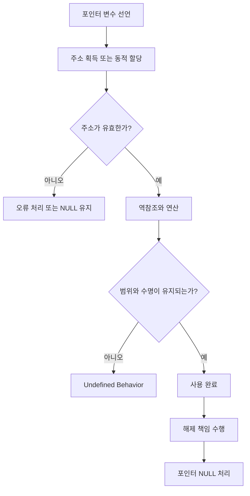
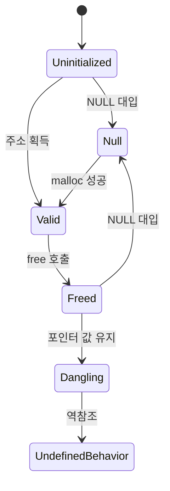

# C/C++ 포인터 학습 및 기록 노트

## 1. 왜 필요한가? (Pain Point & Motivation)

C/C++ 포인터는 값이 아니라 메모리 주소를 직접 다루기 때문에 작은 실수도 즉시 런타임 오류, 메모리 오염, 보안 취약점으로 이어진다. 특히 초중급 단계에서는 `*`, `&`, 배열, 동적 할당 문법은 알지만 "이 주소가 아직 유효한가"를 끝까지 추적하지 못해 문제가 생긴다.

포인터 학습의 핵심은 주소 계산을 외우는 것이 아니라 소유권, 수명, 범위, 해제 책임을 명시적으로 관리하는 것이다.

## 2. 현재 나의 상태 (Baseline)

- `malloc`, `free`, `*ptr`, `&value`의 기본 문법은 알고 있다.
- NULL 체크, 해제 후 NULL 대입 같은 방어 코딩은 알고 있지만 매번 일관되게 적용하지 못한다.
- 배열과 포인터의 관계를 문법으로는 이해하지만 범위 초과 접근이 왜 위험한지 메모리 관점으로 설명이 부족하다.
- 함수 포인터, `restrict`, RAII 흉내, 메모리 풀 같은 고급 기법은 사용 시점과 위험 조건이 아직 분리되어 있지 않다.

## 3. 도달하고 싶은 목표 (Target State)

- 포인터를 읽을 때 주소값보다 먼저 해당 메모리의 수명과 소유자를 확인한다.
- 동적 할당 뒤에는 실패 처리와 해제 경로가 항상 짝을 이루도록 만든다.
- 배열 범위, 포인터 연산, 타입 캐스팅이 메모리 손상을 만들 수 있는 지점을 설명한다.
- 고급 기법은 성능 최적화보다 안전한 불변식이 먼저라는 순서로 적용한다.

## 4. 시스템 번역 (Data Flow)



## 5. 핵심 구성요소 (Building Blocks)

| 구성요소 | 의미 | 주의할 점 |
| --- | --- | --- |
| NULL 포인터 | 유효한 객체를 가리키지 않는 상태 | 역참조 전에 반드시 확인한다. |
| 댕글링 포인터 | 이미 사라진 메모리를 가리키는 포인터 | 스택 지역 변수 주소 반환, 해제 후 사용을 피한다. |
| 동적 할당 | 힙에 메모리를 요청하는 작업 | 실패 가능성과 해제 책임이 함께 생긴다. |
| 포인터 연산 | 타입 크기 단위로 주소를 이동하는 연산 | 배열 경계를 벗어나면 정의되지 않은 동작이다. |
| 함수 포인터 | 호출할 함수의 주소를 값처럼 전달 | 정확한 시그니처를 맞춰야 한다. |
| `restrict` | 포인터들이 서로 겹치지 않는다는 약속 | 약속이 깨지면 최적화 결과가 잘못될 수 있다. |

## 6. 상태 전이 (State Transition)



포인터 값이 같은 숫자처럼 보여도 상태는 다르다. `Valid`인지, `Freed`인지, `Dangling`인지가 실제 안전성을 결정한다.

## 7. 불변식 (Invariant: 절대 깨지면 안 되는 규칙)

- 역참조 전에 포인터가 NULL이 아니고 유효한 객체를 가리키는지 확인한다.
- `malloc`으로 얻은 메모리는 소유자가 정확히 한 번 해제한다.
- `free` 이후 같은 포인터를 다시 사용할 가능성이 있으면 즉시 NULL로 만든다.
- 배열 포인터는 `[0, length)` 범위 안에서만 이동한다.
- 지역 변수의 주소를 함수 밖으로 반환하지 않는다.
- `restrict`를 붙인 포인터들은 같은 메모리 영역을 가리키지 않아야 한다.

## 8. 가장 작은 예제 (Minimal Viable Example)

```c
#include <stdio.h>
#include <stdlib.h>

int *create_array(size_t len) {
    int *arr = malloc(sizeof(int) * len);
    if (arr == NULL) {
        return NULL;
    }

    for (size_t i = 0; i < len; i++) {
        arr[i] = (int)i;
    }
    return arr;
}

int main(void) {
    size_t len = 5;
    int *values = create_array(len);
    if (values == NULL) {
        return 1;
    }

    printf("%d\n", values[0]);
    free(values);
    values = NULL;
    return 0;
}
```

이 예제의 핵심은 `malloc` 실패 처리, 배열 범위 제한, 사용 후 해제, 해제 후 NULL 처리가 한 흐름에 들어 있다는 점이다.

## 9. 실패 사례 (What could go wrong?)

### NULL 포인터 역참조

```c
int *ptr = malloc(sizeof(int));
*ptr = 42;
```

`malloc`은 실패하면 `NULL`을 반환한다. 이 상태에서 `*ptr`을 수행하면 접근 금지 주소를 역참조할 수 있다.

### 스택 주소 반환

```c
int *create_bad_array(void) {
    int arr[5] = {1, 2, 3, 4, 5};
    return arr;
}
```

`arr`은 함수가 끝나면 사라지는 스택 메모리다. 반환된 포인터는 이미 유효하지 않은 주소를 가리킨다.

### 해제 누락

```c
void process_data(void) {
    int *buffer = malloc(1024);
    if (buffer == NULL) {
        return;
    }
    /* 작업 수행 */
}
```

`free(buffer)`가 없으면 반복 호출 시 힙 메모리가 계속 누적된다.

### 범위 초과 포인터 연산

```c
int arr[5] = {1, 2, 3, 4, 5};
int *ptr = arr;
ptr += 10;
*ptr = 100;
```

배열 밖 주소를 쓰면 인접 스택 또는 힙 영역을 훼손할 수 있다.

## 10. 뇌 확장하기 (Evolution & Variants)

- C++에서는 `std::unique_ptr`, `std::shared_ptr`, 컨테이너를 우선 사용해 소유권을 타입으로 표현한다.
- C에서 RAII와 비슷한 흐름이 필요하면 GCC/Clang의 `cleanup` 확장이나 명시적 `goto cleanup` 패턴을 검토한다.
- 메모리 풀이 필요한 경우 빠른 할당보다 해제 정책, 재사용 상태, 동시성 보호를 먼저 설계한다.
- `mmap`, 보호 페이지, 읽기 전용 매핑은 디버깅과 보안 경계 확인에 사용할 수 있지만 플랫폼 의존성이 커진다.
- `restrict`는 벡터화 최적화에 도움이 될 수 있으나 포인터 aliasing이 없다는 계약을 코드 전체에서 지켜야 한다.

## 11. 최종 체크리스트 (Definition of Done)

- [x] NULL 포인터, 댕글링 포인터, 메모리 누수, 범위 초과 접근을 구분했다.
- [x] 동적 할당 성공/실패/해제 경로를 최소 예제에 포함했다.
- [x] 포인터의 상태 전이를 `Valid`, `Freed`, `Dangling`으로 나누어 설명했다.
- [x] 고급 기법을 적용하기 전 지켜야 할 안전 불변식을 정리했다.
- [x] 원문에 있던 잘못된 배열 표기와 위험 예제를 올바른 C 코드 형태로 정리했다.

## 12. 뇌에 새기는 복습 문장 (TL;DR Blank)

포인터는 주소값이 아니라 수명과 소유권을 가진 위험한 참조다. 안전한 포인터 코드는 "가리키는가"보다 "아직 가리켜도 되는가"를 먼저 묻는다.
