# Advanced Algorithms — Under the Hood

## Assumptions and proof boundaries

Complexity and correctness claims in this synthesis depend on the graph model, edge-weight ties, computation model, randomization, and error probability. In the MST diagram, a light edge is guaranteed to belong to some MST under the cut-property conditions; it belongs to every MST only with an appropriate uniqueness condition. Likewise, a cycle edge is excluded from every MST only when it is uniquely heaviest. Treat “all known algorithms” and register-level descriptions as explanatory synthesis rather than a theorem from the cited course. A section is complete when it states the input model, maintained invariant, tie or probability assumptions, proof step, and time·space bound in the same model.

## CMU 15-850 (Anupam Gupta, Fall 2020) · Internal Mechanics

> **Not a tutorial.** This document maps how data flows through memory structures, how mathematical invariants propagate, and how algorithmic state evolves at the register/heap level — from MST history through graph matchings, metric embeddings, streaming sketches, and dimension reduction.

---

## 1. Minimum Spanning Trees — 100 Years of Internal Optimization

### 1.1 The Cut & Cycle Rules as Invariant Pumps

All MST algorithms are ultimately invariant-maintenance engines. Two rules govern what edges can be safely colored:

```mermaid
flowchart TD
    subgraph CUT_RULE["Cut Rule (Blue Rule)"]
        CR1[Partition V into S and V\\S] --> CR2{Min-weight crossing edge e?}
        CR2 --> CR3[Color e BLUE — must be in MST]
        CR3 --> CR4[Exchange proof: any tree T without e has\nhigher weight tree T' = T - e' + e where w(e') > w(e)]
    end
    subgraph CYCLE_RULE["Cycle Rule (Red Rule)"]
        RR1[Identify a cycle C in G] --> RR2{Heaviest edge e on C?}
        RR2 --> RR3[Color e RED — cannot be in MST]
        RR3 --> RR4[Contradiction: removing e' from T and adding e\ngives lower-weight spanning tree]
    end
    CUT_RULE -->|"Blue edges form\nspanning tree → done"| DONE["MST Complete"]
    CYCLE_RULE -->|"Non-red edges\nacyclic → done"| DONE
```

**Key insight**: The algorithms discussed here can be explained through cut-property safe edges and, for Karger-Klein-Tarjan filtering, cycle-property reasoning. This is a scope statement for this document, not a claim about every deterministic MST algorithm.

### 1.2 Algorithm Complexity Timeline — Why It Matters Internally

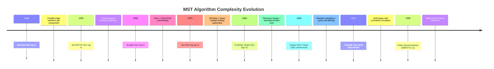

### 1.3 Kruskal's Algorithm — Memory and Data Flow

Kruskal processes edges in weight order, maintaining a **Union-Find** forest in memory:

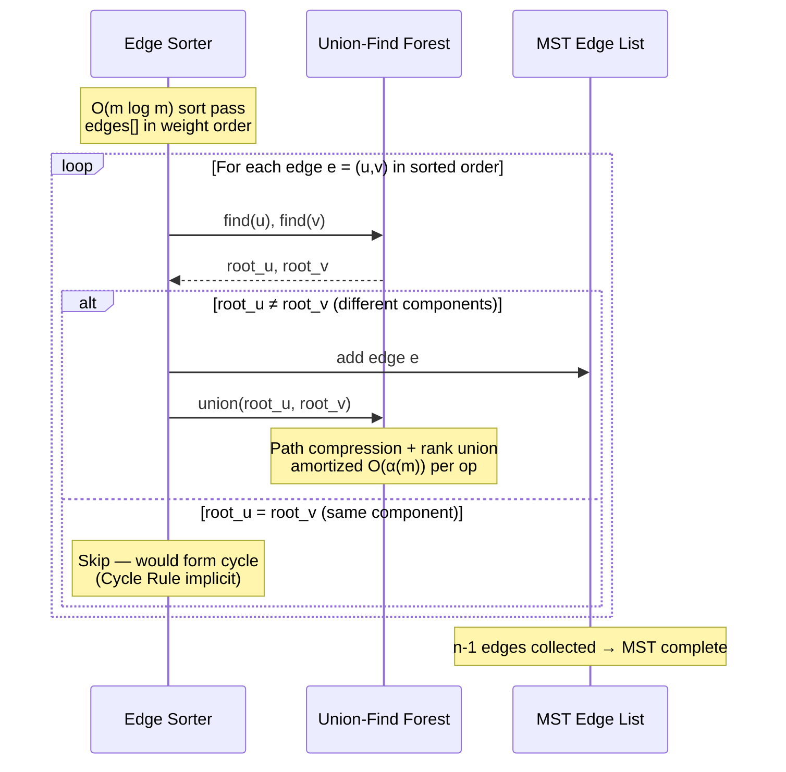

**Union-Find memory layout** — path compression collapses chains in-place:

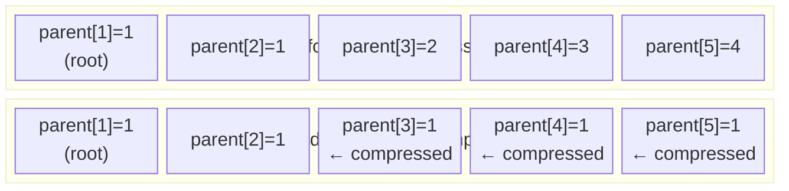

The **inverse Ackermann function α(n)** represents how many times you can apply `log*` before reaching 1. For all practical n, α(n) ≤ 4.

### 1.4 Prim/Jarník — Priority Queue as Frontier Memory

Prim maintains a **priority queue** encoding the cheapest known connection from the growing tree T to each external vertex:

```mermaid
stateDiagram-v2
    [*] --> INIT: Insert all V\{r} with key=∞; r with key=0
    INIT --> EXTRACT: extractMin() → vertex u with min key
    EXTRACT --> GROW: Add u to tree T, add edge (parent[u], u) to MST
    GROW --> UPDATE: For each neighbor v of u
    UPDATE --> DECREASE: decreaseKey(v, w(u,v)) if w(u,v) < key[v]
    DECREASE --> CHECK: All V in T?
    CHECK --> DONE: Yes → MST complete
    CHECK --> EXTRACT: No → continue
    DONE --> [*]
```

**Fibonacci Heap vs Binary Heap** — the internal difference:

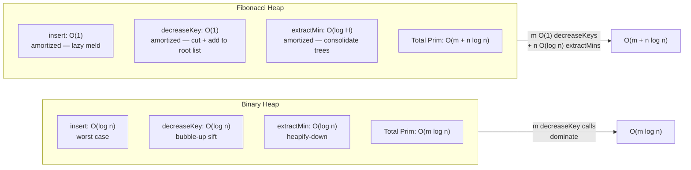

### 1.5 Borůvka — Parallel Contraction Rounds

Borůvka's algorithm is the MST algorithm most amenable to **parallelism**:

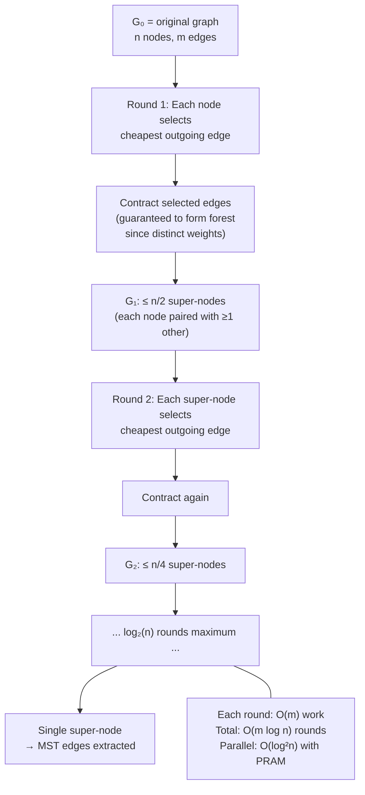

### 1.6 Fredman-Tarjan — Bounded-Frontier Trick

The breakthrough insight: limit Prim's heap size to K, restart when boundary exceeds threshold:

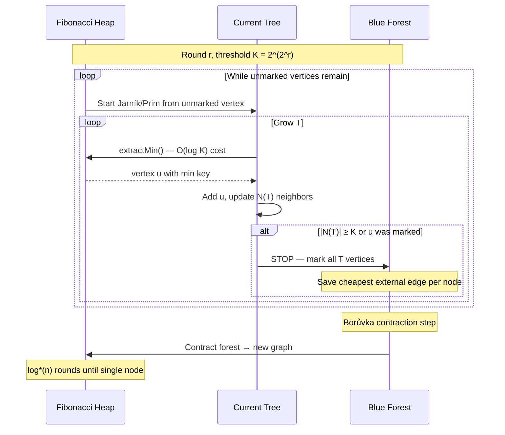

**Key complexity**: Each Prim phase has at most K insertions, so heap size ≤ K, so each extractMin costs O(log K). With K phases per round and the Borůvka contraction halving n, total rounds = O(log* n).

---

## 2. Graph Matchings — Augmenting Path Mechanics

### 2.1 Berge's Theorem — State Machine View

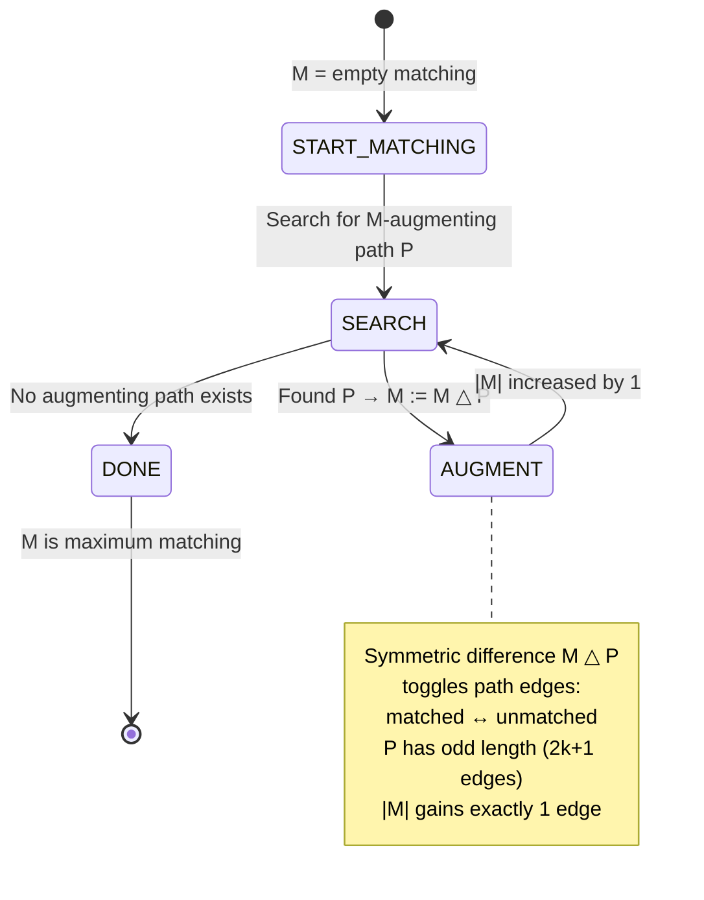

**Why augmenting paths work** — the invariant at the bit level:

```mermaid
flowchart LR
    subgraph PATH["Augmenting Path P (length 2k+1)"]
        direction LR
        O1["●\nopen"] ---U1["───\nunmatched"] --- M1["●\nmatched"] ---MM1["═══\nmatched"] --- M2["●\nmatched"] --- U2["───\nunmatched"] --- O2["●\nopen"]
    end
    subgraph TOGGLE["After M := M △ P"]
        direction LR
        O1b["●\nnow matched"] ---U1b["═══\nnow in M"] --- M1b["●\nstill matched"] ---MM1b["───\nnow out of M"] --- M2b["●\nstill matched"] --- U2b["═══\nnow in M"] --- O2b["●\nnow matched"]
    end
    PATH -->|"XOR edges"| TOGGLE
    Note["k+1 new M edges\nk removed M edges\nNet gain: +1"]
    TOGGLE --- Note
```

### 2.2 Bipartite Matching — Alternating BFS State

König's theorem proof gives an alternating BFS that simultaneously finds augmenting paths or constructs minimum vertex covers:

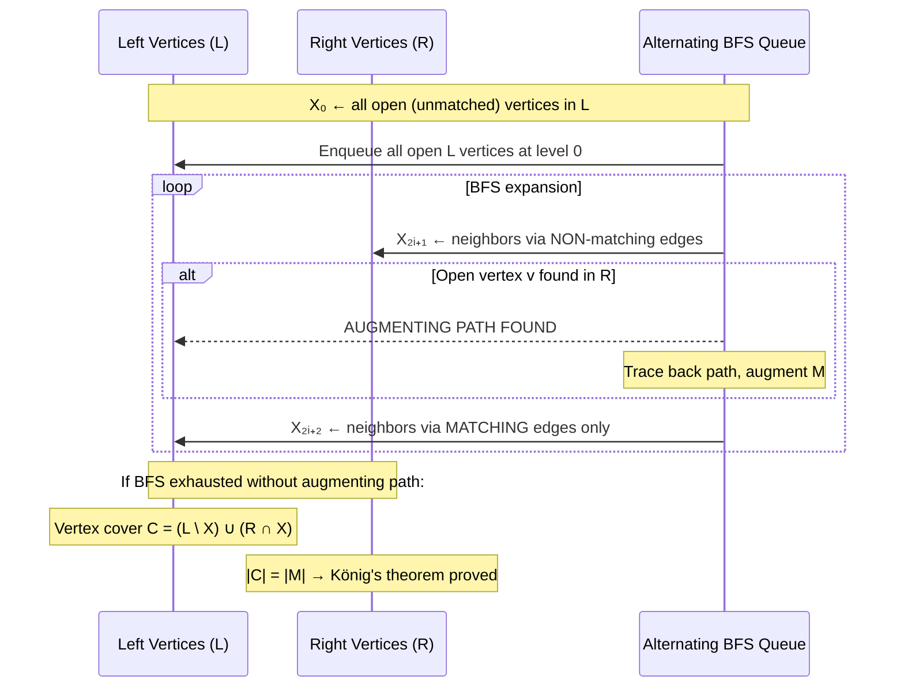

**Vertex Cover Construction from BFS layers**:

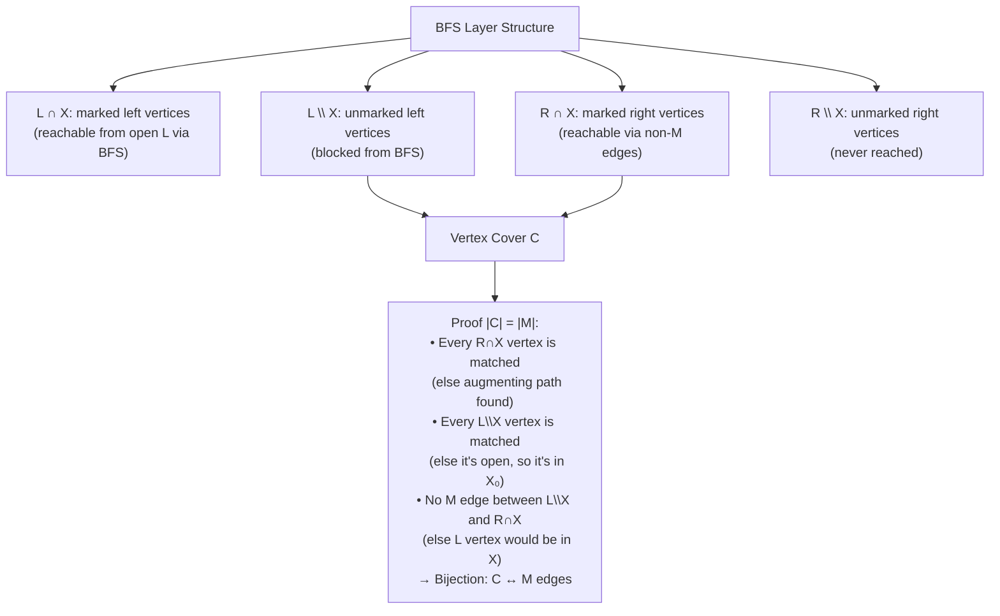

### 2.3 Blossom Algorithm — Handling Odd Cycles

General graphs have **blossoms** (odd cycles) that break the bipartite alternating BFS:

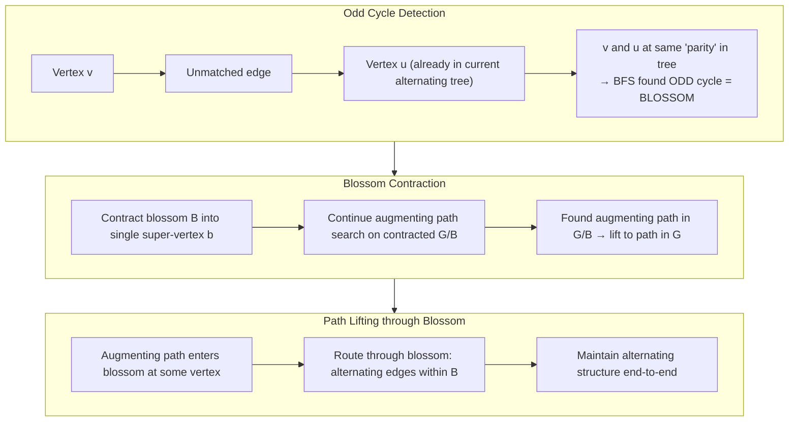

**Edmonds' Blossom complexity**: O(mn²) — each of n augmentations requires O(m) BFS with O(n) blossom contractions.

---

## 3. Metric Embeddings — Distortion Mechanics

### 3.1 Low-Stretch Spanning Trees

The fundamental question: can we approximate arbitrary metrics by tree metrics?

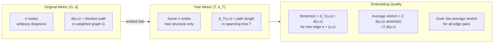

**Bartal's Probabilistic Tree Embedding**:

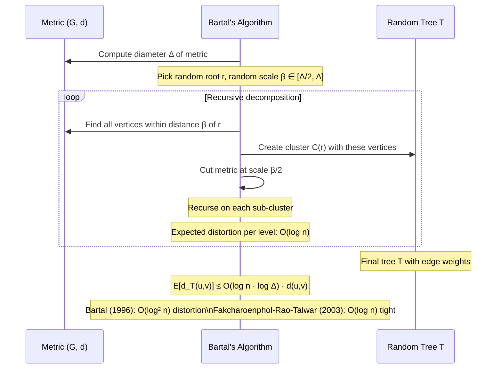

### 3.2 Application: Oblivious Routing

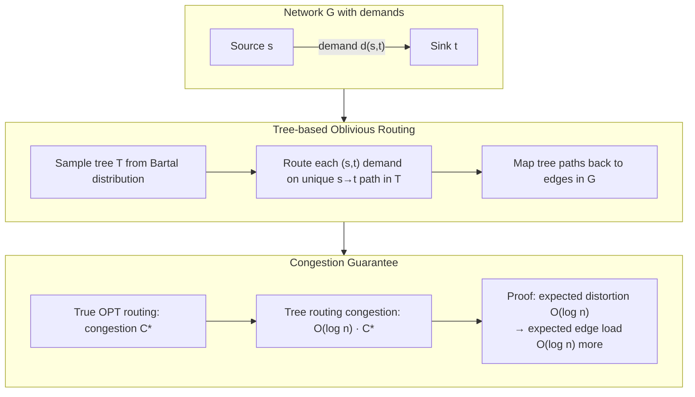

---

## 4. Dimension Reduction — JL Lemma Internals

### 4.1 Johnson-Lindenstrauss Transform

**Goal**: Embed n points from ℝᵈ into ℝᵏ (k ≪ d) while preserving pairwise distances.

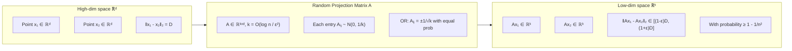

**Why random Gaussian matrices work** — moment calculation:

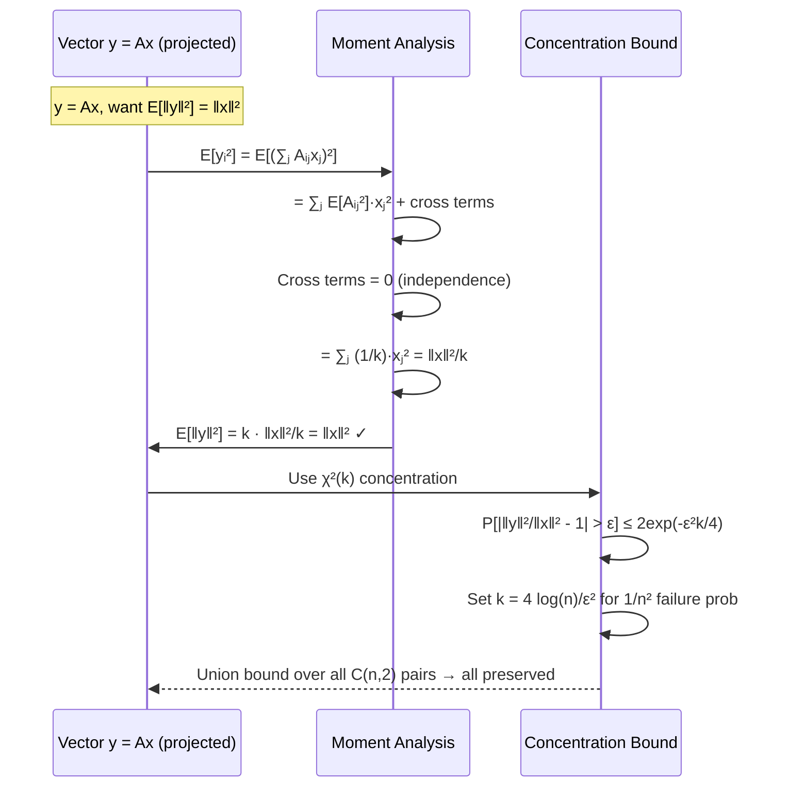

### 4.2 Subgaussian Variables — Memory of Tail Behavior

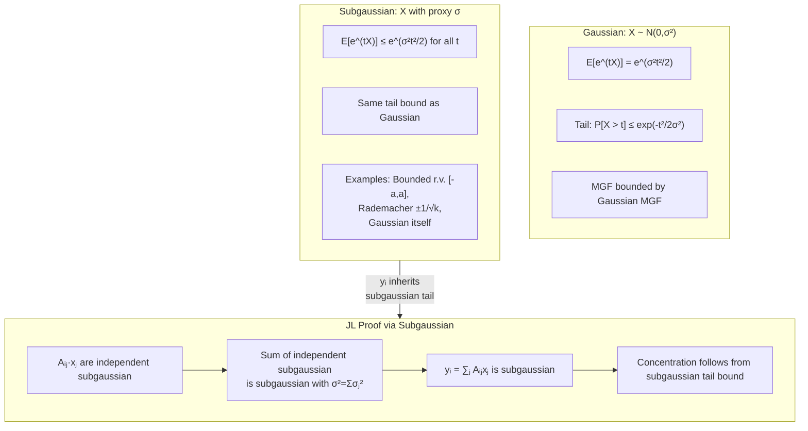

---

## 5. Streaming Algorithms — Sketching Over Data Streams

### 5.1 Frequency Moment Estimation

Process a stream of elements from [n] = {1,...,n}, maintain a small-space **sketch** to estimate Fₖ = Σᵢ aᵢᵏ (k-th frequency moment):

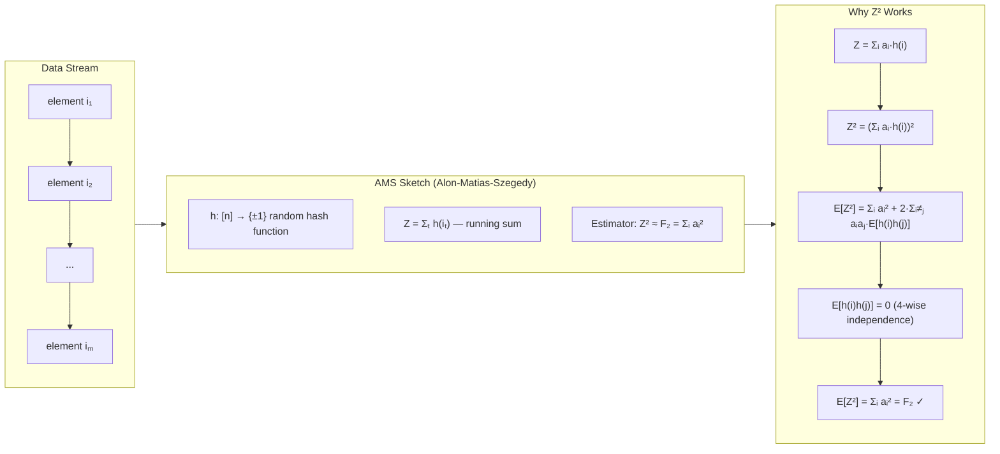

**Memory layout** of streaming sketch:

```mermaid
block-beta
    columns 4
    block:HASH["Hash Functions\n(seeded PRG)"]:1
        H1["h₁: [n]→±1\nO(log n) bits"]
        H2["h₂: [n]→±1\nO(log n) bits"]
        HT["...t copies..."]
    end
    block:COUNTERS["Running Sums"]:1
        Z1["Z₁ = 0\nupdated each element"]
        Z2["Z₂ = 0\nupdated each element"]
        ZT["...t counters..."]
    end
    block:ESTIMATE["Median-of-Means"]:1
        M1["Group t into s groups\nMedian of group means"]
        M2["Fail prob ≤ δ\nwith s = O(log 1/δ)"]
    end
    block:TOTAL["Total Space"]:1
        SP["O(ε⁻² log 1/δ · log n)\nbits for (ε,δ)-approx of F₂"]
    end
```

### 5.2 Stream as Vector Model — Turnstile Updates

```mermaid
sequenceDiagram
    participant STREAM as Stream (i, Δ)
    participant VEC as Frequency Vector f ∈ ℤⁿ
    participant SKETCH as Sketch Matrix S·f

    Note over STREAM: Element arrives: update (i, +1) or (i, -1)
    STREAM->>VEC: f[i] += Δ
    Note over VEC: Conceptual — too large to store (n entries)
    
    Note over SKETCH: S is random matrix: k×n, k ≪ n
    STREAM->>SKETCH: For each update (i,Δ): sketch[j] += S[j,i]·Δ
    Note over SKETCH: O(k) work per update, O(k) space total
    
    SKETCH-->>SKETCH: Recover S·f = approximation of f
    Note over SKETCH: ‖S·f - f‖ ≤ ε·‖f‖ with high probability
    Note over SKETCH: This is compressed sensing / sparse recovery
```

---

## 6. Graph Matchings II — Algebraic Algorithms

### 6.1 Schwartz-Zippel and Polynomial Identity Testing

Detecting a perfect matching reduces to **determinant computation** over a random field:

```mermaid
flowchart TD
    subgraph TUTTE_MATRIX["Tutte Matrix Construction"]
        TM1["For bipartite G=(L,R,E):\nTutte matrix T where\nT[i,j] = xᵢⱼ if (i,j)∈E, else 0"]
        TM2["Xᵢⱼ are distinct indeterminates"]
        TM3["Fact: G has perfect matching ⟺ det(T) ≢ 0"]
    end
    
    subgraph RANDOMIZATION["Randomized Detection (Schwartz-Zippel)"]
        R1["Substitute random values for xᵢⱼ from large field F"]
        R2["Compute det(T) numerically: O(n^ω) time"]
        R3["If det(T) ≠ 0: perfect matching exists (with high prob)"]
        R4["If det(T) = 0: likely no perfect matching"]
        R1 --> R2 --> R3
        R1 --> R2 --> R4
    end
    
    subgraph ERROR["Error Probability"]
        E1["By Schwartz-Zippel: P[det=0 | G has PM] ≤ deg(det)/|F|"]
        E2["deg(det) ≤ n (one variable per edge per row)"]
        E3["Choose |F| = n² → error ≤ 1/n"]
    end
    
    TUTTE_MATRIX --> RANDOMIZATION --> ERROR
```

### 6.2 Isolation Lemma — Finding a Unique Minimum Witness

```mermaid
sequenceDiagram
    participant G as Graph G
    participant ISO as Isolation Lemma
    participant MATCH as Perfect Matching Finder

    Note over G: Assign random weights w(e) ∈ [1, 2m] to edges
    G->>ISO: Compute minimum weight perfect matching weight W*
    
    Note over ISO: Isolation Lemma: P[unique min-weight PM] ≥ 1/2
    ISO-->>MATCH: With prob ≥ 1/2, exactly ONE PM has weight W*
    
    MATCH->>MATCH: For each edge e: remove e, check if min PM weight changes
    Note over MATCH: If min weight increases: e is in THE unique min PM
    Note over MATCH: O(n) determinant computations → O(n^(ω+1)) total
    
    MATCH-->>G: Return unique minimum perfect matching
```

---

## 7. All-Pairs Shortest Paths — Matrix Multiplication Bridge

### 7.1 Min-Plus Product (Tropical Semiring)

APSP reduces to repeated squaring in the **min-plus semiring**:

```mermaid
flowchart LR
    subgraph SEMIRING["Min-Plus Semiring (ℝ, min, +)"]
        OPS["Addition: a ⊕ b = min(a,b)\nMultiplication: a ⊗ b = a+b\nIdentity for ⊕: +∞\nIdentity for ⊗: 0"]
    end
    
    subgraph MATRIX_POWER["Repeated Squaring"]
        D0["D⁰[i,j] = {\n  0 if i=j\n  w(i,j) if edge\n  +∞ otherwise\n}"]
        D1["D¹ = D⁰ ⊗ D⁰\nD¹[i,j] = min over k of (D⁰[i,k] + D⁰[k,j])\n= shortest path using ≤2 edges"]
        DK["Dᵏ[i,j] = min over k-hop paths"]
        DONE["D^(log n) = exact APSP"]
        D0 --> D1 --> DK --> DONE
    end
    
    subgraph COMPLEXITY["Complexity Hierarchy"]
        C1["Naïve APSP: O(n³)"]
        C2["Repeated squaring: O(n³ log n)"]
        C3["With fast (min,+) multiply: open problem!"]
        C4["Integer weights W: O(n³/log n) or better"]
    end
    
    SEMIRING --> MATRIX_POWER
    MATRIX_POWER --> COMPLEXITY
```

### 7.2 APSP via Fast Matrix Multiplication (Undirected)

For undirected graphs with small integer weights, APSP can leverage standard matrix multiplication:

```mermaid
sequenceDiagram
    participant G as Graph G (integer weights)
    participant ADJ as Adjacency Matrix A
    participant MM as Matrix Multiplier (O(n^ω))
    participant APSP as APSP Result

    Note over G: n nodes, integer edge weights in [1,W]
    G->>ADJ: Build n×n adjacency matrix
    
    loop O(log n) iterations
        ADJ->>MM: Compute A^k (ordinary matrix power)
        MM-->>ADJ: Count paths of length exactly k
        Note over MM: A^k[i,j] = # paths of length k from i to j
    end
    
    Note over MM: Extract shortest path lengths from path counts
    Note over MM: Combines with "witnesses" for path reconstruction
    MM->>APSP: D[i,j] for all pairs
    
    Note over APSP: Total: O(n^ω · log² n · log W)
    Note over APSP: Beats O(n³) when ω < 3
```

---

## 8. The Ackermann Function and Union-Find — Inverse Tower

### 8.1 Ackermann Tower Internals

```mermaid
flowchart TD
    subgraph ACKERMANN["Ackermann Function A(m,n)"]
        A1["A(1,n) = 2n — doubles n\nA(2,n) = 2ⁿ·n — exponential\nA(3,n) = 2^(2^...(2^n))  n times — tower\nA(k,n) = A(k-1, A(k-1, ..., A(k-1, n)))"]
    end
    
    subgraph INVERSE["Inverse Ackermann α(n)"]
        AI1["α(n) = min{k : A(k,k) ≥ n}"]
        AI2["α(1) = 1, α(2) = 1, α(3) = 2"]
        AI3["α(2^65536) = 4 — for all practical n, α(n) ≤ 4"]
    end
    
    subgraph UNION_FIND["Why Union-Find is O(mα(m))"]
        UF1["Path compression: flatten find() paths\nEach find() amortized O(α(n)) time"]
        UF2["Union by rank: trees stay shallow\nDepth bounded by O(log n)"]
        UF3["Combined: m operations in O(mα(m)) time\nTarjan's 1975 proof via potential function"]
        UF1 --> UF3
        UF2 --> UF3
    end
    
    ACKERMANN --> INVERSE --> UNION_FIND
```

---

## 9. Concentration of Measure — Probabilistic Algorithm Foundations

### 9.1 Chernoff Bounds — Tail Decay Mechanism

```mermaid
flowchart LR
    subgraph SETUP["Setup: X = Σ Xᵢ, independent Bernoulli"]
        S1["Xᵢ ∈ {0,1}, P[Xᵢ=1] = pᵢ"]
        S2["μ = E[X] = Σpᵢ"]
    end
    
    subgraph MGF_TRICK["MGF + Markov"]
        M1["P[X ≥ (1+δ)μ] = P[e^(tX) ≥ e^(t(1+δ)μ)]"]
        M2["≤ E[e^(tX)] / e^(t(1+δ)μ)    (Markov)"]
        M3["= Πᵢ E[e^(tXᵢ)] / e^(t(1+δ)μ)    (independence)"]
        M4["E[e^(tXᵢ)] = 1 + pᵢ(eᵗ-1) ≤ exp(pᵢ(eᵗ-1))"]
        M5["Πᵢ E[e^(tXᵢ)] ≤ exp(μ(eᵗ-1))"]
        M6["Minimize over t: t = ln(1+δ)"]
        M7["P[X ≥ (1+δ)μ] ≤ (eᵟ/(1+δ)^(1+δ))^μ"]
        M1 --> M2 --> M3 --> M4 --> M5 --> M6 --> M7
    end
    
    subgraph SIMPLIFIED["Simplified Bound"]
        SB1["P[X ≥ (1+δ)μ] ≤ exp(-δ²μ/3) for δ ≤ 1"]
        SB2["P[X ≥ cμ] ≤ (e/c)^(cμ) for c > e"]
    end
    
    SETUP --> MGF_TRICK --> SIMPLIFIED
```

### 9.2 Power of Two Choices — Load Balancing

```mermaid
sequenceDiagram
    participant BALLS as n Balls
    participant HASH as Two Random Bins
    participant BINS as m Bins

    loop For each ball
        BALLS->>HASH: Pick 2 random bins b₁, b₂
        HASH->>BINS: Query load[b₁] and load[b₂]
        BINS-->>HASH: Return counts
        HASH->>BINS: Place ball in min(load[b₁], load[b₂])
    end
    
    Note over BINS: One choice: max load = O(log n / log log n) w.h.p.
    Note over BINS: Two choices: max load = O(log log n) w.h.p.
    Note over BINS: Exponential improvement from one extra hash query!
    Note over BINS: Application: hash tables, load balancers, memory allocation
```

---

## 10. Summary — Algorithmic State Transitions Map

```mermaid
flowchart TD
    subgraph MST_LAND["MST Algorithms"]
        K["Kruskal:\nSort→UF-merge\nO(m log n)"]
        P["Prim:\nFibHeap+decreaseKey\nO(m+n log n)"]
        B["Borůvka:\nParallel contraction\nO(m log n)"]
        FT["Fredman-Tarjan:\nBounded heap+Borůvka\nO(m log* n)"]
        KKT["Karger-Klein-Tarjan:\nRandom sampling+cycle filter\nO(m) expected"]
    end
    
    subgraph MATCHING_LAND["Matching Algorithms"]
        BIOL["Bipartite:\nAlt-BFS\nO(mn)"]
        HK["Hopcroft-Karp:\nMulti-path BFS\nO(m√n)"]
        BLOSSOM["Blossom:\nOdd-cycle contraction\nO(mn²)"]
        ALG["Algebraic:\nTutte det + isolation\nO(n^ω)"]
    end
    
    subgraph EMBEDDING_LAND["Embeddings & Dimension"]
        BARTAL["Bartal trees:\nO(log² n) distortion"]
        JL["JL Lemma:\nO(log n/ε²) dims"]
        SK["Streaming sketches:\nO(ε⁻² log n) space"]
    end
    
    UF["Union-Find\nO(mα(m))"] --> K
    FIBH["Fibonacci Heap\nO(1) amortized ins/decKey"] --> P
    UF --> B
    FIBH --> FT
    B --> KKT
    P --> FT
    
    BIOL --> HK
    HK --> BLOSSOM
    BLOSSOM --> ALG
    
    BARTAL --> JL
    JL --> SK
```

---

*Source: CMU 15-850 Advanced Algorithms, Anupam Gupta (Fall 2020). All diagrams synthesize internal algorithmic mechanics — not reproduced text.*
