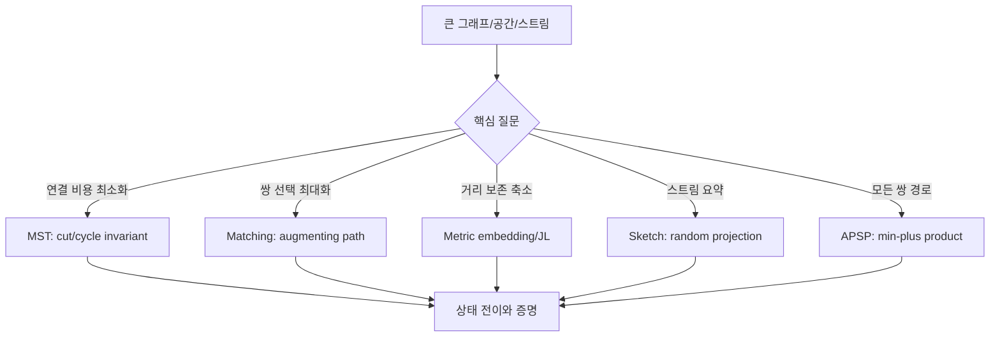
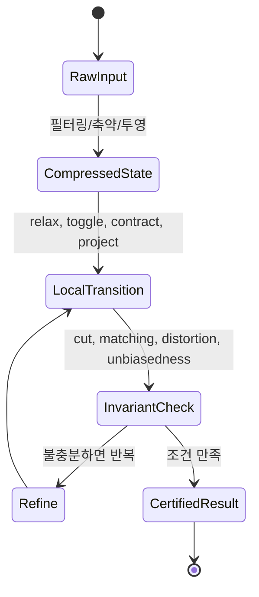

# Advanced Algorithms 내부 메커니즘 학습 및 기록 노트

## 1. 왜 필요한가? (Pain Point & Motivation)

고급 알고리즘은 단순 구현보다 증명 불변식과 상태 압축 기법이 핵심이다. MST, 매칭, metric embedding, Johnson-Lindenstrauss 차원 축소, streaming sketch, algebraic matching, APSP는 서로 다른 분야처럼 보이지만 모두 "큰 상태를 더 작은 표현으로 보존하거나 필터링한다"는 공통 구조를 가진다.

이 문서는 CMU 15-850 Advanced Algorithms 원문 요약의 내부 동작을 학습 노트 형식으로 재정리한다. 목표는 정리된 정리 이름을 외우는 것이 아니라, 알고리즘이 어떤 상태를 유지하고 어떤 불변식으로 정당화되는지 추적하는 것이다.

## 2. 현재 나의 상태 (Baseline)

- MST의 cut rule과 cycle rule은 알고 있지만 알고리즘별로 어떤 rule을 직접 쓰는지 연결이 약하다.
- bipartite matching의 augmenting path는 이해하지만 blossom contraction이 왜 필요한지 직관이 부족하다.
- metric embedding과 JL lemma는 확률적 보존이라는 큰 그림만 알고 있다.
- streaming sketch는 작은 메모리로 추정한다는 사실은 알지만, unbiased estimator와 variance control의 역할이 불명확하다.
- inverse Ackermann과 Chernoff bound는 알고리즘 분석에서 자주 보지만 실제 상태 전이와 연결하지 못한다.

## 3. 도달하고 싶은 목표 (Target State)

- 고급 알고리즘을 "상태 표현, 안전한 전이, 보존되는 값" 기준으로 읽는다.
- MST, matching, embedding, sketching, APSP의 핵심 불변식을 한 문장으로 설명한다.
- randomized algorithm에서 실패 확률, distortion, concentration이 어디에 들어가는지 구분한다.
- Union-Find의 `α(n)`, JL의 `O(log n / ε²)`, streaming sketch의 `O(ε^-2 log(1/δ))` 같은 항이 왜 생기는지 구조적으로 이해한다.
- 구현 전에 어떤 데이터 구조가 증명 구조를 지탱하는지 먼저 정리한다.

## 4. 시스템 번역 (Data Flow)



고급 알고리즘의 data flow는 입력 전체를 그대로 저장하지 않고, 증명에 필요한 상태만 남긴다. 그 상태가 불변식을 만족하면 결과의 정확도 또는 근사 보장이 따라온다.

## 5. 핵심 구성요소 (Building Blocks)

| 구성요소 | 핵심 상태 | 보존해야 할 규칙 |
| --- | --- | --- |
| MST cut rule | 선택된 blue edge 집합 | cut을 가로지르는 최소 간선은 안전하다. |
| MST cycle rule | 제거된 red edge 집합 | cycle의 최대 간선은 MST에 필요 없다. |
| Union-Find | component parent/rank | 같은 component를 잇는 간선은 cycle을 만든다. |
| Augmenting path | matching edge 집합 | 경로 edge를 toggle하면 matching 크기가 1 증가한다. |
| Blossom contraction | odd cycle super-node | 축약 그래프의 augmenting path를 원래 그래프로 lift한다. |
| Metric embedding | 원공간 거리와 tree 거리 | distortion bound 안에서 거리를 보존한다. |
| JL transform | random projection matrix | pairwise distance가 `1 ± ε` 범위에 남는다. |
| Streaming sketch | hash/sign counters | expectation은 목표 값이고 variance는 반복/median으로 줄인다. |
| Min-plus product | distance matrix | `min`과 `+`가 경로 결합을 표현한다. |
| Chernoff bound | 독립 확률 변수 합 | tail probability를 지수적으로 줄인다. |

## 6. 상태 전이 (State Transition)



Kruskal은 edge sort와 Union-Find로 component 상태를 갱신한다. 매칭 알고리즘은 augmenting path를 찾으면 symmetric difference로 edge 상태를 뒤집는다. JL과 sketching은 random projection 후 concentration으로 결과 상태를 검증한다.

## 7. 불변식 (Invariant: 절대 깨지면 안 되는 규칙)

- MST에서 선택한 blue edge는 항상 어떤 MST로 확장 가능해야 한다.
- Kruskal은 Union-Find 기준으로 서로 다른 component를 잇는 간선만 추가한다.
- Matching의 각 vertex는 최대 하나의 matching edge에만 incident해야 한다.
- Augmenting path는 unmatched edge와 matched edge가 교대로 나타나야 한다.
- Blossom을 축약해도 augmenting path 존재 여부를 잃지 않아야 한다.
- Random projection은 모든 point pair에 대해 확률적 보존 조건을 만족해야 한다.
- Streaming sketch의 estimator는 기대값이 목표 통계량과 맞아야 하며, 반복으로 failure probability를 낮춰야 한다.
- Shortest path DP나 min-plus product는 이미 계산된 경로 길이를 증가시키면 안 된다.

## 8. 가장 작은 예제 (Minimal Viable Example)

```python
def kruskal(n, edges):
    parent = list(range(n))
    rank = [0] * n

    def find(x):
        if parent[x] != x:
            parent[x] = find(parent[x])
        return parent[x]

    def union(a, b):
        ra, rb = find(a), find(b)
        if ra == rb:
            return False
        if rank[ra] < rank[rb]:
            ra, rb = rb, ra
        parent[rb] = ra
        if rank[ra] == rank[rb]:
            rank[ra] += 1
        return True

    mst = []
    for w, u, v in sorted(edges):
        if union(u, v):
            mst.append((u, v, w))
            if len(mst) == n - 1:
                break
    return mst
```

이 예제는 고급 알고리즘에서 반복되는 핵심 구조를 보여준다. 전체 그래프를 매번 다시 보지 않고, component 상태와 cut/cycle 불변식만 유지해 안전한 간선을 선택한다.

## 9. 실패 사례 (What could go wrong?)

- MST에서 같은 component를 잇는 간선을 추가하면 cycle이 생기고 spanning tree 불변식이 깨진다.
- Blossom contraction 없이 일반 그래프 matching을 bipartite 방식으로 처리하면 odd cycle 때문에 augmenting path를 놓친다.
- JL transform의 차원 `k`를 너무 작게 잡으면 pairwise distance 보존 실패 확률이 커진다.
- Streaming sketch에서 독립성이 부족한 hash 함수를 쓰면 estimator variance 분석이 성립하지 않을 수 있다.
- Dijkstra를 음수 간선에 적용하듯, 알고리즘이 요구하는 전제와 입력 조건을 섞으면 증명이 무너진다.
- Min-plus product와 일반 matrix product의 연산 의미를 혼동하면 APSP 전이가 잘못된다.

## 10. 뇌 확장하기 (Evolution & Variants)

- MST는 Boruvka의 parallel contraction, Prim의 priority queue, Karger-Klein-Tarjan의 random sampling으로 확장된다.
- Matching은 Hopcroft-Karp, Edmonds blossom, Tutte matrix와 isolation lemma를 통한 algebraic algorithm으로 이어진다.
- Metric embedding은 tree routing, oblivious routing, low-stretch spanning tree 설계로 확장된다.
- JL lemma는 nearest neighbor, clustering, randomized numerical linear algebra에서 차원 축소 기반이 된다.
- Streaming sketch는 AMS sketch, Count-Min sketch, compressed sensing, turnstile model로 확장된다.
- Concentration inequality는 randomized load balancing, hashing, sampling algorithm의 실패 확률 계산에 공통으로 쓰인다.

## 11. 최종 체크리스트 (Definition of Done)

- [x] MST, matching, embedding, sketching, APSP를 상태와 불변식 기준으로 묶었다.
- [x] Kruskal 최소 예제로 cut/cycle 규칙과 Union-Find 상태 전이를 연결했다.
- [x] Blossom, JL, streaming sketch의 실패 조건을 분리해 적었다.
- [x] 확률적 알고리즘에서 expectation, variance, concentration의 역할을 명시했다.
- [x] 원문에 있던 CMU 15-850 고급 알고리즘 범위를 학습 노트 구조로 재구성했다.

## 12. 뇌에 새기는 복습 문장 (TL;DR Blank)

고급 알고리즘은 거대한 입력을 그대로 다루지 않는다. 증명에 필요한 상태만 압축해 유지하고, 그 상태가 불변식을 지키도록 전이시키는 기술이다.
