# Algorithm Design & Analysis: Levitin + CTCI Internals

> Sources: *Introduction to the Design and Analysis of Algorithms* by Anany Levitin (3rd ed., Pearson) and *Cracking the Coding Interview* (4th ed.) by Gayle Laakmann

---

> **Reading contract:** This note synthesizes Levitin 3rd edition and CTCI 4th edition; it does not claim coverage of later editions or every implementation. Treat a theorem as established only under its stated input domain and cost model, and treat stack, heap, cache, and instruction descriptions as implementation examples unless an ABI or language version is named. A section is complete when the algorithm variant, preconditions, invariant, termination argument, complexity measure, and source edition/location are identifiable. If any of those is missing, retain the claim as a heuristic or incomplete derivation rather than a universal result.

## 1. Algorithm Correctness — The Precision Imperative

An algorithm specification must make each step mechanically executable. The middle-school GCD procedure is **incomplete as written** when "find prime factors" is left undefined; it becomes an algorithm once a terminating factorization procedure and its input domain are supplied.

```mermaid
flowchart LR
    P["Problem Statement"] --> A1["Euclid's GCD\ngcd(m,n)=gcd(n, m mod n)"]
    P --> A2["Consecutive Integer\ncheck t=min(m,n) down to 1"]
    P --> A3["Middle-School\nprime factorization × LCM"]
    A1 --> |O(log min(m,n))| Fast
    A2 --> |O(min(m,n))| Slow
    A3 --> |NOT an algorithm — factorization undefined| Invalid
```

**Why Euclid's terminates:** m mod n < n always. The second argument strictly decreases each iteration → must eventually reach 0. Termination proof = strictly decreasing bounded measure.

---

## 2. Recurrence Relations — Backward Substitution Method

Every recursive algorithm's cost satisfies a recurrence. Levitin's **backward substitution** method unrolls the recurrence until the base case appears.

### Sequential Recursion: T(n) = T(n−1) + 1

```
T(n) = T(n-1) + 1
     = [T(n-2) + 1] + 1 = T(n-2) + 2
     = [T(n-3) + 1] + 2 = T(n-3) + 3
     ...
     = T(n-i) + i           ← general pattern
     = T(0) + n   (set i=n) ← base case
     = n
```

Pattern: constant work per level, n levels → T(n) = Θ(n).

### Binary Recursion: T(n) = T(n/2) + 1

For n = 2^k:
```
T(2^k) = T(2^(k-1)) + 1
        = T(2^(k-2)) + 2
        ...
        = T(2^0) + k = k = log₂n
```

→ T(n) = Θ(log n). Template for binary search, binary conversion.

### Exponential Recursion: Tower of Hanoi T(n) = 2T(n−1) + 1

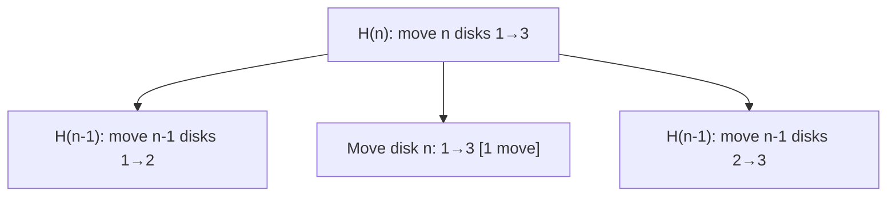

Backward substitution:
```
M(n) = 2M(n-1) + 1
     = 2[2M(n-2)+1] + 1 = 2²M(n-2) + 2 + 1
     = 2³M(n-3) + 2² + 2 + 1
     ...
     = 2^(n-1)·M(1) + 2^(n-1) - 1
     = 2^n - 1
```

**Call tree has 2ⁿ−1 nodes total** — exponential time is intrinsic to the problem, not algorithmic inefficiency.

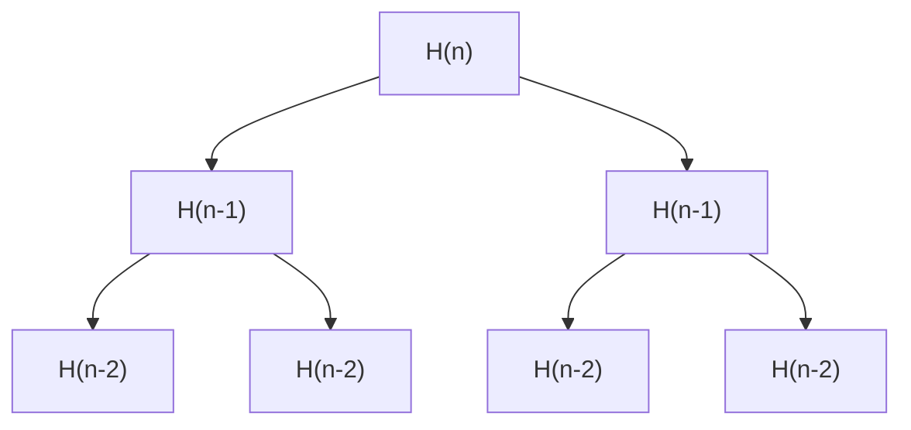

Total nodes at depth d: 2^d. Sum over all depths: Σ_{d=0}^{n-1} 2^d = 2^n − 1.

---

## 3. Algorithm Design Paradigms — Levitin's Classification

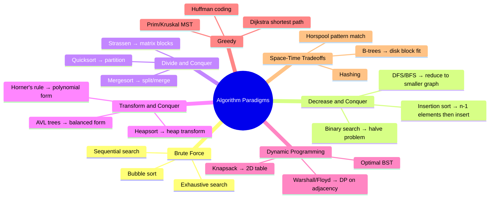

**Key classification axis:** how many subproblems and what size?
- Decrease-and-conquer: 1 subproblem of size n−1 or n/2
- Divide-and-conquer: 2+ subproblems, size n/c each
- Dynamic programming: all subproblems, build table bottom-up

---

## 4. Sieve of Eratosthenes — Bit Array and Cache Access Pattern

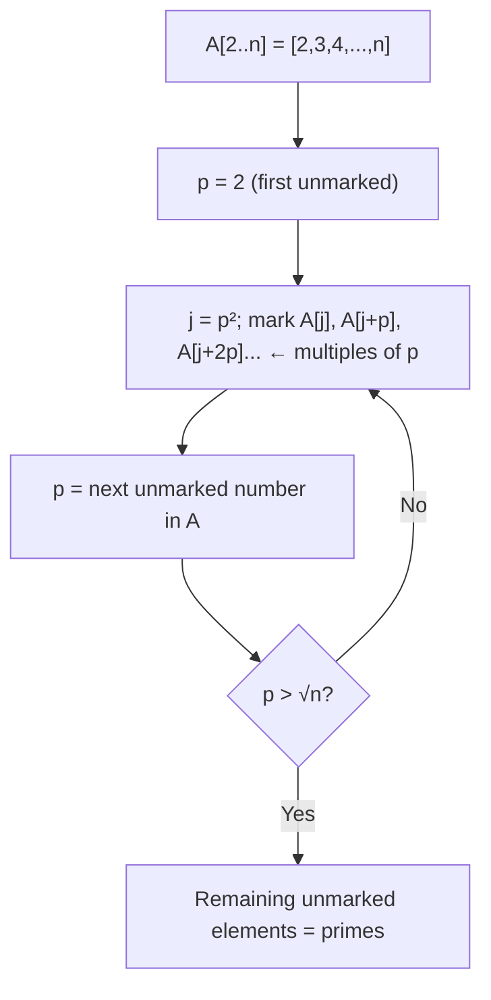

**Why start marking at p²:** All multiples kp with k < p were already marked when k itself was the active sieve value. So p² is the first NEW multiple to mark.

**Memory access pattern:** Inner loop `A[p²], A[p²+p], A[p²+2p], ...` has stride = p.
- For small p: stride is small → good cache locality
- For large p: stride > cache line → cache miss per iteration, but few iterations (n/p)

Total work: Σ_{p prime ≤ √n} n/p ≈ n · ln(ln(n)) → O(n log log n)

---

## 5. Insertion Sort — Decrease and Conquer Mechanics

Insertion sort solves A[1..n] by solving A[1..n−1] first (recursively/iteratively), then **inserting** A[n] into sorted position.

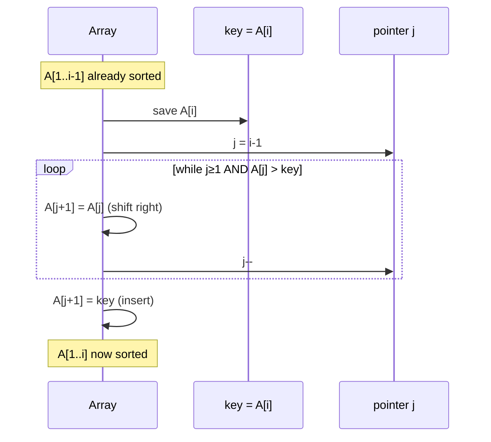

**Memory movement pattern:** At each outer iteration i, elements A[j], A[j+1], ..., A[i-1] shift right by one position. In the worst case (reverse-sorted input), this is 1+2+...+(n-1) = n(n-1)/2 shifts → Θ(n²).

**Best case (already sorted):** 0 shifts → Θ(n) — each element is immediately in position.

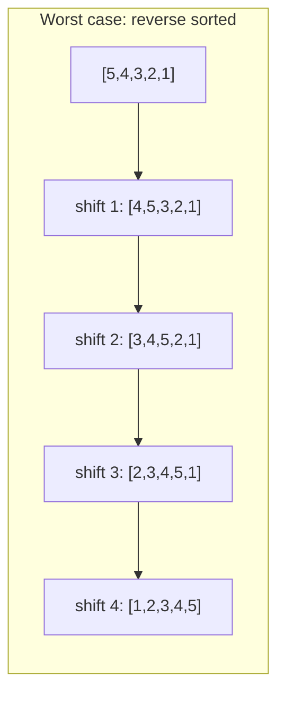

---

## 6. CTCI: Stack Memory vs. Heap Memory — The Interview Essential

```mermaid
block-beta
    columns 2
    block:stack["Stack (LIFO)"]
        SF4["Frame: funcD() — local vars, return addr"]
        SF3["Frame: funcC()"]
        SF2["Frame: funcB()"]
        SF1["Frame: main() — base"]
        SP["↑ Stack Pointer (moves down on push)"]
    end
    block:heap["Heap (free store)"]
        HB1["malloc'd block A (tracked by allocator)"]
        HB2["free block"]
        HB3["malloc'd block B"]
        HB4["free block"]
        HB5["..."]
    end
```

**Stack allocation (typical fixed-frame ABI case):** The compiler can determine a fixed frame from local declarations, adjust the stack pointer on entry, and restore it on return. Variable-length allocations, optimization, inlining, red zones, and ABI rules can change or eliminate this layout; "no fragmentation" is not a language-level guarantee.

**Heap allocation:** Runtime-determined. `malloc(n)` searches free-list for block ≥ n bytes. Returns pointer; adds header (size, next-free pointer). `free(p)` marks block as available, coalesces adjacent free blocks.

**Interview gotcha: use-after-free:**
```c
int* f() {
    int x = 5;
    return &x;  // DANGLING POINTER — x is on stack, freed when f() returns
}
int* g() {
    int* p = malloc(sizeof(int));
    *p = 5;
    return p;  // SAFE — heap persists past function return
}
```

---

## 7. CTCI: Bit Manipulation — Hardware Register Mechanics

The following bit operations are constant-time in the usual fixed-width word-RAM model. Actual instruction count, latency, and memory traffic depend on operand placement, compiler output, ISA, and word width:

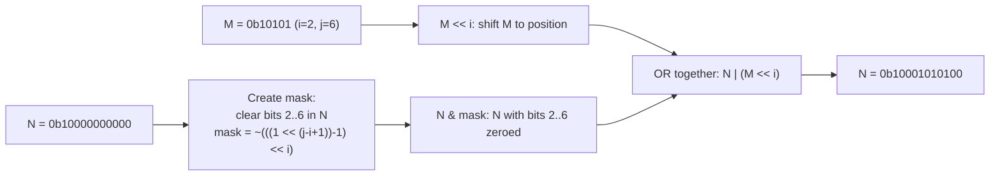

**Power-of-2 check:** `(n & (n-1)) == 0`

Binary: powers of 2 have exactly one 1-bit.
```
n     = 0b01000000  (= 64)
n-1   = 0b00111111
n & (n-1) = 0b00000000  → true: power of 2

n     = 0b01000001  (= 65)
n-1   = 0b01000000
n & (n-1) = 0b01000000  → not zero: not power of 2
```

**Bit count (Hamming weight) — Brian Kernighan's method:**
```
count = 0
while n != 0:
    n = n & (n-1)   // clears the lowest set bit each iteration
    count++
```
Each iteration removes exactly one 1-bit → runs in O(number of set bits) iterations, not O(word size).

---

## 8. CTCI: Trees — Balance Conditions and Height Invariants

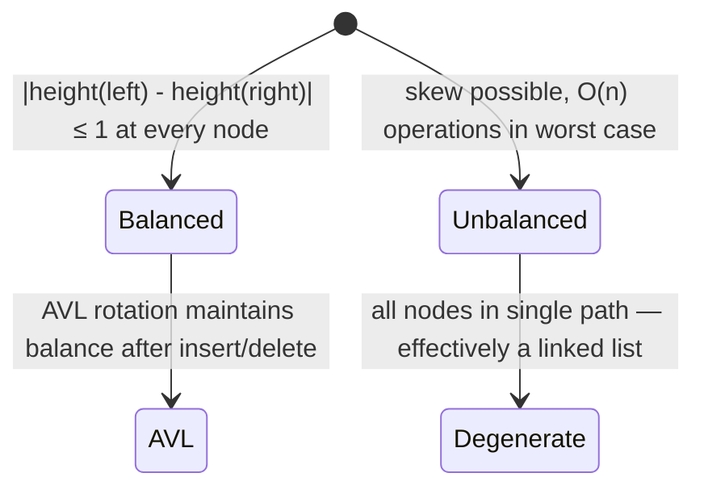

**Height-checking algorithm — call stack flow:**

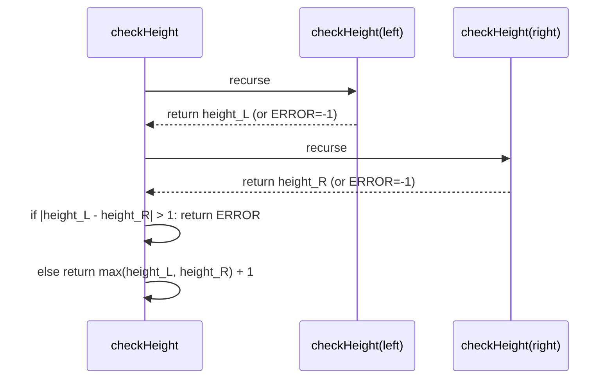

Short-circuit: return ERROR (-1) immediately if either subtree is unbalanced → avoids exploring the entire tree.

**Height vs depth:** Height of node = length of longest path to leaf below. Depth = length of path from root. Height of tree = height of root = max depth of any leaf.

---

## 9. CTCI: Graph Traversal — BFS for Route Finding

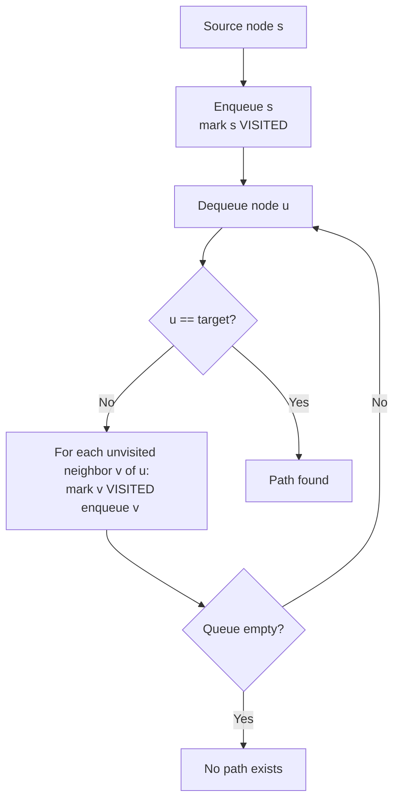

**Why BFS guarantees shortest path (unweighted):** BFS explores nodes layer by layer — all nodes at distance d before any at distance d+1. When target is first dequeued, it was reached via the minimum number of edges.

**Memory:** BFS queue holds at most O(W) nodes where W = maximum graph width (branching factor × depth layers). DFS stack holds at most O(H) nodes where H = max depth. For wide shallow graphs: DFS more memory-efficient. For deep narrow graphs: BFS more memory-efficient.

---

## 10. CTCI: Linked List Internals — Memory Layout

```mermaid
block-byzantine
    block:LL["Linked List in Memory (Heap)"]
        N1["addr 0x100:\n  data=5\n  next=0x230"]
        N2["addr 0x230:\n  data=12\n  next=0x045"]
        N3["addr 0x045:\n  data=8\n  next=NULL"]
    end
```

Nodes are **not contiguous** in memory. Each `next` pointer is a heap address. This has consequences:

- **No random access:** To reach node k, must traverse from head: O(k) pointer dereferences
- **Cache unfriendly:** Each pointer-follow is a potential cache miss if nodes are spread across heap pages
- **Insertion O(1):** Given pointer to node, splice in new node by updating two pointers — no shifting

**Fast/slow pointer pattern (Floyd's algorithm):**

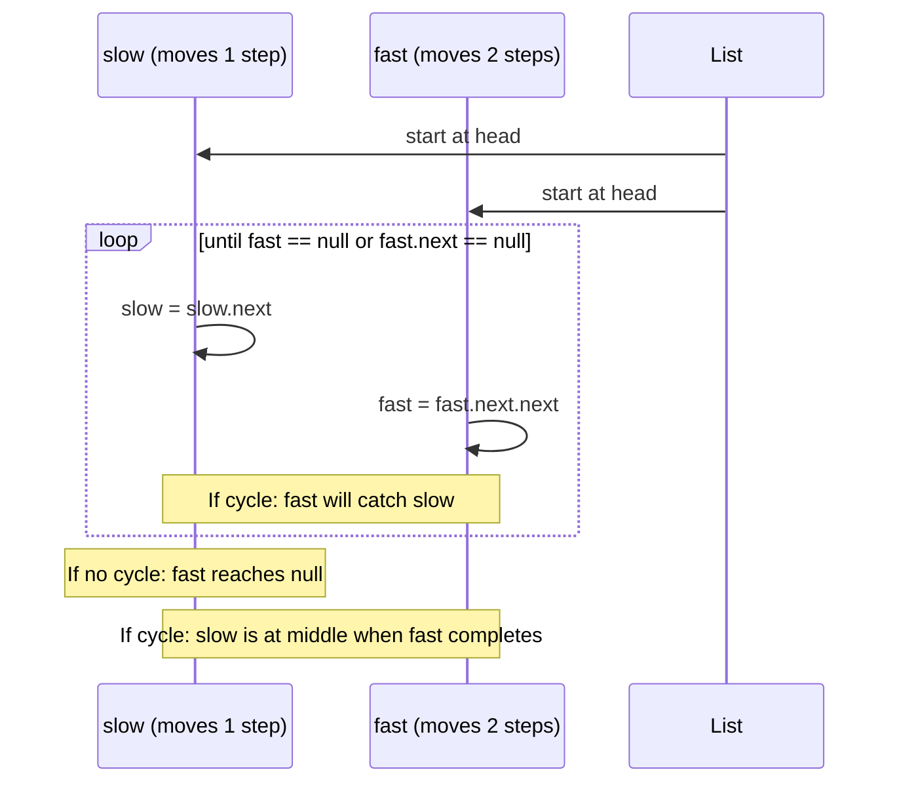

When fast reaches null → no cycle. When fast == slow (inside loop) → cycle detected. After cycle detection, resetting slow to head and advancing both by 1 finds the cycle entry point (mathematical proof: distance from head to entry = distance from meeting point to entry along cycle).

---

## 11. Dynamic Programming — Levitin's Four-Step Method

Levitin formalizes DP into a systematic methodology:

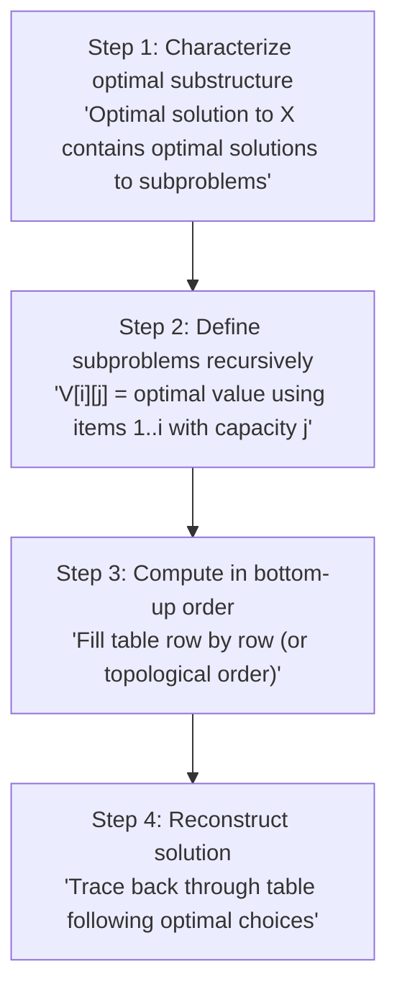

### 0/1 Knapsack — Table Fill Pattern

V[i][j] = max value using items 1..i and capacity j:

```
V[i][j] = V[i-1][j]                         if w_i > j  (can't include item i)
         = max(V[i-1][j], v_i + V[i-1][j-w_i]) otherwise (include or exclude)
```

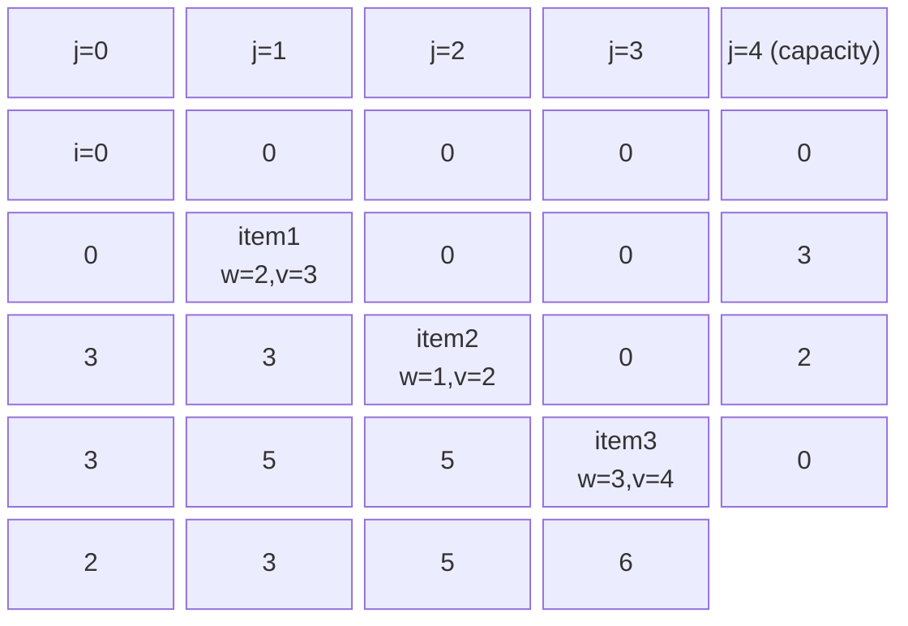

Each cell depends only on the row directly above (previous items). Space optimization: use single 1D array, fill right-to-left.

---

## 12. Greedy Correctness — Exchange Argument Pattern

For Dijkstra / Prim / Huffman to be correct, the greedy choice must be safe. The canonical proof is the **exchange argument:**

```
Assume OPT differs from GREEDY at step k.
OPT contains choice B at step k; GREEDY makes choice A (locally optimal).
Show: swap B→A in OPT to get OPT' where cost(OPT') ≤ cost(OPT).
Conclusion: OPT was not strictly better than GREEDY → GREEDY is optimal.
```

```mermaid
sequenceDiagram
    participant OPT as OPT solution
    participant G as GREEDY solution

    Note over OPT,G: Steps 1..k-1 identical
    OPT->>OPT: Step k: choose B
    G->>G: Step k: choose A (locally best)
    OPT->>OPT: Steps k+1..n: some sequence
    G->>G: Steps k+1..n: greedy continues
    Note over OPT: Swap B→A: new solution OPT'
    OPT->>OPT: cost(OPT') ≤ cost(OPT) because A is locally optimal
    Note over OPT,G: By induction, GREEDY = OPT at every step
```

**When greedy FAILS:** Fractional knapsack ✓ (greedy by value/weight ratio works). 0/1 knapsack ✗ (greedy fails — must use DP). The difference: 0/1 knapsack has "all-or-nothing" choice that can block future items, destroying the greedy choice property.

---

## 13. CTCI: Recursion — Call Stack Size as Memory Constraint

For problems solved by recursion, **stack depth = memory consumption**:

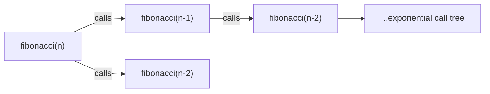

Naïve fibonacci: exponential time (recomputes same subproblems) but only O(n) stack depth (depth = n along leftmost branch).

With memoization — each unique subproblem solved once:
- Stack depth still O(n) in worst case (during first descent)
- Total work: O(n) (each of n subproblems solved exactly once)

**Tail-call optimization:** A compiler may reuse the current stack frame when the recursive call is in tail position, but C and C++ do not guarantee this transformation. Claim O(1) stack space only after checking the target compiler and generated code; otherwise retain the O(n) worst-case stack bound.

```
// NOT tail recursive — addition happens after recursive return
int fact(n): return n * fact(n-1)

// Tail recursive — accumulator pattern
int fact(n, acc=1): 
    if n==0: return acc
    return fact(n-1, n*acc)  // last operation = recursive call
```

---

## 14. Algorithm Selection Matrix

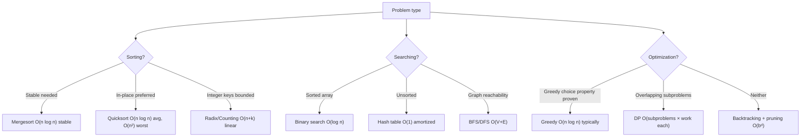

**Time-space tradeoff pattern (Levitin):** Hashing trades O(n) extra memory for O(1) lookup (vs O(log n) for BST with O(n) memory). Dynamic programming trades O(n²) memory for polynomial time (vs exponential naïve recursion). This tradeoff is a first-class design axis, not an afterthought.

---

## Summary — Core Internal Mechanics

| Algorithm | Internal Mechanism | Recurrence | Complexity |
|-----------|-------------------|------------|------------|
| Euclid GCD | Invariant: gcd(m,n)=gcd(n,m mod n), decreasing second arg | T(n)=T(n mod m) | O(log min(m,n)) |
| Sieve | Stride-p marking, start at p² | Work ∝ n/p per prime p | O(n log log n) |
| Insertion Sort | Shift-right then insert | T(n)=T(n-1)+n | O(n²) worst, O(n) best |
| Merge Sort | Split-merge | T(n)=2T(n/2)+n | O(n log n) |
| Tower of Hanoi | 2 recursive subtasks + 1 move | T(n)=2T(n-1)+1 | O(2ⁿ) |
| BFS | FIFO layer-by-layer | — | O(V+E) |
| 0/1 Knapsack DP | 2D table, row-by-row | V[i][j]=max(...) | O(nW) |
| Dijkstra | Min-heap BFS with relaxation | — | O((V+E)logV) |
| Huffman | Greedy: merge two min-freq | — | O(n log n) |
