# Algorithmic Thinking: A Problem-Based Introduction — Under the Hood

> **Source**: Daniel Zingaro, No Starch Press, 2021  
> **Focus**: Internal mechanics of hash tables, BFS queue state, DP memoization cache, heap sift operations, union-find path compression — the memory layouts and pointer mechanics beneath competitive programming patterns

---

## 1. Hash Table Internals: Chaining, Load Factor, and Collision Mechanics

### Memory Layout of a Chained Hash Table

A hash table maps a key → array index → linked list chain. Understanding the memory structure reveals why average O(1) is not worst-case O(1).

```mermaid
block-beta
  columns 1
  block:arr["Hash Array (size=8, backing array in heap)"]
    b0["[0] → NULL"]
    b1["[1] → node{key=9, val=V1} → node{key=1, val=V2} → NULL"]
    b2["[2] → node{key=10, val=V3} → NULL"]
    b3["[3] → NULL"]
    b4["[4] → NULL"]
    b5["[5] → node{key=13, val=V4} → NULL"]
    b6["[6] → NULL"]
    b7["[7] → node{key=7, val=V5} → NULL"]
  end
```

**Hash function internals (for integer keys)**:
```
index = key % table_size
```

For the "Unique Snowflakes" problem (6-element snowflakes), the book uses a composite hash:
```
hash = (s[0] + s[1] + s[2] + s[3] + s[4] + s[5]) % table_size
```

### Collision Resolution: Why Chaining Matters

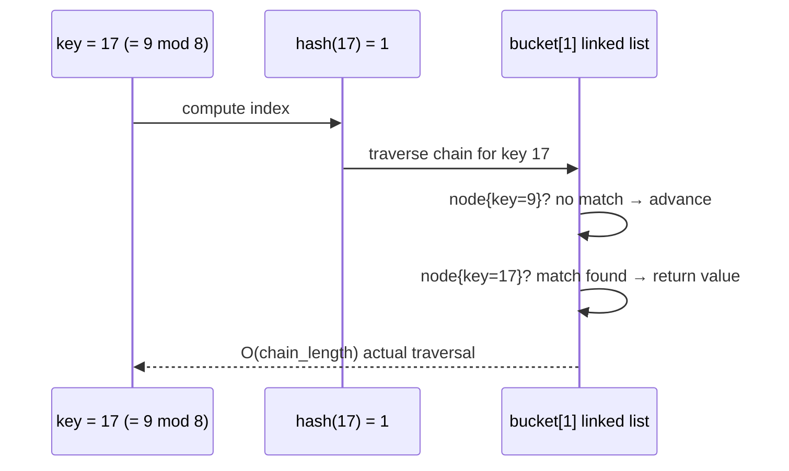

**Load factor λ = n/m** (n = items, m = buckets):
- λ < 0.7: average chain length ≈ 1, effective O(1)
- λ = 1.0: average chain length = 1.0, collisions frequent
- λ > 2.0: chains degrade to linked list scan O(n)

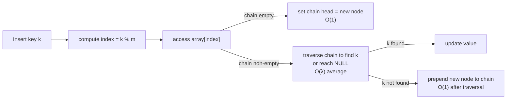

### Why Pairwise Comparison O(n²) Fails vs Hash O(n)

The book's snowflake problem demonstrates this concretely:

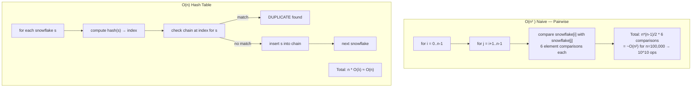

---

## 2. Trees and Recursion: Call Stack Memory Layout

### Binary Tree Memory Representation

The book represents trees with a node struct array in C:

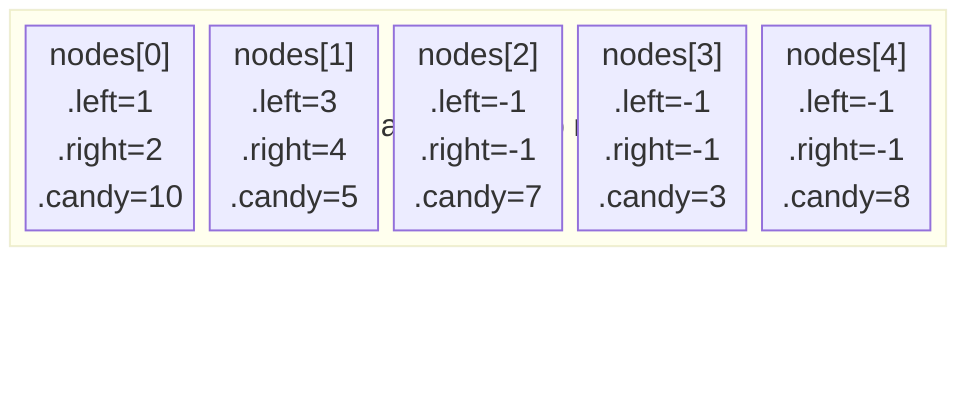

**Corresponding tree structure:**
```
        0 (10)
       / \
      1(5) 2(7)
     / \
   3(3) 4(8)
```

### Recursive DFS Call Stack Growth

For the "Halloween Haul" problem, the recursive candy collection traversal has a call stack depth equal to tree height:

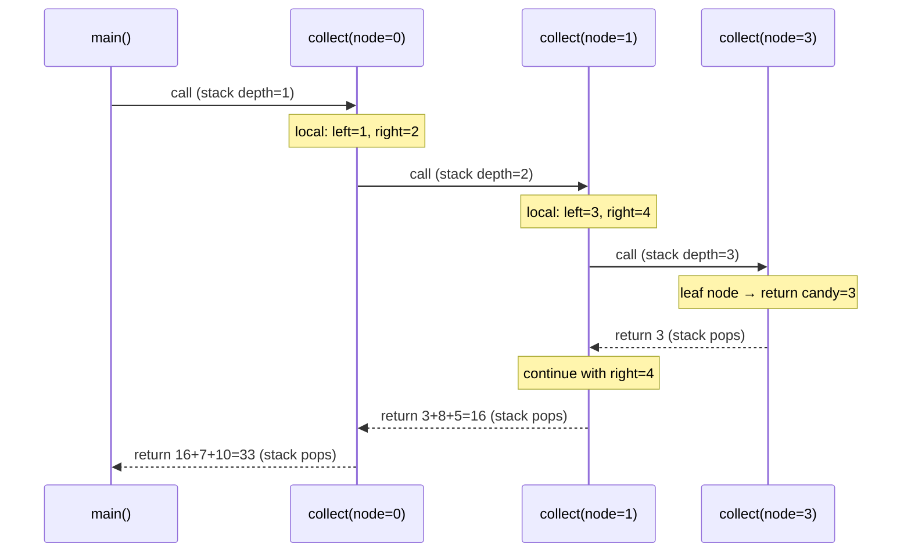

**Stack frame contents per call** (C-style):
- Return address pointer
- `node` parameter (int index)
- Local variables for left/right subtree totals
- Frame pointer

**Memory for tree height h**: O(h) stack frames × ~32 bytes each = O(h) total stack space.  
For balanced tree with n nodes: h = log₂(n), so O(log n) space.  
For degenerate (linked list) tree: h = n, so O(n) stack space → potential stack overflow.

---

## 3. Memoization and Dynamic Programming: Cache Architecture

### Recursive vs Memoized vs DP Memory Access Patterns

The "Burger Fervor" problem illustrates the transition:

**Problem**: Given time t and two burger sizes m, n — can we spend exactly t minutes eating burgers?

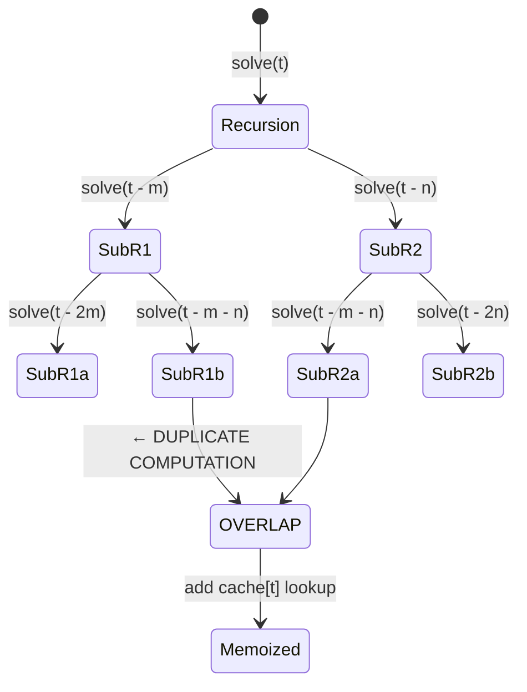

### Memoization Cache Layout

```mermaid
block-bitcoin
  columns 1
  block:cache["memo[] array — indexed by remaining time"]
    c0["memo[0] = SOLVED (base case: 0 minutes = achievable)"]
    c1["memo[1] = UNSOLVABLE"]
    c2["memo[2] = ..."]
    ct["memo[t] = -1 (uncomputed)\n→ compute → store result\n→ return cached on repeat visit"]
  end
```

**Key insight**: Each subproblem `solve(t)` computed exactly once. Total work: O(t) not O(2^t).

### Bottom-Up DP: Eliminating Recursion Entirely

Bottom-up DP fills the table iteratively, avoiding call stack overhead:

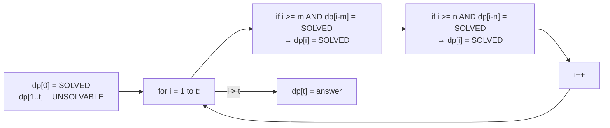

**Access pattern**: strictly left-to-right through the array. Cache-friendly — every access hits L1/L2 cache in sequence.

### Space Optimization: Rolling Window

For problems where only the last k values matter:

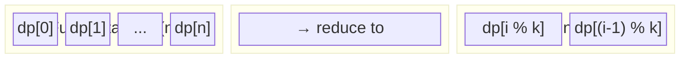

The "Hockey Rivalry" problem demonstrates this: tracking only 2-3 prior states instead of the full sequence.

---

## 4. BFS Internals: Queue State Machine and Level Ordering

### BFS Queue as FIFO Level-Order Traverser

For the "Knight Chase" problem (chess knight on a board), BFS guarantees the **minimum number of moves** because it explores nodes by increasing distance from the source.

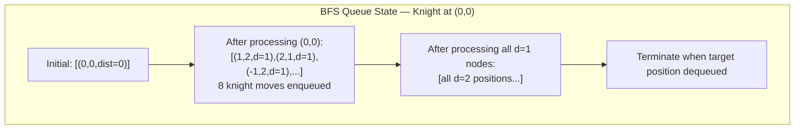

### Memory Layout of BFS Queue

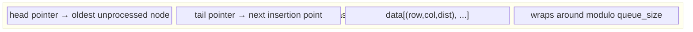

**Why BFS not DFS for shortest path (unweighted)**:

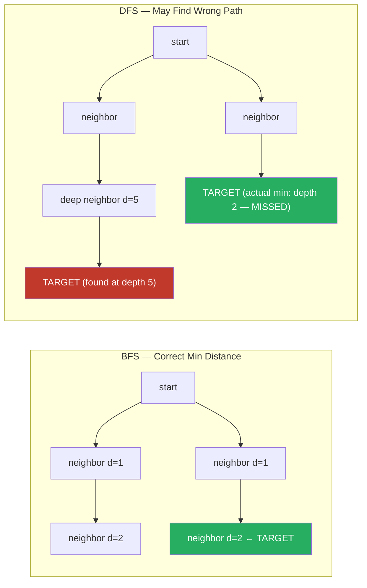

### BFS State Visited Array

Critical invariant: each node must be processed **at most once**. The `visited[row][col]` array prevents re-enqueueing:

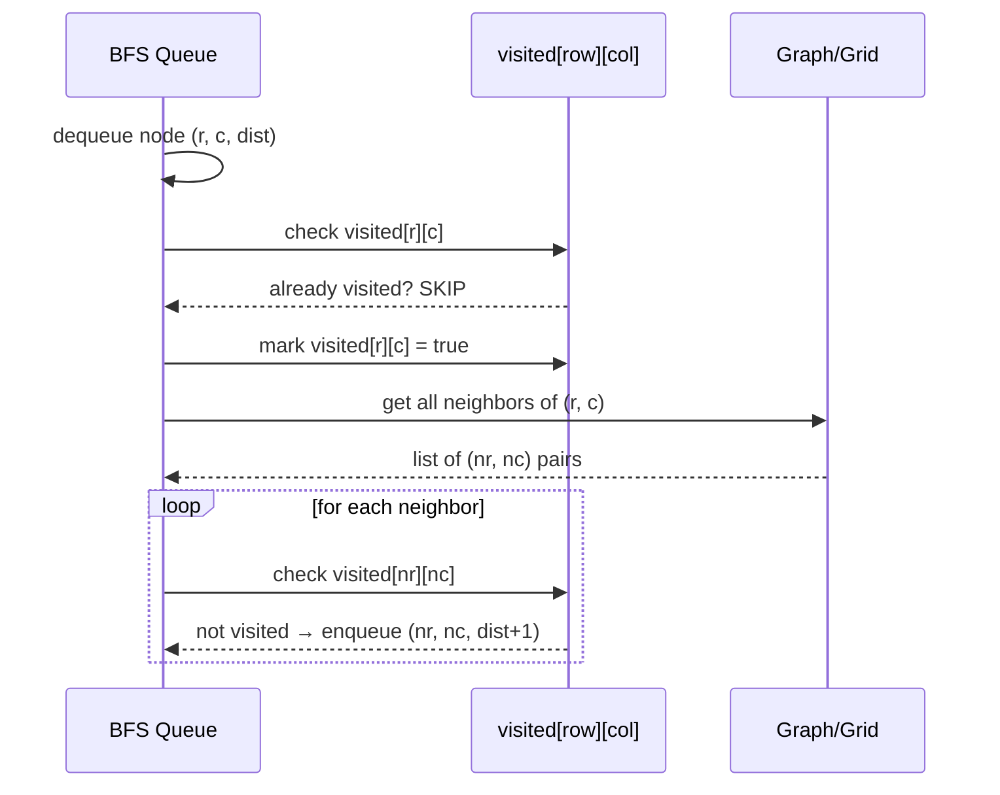

**Space**: O(V) for visited array + O(V) for queue = O(V) total, where V = number of vertices.

---

## 5. Dijkstra's Algorithm: Priority Queue Mechanics

### Min-Heap as Priority Queue

For weighted shortest paths (the "Mice Maze" problem), BFS's simple queue is replaced by a **min-heap** — always extracting the unvisited node with smallest known distance.

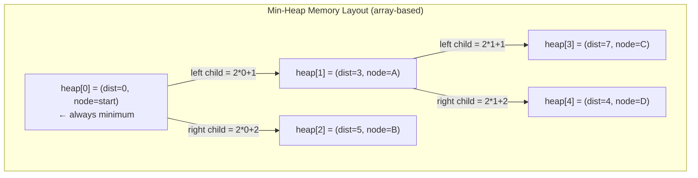

**Heap parent-child indexing (0-based)**:
- Parent of node i: `(i-1)/2`
- Left child of node i: `2*i+1`
- Right child of node i: `2*i+2`

### Sift-Up and Sift-Down Operations

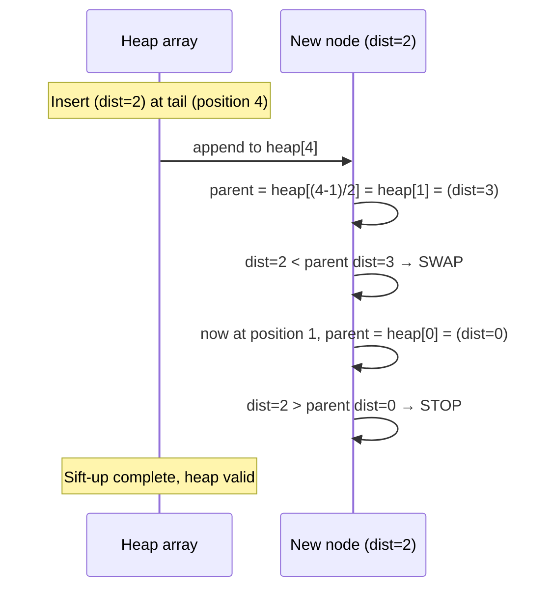

**Extract-min (used in Dijkstra)**:
1. Swap root (min) with last element
2. Remove last element (was root, now returned)
3. Sift-down: push new root down until heap property restored

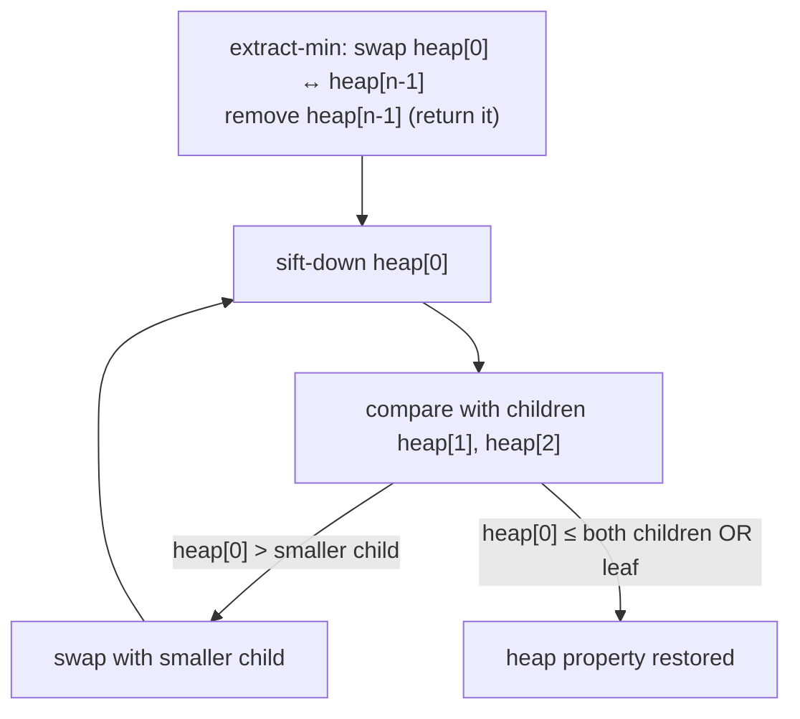

### Dijkstra's Algorithm State Machine

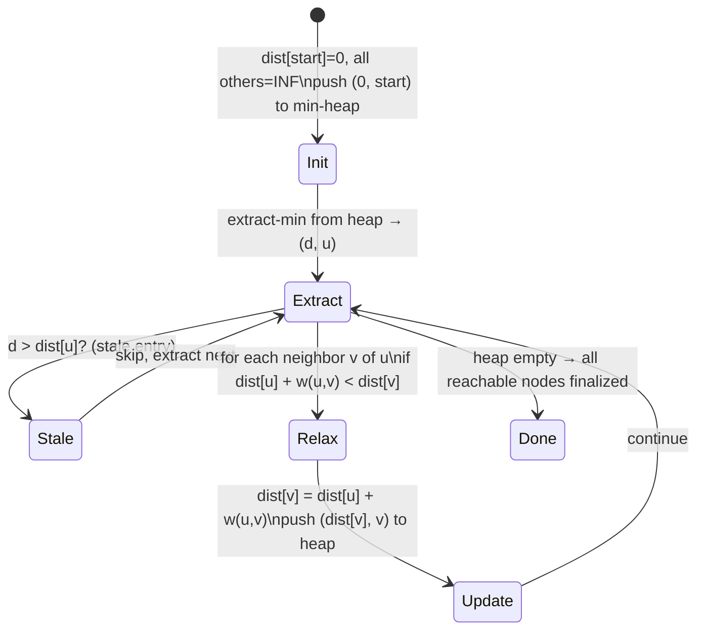

**Time complexity**: O((V + E) log V) with binary heap.  
**Space**: O(V) for dist[] + O(V+E) for heap entries (can have duplicates) = O(V+E).

---

## 6. Binary Search on Answer Space

### The Key Insight: Search Value, Not Index

Classical binary search finds a value in a sorted array. The book extends this to **searching the answer space** — binary searching over *possible answers* and testing feasibility.

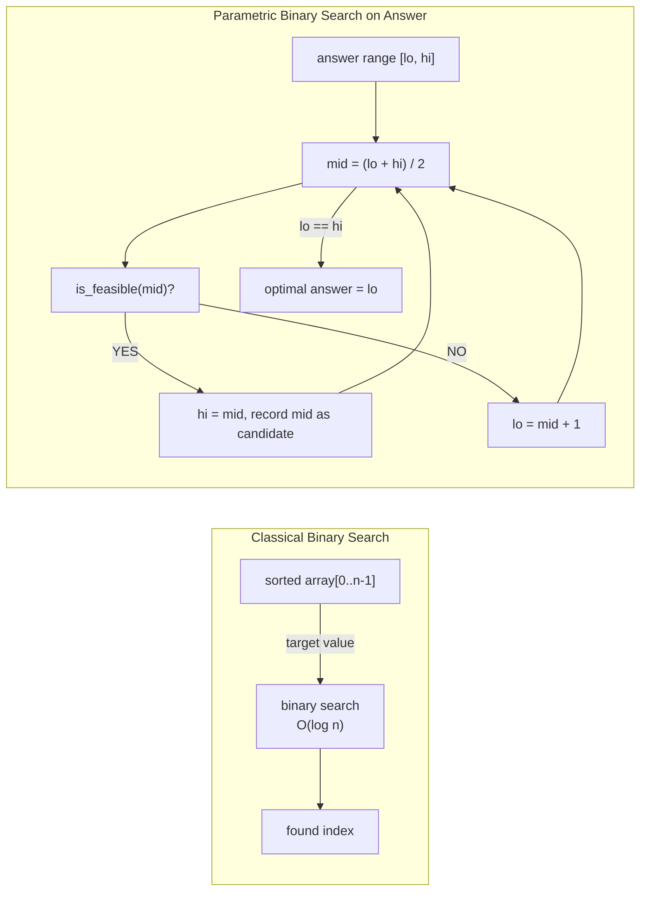

**For the "River Jump" problem** (find minimum jump distance d such that a frog can cross removing ≤ k stones):

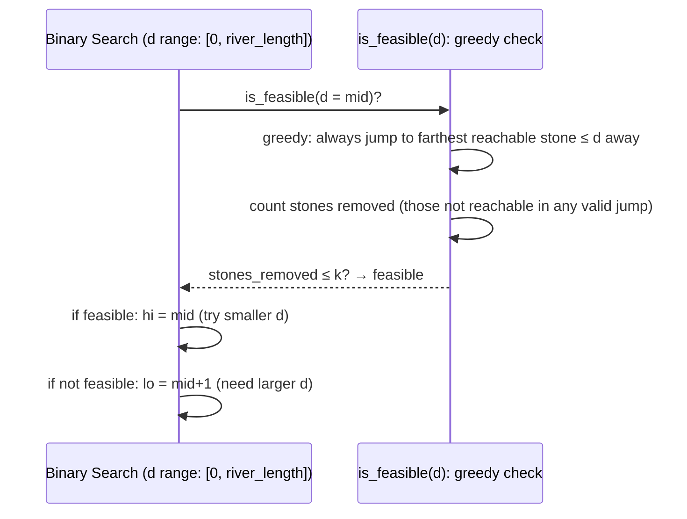

---

## 7. Heap and Segment Tree: Range Query Mechanics

### Max-Heap Insertion: Sift-Up Path

```mermaid
flowchart TD
    subgraph Before["Max-Heap before insert(15)"]
        r["20"]
        l1["17"] 
        r1["10"]
        l2["15 ← inserted here initially"] 
        r2["12"]
    end
    
    subgraph After["After sift-up"]
        r2_["20"]
        l1_["17"]
        r1_["15 ← moved up"]
        l2_["10 ← pushed down"]
        r2_2["12"]
    end
```

### Segment Tree: Internal Nodes as Aggregate Values

A segment tree stores precomputed aggregates (max, min, sum) for array ranges, enabling O(log n) range queries.

```mermaid
block-beta
  columns 7
  space
  space
  space
  n1["max(0..7)=15\n[node 1]"]
  space
  space
  space
  space
  n2["max(0..3)=12\n[node 2]"]
  space
  n3["max(4..7)=15\n[node 3]"]
  space
  space
  n4["max(0..1)=10\n[node 4]"]
  space
  n5["max(2..3)=12\n[node 5]"]
  space
  n6["max(4..5)=15\n[node 6]"]
  space
  n7["max(6..7)=8\n[node 7]"]
  n8["a[0]=7"]
  n9["a[1]=10"]
  n10["a[2]=9"]
  n11["a[3]=12"]
  n12["a[4]=15"]
  n13["a[5]=3"]
  n14["a[6]=8"]
  n15["a[7]=1"]
```

**Array representation of segment tree** (1-indexed):
- Root: index 1
- Left child of node i: `2*i`
- Right child of node i: `2*i+1`
- Array of size: `4 * n` (safe upper bound for n-element input)

### Range Query: Recursive Decomposition

```mermaid
sequenceDiagram
    participant Q as query(node, seg_lo, seg_hi, query_lo, query_hi)
    participant L as query(left_child, ...)
    participant R as query(right_child, ...)
    
    Q->>Q: if [seg_lo..seg_hi] outside [query_lo..query_hi] → return -INF
    Q->>Q: if [seg_lo..seg_hi] inside [query_lo..query_hi] → return node.max
    
    Note over Q: partial overlap: recurse both children
    Q->>L: query(2*node, seg_lo, mid, query_lo, query_hi)
    Q->>R: query(2*node+1, mid+1, seg_hi, query_lo, query_hi)
    L-->>Q: left_max
    R-->>Q: right_max
    Q->>Q: return max(left_max, right_max)
```

**Time**: O(log n) per query — at most 4 nodes at each level of the tree are "partially overlapping."

---

## 8. Union-Find: Path Compression and Union by Size

### Naive Union-Find vs Optimized

```mermaid
flowchart TD
    subgraph Naive["Naive Union-Find — O(n) find"]
        parent1["parent[] = [0,1,2,3,4]\n(each node points to itself initially)"]
        union1["union(0,1): parent[1] = 0"]
        union2["union(1,2): parent[2] = 1"]
        union3["union(2,3): parent[3] = 2"]
        find1["find(3): 3→2→1→0\nchain traversal O(n)"]
    end
    
    subgraph Optimized["Optimized — Path Compression + Union by Size"]
        parent2["After find(3) with path compression:\nparent[3]=0, parent[2]=0\n(all point directly to root)"]
        next_find["Next find(3): 3→0 O(1)"]
    end
    
    Naive --> Optimized
```

### Union by Size: Tree Height Control

```mermaid
flowchart LR
    subgraph NaiveUnion["Naive Union — can create deep trees"]
        a1["A (size=1)"] -->|"union(B, A)\n→ A.parent = B"| b1["B (size=1)"]
        b1 -->|"union(C, B)\n→ B.parent = C"| c1["C (size=1)"]
        c1 --> chain["chain of depth n"]
    end
    
    subgraph SizeUnion["Union by Size — always attach smaller under larger"]
        root_["root (size=4)"]
        child1["child1 (size=2)"]
        child2["child2 (size=1)"]
        child3["child3 (size=1)"]
        root_ --> child1
        root_ --> child2
        child1 --> child3
        height["max height = O(log n)"]
    end
```

### Path Compression Implementation

```mermaid
sequenceDiagram
    participant App as find(x=5)
    participant N5 as node 5 (parent=3)
    participant N3 as node 3 (parent=1)
    participant N1 as node 1 (parent=0)
    participant N0 as node 0 (root, parent=0)
    
    App->>N5: find(5)
    N5->>N3: find(parent[5]=3)
    N3->>N1: find(parent[3]=1)
    N1->>N0: find(parent[1]=0)
    N0-->>N1: return 0 (root)
    N1-->>N1: parent[1] = 0 ✓ (already)
    N1-->>N3: return 0
    N3-->>N3: parent[3] = 0 ← path compressed!
    N3-->>N5: return 0
    N5-->>N5: parent[5] = 0 ← path compressed!
    N5-->>App: return 0
    
    Note over App: next find(5) → O(1), find(3) → O(1)
```

**Combined complexity with both optimizations**:
- Amortized O(α(n)) per operation where α = inverse Ackermann function
- Practically O(1) — α(n) ≤ 4 for any realistic n (up to 2^65536)

### Union-Find for "Friends and Enemies" (Bipartite-Aware)

The book extends union-find with an "enemy" pointer per node — each node i has a virtual "enemy node" i+n. Friends are unified in the same component; enemies are unified across the boundary.

```mermaid
flowchart TD
    subgraph UF["Union-Find with 2n nodes (n friends + n enemies)"]
        f0["node 0 (friend)"] 
        f1["node 1 (friend)"]
        f2["node 2 (friend)"]
        e0["node n+0 (enemy of 0)"]
        e1["node n+1 (enemy of 1)"]
        e2["node n+2 (enemy of 2)"]
        
        f0 --- e1
        f1 --- e0
        f0 --- f1
    end
    
    note1["set_friends(0,1): union(0,1) AND union(n+0, n+1)"]
    note2["set_enemies(0,2): union(0, n+2) AND union(n+0, 2)"]
    note3["are_friends(0,1): find(0) == find(1)?"]
    note4["are_enemies(0,2): find(0) == find(n+2)?"]
```

---

## 9. Algorithm Selection Decision Map

```mermaid
flowchart TD
    problem["Problem Type?"] --> search{"Is graph unweighted?\nFind min steps?"}
    search -->|YES| bfs["BFS\nQueue-based\nO(V+E)"]
    search -->|NO| weighted{"Weighted graph\nmin path?"}
    weighted -->|YES| dijkstra["Dijkstra\nMin-heap\nO((V+E) log V)"]
    weighted -->|"negative weights"| bellman["Bellman-Ford\nO(VE)"]
    
    problem --> dup{"Duplicate/membership\ncheck?"}
    dup --> hash["Hash Table\nO(1) avg lookup\nO(n) space"]
    
    problem --> opt{"Optimal substructure?\nOverlapping subproblems?"}
    opt -->|YES| dp["Dynamic Programming\nBottom-up table\nO(states * transitions)"]
    
    problem --> range{"Range min/max query\non array?"}
    range --> seg["Segment Tree\nO(n) build\nO(log n) query/update"]
    
    problem --> connect{"Connectivity\nqueries?"}
    connect --> uf["Union-Find\nO(α(n)) per op\nnearly O(1)"]
    
    problem --> answer_range{"Monotone feasibility\nfunction?"}
    answer_range --> binary["Binary Search on Answer\nO(log(range) * feasibility_check)"]
```

---

## 10. Summary: Data Structure Space-Time Tradeoffs

| Data Structure | Query | Insert | Delete | Space | Best For |
|---------------|-------|--------|--------|-------|---------|
| Hash Table | O(1) avg | O(1) avg | O(1) avg | O(n) | Exact lookup, dedup |
| BFS Queue | O(V+E) | O(1) | O(1) | O(V) | Min hops, unweighted |
| Min-Heap | O(1) peek | O(log n) | O(log n) | O(n) | Priority scheduling |
| Segment Tree | O(log n) | O(log n) | O(log n) | O(n) | Range max/min/sum |
| Union-Find | O(α(n)) | O(α(n)) | N/A | O(n) | Connectivity, grouping |
| DP table | O(1) after build | O(states) build | N/A | O(states) | Optimal substructure |
| Binary Search | O(log n) | N/A | N/A | O(1) | Sorted/monotone spaces |

**Key insight from Zingaro's approach**: The data structure choice is the algorithm. The "Unique Snowflakes" problem is trivially O(n) with a hash table but O(n²) without it. The knight chess problem is trivially solvable with BFS but intractable with brute force recursion. Every competitive programming problem has a canonical data structure that unlocks the efficient solution — recognizing that pattern is the meta-skill the book teaches.
