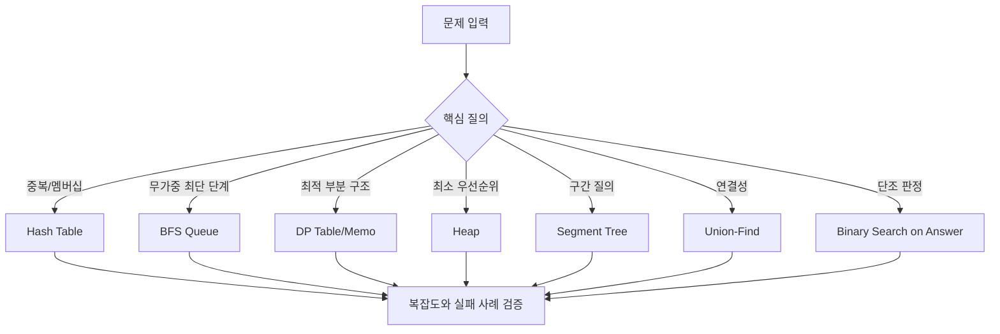
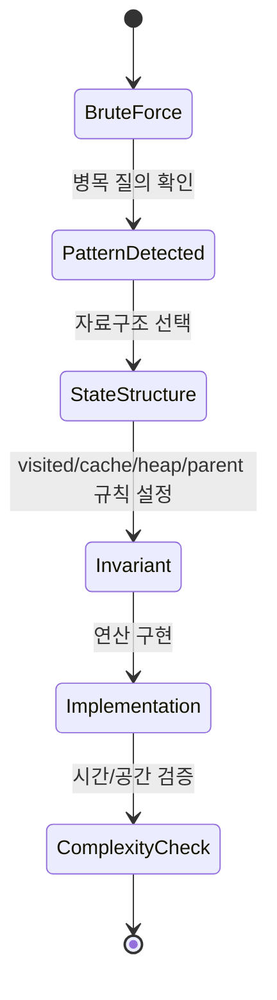

# Algorithmic Thinking 내부 메커니즘 학습 및 기록 노트

## 1. 왜 필요한가? (Pain Point & Motivation)

Daniel Zingaro의 Algorithmic Thinking은 문제 풀이에서 자료구조 선택이 곧 알고리즘 선택이라는 점을 반복해서 보여준다. 같은 중복 탐지 문제도 배열로 모든 쌍을 비교하면 `O(n^2)`이고, 해시 테이블을 쓰면 평균 `O(n)`이 된다. 같은 최단 이동 문제도 DFS로 깊게 파고들면 최소 거리를 보장하지 못하지만 BFS는 queue 순서 하나로 보장한다.

이 문서는 원문의 문제 기반 설명을 내부 상태, 메모리 구조, 전이 규칙 중심으로 재정리한다.

## 2. 현재 나의 상태 (Baseline)

- 해시 테이블, BFS, DP, heap, union-find, segment tree의 이름과 기본 복잡도는 알고 있다.
- 문제를 봤을 때 어떤 자료구조가 병목을 없애는지 바로 떠올리지 못할 때가 있다.
- 재귀 풀이와 memoization, bottom-up DP의 메모리 차이를 명확히 구분해야 한다.
- binary search on answer처럼 "값이 아니라 답 공간을 탐색"하는 패턴이 아직 익숙하지 않다.
- segment tree와 union-find는 구현은 가능하지만 어떤 invariant를 지키는지 설명이 부족하다.

## 3. 도달하고 싶은 목표 (Target State)

- 문제 조건에서 필요한 자료구조를 먼저 추론한다.
- 해시 충돌, BFS queue, DP cache, heap sift, union-find compression의 내부 상태를 설명한다.
- brute force가 왜 느린지 복잡도뿐 아니라 실제 반복/메모리 접근 관점으로 설명한다.
- monotone feasibility가 보이면 binary search on answer를 떠올린다.
- range query, connectivity query, shortest path, duplicate detection을 각각 대표 자료구조로 연결한다.

## 4. 시스템 번역 (Data Flow)



문제 해결 data flow는 먼저 질의 형태를 고르고, 그 질의가 빠르게 수행되도록 상태 구조를 바꾸는 방식으로 진행된다.

## 5. 핵심 구성요소 (Building Blocks)

| 구성요소 | 내부 상태 | 언제 쓰는가 |
| --- | --- | --- |
| Hash table | bucket array와 collision chain/probe | 중복 탐지, membership, key-value lookup |
| Recursion stack | 호출 프레임과 반환 주소 | tree traversal, divide and conquer |
| Memoization | subproblem key -> result cache | 중복 부분 문제가 반복될 때 |
| Bottom-up DP | 순서대로 채우는 table | 재귀 stack 없이 상태를 누적할 때 |
| BFS queue | FIFO frontier와 visited 배열 | unweighted shortest path, level order |
| Min-heap | 배열 기반 priority queue | weighted shortest path, scheduling |
| Segment tree | 구간 aggregate를 담은 완전 이진 트리 | range min/max/sum query/update |
| Union-Find | parent/size 배열 | dynamic connectivity, grouping |
| Binary search on answer | 답 후보 범위와 feasibility check | 판정 함수가 단조일 때 |

## 6. 상태 전이 (State Transition)



Zingaro식 문제 풀이는 "코드를 먼저 쓰기"보다 "어떤 상태를 저장하면 비싼 반복이 사라지는가"를 먼저 찾는 절차에 가깝다.

## 7. 불변식 (Invariant: 절대 깨지면 안 되는 규칙)

- 해시 테이블은 같은 key가 항상 같은 bucket/probe sequence로 찾아져야 한다.
- BFS는 vertex를 처음 발견한 거리가 최단 거리여야 하며, 중복 enqueue를 막아야 한다.
- DP table은 참조하는 이전 상태가 이미 계산되어 있어야 한다.
- Heap은 부모 priority가 자식 priority보다 항상 작거나 같아야 한다.
- Segment tree의 각 node 값은 자신이 담당하는 구간의 aggregate와 일치해야 한다.
- Union-Find의 root는 자기 자신을 parent로 가져야 하며, path compression 후에도 component membership이 변하면 안 된다.
- Binary search on answer의 feasibility 함수는 단조성을 가져야 한다.

## 8. 가장 작은 예제 (Minimal Viable Example)

```python
from collections import deque


def shortest_steps(grid, start, target):
    rows, cols = len(grid), len(grid[0])
    queue = deque([(start[0], start[1], 0)])
    visited = {start}

    while queue:
        row, col, dist = queue.popleft()
        if (row, col) == target:
            return dist

        for dr, dc in ((1, 0), (-1, 0), (0, 1), (0, -1)):
            nr, nc = row + dr, col + dc
            inside = 0 <= nr < rows and 0 <= nc < cols
            if inside and grid[nr][nc] != "#" and (nr, nc) not in visited:
                visited.add((nr, nc))
                queue.append((nr, nc, dist + 1))

    return -1
```

이 예제는 BFS의 핵심 invariant를 보여준다. queue는 거리 순서를 보장하고, `visited`는 같은 칸이 여러 번 처리되는 일을 막는다.

## 9. 실패 사례 (What could go wrong?)

- 중복 탐지를 이중 반복으로 풀면 `n=100,000`에서 비교 횟수가 현실적으로 감당되지 않는다.
- BFS에서 dequeue 시점까지 `visited` 표시를 미루면 같은 vertex가 여러 번 queue에 들어가 메모리가 폭증할 수 있다.
- DP에서 아직 계산되지 않은 상태를 읽으면 recurrence는 맞아도 구현 결과가 틀린다.
- Dijkstra에서 min-heap 대신 일반 queue를 쓰면 weighted shortest path의 greedy 선택이 깨진다.
- Segment tree update 후 ancestor node를 갱신하지 않으면 이후 query가 오래된 값을 반환한다.
- Binary search on answer에 단조성이 없는 판정 함수를 넣으면 수렴해도 답이 보장되지 않는다.

## 10. 뇌 확장하기 (Evolution & Variants)

- Hash table은 separate chaining, linear probing, double hashing, resizing policy로 확장된다.
- BFS는 multi-source BFS, 0-1 BFS, bidirectional BFS로 변형할 수 있다.
- DP는 memoization, bottom-up table, rolling array, bitmask DP로 확장된다.
- Heap은 Dijkstra, Prim, event simulation, top-k selection의 공통 기반이다.
- Segment tree는 lazy propagation, Fenwick tree, sparse table과 비교해 선택한다.
- Union-Find는 bipartite constraint, parity, rollback DSU로 확장된다.
- Binary search on answer는 greedy feasibility와 결합될 때 가장 자주 등장한다.

## 11. 최종 체크리스트 (Definition of Done)

- [x] Zingaro 원문의 핵심 주제를 자료구조 선택 기준으로 재정리했다.
- [x] 해시, BFS, DP, heap, segment tree, union-find의 상태와 invariant를 분리했다.
- [x] BFS 최소 예제로 queue와 visited의 역할을 검증했다.
- [x] binary search on answer의 단조성 전제를 명시했다.
- [x] 실패 사례를 통해 잘못된 자료구조 선택의 비용을 정리했다.

## 12. 뇌에 새기는 복습 문장 (TL;DR Blank)

문제 풀이에서 자료구조 선택은 구현 세부사항이 아니라 알고리즘 그 자체다. 비싼 반복을 없애는 상태를 찾으면 복잡도가 바뀐다.
