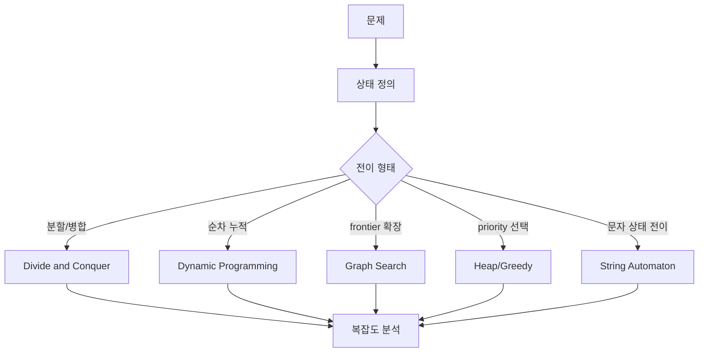
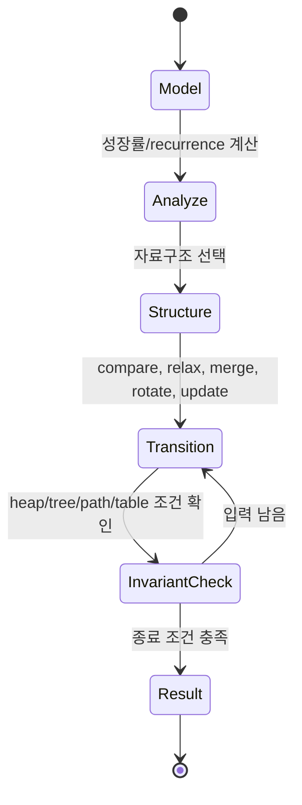

# Algorithms 내부 동작 학습 및 기록 노트

## 1. 왜 필요한가? (Pain Point & Motivation)

CLRS와 Sedgewick 계열 알고리즘 문서는 정리와 구현이 많아 보이지만, 실제로는 반복되는 몇 가지 내부 메커니즘을 다룬다. 점근 분석은 성장률을 추상화하고, 정렬은 비교와 메모리 이동을 제어하며, 그래프 알고리즘은 frontier와 relaxation 상태를 갱신한다. DP는 subproblem DAG를 table로 바꾸고, 문자열 알고리즘은 실패 함수로 되돌아가기를 줄인다.

이 문서는 원문의 광범위한 알고리즘 내부 구조를 하나의 학습 노트로 압축해, 각 알고리즘을 상태와 불변식 기준으로 다시 읽기 위한 기준을 만든다.

## 2. 현재 나의 상태 (Baseline)

- Big-O, merge sort, quicksort, heap, BFS, DFS, Dijkstra 같은 이름은 익숙하다.
- Master theorem과 amortized analysis는 식은 알지만 어떤 자료구조 상태를 설명하는지 연결이 약하다.
- red-black tree, B-tree, Fibonacci heap은 복잡도를 기억하지만 내부 invariant와 연산 비용이 흐릿하다.
- DP와 graph algorithm을 별도 단원처럼 보고, 둘 다 "상태 전이"라는 공통 모델로 연결하지 못한다.
- KMP의 failure function이 왜 text pointer를 되돌리지 않게 하는지 다시 정리해야 한다.

## 3. 도달하고 싶은 목표 (Target State)

- 알고리즘을 입력, 상태, 전이, 불변식, 종료 조건으로 분해한다.
- 점근 표기와 recurrence가 실제 loop, recursion, heap operation을 어떻게 요약하는지 설명한다.
- 정렬 알고리즘의 시간 복잡도뿐 아니라 auxiliary memory, stability, cache behavior를 함께 본다.
- graph algorithm에서 queue, stack, priority queue, Union-Find가 각각 어떤 frontier 상태를 표현하는지 구분한다.
- DP table과 string automaton을 모두 "중복 계산을 제거하는 상태 저장"으로 이해한다.

## 4. 시스템 번역 (Data Flow)



알고리즘 내부에서 실제로 이동하는 것은 입력 전체가 아니라 현재 상태다. 상태가 작고 전이가 안전할수록 빠르고 증명 가능한 알고리즘이 된다.

## 5. 핵심 구성요소 (Building Blocks)

| 구성요소 | 내부 상태 | 핵심 질문 |
| --- | --- | --- |
| Asymptotic analysis | `n`에 따른 자원 증가 함수 | 입력이 커질 때 지배항은 무엇인가? |
| Recurrence | 재귀 subproblem과 combine cost | subproblem이 지배하는가, combine이 지배하는가? |
| Merge sort | 분할된 sorted run과 auxiliary array | 안정성과 `O(n log n)`을 어떻게 보장하는가? |
| Quicksort | pivot 기준 partition boundary | pivot 선택이 균형을 유지하는가? |
| Heap | complete tree를 담은 array | parent-child order가 유지되는가? |
| Red-black tree | color와 black-height | search path가 `O(log n)`으로 묶이는가? |
| Hash table | bucket/probe state | load factor가 lookup 비용을 망치지 않는가? |
| DP table | subproblem result cache | 필요한 이전 상태가 이미 계산됐는가? |
| BFS/DFS | queue/stack frontier | 방문 순서가 요구하는 성질을 보장하는가? |
| Dijkstra/Bellman-Ford | distance array와 relaxation | 간선 가중치 전제가 맞는가? |
| KMP | failure function 또는 DFA state | mismatch 후 어디서 재시작해야 하는가? |

## 6. 상태 전이 (State Transition)



merge sort의 전이는 sorted run을 합치는 것이고, Dijkstra의 전이는 relaxation이며, KMP의 전이는 DFA state 이동이다. 이름은 다르지만 모두 invariant를 유지하면서 상태를 전진시킨다.

## 7. 불변식 (Invariant: 절대 깨지면 안 되는 규칙)

- 점근 분석은 상수보다 성장률을 비교하되, 입력 모델과 worst/average/best case를 섞지 않는다.
- Merge sort의 merge 단계는 두 입력 run이 이미 정렬되어 있다는 전제가 있어야 한다.
- Quicksort partition 후 pivot 왼쪽과 오른쪽의 비교 조건이 깨지면 재귀 정렬도 틀린다.
- Heap에서는 모든 parent가 child보다 우선순위가 높거나 같아야 한다.
- Red-black tree는 root black, red-red 금지, 모든 root-to-leaf black-height 동일 조건을 유지해야 한다.
- BFS는 거리 증가 순서로 vertex를 처리해야 unweighted shortest path가 보장된다.
- Dijkstra는 음수 간선이 없을 때 extract-min vertex의 거리가 확정된다.
- DP는 recurrence가 참조하는 상태를 올바른 순서로 채워야 한다.
- KMP의 failure function은 이미 일치한 prefix/suffix 정보를 보존해야 한다.

## 8. 가장 작은 예제 (Minimal Viable Example)

```python
def kmp_table(pattern):
    fail = [0] * len(pattern)
    j = 0
    for i in range(1, len(pattern)):
        while j > 0 and pattern[i] != pattern[j]:
            j = fail[j - 1]
        if pattern[i] == pattern[j]:
            j += 1
            fail[i] = j
    return fail


def kmp_search(text, pattern):
    fail = kmp_table(pattern)
    j = 0
    for i, char in enumerate(text):
        while j > 0 and char != pattern[j]:
            j = fail[j - 1]
        if char == pattern[j]:
            j += 1
            if j == len(pattern):
                return i - len(pattern) + 1
    return -1
```

KMP의 최소 예제는 "실패했을 때 처음부터 다시 보지 않는다"는 알고리즘 내부 메커니즘을 보여준다. `fail` table은 이미 본 prefix/suffix 상태를 저장해 text pointer를 뒤로 돌리지 않는다.

## 9. 실패 사례 (What could go wrong?)

- Average case 복잡도를 worst case 보장처럼 설명하면 quicksort, hash table 같은 알고리즘의 위험을 놓친다.
- Merge sort에서 auxiliary array 관리를 잘못하면 안정성이 깨지거나 불필요한 `O(n log n)` extra allocation이 생긴다.
- Red-black tree rotation 후 color와 subtree size를 갱신하지 않으면 search는 되더라도 rank/select 같은 연산이 틀릴 수 있다.
- Dijkstra를 음수 간선 그래프에 적용하면 이미 확정했다고 믿은 vertex의 거리가 나중에 더 줄어들 수 있다.
- Bellman-Ford의 `|V|-1` relaxation 후 추가 pass를 하지 않으면 negative cycle 감지가 빠진다.
- DP table 순서를 잘못 잡으면 아직 계산되지 않은 상태를 읽어 잘못된 값이 전파된다.
- KMP failure function을 잘못 만들면 mismatch에서 무한 루프나 누락 match가 생긴다.

## 10. 뇌 확장하기 (Evolution & Variants)

- Sorting은 comparison lower bound, counting/radix sort 같은 non-comparison sort, stability 요구로 확장된다.
- Tree 구조는 BST, red-black tree, B-tree, trie, suffix tree처럼 접근 패턴과 저장 매체에 따라 달라진다.
- Graph search는 BFS/DFS에서 SCC, topological sort, MST, shortest path로 이어진다.
- Greedy 알고리즘은 cut property, exchange argument, matroid 같은 증명 도구로 확장된다.
- DP는 DAG shortest path, matrix chain, LCS, knapsack, Floyd-Warshall처럼 상태 차원이 늘어난다.
- Amortized analysis는 dynamic array, Fibonacci heap, splay tree 같은 자료구조의 실제 연산 sequence를 설명한다.

## 11. 최종 체크리스트 (Definition of Done)

- [x] CLRS/Sedgewick식 알고리즘 주제를 상태와 전이 중심으로 재구성했다.
- [x] 점근 분석, recurrence, amortized analysis의 역할을 분리했다.
- [x] 정렬, 트리, 해시, 그래프, DP, 문자열 알고리즘의 핵심 invariant를 정리했다.
- [x] KMP 최소 예제로 table 기반 상태 저장의 의미를 보였다.
- [x] 음수 간선, 평균 복잡도 오해, DP 순서 오류 같은 실패 사례를 포함했다.

## 12. 뇌에 새기는 복습 문장 (TL;DR Blank)

알고리즘은 이름 목록이 아니라 상태 전이 규칙이다. 좋은 분석은 어떤 상태를 저장하고 어떤 불변식을 유지해 반복 비용을 줄이는지 설명한다.
