# Algorithms: Under the Hood
> Sources: Cormen, Leiserson, Rivest, Stein — *Introduction to Algorithms (3rd Ed.)* · Sedgewick & Wayne — *Algorithms (4th Ed.)*

---

> **Reading contract:** This synthesis uses CLRS 3rd edition and Sedgewick & Wayne 4th edition. Names such as quicksort, Dijkstra, hash table, and counting sort refer to families of variants, so a bound is authoritative only after the pivot rule, graph assumptions, hash model, stability procedure, and machine model relevant to that bound are named. Mark proved bounds separately from implementation observations. A subsection is complete when it states preconditions, invariant, result, failure boundary, and source location; otherwise treat its conclusion as provisional.

## 1. Asymptotic Analysis: The Mathematical Foundation

Algorithm analysis abstracts away hardware constants to capture **growth rate** — the relationship between input size `n` and resource consumption as `n → ∞`.

### 1.1 The Asymptotic Notation Toolkit

```
Θ(g(n)) = { f(n) : ∃ c₁,c₂,n₀ > 0 such that c₁·g(n) ≤ f(n) ≤ c₂·g(n) ∀n ≥ n₀ }
O(g(n)) = { f(n) : ∃ c,n₀ > 0 such that f(n) ≤ c·g(n) ∀n ≥ n₀ }       (upper bound)
Ω(g(n)) = { f(n) : ∃ c,n₀ > 0 such that f(n) ≥ c·g(n) ∀n ≥ n₀ }       (lower bound)
o(g(n)) = { f(n) : ∀c > 0, ∃n₀ such that f(n) < c·g(n) ∀n ≥ n₀ }       (strict upper)
ω(g(n)) = { f(n) : ∀c > 0, ∃n₀ such that f(n) > c·g(n) ∀n ≥ n₀ }       (strict lower)
```

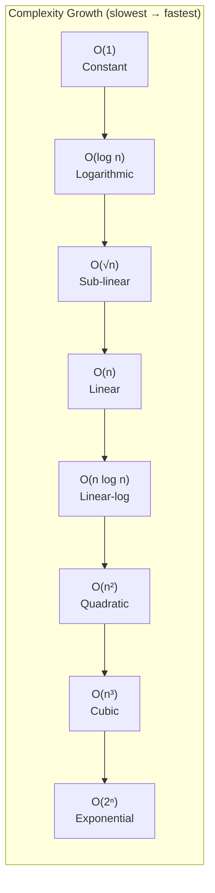

### 1.2 Recurrence Solving: The Master Theorem

Divide-and-conquer recurrences take form `T(n) = aT(n/b) + f(n)`:

```
Case 1: f(n) = O(n^(log_b a - ε))  →  T(n) = Θ(n^log_b a)          [subproblem dominates]
Case 2: f(n) = Θ(n^log_b a)        →  T(n) = Θ(n^log_b a · log n)  [equal work]
Case 3: f(n) = Ω(n^(log_b a + ε))  →  T(n) = Θ(f(n))               [divide step dominates]
```

Merge sort: `T(n) = 2T(n/2) + Θ(n)` → `log_2 2 = 1`, `f(n) = Θ(n¹)` → Case 2 → `T(n) = Θ(n log n)`

---

## 2. Sorting Algorithms: Internal Mechanics

### 2.1 Merge Sort: Divide-and-Conquer Memory Flow

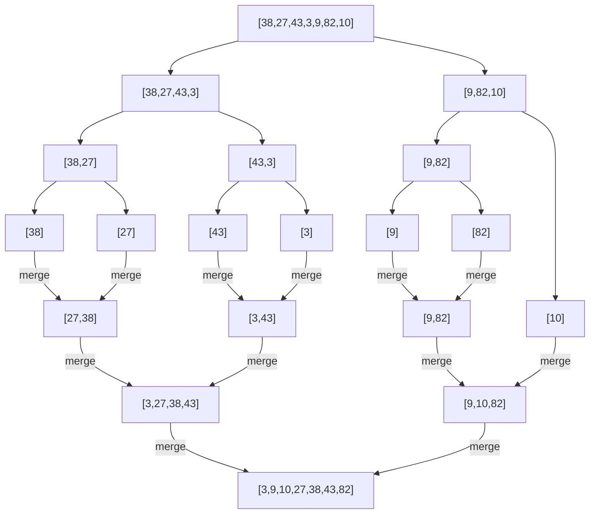

**Memory layout during merge**: merge requires O(n) auxiliary space. Two sorted subarrays `A[p..q]` and `A[q+1..r]` are copied into temp arrays `L[]` and `R[]`; then merged back into A with two-pointer comparison.

**Why n log n is the worst-case lower bound for deterministic comparison sorting**: In the decision-tree model, each distinguishable input permutation must reach a distinct leaf. With n! permutations and binary comparisons, height ≥ log₂(n!) = Θ(n log n) by Stirling's approximation. The claim does not apply to non-comparison methods with restricted key domains.

### 2.2 Quicksort: Partition Mechanics and Pivot Choice

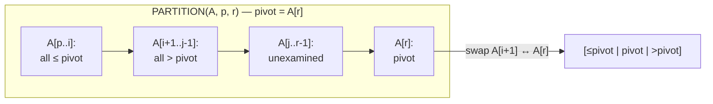

**Randomized Quicksort**: Choose random pivot → expected O(n log n). Probability that element `z_i` and `z_j` are compared = `2/(j-i+1)` (they're compared only when one is chosen as pivot before any intermediate element).

Expected comparisons = `Σᵢ Σⱼ>ᵢ 2/(j-i+1)` = `O(n log n)`

**Worst case O(n²)**: Already-sorted input with always-last pivot → T(n) = T(n-1) + Θ(n)

**3-way partition (Dutch National Flag)** for arrays with duplicates:

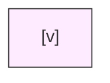

Scan element by element: if `< v`, swap with first `==v`; if `> v`, swap with last unclassified. O(n) passes, O(1) space.

### 2.3 Heapsort: Max-Heap as Internal Sorting Engine

The max-heap invariant: `A[parent(i)] ≥ A[i]` for all `i`.

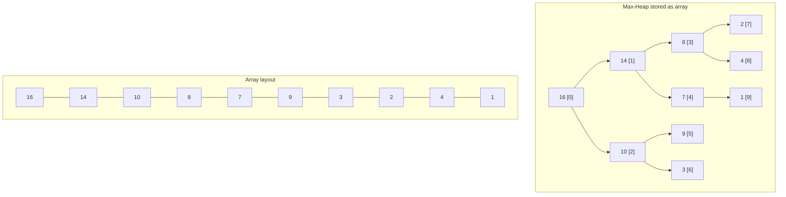

**MAX-HEAPIFY** sinks a violated root by comparing with children and swapping down: `O(log n)` per call.  
**BUILD-MAX-HEAP**: Call MAX-HEAPIFY on `A[⌊n/2⌋..1]` bottom-up → `O(n)` total (not O(n log n) — most nodes at height 0).  
**HEAPSORT**: Extract max `n` times → each extraction costs `O(log n)` → total `O(n log n)`, in-place, worst-case optimal.

### 2.4 Counting Sort and Radix Sort: Beyond Comparison

**Counting sort** works on integer keys in range `[0..k]`:
1. Count occurrences into `C[0..k]`
2. Compute prefix sums of C (cumulative positions)
3. Place each element A[j] at position `C[A[j]]-1` in output; decrement C[A[j]]

**Why prefix sums**: `C[v]` after prefix sum step = number of elements ≤ v = index of last occurrence of v in sorted output.

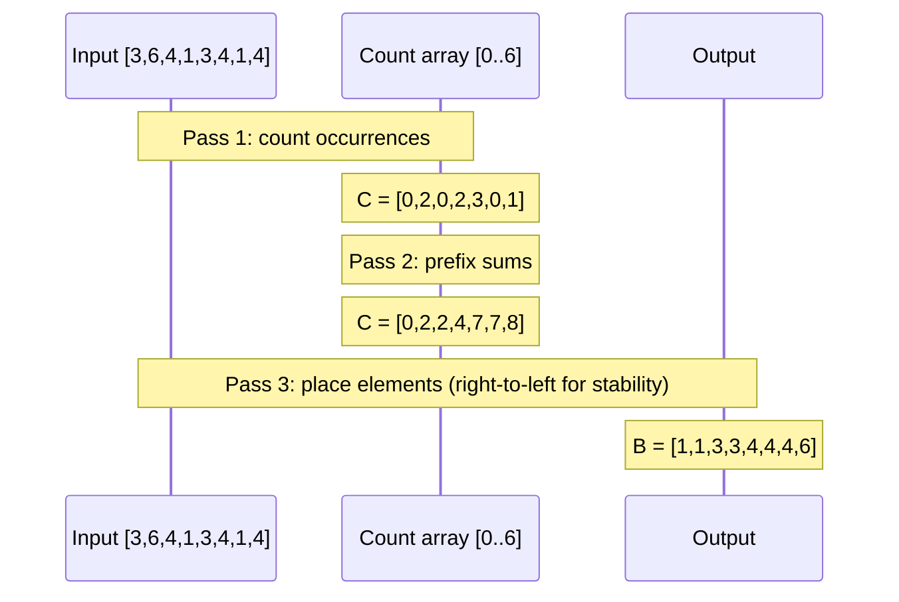

**Radix sort**: Sort by least-significant digit first using stable sort (counting sort) on each digit.  
Why LSD first? Because subsequent passes preserve relative order of equal-digit elements (stability). After d passes, elements sorted by d-digit key.

---

## 3. Data Structures: Memory Layout and Access Patterns

### 3.1 Red-Black Trees: Self-Balancing Invariants

Five properties maintained at all times:
1. Every node is RED or BLACK
2. Root is BLACK
3. Every leaf (NIL sentinel) is BLACK
4. RED node → both children are BLACK (no two reds in a row)
5. All paths from any node to descendant NIL nodes have same number of BLACK nodes (**black-height**)

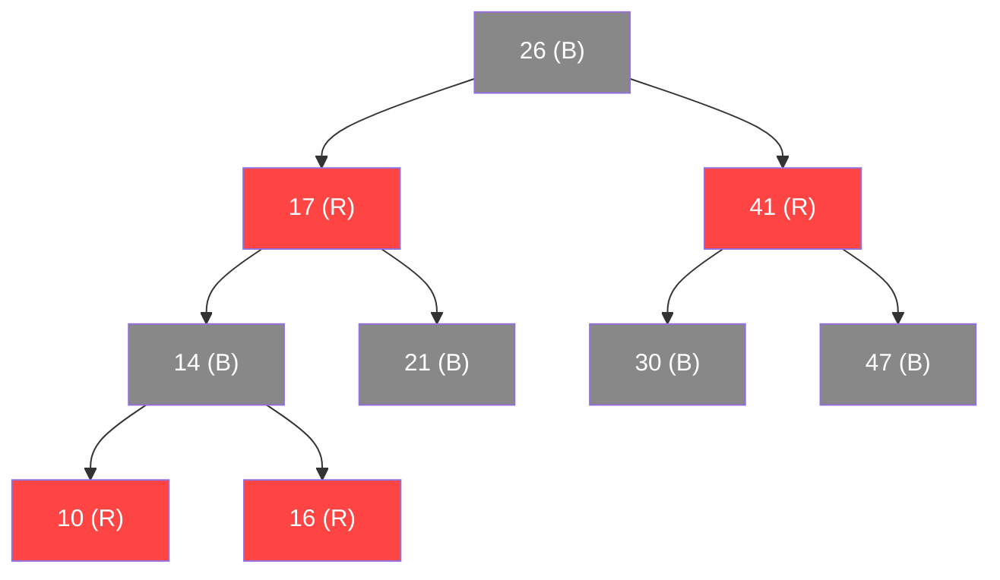

**Height bound**: With black-height `bh`, subtree at node x has ≥ 2^bh - 1 internal nodes. Since half of root-to-leaf path is black: `bh ≥ h/2`, so `n ≥ 2^(h/2) - 1` → `h ≤ 2 lg(n+1)`.

**Rotation mechanics** (core of insert/delete rebalancing):

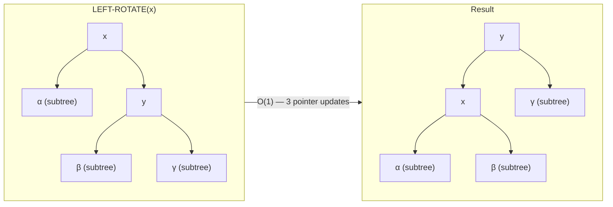

### 3.2 B-Trees: Disk-Optimized Tree Structure

B-trees minimize disk I/O by maximizing node fanout. Node of degree t stores `t-1` to `2t-1` keys; disk block fills one node.

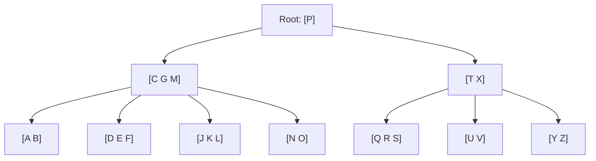

**Search complexity**: With `n` keys and the stated B-tree minimum-degree invariant, height h ≤ log_t((n+1)/2). The t=1000, n=10⁹ illustration assumes that definition of `t` and ignores implementation metadata. Non-root occupancy is bounded by the insertion/deletion algorithm; practical space efficiency still depends on page size, key width, and workload.

**Split on insert**: When inserting into a full node (2t-1 keys), split it into two nodes of t-1 keys each and push median up to parent. If root splits, tree height grows by 1 (only way height increases).

### 3.3 Hash Tables: Collision Resolution Internals

**Universal hashing**: Choose hash function h randomly from family H such that:
```
Pr[h(k) = h(l)] ≤ 1/m  for all distinct k, l
```

Simple multiply-shift family: `h(k) = ((ak mod 2^w) >> (w-r))` where `m = 2^r`, `w` = word size, `a` is odd.

**Open addressing — linear probing**:

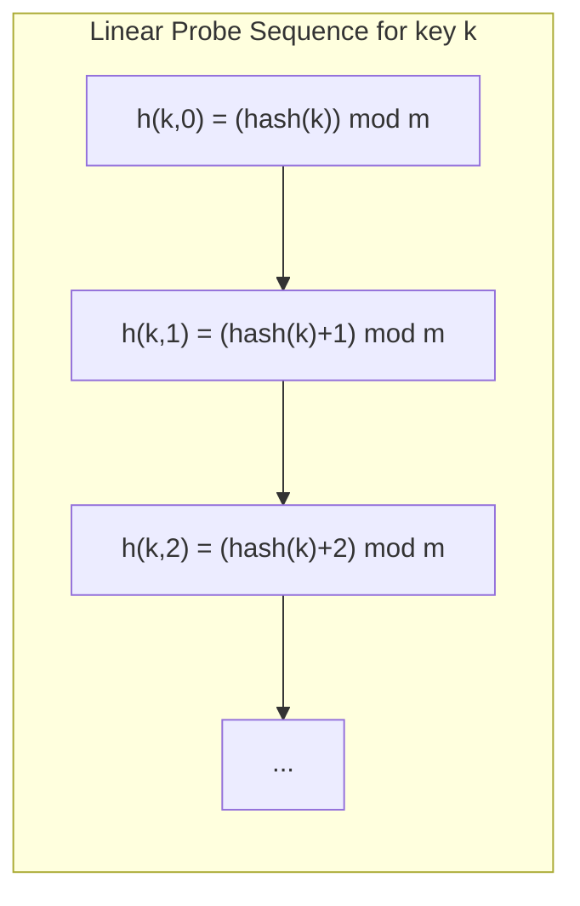

**Clustering problem**: Occupied positions tend to cluster. Load factor α = n/m. Expected probes for unsuccessful search = `1/(1-α)²`. At α=0.9, that's 100 probes — catastrophic.

**Double hashing** breaks clustering: `h(k,i) = (h₁(k) + i·h₂(k)) mod m`. The second hash ensures different probe sequences for different keys.

### 3.4 Fibonacci Heaps: Amortized O(1) Decrease-Key

Fibonacci heaps achieve the O(1) amortized decrease-key needed for optimal Dijkstra (O(V log V + E)).

**Structure**: Forest of min-heap-ordered trees. Roots linked in circular doubly-linked list.

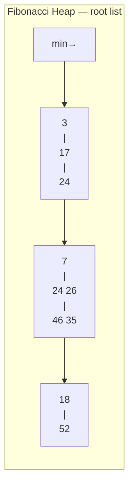

**Decrease-key mechanics**:
1. Reduce key of x
2. If x < parent: CUT x from tree, add to root list
3. CASCADING-CUT up the tree: if parent y already lost a child (mark=TRUE), cut y too; recurse

**Amortized analysis**: Let Φ = t(H) + 2·m(H) where t = #trees, m = #marked nodes.
- Decrease-key actual cost: O(c) where c = cascading cuts
- Potential change: -c + 2 (cut nodes unmark) = O(1) amortized

---

## 4. Dynamic Programming: Subproblem DAGs

### 4.1 The Two Prerequisites

**Optimal substructure**: Optimal solution contains optimal solutions to subproblems (provable by cut-and-paste contradiction).

**Overlapping subproblems**: Same subproblems recur multiple times (memoization saves work).

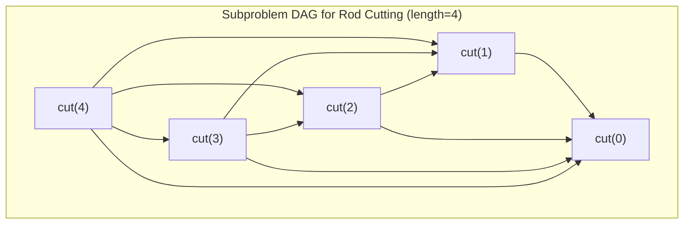

Bottom-up DP fills this DAG in topological order. Time = O(subproblems × choices per subproblem).

### 4.2 LCS: 2D Subproblem Table

Longest Common Subsequence of X[1..m] and Y[1..n]:

```
c[i,j] = 0                      if i=0 or j=0
         c[i-1,j-1] + 1         if X[i] = Y[j]
         max(c[i,j-1], c[i-1,j]) otherwise
```

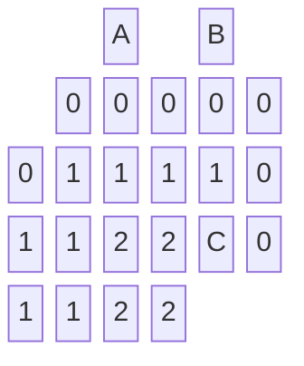

**Space optimization**: Only need current and previous row → O(min(m,n)) space.

### 4.3 Matrix Chain Multiplication

Order matters: `(A·B)·C` vs `A·(B·C)` can differ by orders of magnitude in flops.

```
m[i,j] = min over i≤k<j of { m[i,k] + m[k+1,j] + p_{i-1}·p_k·p_j }
```

Fill table in order of increasing chain length (diagonal-by-diagonal):

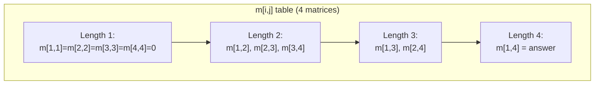

---

## 5. Graph Algorithms: BFS, DFS, and Their Applications

### 5.1 BFS: Layer-by-Layer Memory Model

```mermaid
sequenceDiagram
    participant Q as Queue
    participant V as Visited Set
    participant G as Graph

    Note over Q: Enqueue source s; color s = GRAY
    loop Until queue empty
        Q->>G: Dequeue u; examine neighbors
        G->>V: For each unvisited v:
        V->>Q: Enqueue v; color v = GRAY; π[v]=u; d[v]=d[u]+1
        Note over Q: Color u = BLACK (fully explored)
    end
```

**BFS tree = shortest path tree**: All paths from s to any reachable vertex v via `π` pointers = shortest path. Proven because BFS processes vertices in non-decreasing distance order.

**Time**: O(V + E) — each vertex enqueued/dequeued once; each edge examined at most twice (once from each endpoint in undirected; once from source in directed).

### 5.2 DFS: Stack Frames and Timestamps

DFS assigns discovery `d[v]` and finish `f[v]` timestamps to every vertex:

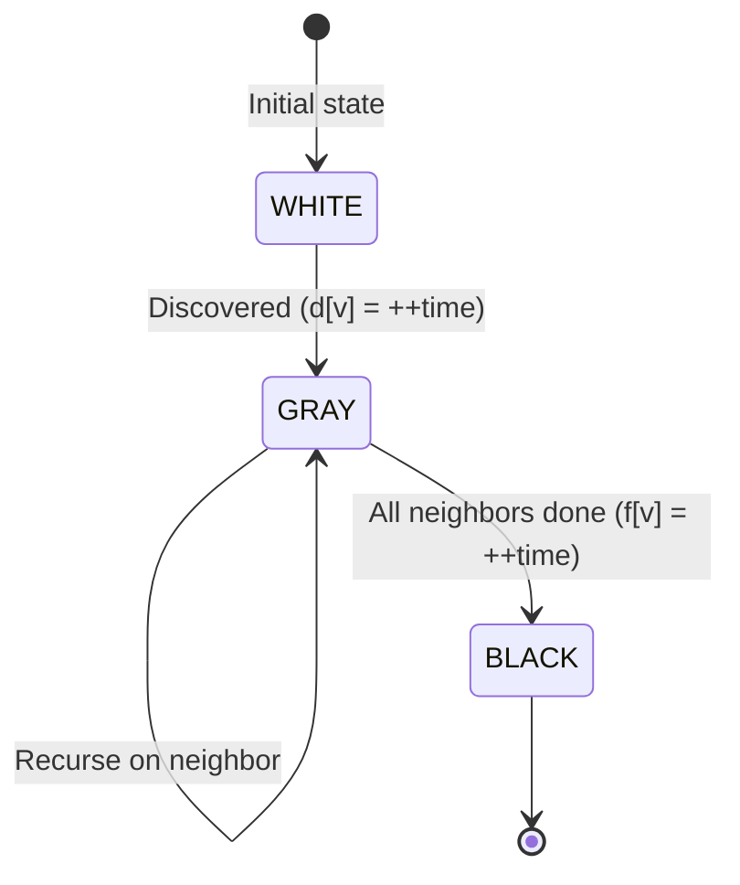

**Parenthesis theorem**: For any two vertices u, v, exactly one of:
- `[d[u]..f[u]]` and `[d[v]..f[v]]` are entirely disjoint (neither ancestor of other)
- One interval is entirely nested within other (one is ancestor of other)

**Edge classification** by DFS:
- **Tree edge**: v is WHITE when u discovers it → `d[u] < d[v] < f[v] < f[u]`
- **Back edge**: v is GRAY (ancestor of u) → cycle in directed graph
- **Forward edge**: v is BLACK, `d[u] < d[v]` (directed only)
- **Cross edge**: v is BLACK, `d[v] < d[u]` (directed only)

### 5.3 Topological Sort via DFS Finish Times

**Claim**: Topological order = decreasing finish time from DFS.

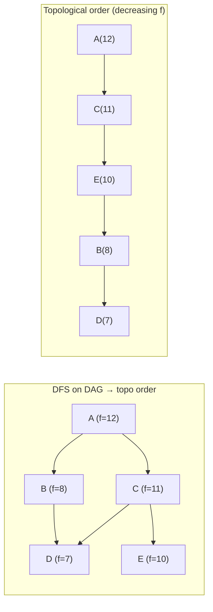

**Why it works**: If `(u,v)` is an edge, then `f[v] < f[u]` — v finishes before u. So sorting by decreasing finish time puts u before v for all edges.

### 5.4 Dijkstra: Greedy + Priority Queue

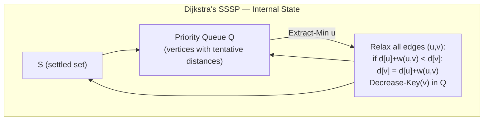

**Correctness via greedy choice**: When vertex u is extracted from Q (minimum tentative distance), d[u] is final. Proof: Any path through an unprocessed vertex has distance ≥ d[u] (non-negative weights). So no shorter path to u remains.

**Complexity**:
- Binary heap: O((V + E) log V) 
- Fibonacci heap: O(V log V + E) — O(1) amortized decrease-key

### 5.5 Bellman-Ford: Negative Weights and Cycle Detection

Relax all edges `|V|-1` times:

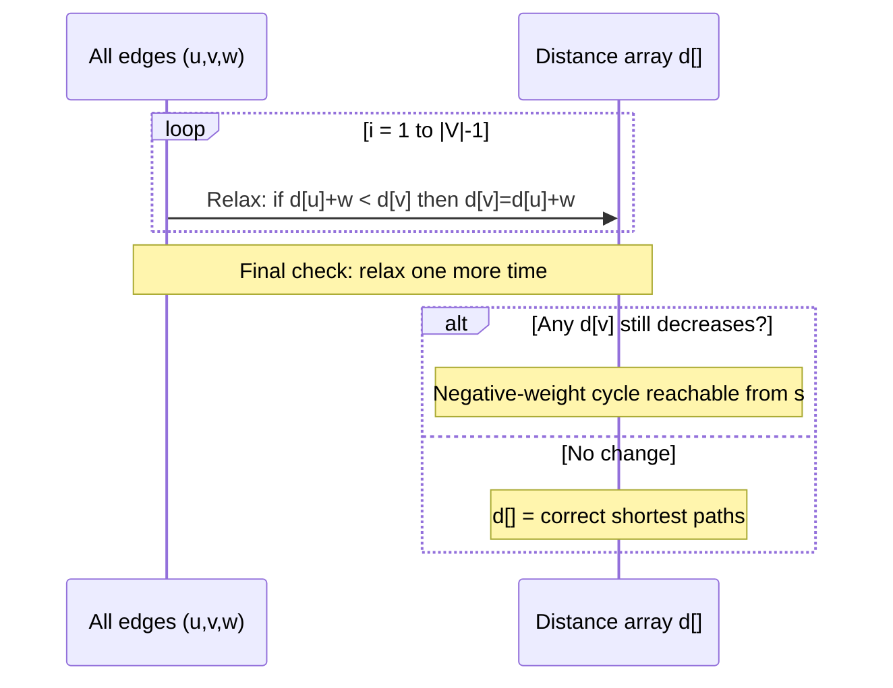

**Why |V|-1 iterations?** Shortest path in graph with no negative cycles uses ≤ |V|-1 edges. After iteration `k`, d[v] = correct shortest path using ≤ k edges.

---

## 6. Minimum Spanning Trees: Cut Property and Cycle Property

### 6.1 The Cut Property (Correctness Foundation)

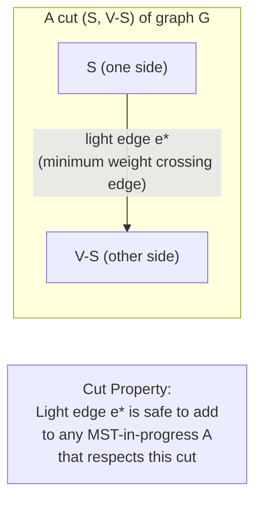

**Prim's algorithm**: Grow MST from single vertex. At each step, add minimum-weight edge crossing cut `(S, V-S)` where S = current tree.

**Kruskal's algorithm**: Sort edges by weight; add edge if it doesn't form a cycle (tested via Union-Find). Uses cut property at each step across a different cut.

### 6.2 Union-Find with Path Compression and Union by Rank

```mermaid
flowchart TD
  subgraph Before["Before path compression: FIND(e)"]
    A1["root (rank=3)"] --> B1["b"] --> C1["c"] --> D1["d"] --> E1["e"]
  end
  subgraph After["After FIND(e) with path compression"]
    A2["root"] --> B2["b"]
    A2 --> C2["c"]
    A2 --> D2["d"]
    A2 --> E2["e"]
  end
  Before -->|"All nodes point directly to root"| After
```

With both path compression and union by rank, m operations on n elements: O(m · α(n)) where α is the **inverse Ackermann function** — grows so slowly it's effectively constant (α(n) ≤ 4 for any practical n).

---

## 7. Amortized Analysis: True Cost Over Sequences

### 7.1 Three Methods

**Aggregate method**: Total cost of n operations = T(n). Amortized cost = T(n)/n.

**Accounting method**: Assign "amortized cost" to each operation; prepay for future expensive ops with "credit" stored in data structure.

**Potential method**: Define Φ(state) ≥ 0. Amortized cost of op_i = actual_cost_i + Φ(Dᵢ) - Φ(Dᵢ₋₁).

### 7.2 Dynamic Array (std::vector) Amortized O(1) Push

```mermaid
flowchart TD
  subgraph Growth["Array growth sequence"]
    S1["size=1, cap=1\nInsert: $1 + $1 prepay"] --> S2["size=2, cap=2\nInsert: $1 + $1 prepay (doubling used $2)"]
    S2 --> S3["size=3, cap=4\nInsert: $1 + $1 prepay"]
    S3 --> S4["size=4, cap=4\nInsert: $1 + $1 prepay (next doubling will cost $4)"]
    S4 --> S5["DOUBLE: copy 4 elements\n(cost $4, paid by $4 prepaid)"]
    S5 --> S6["size=5, cap=8\nInsert: $1 + $1 prepay"]
  end
```

**Potential function**: Φ(D) = 2·size - capacity.  
- Push when not full: actual=1, ΔΦ = 2·1 - 0 = +2. Amortized = 1+2 = 3.
- Push with doubling: capacity doubles from k to 2k. Actual = k+1 (k copies + 1 insert). ΔΦ = 2(k+1) - 2k - (-k) = -k+2. Amortized = (k+1) + (-k+2) = 3.

All pushes: amortized O(1) per operation.

---

## 8. String Algorithms: Pattern Matching Internals

### 8.1 KMP: Failure Function and State Machine

KMP avoids re-examining characters by precomputing a **failure function** `π[q]` = length of longest proper prefix of pattern `P[1..q]` that is also a suffix.

```mermaid
stateDiagram-v2
    [*] --> Q0 : start
    Q0 --> Q1 : P[1]='A'
    Q1 --> Q2 : P[2]='B'
    Q2 --> Q3 : P[3]='A'
    Q3 --> Q4 : P[4]='B'
    Q4 --> Q5 : P[5]='A'
    Q5 --> Q6 : P[6]='C'  (match!)
    Q1 --> Q0 : not 'B'
    Q2 --> Q1 : not 'A' (π[2]=1, back to Q1)
    Q3 --> Q2 : not 'B'
    Q4 --> Q3 : not 'A'
    Q5 --> Q2 : not 'C' (π[5]=3, skip to Q2)
```

**Why π prevents re-scanning**: When mismatch occurs at `q+1`, we know `P[1..π[q]]` still matches text. Shift pattern so this prefix aligns with current text position — skip `q - π[q]` characters.

Total time: O(n + m) where n = text length, m = pattern length.

---

## 9. Algorithm Design Patterns: Decision Frameworks

```mermaid
flowchart TD
  Problem["Problem Structure?"] --> OptSubst{"Optimal\nSubstructure?"}
  OptSubst -->|"Yes + Overlapping subproblems"| DP["Dynamic Programming\n(bottom-up table)"]
  OptSubst -->|"Yes + Greedy choice"| Greedy["Greedy Algorithm\n(local-optimal = global-optimal)"]
  OptSubst -->|"No"| Exhaustive{"Search space\nsize?"}
  Exhaustive -->|"Exponential"| BackTrack["Backtracking /\nBranch & Bound"]
  Exhaustive -->|"Polynomial"| DivConq["Divide & Conquer\n(if independent subproblems)"]

  DP --> Examples1["LCS, Edit Distance,\nKnapsack, Floyd-Warshall"]
  Greedy --> Examples2["Huffman, Prim, Kruskal,\nDijkstra, Activity Select"]
  DivConq --> Examples3["Merge Sort, FFT,\nClosest Pair, Strassen"]
```

```mermaid
block-beta
  columns 4
  H1["Algorithm"] H2["Best"] H3["Average"] H4["Worst"]
  R1a["Merge Sort"] R1b["Θ(n lg n)"] R1c["Θ(n lg n)"] R1d["Θ(n lg n)"]
  R2a["Quick Sort"] R2b["Θ(n lg n)"] R2c["Θ(n lg n)"] R2d["Θ(n²)"]
  R3a["Heap Sort"] R3b["Θ(n lg n)"] R3c["Θ(n lg n)"] R3d["Θ(n lg n)"]
  R4a["Counting Sort"] R4b["Θ(n+k)"] R4c["Θ(n+k)"] R4d["Θ(n+k)"]
  R5a["BFS/DFS"] R5b["Θ(V+E)"] R5c["Θ(V+E)"] R5d["Θ(V+E)"]
  R6a["Dijkstra (Fib)"] R6b["—"] R6c["—"] R6d["Θ(V lg V+E)"]
  R7a["Bellman-Ford"] R7b["—"] R7c["—"] R7d["Θ(VE)"]
  R8a["Floyd-Warshall"] R8b["—"] R8c["—"] R8d["Θ(V³)"]
```

---

## 10. Sedgewick's Algorithmic Engineering Perspective

### Pointer Sorting and Indirection

In Java (and any reference-based language), sort algorithms operate on **references** to objects, not the objects themselves. The comparison touches a small key field; the rest of the object is never moved during sort. This makes exchange cost ≈ compare cost regardless of object size.

```mermaid
flowchart LR
  subgraph Array["Reference Array"]
    R1["ref1"] --> O1["Object{key=3, data=...}"]
    R2["ref2"] --> O2["Object{key=1, data=...}"]
    R3["ref3"] --> O3["Object{key=2, data=...}"]
  end
  subgraph Sorted["After sort (only refs moved)"]
    S1["ref2"] --> O2
    S2["ref3"] --> O3
    S3["ref1"] --> O1
  end
```

### Stability: Why It Matters for Multi-Key Sorts

A **stable sort** preserves relative order of equal keys. This enables sorting by multiple keys sequentially:
1. Sort by secondary key (stable)
2. Sort by primary key (stable)
→ Result: sorted by primary, ties broken by secondary — without any multi-key comparison logic.

This is why a **stable implementation** of counting sort is commonly used as a radix-sort pass. Stability comes from the placement procedure, such as the shown right-to-left pass; counting sort is not inherently stable under every implementation.

```mermaid
sequenceDiagram
    participant Input as [(3,B),(1,A),(2,B),(1,C)]
    participant After1 as After sort by 2nd key
    participant After2 as After sort by 1st key (stable)

    Note over Input: Original order
    Note over After1: [(3,B),(1,A),(2,B),(1,C)]\nWait — already stable on 2nd key
    Note over After2: [(1,A),(1,C),(2,B),(3,B)]\n1,A before 1,C preserved ✓
```
