# CMU 15-850 Advanced Algorithms: Under the Hood

> **Source**: *Advanced Algorithms — Notes for CMU 15-850 (Fall 2020)*, Anupam Gupta, Carnegie Mellon University (285 pp.)  
> **Focus**: Mathematical internals of advanced algorithmic machinery — how Ackermann's inverse emerges from data structure amortization, how randomized algorithms exploit polynomial sparsity, how convex optimization underpins modern graph algorithms, and how matroid theory generalizes greedy correctness proofs.

---

> **Reading contract:** Scope is the cited CMU 15-850 Fall 2020 notes and the chapter mapping recorded at the end. Theorems here depend on graph properties, randomness model, field size, approximation parameter, and success probability that abbreviated diagrams may omit. Identify those parameters and the cited theorem before treating a result as proved; label intuitive explanations as sketches. A result is complete only when assumptions, probability or approximation guarantee, failure event, and asymptotic model are all recoverable. If not, use it as a study prompt rather than an implementation contract.

## 1. Minimum Spanning Trees: From O(m log n) to O(m α(n))

### 1.1 The Cut and Cycle Rules — Correctness Foundation

The MST algorithms discussed in these notes can be analyzed through **blue-rule** (cut) and **red-rule** (cycle) arguments. With tied weights, "minimum" and "maximum" edges need the theorem's safe-edge conditions; a chosen edge need not belong to every MST. Record whether the conclusion is existence in some MST or membership in all MSTs.

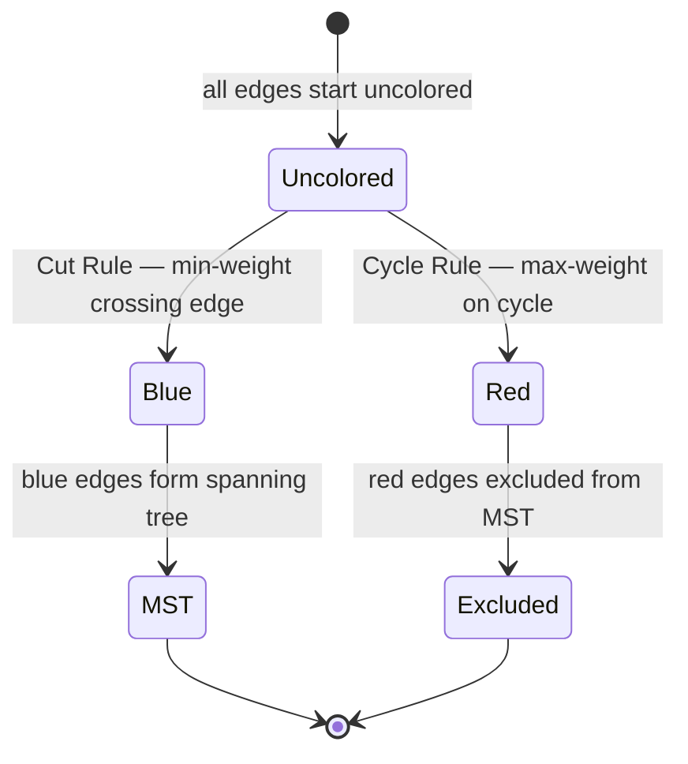

**Cut Rule proof sketch**: If min-weight edge `e` across cut `(S, S̄)` is absent from some spanning tree `T`, then `T ∪ {e}` contains a cycle `C`. Since `C` crosses the cut, there exists another edge `e'` in `C` crossing the cut with `w(e') > w(e)`. Replacing `e'` with `e` gives a lower-weight tree — contradiction.

### 1.2 Three Classical Algorithms — Data Structure Dependence


### 1.3 Fredman-Tarjan: O(m log* n) with Fibonacci Heaps

The key insight: **don't grow the priority queue too large** before contracting. Fredman and Tarjan run Prim's algorithm but stop each "phase" when the heap exceeds a threshold `t` — then contract all found MST components and restart.

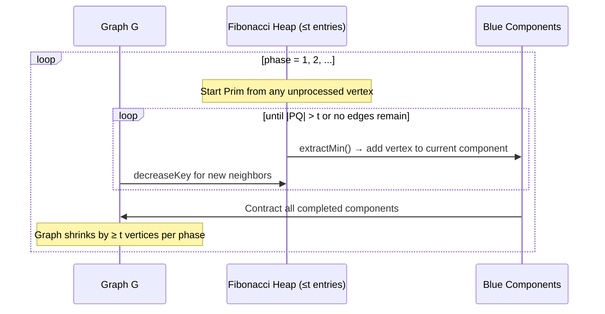

**Why log* n phases?** With threshold `t = 2^(2^(phase))` (Ackermann-like growth), the number of phases before all components merge is bounded by `log* n` — the number of times you can take log₂ before reaching 1.

### 1.4 The Ackermann Function and Its Inverse

The Ackermann function `A(k, n)` is defined by double recursion:
```
A(1, n) = 2n
A(k, 1) = A(k-1, 2)       for k ≥ 2
A(k, n) = A(k-1, A(k, n-1)) for k,n ≥ 2
```

Growth rates:
- `A(1, n) = 2n` (linear)
- `A(2, n) = 2^n` (exponential)
- `A(3, n) = 2^(2^(2^...))` (tower of n 2s)
- `A(4, n)` grows unimaginably fast

The **inverse Ackermann function** `α(n)` = smallest `k` such that `A(k, k) ≥ n`. For any `n` conceivable in practice, `α(n) ≤ 4`.

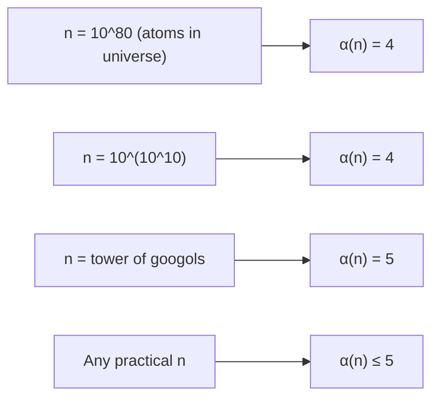

**Union-Find amortization**: Path compression + union by rank give each operation amortized `O(α(n))` cost. The proof uses a "rank function" on nodes — after compression, many nodes have their parent's rank jump several levels, amortizing future traversals.

### 1.5 Randomized Linear-Time MST (Karger-Klein-Tarjan)

Uses the **Cycle Rule** in a clever way: randomly sample a subgraph F (each edge included independently with probability 1/2), recursively find its MST `T_F`, then **use `T_F` to eliminate heavy edges** from the original graph.

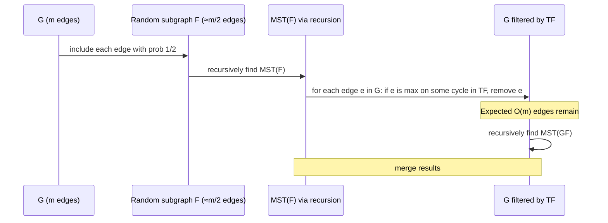

**F-heavy edge elimination**: An edge `e` is `F`-heavy if it is the heaviest edge on the path between its endpoints in `T_F`. By cycle rule, F-heavy edges cannot be in the MST of G → discard them. Expected number of F-light edges = O(n) → recursion on much smaller graph.

---

## 2. Matroids: Generalizing Greedy Correctness

### 2.1 Matroid Definition

A matroid `M = (E, I)` consists of a ground set `E` and a family of independent sets `I` satisfying:
1. `∅ ∈ I`
2. (Hereditary) If `A ∈ I` and `B ⊆ A`, then `B ∈ I`
3. (Augmentation) If `A, B ∈ I` and `|A| < |B|`, then `∃ e ∈ B \ A` such that `A ∪ {e} ∈ I`

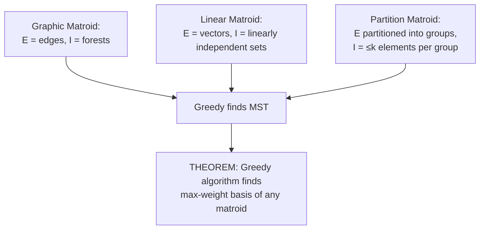

### 2.2 Why Greedy Works on Matroids — Exchange Argument

```mermaid
sequenceDiagram
    participant G as Greedy solution (sorted by weight, descending)
    participant OPT as Optimal solution
    
    Note over G,OPT: Suppose G ≠ OPT
    G->>OPT: Find first element e in G not in OPT
    OPT->>OPT: OPT + {e} has a cycle C (by matroid circuit property)
    G->>OPT: ∃ f in C ∩ OPT with w(f) ≤ w(e)
    Note over OPT: OPT' = OPT + {e} - {f} is also independent
    Note over OPT: w(OPT') ≥ w(OPT) — contradicts optimality of OPT
```

**Kruskal's correctness** is exactly this matroid greedy theorem applied to the graphic matroid — adding the lightest edge that doesn't form a cycle is the greedy step on the independent sets (forests) of the graphic matroid.

---

## 3. Algebraic Matching: Schwartz-Zippel and Polynomial Identity Testing

### 3.1 Schwartz-Zippel Lemma

For a non-zero polynomial `p(x₁,...,xₙ)` of degree ≤ d, if we sample each `xᵢ` uniformly from a set `S`:

```
Pr[p(R₁,...,Rₙ) = 0] ≤ d/|S|
```

This is the engine of randomized algebraic algorithms: if we evaluate the polynomial at random points and get 0, it's probably the zero polynomial (i.e., no matching exists).

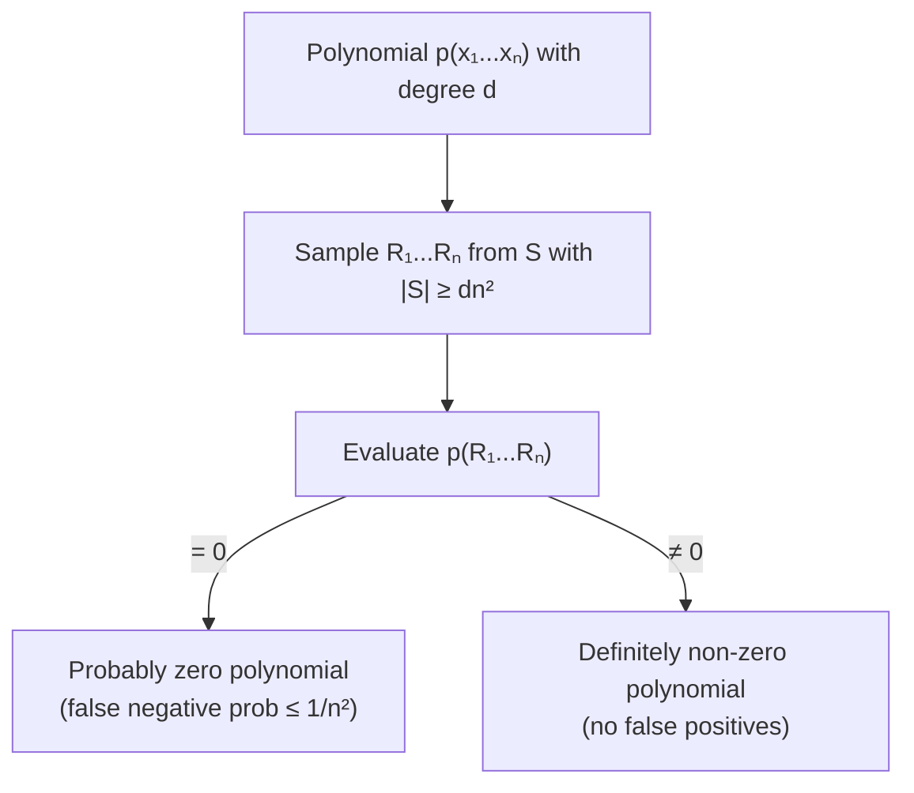

### 3.2 Perfect Matching via Edmonds Matrix

**Edmonds matrix** for bipartite graph `G=(L,R,E)`: `n×n` matrix where `E_ij = x_ij` if edge `(i,j) ∈ E`, else 0.

```
det(E(G)) = Σ_σ (−1)^sign(σ) ∏ᵢ E_{i,σ(i)}
```

Each permutation `σ` corresponds to a potential perfect matching. A term is non-zero iff all edges of that matching exist. Therefore:
- `det(E(G)) ≠ 0` ↔ `G` has a perfect matching

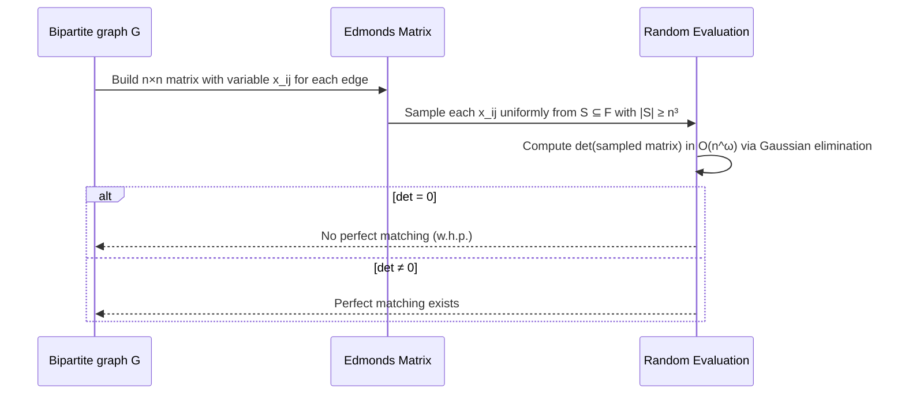

**Time**: O(n^ω) where ω ≈ 2.37 (matrix multiplication exponent). This beats combinatorial O(m√n) algorithms for dense graphs.

---

## 4. Dimension Reduction: Johnson-Lindenstrauss Lemma

### 4.1 The JL Lemma — High-Dimensional Geometry

For n points in ℝ^d, we can project them to ℝ^k (with `k = O(ε⁻² log n)`) such that all pairwise distances are preserved within factor `(1 ± ε)`:

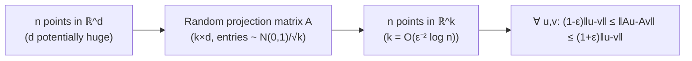

**Why this works**: Each coordinate of the projected point is the sum of k random variables (by rows of A). By **concentration of measure**, the sum concentrates tightly around its mean — the squared distance `‖Au-Av‖²` concentrates around `‖u-v‖²` with exponentially small deviation.

### 4.2 Concentration of Measure — The Core Tool

For independent random variables `X₁,...,Xₙ` each bounded in `[a,b]`, **Hoeffding's inequality**:

```
Pr[Σ Xᵢ - E[Σ Xᵢ] ≥ t] ≤ exp(-2t² / (n(b-a)²))
```

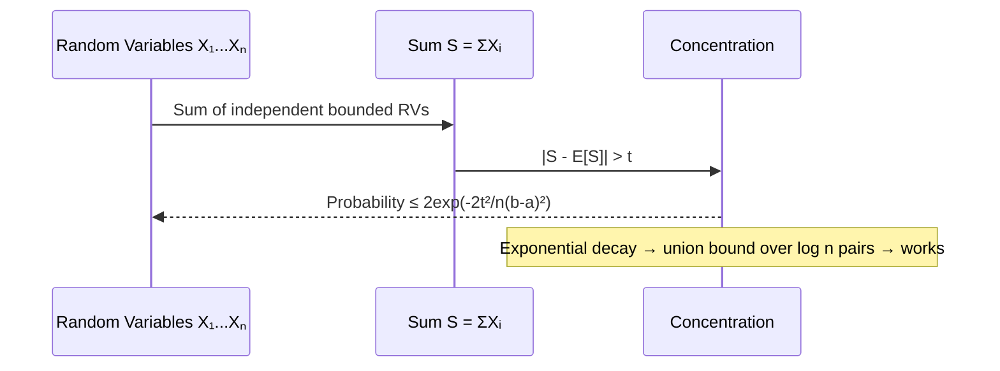

**Application to JL**: The squared norm of a projected Gaussian vector concentrates around its expectation with `exp(-Ω(ε²k))` failure probability. Choosing `k = O(ε⁻² log n)` makes the union bound over all `O(n²)` pairs succeed with high probability.

---

## 5. Streaming Algorithms: O(log n) Space for Moments

### 5.1 AMS Sketch — Second Moment in Polylog Space

Given a data stream of updates to a frequency vector `f ∈ ℝⁿ`, estimate `F₂ = Σ fᵢ²` (second moment) using O(log n) space.

**Key insight**: Maintain a sketch `Z = Σᵢ sᵢ fᵢ` where `sᵢ ∈ {+1, -1}` are 4-wise independent random signs.

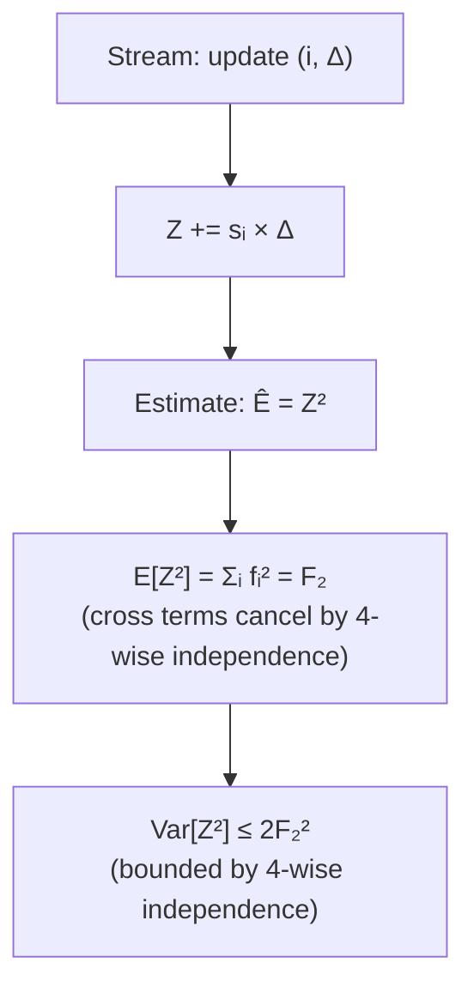

**Space**: O(log n) bits for `Z` + O(log n) to specify the hash function `s`. Running `O(1/ε²)` parallel sketches and taking median reduces variance → `(1±ε)` approximation with high probability.

### 5.2 Matrix View of AMS

The sketch `Z = Σᵢ sᵢ fᵢ` can be written as `Z = S·f` where S is a row of random ±1 signs. Multiple sketches form the **count sketch matrix**:

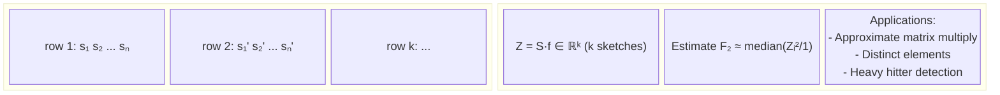

---

## 6. Online Learning: Multiplicative Weights Update

### 6.1 The Expert Problem — Regret Minimization

At each round, choose a distribution over n "experts", observe the outcome, and update weights based on expert performance. Goal: total loss close to the best single expert in hindsight.

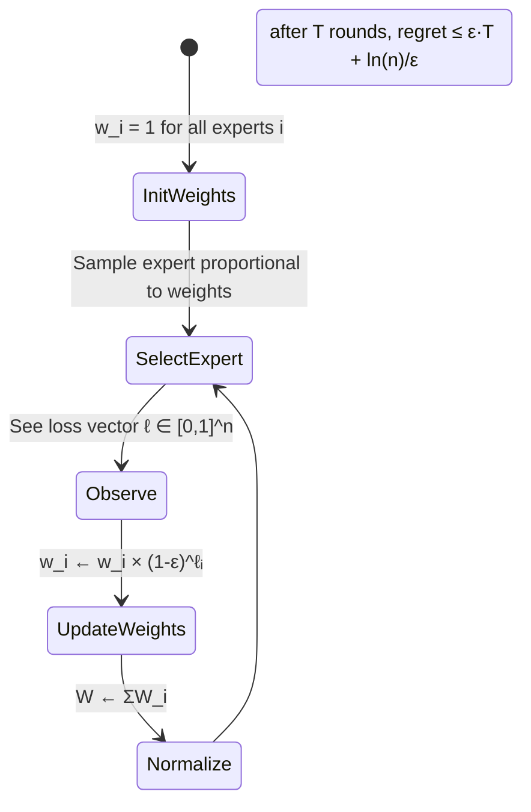

**Regret bound**: Choosing `ε = √(ln(n)/T)` gives regret ≤ `2√(T ln n)`. Total loss ≤ OPT + 2√(T ln n).

### 6.2 Using MWU to Solve Linear Programs Approximately

Any LP `{min c·x : Ax ≥ b, x ≥ 0}` can be solved approximately using MWU as a "black box solver":

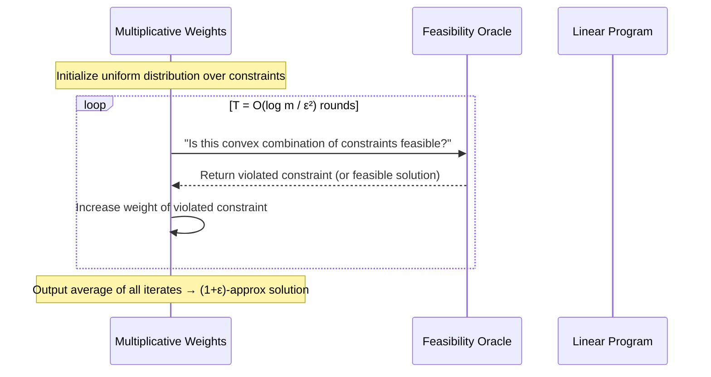

**Key**: This converts a separation oracle into an approximate optimization algorithm. Any problem where you can check feasibility efficiently can be approximately optimized via MWU.

---

## 7. Convex Optimization: Interior-Point Methods

### 7.1 Barrier Functions and the Central Path

For LP `{min c·x : Ax ≤ b}`, interior-point methods add a **barrier function** `B(x) = -Σ log(bᵢ - aᵢ·x)` that blows up at the boundary:

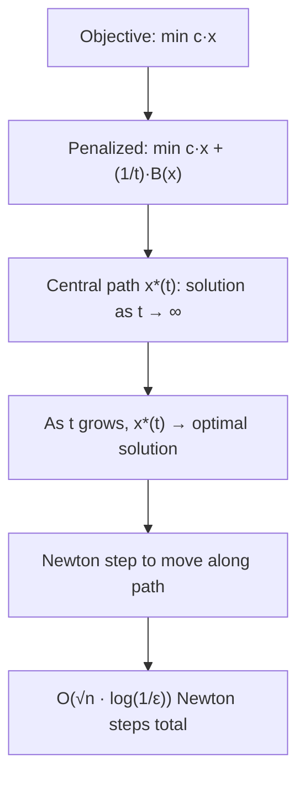

### 7.2 Newton's Method — Quadratic Convergence

Near a minimum, the barrier function approximates a quadratic `f(x+Δ) ≈ f(x) + ∇f·Δ + ½ Δᵀ∇²f·Δ`. The Newton step `Δ = -(∇²f)⁻¹∇f` is the exact minimizer of this quadratic approximation.

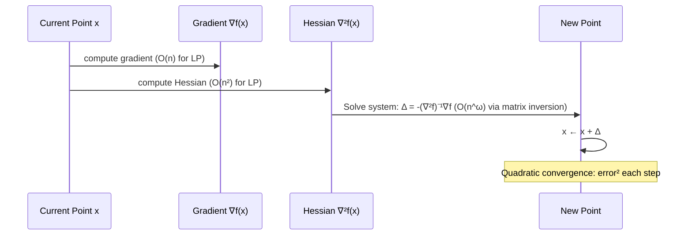

**Self-concordance**: barrier functions `B(x)` satisfying `|∇³B[Δ,Δ,Δ]| ≤ 2(∇²B[Δ,Δ])^(3/2)` guarantee Newton's method converges in `O(√κ · log(1/ε))` steps where κ is condition number.

---

## 8. Graph Sparsification: Preserving Cut Structure

### 8.1 Spectral Sparsification

For graph `G = (V, E)` with Laplacian `L_G`, a **spectral sparsifier** `H ⊆ G` satisfies:

```
(1-ε) x^T L_G x ≤ x^T L_H x ≤ (1+ε) x^T L_G x   ∀ x ∈ ℝⁿ
```

This means H preserves **all cuts** simultaneously to within `(1±ε)` — not just specific cuts.


**Effective resistance** of edge `e = (u,v)`: `r_e = (χ_e)^T L_G^† χ_e` where `χ_e` is the edge incidence vector and `L_G^†` is the pseudoinverse of the Laplacian. Edges with high effective resistance are "bottleneck" edges — they must be in the sparsifier.

### 8.2 Concentration Proof — Matrix Bernstein

Matrix Bernstein inequality: for independent random PSD matrices `X_i` with `‖X_i‖ ≤ R` and `‖Σ E[X_i]‖ ≤ σ²`:

```
Pr[‖Σ Xᵢ - E[Σ Xᵢ]‖ ≥ t] ≤ 2n · exp(-t²/2(σ² + Rt/3))
```

This is the matrix analog of scalar Bernstein — used to prove the sampled graph's Laplacian concentrates around the original's.

---

## 9. Near-Linear SSSP: Beyond Dijkstra

### 9.1 Low-Stretch Spanning Trees

A spanning tree `T` of `G` has **stretch** `str_T(u,v) = d_T(u,v)/d_G(u,v)`. Average stretch = `(Σ_{(u,v)∈E} str_T(u,v))/m`.

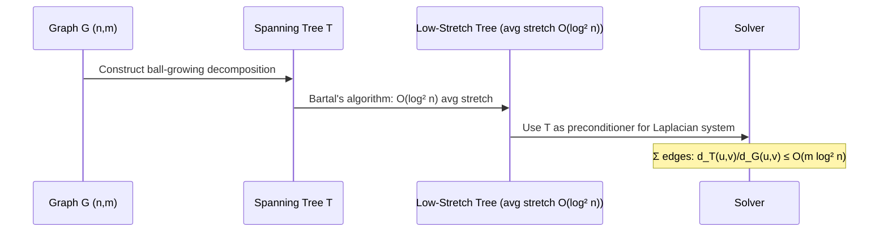

**Why this enables faster SSSP**: With a low-stretch tree, the SDD (symmetric diagonally dominant) Laplacian system `Lx = b` can be solved in `O(m log n)` time using iterative methods where the tree provides an approximate inverse.

### 9.2 Electric Flow Framework

Electrical flows minimize `Σ_e rₑ fₑ²` subject to flow conservation. The solution satisfies Ohm's law: `fₑ = (φᵤ - φᵥ)/rₑ` where `φ` is the vertex potential vector:

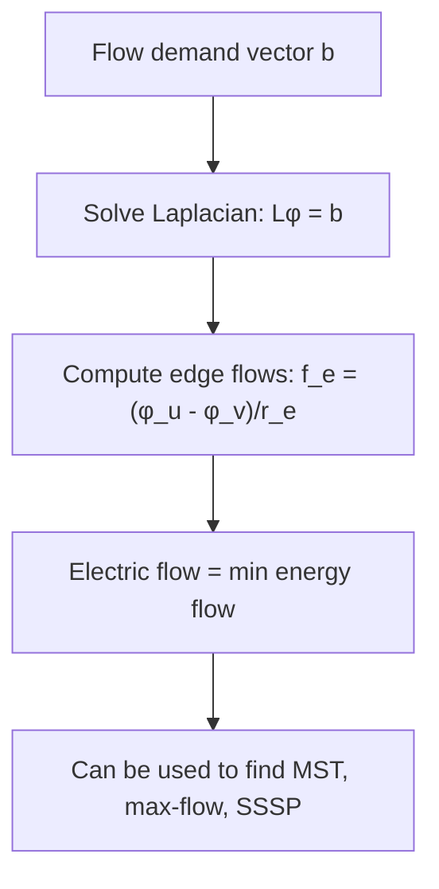

The Laplacian solve `Lφ = b` can be done in `O(m log n polylog log n)` time using Spielman-Teng solvers — achieving near-linear SSSP.

---

## 10. Matroid Intersection and Arborescences

### 10.1 Matroid Intersection — Two Matroids

Given two matroids `M₁ = (E, I₁)` and `M₂ = (E, I₂)`, find the maximum-weight set in `I₁ ∩ I₂`.

**Application — Arborescence (directed MST)**: Finding minimum-cost arborescence (directed spanning tree) in a digraph reduces to matroid intersection:
- Matroid 1: graphic matroid of underlying undirected graph
- Matroid 2: partition matroid (exactly one incoming edge per non-root vertex)

```mermaid
sequenceDiagram
    participant M1 as Matroid M₁ (graphic)
    participant M2 as Matroid M₂ (partition: 1 in-edge per vertex)
    participant ALG as Intersection Algorithm

    ALG->>M1: Find augmenting path in exchange graph
    ALG->>M2: Check if augmenting path is valid in M₂
    loop path found
        ALG->>ALG: Update independent set along path
        Note over ALG: Augment by 1 element each iteration
    end
    Note over ALG: O(r · (oracle time)) total
    Note over ALG: r = rank of final solution ≤ n-1
```

### 10.2 Chu-Liu/Edmonds Algorithm — Contraction-Based

```mermaid
stateDiagram-v2
    [*] --> FindCheapest : For each non-root vertex v:\npick cheapest incoming edge
    FindCheapest --> CheckCycle : Union-Find: does selection form a directed cycle?
    CheckCycle --> ReturnTree : NO → spanning arborescence found
    CheckCycle --> Contract : YES → contract cycle to single super-node
    Contract --> ReweightEdges : Adjust weights of edges entering super-node
    ReweightEdges --> FindCheapest : Recurse on contracted graph
    ReturnTree --> [*]
```

**Reweighting rule**: For edge `(u, C)` entering contracted cycle `C` via vertex `v ∈ C`, new weight = `w(u,v) - w(cheapest_in(v))`. This accounts for the fact that adding `(u,v)` to the arborescence removes the cycle's edge into `v`.

---

## 11. Complexity Landscape of Graph Problems

```mermaid
flowchart TD
    subgraph Linear["O(m) or near-linear"]
        MST_rand["MST (randomized KKT)"]
        BFS_dfs["BFS/DFS"]
        SSSP_unw["SSSP unweighted"]
    end
    subgraph NearLinear["O(m log* n) or O(m log n)"]
        MST_det["MST (deterministic)"]
        Prim["Prim + Fibonacci heap: O(m + n log n)"]
    end
    subgraph MatMul["O(n^ω)"]
        Match_alg["Perfect Matching (algebraic)"]
        APSP_dense["APSP dense graphs"]
    end
    subgraph Harder["O(mn) or harder"]
        BF["Bellman-Ford: O(mn)"]
        BlossoM["Blossom: O(n³)"]
    end
    MST_rand --> MST_det
    Prim --> Match_alg
```

---

## 12. Online Optimization: Regret Bound Derivation

### 12.1 Hedge Algorithm — Weight Update Mechanics

```mermaid
sequenceDiagram
    participant Learner
    participant Weights as w_i (n experts)
    participant Loss as Loss vector ℓ ∈ [0,1]^n

    Note over Weights: Initialize w_i = 1 for all i
    loop t = 1 to T
        Learner->>Weights: Sample expert i with prob w_i / Σw_j
        Learner->>Loss: Observe ℓ (all expert losses)
        Weights->>Weights: Update: w_i ← w_i × exp(-ε ℓᵢ)
    end
    Note over Learner: Total loss ≤ (1+ε) × OPT + ln(n)/ε
    Note over Learner: Setting ε = √(ln(n)/T) → regret = O(√(T ln n))
```

**Potential function analysis**: Let `Φ_t = Σᵢ wᵢ^(t)`. After T rounds:
- Upper bound: `Φ_T ≤ n · exp(-ε · LOSS_LEARNER · (1-ε/2))` (by geometric weight decay)
- Lower bound: `Φ_T ≥ exp(-ε · LOSS_OPT)` (one expert's weight)
- Combining: `LOSS_LEARNER ≤ (1+ε) LOSS_OPT + ln(n)/ε`

---

*Document synthesized from CMU 15-850 Advanced Algorithms course notes (Fall 2020), Prof. Anupam Gupta — covering MST algorithms (Ch. 1), algebraic matching (Ch. 8), graph sparsification, online learning (Ch. 14-15), convex optimization (Ch. 17-20), and dimension reduction (Ch. 10-13).*
