# Competitive Programming Internals — Under the Hood
## Antti Laaksonen's Competitive Programmer's Handbook · Internal Mechanics

> **Not a tutorial.** This document maps selected techniques from the cited handbook to memory structures, complexity transitions, DP table order, and bit operations.

---

> **Reading contract:** Source scope is the July 3, 2018 handbook draft named at the end. Judge throughput, recursion limits, integer widths, memory limits, and library costs vary by platform, so the tables are estimation heuristics, not acceptance guarantees. Before selecting an algorithm, bind the claim to the exact constraints, input distribution, numeric range, data-structure variant, and worst-case or expected bound. Selection is complete only when correctness and resource bounds fit the judge limits with margin; a timeout, overflow, excessive memory use, or violated invariant returns the choice to an unverified state.

## 1. Time Complexity — The Internal Machine Model

### 1.1 Complexity Estimation Table — What Actually Runs

Complexity classes constrain growth, while actual runtime depends on the judge hardware, language, constants, cache behavior, and time limit. The often-used ~10⁸ simple operations/second figure is only a rough sizing heuristic and must be calibrated against the target judge.

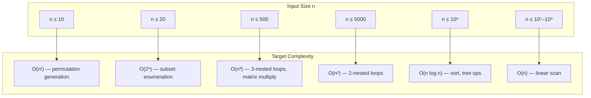

### 1.2 Maximum Subarray Sum — Three Algorithm Generations

The classic O(n³)→O(n²)→O(n) reduction demonstrates how **memory access patterns** change complexity:

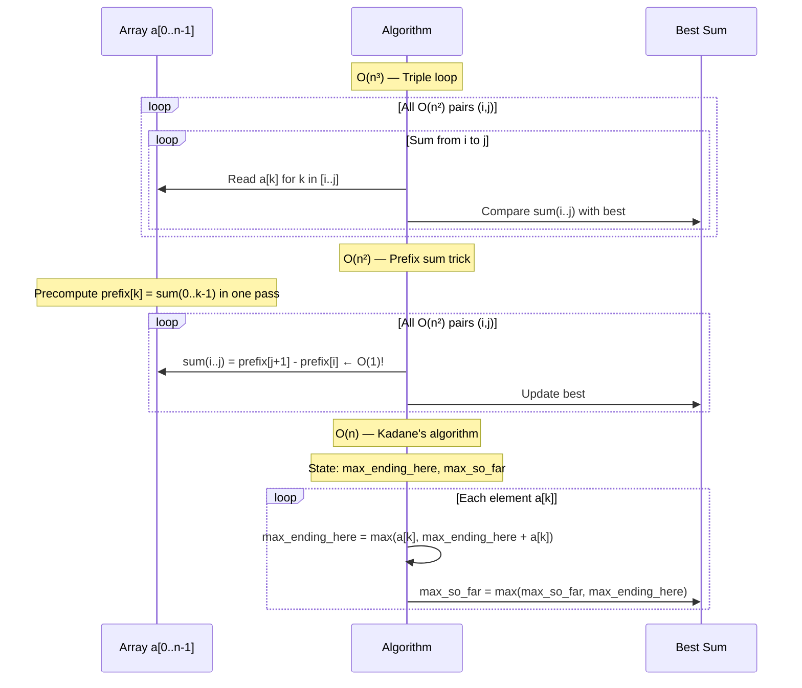

**Kadane's state machine** — the invariant that makes O(n) work:

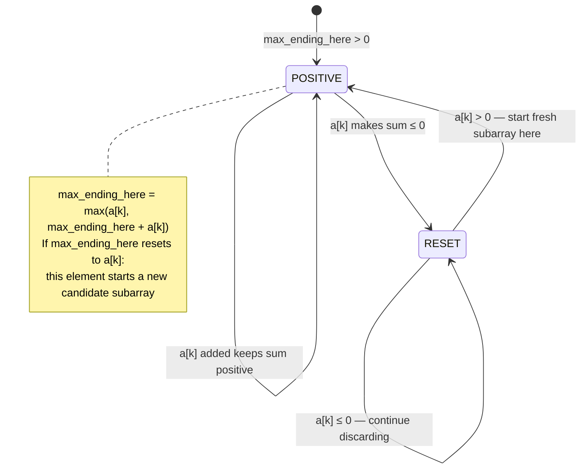

---

## 2. Sorting Internals — Memory Movement Patterns

### 2.1 Merge Sort — Cache Line Behavior

Merge sort's recursive halving creates a **call stack** that determines memory access locality:

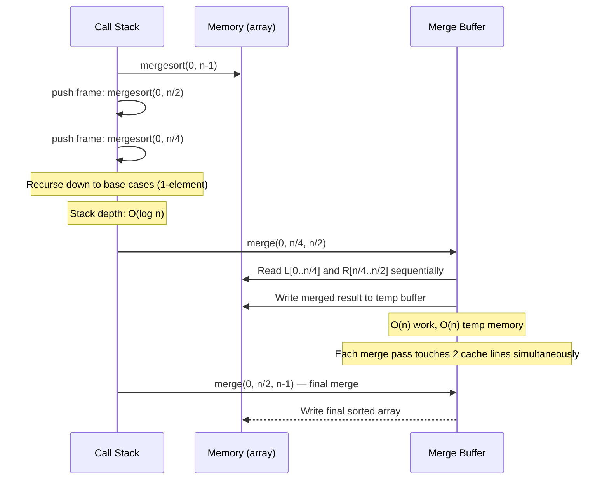

**Sorting algorithm comparison** — internal operation counts:

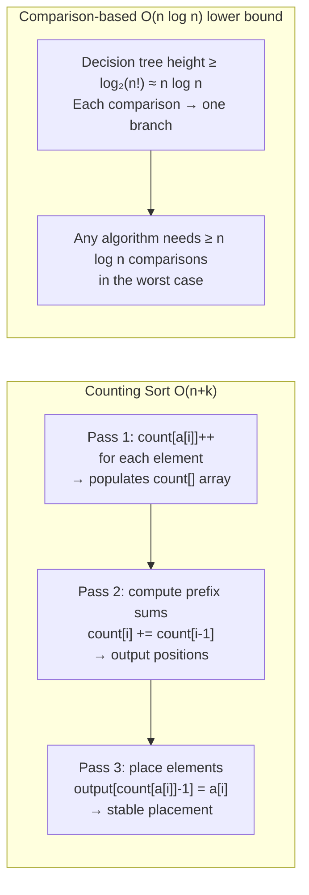

### 2.2 Binary Search — Invariant Maintenance

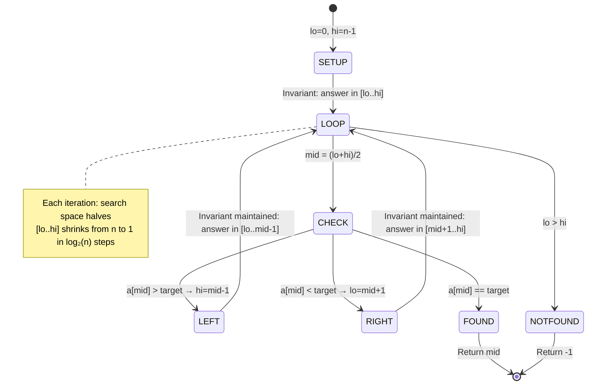

---

## 3. Data Structures — Memory Layout and Operation Costs

### 3.1 Dynamic Arrays — Amortized Doubling

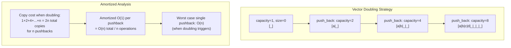

### 3.2 Segment Tree — Internal Node Memory Layout

Segment trees store a complete binary tree in a flat array with the **1-indexed parent-child relationship**:

```mermaid
block-beta
    columns 8
    block:ROOT["Index 1\ntree[1]\nsum[0..7]"]:8
    end
    block:L2A["tree[2]\nsum[0..3]"]:4
    block:L2B["tree[3]\nsum[4..7]"]:4
    block:L3A["tree[4]\n[0..1]"]:2
    block:L3B["tree[5]\n[2..3]"]:2
    block:L3C["tree[6]\n[4..5]"]:2
    block:L3D["tree[7]\n[6..7]"]:2
    tree8["[8]\na[0]"]
    tree9["[9]\na[1]"]
    tree10["[10]\na[2]"]
    tree11["[11]\na[3]"]
    tree12["[12]\na[4]"]
    tree13["[13]\na[5]"]
    tree14["[14]\na[6]"]
    tree15["[15]\na[7]"]
```

**Navigation rules**: left child = `2k`, right child = `2k+1`, parent = `k/2`

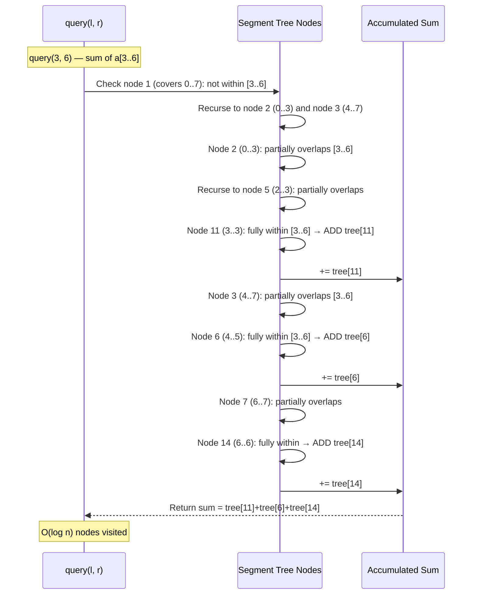

### 3.3 Binary Indexed Tree (Fenwick) — Bit Magic Navigation

The BIT uses LSB (least significant bit) to determine which range each index covers:

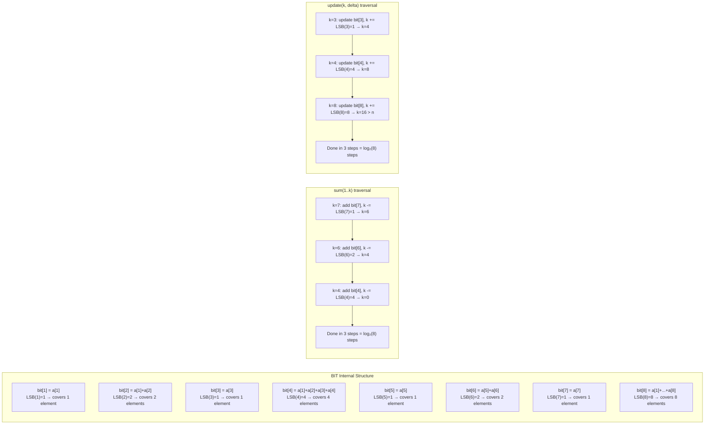

---

## 4. Dynamic Programming — Table Fill Mechanics

### 4.1 Coin Change — State Transition Graph

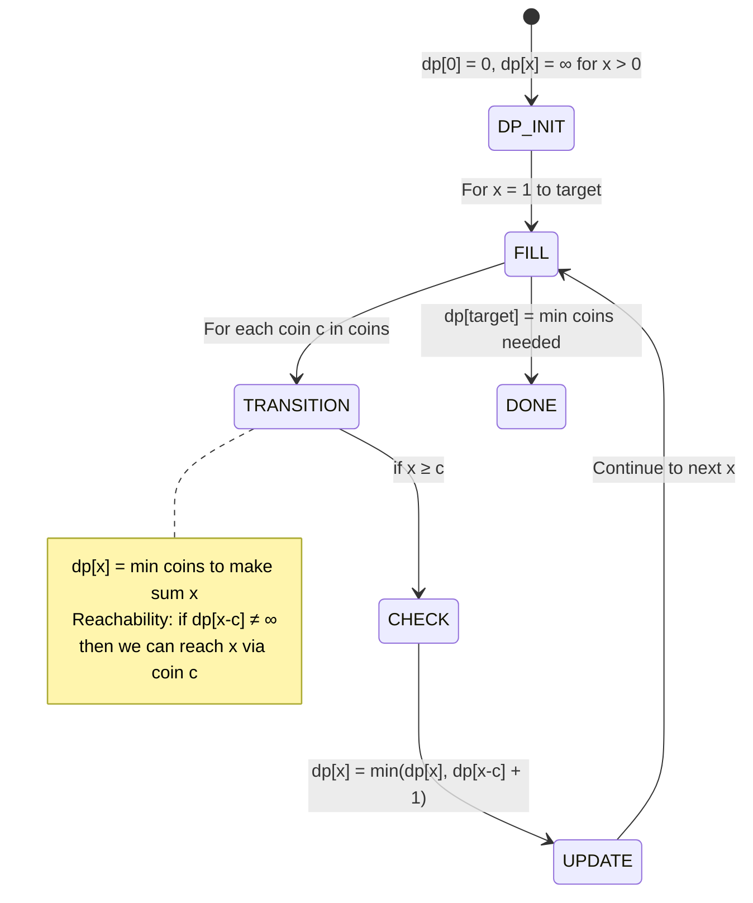

**Memory access pattern** — 1D DP fill for coin problem:

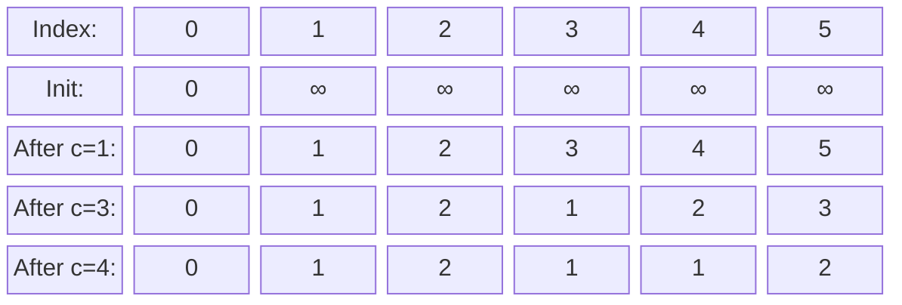

### 4.2 Longest Increasing Subsequence (LIS) — Two Approaches

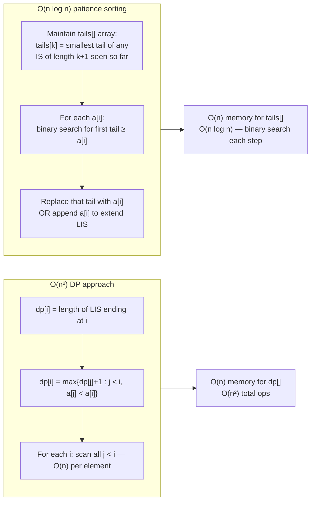

**LIS patience sort state evolution** for `[3, 1, 4, 1, 5, 9, 2, 6]`:

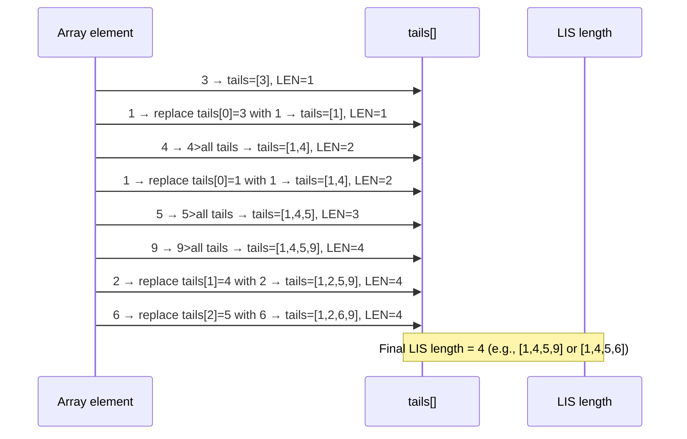

### 4.3 Grid Path DP — 2D Memory Fill Order

```mermaid
flowchart TD
    subgraph GRID["Grid DP (count paths to bottom-right)"]
        INIT["dp[0][0] = 1 (start)"]
        FILL["Fill left-to-right, top-to-bottom"]
        RECUR["dp[i][j] = dp[i-1][j] + dp[i][j-1]\n(from above + from left)"]
        BOUND["dp[i][j] = 0 if wall/blocked"]
        INIT --> FILL --> RECUR --> BOUND
    end
    
    subgraph MEMORY_LAYOUT["Memory Access Pattern"]
        R0["Row 0: [1, 1, 1, 1, ...]"]
        R1["Row 1: [1, 2, 3, 4, ...]"]
        R2["Row 2: [1, 3, 6, 10, ...]"]
        R3["Row 3: [1, 4, 10, 20, ...]"]
        R0 --> R1 --> R2 --> R3
    end
    
    subgraph OPTIMIZATION["1D Memory Optimization"]
        OPT["Use single dp[n] array\nUpdate in-place left-to-right:\ndp[j] += dp[j-1] per row"]
        OPT2["From O(n²) space to O(n) space\ndp[j] from previous row + dp[j-1] from current row"]
        OPT --> OPT2
    end
```

### 4.4 Knapsack — 2D vs 1D Memory and Fill Direction

```mermaid
sequenceDiagram
    participant ITEMS as Items (weight, value)
    participant DP as dp[0..W] array
    participant OPT as Optimal Value

    Note over DP: 0/1 Knapsack: each item usable ONCE
    Note over DP: Fill RIGHT-TO-LEFT to avoid reuse
    
    loop For each item (w, v)
        loop j from W down to w
            DP->>DP: dp[j] = max(dp[j], dp[j-w] + v)
            Note over DP: Reading dp[j-w] from "previous item's row"
            Note over DP: because we fill right-to-left
        end
    end
    
    Note over DP: UNBOUNDED Knapsack: each item usable MANY times
    Note over DP: Fill LEFT-TO-RIGHT to allow reuse!
    loop For each item (w, v)
        loop j from w up to W
            DP->>DP: dp[j] = max(dp[j], dp[j-w] + v)
            Note over DP: Reading dp[j-w] from "current item's row"
            Note over DP: because we fill left-to-right
        end
    end
    
    DP-->>OPT: dp[W] = maximum value
```

**Critical difference**: direction of inner loop determines if items can be reused:

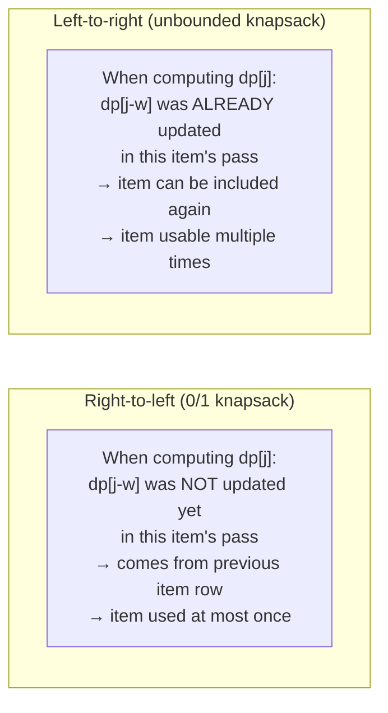

---

## 5. Amortized Analysis — Two Pointers and Sliding Window

### 5.1 Two Pointers — Telescoping State

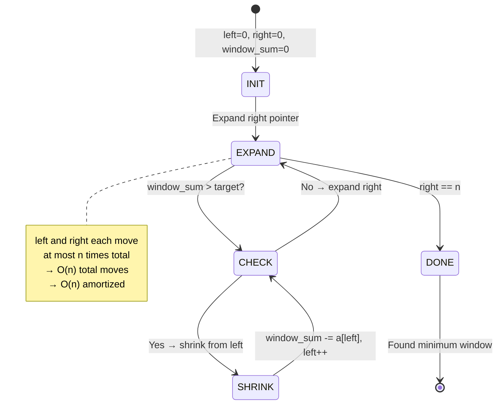

### 5.2 Sliding Window Minimum — Monotone Deque

The **monotone deque** maintains the invariant that front always holds the current window minimum:

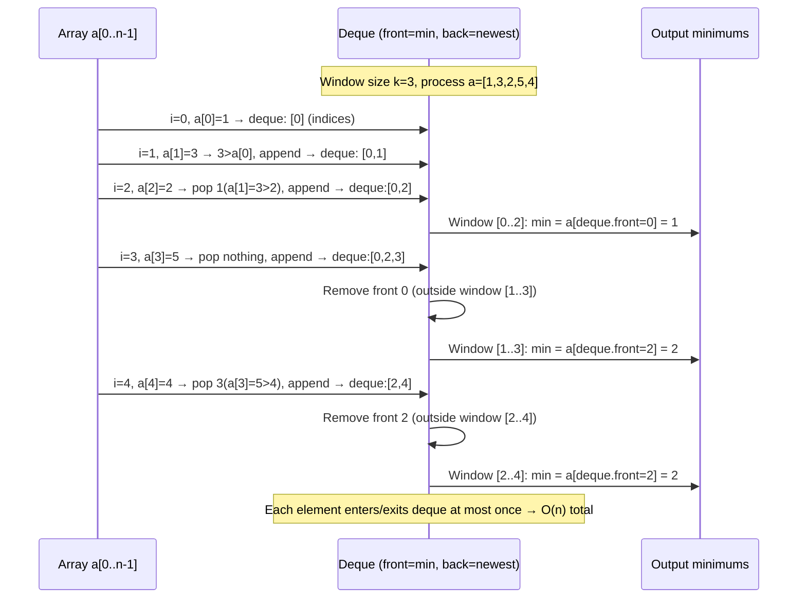

---

## 6. Bit Manipulation — Register-Level Operations

### 6.1 Set Representation in Integers

Every subset of {0..n-1} maps to one integer. Operations become single CPU instructions:

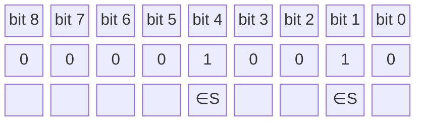

*Set {1, 4} represented as integer 18 = 2¹ + 2⁴*

```mermaid
flowchart LR
    subgraph OPERATIONS["Bit Set Operations (O(1) each)"]
        ADD["Add element x:\nS |= (1 << x)"]
        DEL["Delete element x:\nS &= ~(1 << x)"]
        MEMBER["Test x ∈ S:\n(S >> x) & 1"]
        UNION["Union A ∪ B:\nA | B"]
        INTER["Intersection A ∩ B:\nA & B"]
        DIFF["Difference A \\ B:\nA & ~B"]
        SIZE["Popcount |S|:\n__builtin_popcount(S)"]
    end
    
    subgraph SUBSET_ITER["Iterate subsets of S"]
        SI1["for b=(b-1)&S; b!=0; b=(b-1)&S"]
        SI2["Each iteration: b = next smaller subset of S"]
        SI3["(b-1) clears lowest set bit and fills below\n& S keeps only bits that were in S"]
        SI1 --> SI2 --> SI3
    end
```

### 6.2 Bitmask DP — Subset State Transitions

```mermaid
sequenceDiagram
    participant STATES as DP States (2^n integers)
    participant TRANS as Transition via bitmask
    participant RESULT as Optimal result

    Note over STATES: TSP-like: dp[mask][v] = shortest path\nvisiting exactly vertices in mask, ending at v
    
    Note over STATES: Base: dp[1<<v][v] = 0 for all v (start anywhere)
    
    loop For each mask (in increasing order of bits)
        loop For each endpoint v in mask
            loop For each neighbor u NOT in mask
                STATES->>TRANS: new_mask = mask | (1<<u)
                TRANS->>STATES: dp[new_mask][u] = min(dp[new_mask][u],\ndp[mask][v] + dist[v][u])
            end
        end
    end
    
    STATES-->>RESULT: min over v of dp[(1<<n)-1][v] + dist[v][start]
    Note over RESULT: Time: O(2^n · n²), Space: O(2^n · n)
```

---

## 7. Graph Algorithms — Internal Traversal State

### 7.1 DFS/BFS — Stack vs Queue Memory Dynamics

```mermaid
flowchart TD
    subgraph DFS_STACK["DFS via Explicit Stack"]
        DS1["Push start node"]
        DS2["Pop node u, mark visited"]
        DS3["Push all unvisited neighbors of u"]
        DS4["Stack holds 'frontier of paths not yet explored'"]
        DS1 --> DS2 --> DS3 --> DS4 --> DS2
    end
    
    subgraph BFS_QUEUE["BFS via FIFO Queue"]
        BQ1["Enqueue start node, mark distance[start]=0"]
        BQ2["Dequeue node u"]
        BQ3["For unvisited neighbor v:\nmark distance[v] = distance[u]+1, enqueue v"]
        BQ4["Queue holds 'wave frontier at current distance'"]
        BQ1 --> BQ2 --> BQ3 --> BQ4 --> BQ2
    end
    
    subgraph PROPERTY["Key Property Difference"]
        P1["DFS: explores one path fully before backtracking\nDepth-first = LIFO order"]
        P2["BFS: explores all nodes at distance d before d+1\nBreadth-first = FIFO order → shortest paths in unweighted graphs"]
    end
```

### 7.2 Dijkstra — Priority Queue State Evolution

```mermaid
sequenceDiagram
    participant PQ as Priority Queue (min-heap by dist)
    participant DIST as dist[] array
    participant VISITED as visited[] set

    Note over PQ: Initial: push (0, source), dist[source]=0, all others=∞
    
    loop While PQ not empty
        PQ->>DIST: Pop (d, u) — minimum distance node
        alt u already visited
            Note over PQ: Skip — stale entry in PQ
        else
            DIST->>VISITED: Mark u as visited
            loop For each edge (u, v, w)
                DIST->>DIST: if dist[u] + w < dist[v]
                DIST->>DIST: dist[v] = dist[u] + w
                DIST->>PQ: push (dist[v], v)
                Note over PQ: Lazy deletion: old (dist_old, v) still in PQ\nwill be ignored when popped (u already visited)
            end
        end
    end
    Note over DIST: All dist[] = shortest path distances from source
```

### 7.3 Bellman-Ford — Edge Relaxation Wave

```mermaid
flowchart TD
    subgraph BELLMAN_FORD["Bellman-Ford Rounds"]
        R0["Round 0: dist[source]=0, all others=∞"]
        R1["Round 1: Relax all m edges\n→ correct shortest paths using ≤1 edge"]
        R2["Round 2: Relax all m edges again\n→ correct shortest paths using ≤2 edges"]
        RK["Round k: correct for ≤k edge paths"]
        DONE["Round n-1: correct for all paths (if no negative cycle)\nif any improvement in Round n → NEGATIVE CYCLE exists"]
        R0 --> R1 --> R2 --> RK --> DONE
    end
    
    subgraph NEG_DETECT["Negative Cycle Detection"]
        ND1["Run n rounds instead of n-1"]
        ND2["If dist[v] still decreases in round n:\nnegative cycle reachable to v"]
        ND1 --> ND2
    end
```

---

## 8. String Algorithms — Pattern Matching Internals

### 8.1 Z-Algorithm — Z-Array Construction

The Z-array at index i stores the length of the longest substring starting at i that matches a prefix of the string:

```mermaid
sequenceDiagram
    participant S as String s
    participant Z as Z[] array
    participant WIN as [l, r] current Z-box

    Note over S,WIN: s = "aabxaa", compute Z[]
    Note over WIN: Z[0] = n by convention (whole string)
    
    loop i from 1 to n-1
        alt i > r (outside current Z-box)
            Z->>S: Naive compare: s[0..?] vs s[i..?]
            S-->>Z: Z[i] = matched length
            Z->>WIN: Update l=i, r=i+Z[i]-1 if Z[i]>0
        else i ≤ r (inside current Z-box)
            Z->>Z: k = i - l (position within current match)
            alt Z[k] < r - i + 1
                Z->>Z: Z[i] = Z[k] (bounded by box)
            else Z[k] >= r - i + 1
                Z->>S: Extend beyond r: compare s[r+1..] vs s[r-i+1..]
                S-->>Z: Z[i] = r-i+1 + extension
                Z->>WIN: Update l=i, r=i+Z[i]-1
            end
        end
    end
    Note over Z: Each character compared at most twice → O(n) total
```

### 8.2 Huffman Coding — Greedy Tree Construction

```mermaid
sequenceDiagram
    participant FREQ as Character Frequencies
    participant PQ as Min-Priority Queue (by freq)
    participant TREE as Huffman Tree

    FREQ->>PQ: Insert all characters as leaf nodes with their frequencies
    
    loop While PQ.size > 1
        PQ->>TREE: Pop two minimum-frequency nodes L and R
        TREE->>TREE: Create internal node with freq = L.freq + R.freq
        TREE->>TREE: Internal.left = L, Internal.right = R
        TREE->>PQ: Push internal node back to PQ
    end
    
    PQ->>TREE: Final node = root of Huffman tree
    TREE->>TREE: Traverse: left edge = '0', right edge = '1'
    TREE-->>FREQ: Assign codewords — frequently used chars get shorter codes
    
    Note over TREE: Optimal prefix-free code: total bit length minimized
    Note over TREE: Proof: exchange argument — swapping two sub-trees of\ndifferent depths never improves total cost
```

---

## 9. Range Queries — Sparse Table and Sqrt Decomposition

### 9.1 Sparse Table — Offline O(1) RMQ

```mermaid
flowchart TD
    subgraph PRECOMPUTE["Sparse Table Build O(n log n)"]
        SP1["sparse[i][j] = min of a[i..i+2^j-1]"]
        SP2["Base: sparse[i][0] = a[i] for all i"]
        SP3["Recurrence: sparse[i][j] = min(sparse[i][j-1],\nsparse[i+2^(j-1)][j-1])"]
        SP4["Fill j=1..log n, i=0..n-1"]
        SP2 --> SP3 --> SP4
    end
    
    subgraph QUERY["Range Min Query O(1)"]
        Q1["RMQ(l, r): compute k = floor(log₂(r-l+1))"]
        Q2["Answer = min(sparse[l][k], sparse[r-2^k+1][k])"]
        Q3["Two overlapping blocks of size 2^k covering [l..r]"]
        Q4["Overlap is OK for min — repeated elements don't affect result"]
        Q1 --> Q2 --> Q3 --> Q4
    end
    
    subgraph TRADEOFF["Space vs Update"]
        T1["O(n log n) space, O(1) query, NO updates allowed"]
        T2["vs Segment tree: O(n) space, O(log n) query, O(log n) update"]
    end
```

### 9.2 Mo's Algorithm — Query Reordering

Mo's algorithm answers offline range queries by reordering them to minimize total pointer movement:

```mermaid
sequenceDiagram
    participant QUERIES as Queries [l,r]
    participant SORT as Sort by (block(l), r)
    participant PTRS as [cur_l, cur_r] pointers
    participant ANSWER as Per-query answer

    QUERIES->>SORT: Sort queries: block size = √n
    Note over SORT: Primary: block(l) = l / √n
    Note over SORT: Secondary: r ascending in odd blocks, descending in even

    loop For each sorted query (l, r)
        loop Extend/shrink cur_r to r
            PTRS->>PTRS: add/remove a[cur_r] from current window
            Note over PTRS: cur_r pointer moves at most O(n) per block
        end
        loop Move cur_l to l
            PTRS->>PTRS: add/remove a[cur_l] from current window
            Note over PTRS: cur_l moves O(√n) per query
        end
        PTRS->>ANSWER: Record current window statistic
    end
    
    Note over PTRS: Total r moves: O(n √n) — r sweeps n per block, √n blocks
    Note over PTRS: Total l moves: O(q √n) — each query moves l ≤ √n
    Note over PTRS: Total: O((n+q)√n)
```

---

## 10. Number Theory — Modular Arithmetic Internals

### 10.1 Modular Exponentiation — Binary Method

```mermaid
sequenceDiagram
    participant EXP as exponent b (binary)
    participant RESULT as result = 1
    participant BASE as base = a

    Note over EXP: Compute a^b mod m
    Note over EXP: b in binary: b = b_{k}...b_1 b_0
    
    loop While b > 0
        alt b is odd (b & 1 == 1)
            RESULT->>RESULT: result = result * base % m
        end
        BASE->>BASE: base = base * base % m
        EXP->>EXP: b >>= 1 (right shift)
    end
    
    RESULT-->>EXP: Return result = a^b mod m
    Note over EXP: O(log b) multiplications instead of O(b)
    Note over EXP: Key: a^b = (a^(b/2))² if b even\na^b = a * a^(b-1) if b odd
```

### 10.2 Sieve of Eratosthenes — Cache Access Pattern

```mermaid
flowchart TD
    subgraph SIEVE["Sieve Internal State"]
        S1["is_prime[0..n] = true initially"]
        S2["Mark 0,1 as false"]
        S3["For p=2 to √n:\nif is_prime[p]:\nmark p², p²+p, p²+2p, ... as false"]
        S4["After sieve: is_prime[k] = true ⟺ k is prime"]
        S1 --> S2 --> S3 --> S4
    end
    
    subgraph CACHE["Cache Behavior"]
        C1["Inner loop: stride = p\nFor small p: stride small, cache-friendly"]
        C2["For large p (near √n): few multiples to mark\ntotal work = O(n log log n)"]
        C3["Harmonic series: n/2 + n/3 + n/5 + ... ≈ n·Σ(1/p) ≈ n ln ln n"]
        C1 --> C3
        C2 --> C3
    end
    
    subgraph SEGMENTED["Segmented Sieve for Large n"]
        SS1["Sieve primes up to √n first"]
        SS2["Process array in blocks of √n (fits in L1 cache)"]
        SS3["For each block: mark multiples of precomputed primes"]
        SS4["Cache-optimal: O(n log log n) but with better constant"]
        SS1 --> SS2 --> SS3 --> SS4
    end
```

---

## 11. Game Theory — Nim and Sprague-Grundy

### 11.1 Nim — XOR Invariant

```mermaid
flowchart TD
    subgraph NIM_STATE["Nim State Analysis"]
        N1["Piles: (a₁, a₂, ..., aₙ)"]
        N2["Nim-value = a₁ XOR a₂ XOR ... XOR aₙ"]
        N3["P-position (previous player wins) = Nim-value 0"]
        N4["N-position (next player wins) = Nim-value ≠ 0"]
        N1 --> N2 --> N3
        N1 --> N2 --> N4
    end
    
    subgraph PROOF["Why XOR works"]
        P1["Terminal: all piles 0 → XOR=0 → P-position ✓"]
        P2["From XOR≠0: always exists a move to XOR=0\n(take from pile where highest set bit of XOR is set)"]
        P3["From XOR=0: any move creates XOR≠0\n(must change at least one pile)"]
        P1 --> P2 --> P3
    end
    
    subgraph GRUNDY["Sprague-Grundy Generalization"]
        G1["Grundy(pos) = MEX of {Grundy(next_pos) : all moves}"]
        G2["MEX = Minimum Excludant = smallest non-negative integer not in set"]
        G3["Composite game: XOR of individual Grundy values"]
        G4["Grundy=0 → P-position (losing for mover)"]
        G1 --> G2 --> G3 --> G4
    end
```

---

## 12. Summary — Algorithm Selection Decision Tree

```mermaid
flowchart TD
    PROBLEM["Problem Input"] --> Q1{"Query type?"}
    
    Q1 -->|"Range sum/min/max\nonline updates"| SEG["Segment Tree\nO(log n) query+update"]
    Q1 -->|"Range sum\nonly additions"| BIT["Binary Indexed Tree (Fenwick)\nO(log n) simpler code"]
    Q1 -->|"Range min/max\nno updates"| SPARSE["Sparse Table\nO(1) query, O(n log n) build"]
    Q1 -->|"Many offline queries\nexpensive range stat"| MO["Mo's Algorithm\nO((n+q)√n)"]
    
    Q1 -->|"Shortest path\nnon-negative weights"| DIJ["Dijkstra\nO((V+E) log V)"]
    Q1 -->|"Shortest path\nnegative weights"| BELL["Bellman-Ford\nO(VE)"]
    Q1 -->|"All-pairs shortest"| FW["Floyd-Warshall\nO(V³)"]
    
    Q1 -->|"DP with subset state\nn ≤ 20"| BMASK["Bitmask DP\nO(2^n · n²)"]
    Q1 -->|"Counting/opt\noverlapping subproblems"| DP["Standard DP\nidentify state, recurrence, order"]
    
    Q1 -->|"Connectivity\nMST"| UF["Union-Find / Kruskal\nO(m log m)"]
    Q1 -->|"Matching"| HOPKARP["Hopcroft-Karp (bipartite)\nO(m√n)"]
    
    Q1 -->|"Max flow"| FF["Ford-Fulkerson / Dinic\nO(V²E) or O(E√V)"]
    Q1 -->|"String matching"| Z["Z-algorithm\nO(n+m)"]
```

---

*Source: Antti Laaksonen, "Competitive Programmer's Handbook" (Draft July 3, 2018). All diagrams synthesize internal algorithmic mechanics — data flows, memory layouts, state transitions — not reproduced text.*
