# Cracking the Coding Interview (4th Ed.) — Under the Hood

> **Source**: *Cracking the Coding Interview, 4th Edition* — Gayle Laakmann McDowell, CareerCup LLC (310 pp.)  
> **Focus**: Internal memory mechanics, algorithmic invariants, and computational complexity models behind the 150 interview problems — not the interview prep advice, but the deep data structure and algorithm internals the problems are testing.

---

## 1. Bit Manipulation: Integer Memory Layout and Arithmetic

### 1.1 Integer Representation in Memory

Every integer in a 32-bit system occupies exactly 4 bytes = 32 bits in two's complement representation. Bit position `k` has value `2^k` (LSB = bit 0).

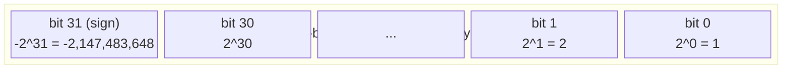

**Key operations that CTCI problems exploit:**

| Operation | C/Java | Effect |
|-----------|--------|--------|
| Test bit k | `(n >> k) & 1` | Extract single bit |
| Set bit k | `n \| (1 << k)` | Force bit to 1 |
| Clear bit k | `n & ~(1 << k)` | Force bit to 0 |
| Toggle bit k | `n ^ (1 << k)` | Flip bit |
| Count set bits | `n & (n-1)` removes lowest set bit | O(popcount) iterations |

### 1.2 Bit Vector: 256-char Set in One Integer

The classic "unique characters" problem (CTCI 1.1) exploits that 26 lowercase letters fit in 26 bits of one `int`:

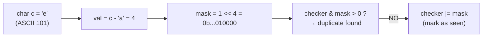

**Memory saving**: `boolean[256]` = 256 bytes; `int checker` = 4 bytes. 64× compression.

### 1.3 XOR Properties for Interview Problems

XOR (`^`) is commutative, associative, and `x ^ x = 0`, `x ^ 0 = x`. These allow:
- Finding the unique element in an array where all others appear twice: `result = XOR of all elements`
- Swap without temp: `a ^= b; b ^= a; a ^= b`

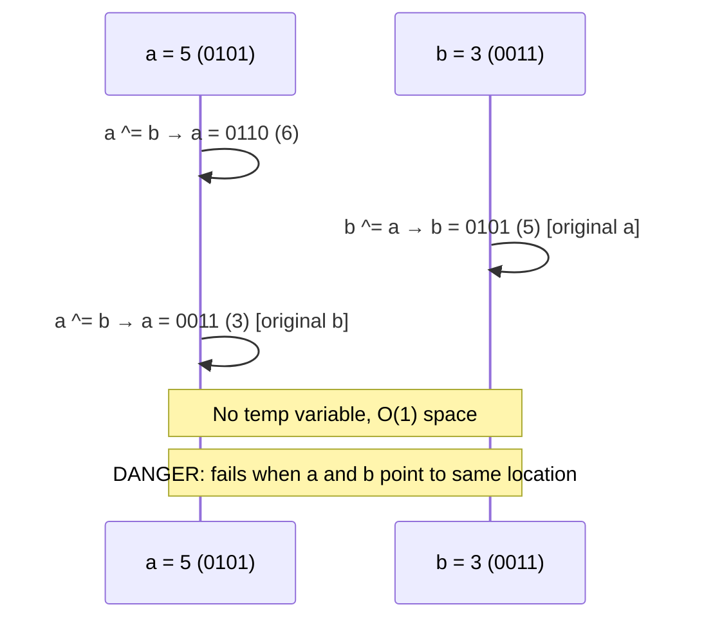

---

## 2. Hash Tables: Collision Chain Memory Model

### 2.1 Java HashMap Internal Buckets

```mermaid
block-byzantine
  columns 1
  block:HM["HashMap<K,V> internals"]:1
    A["Entry[] table (array of bucket heads)"]
    B["Entry{hash, key, value, next} — linked list nodes"]
    C["loadFactor = 0.75 (default)"]
    D["threshold = table.length × loadFactor"]
  end
```

**Put operation mechanics:**
```
hash = key.hashCode() ^ (hash >>> 16)   // spread high bits
index = hash & (table.length - 1)        // modulo via bitmask (power-of-2 tables)
```

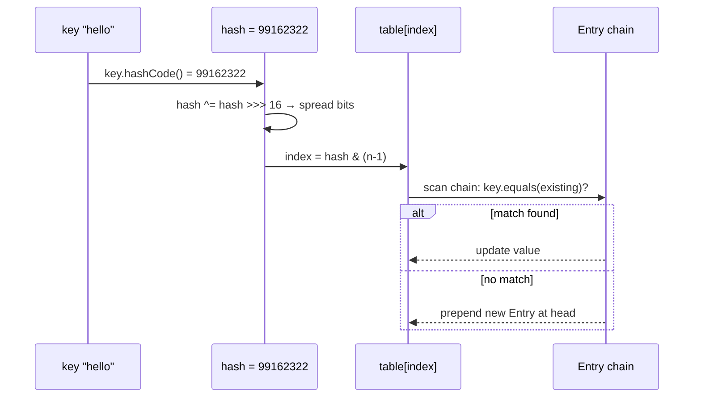

### 2.2 Amortized Resize Cost

When `size > threshold`, HashMap doubles `table.length` and **rehashes all entries**:

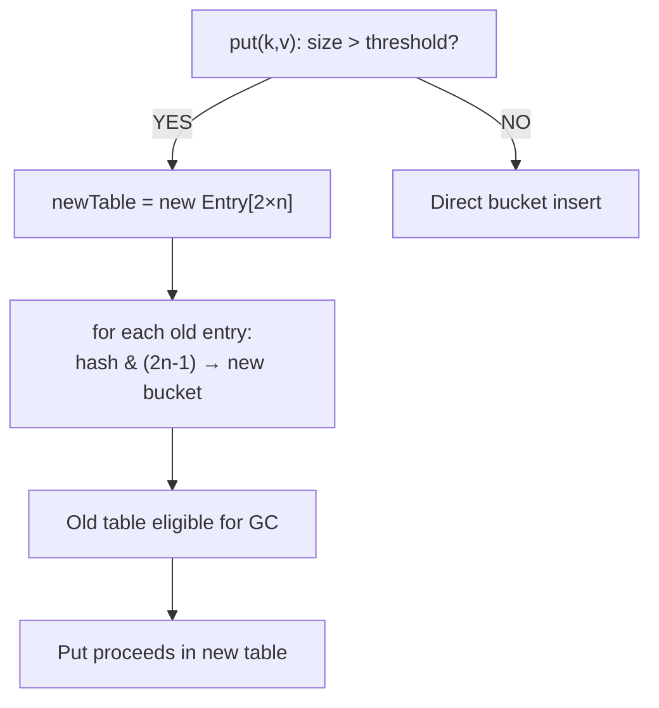

Amortized O(1) per insert because: total work across N inserts = O(N + N/2 + N/4 + ...) = O(2N) = O(N).

---

## 3. Linked List: Pointer Mechanics and Two-Pointer Patterns

### 3.1 Node Memory Layout

```
class Node {
    int data;      // 4 bytes
    Node next;     // 8 bytes (64-bit reference)
    // JVM object header: 16 bytes
    // Total: 28 bytes → padded to 32 bytes
}
```

A linked list of N nodes uses **32N bytes** on 64-bit JVM — vs `int[N]` = 24+4N bytes. Arrays are 7-8× more memory-efficient for integers.

### 3.2 Floyd's Cycle Detection — Two Pointers

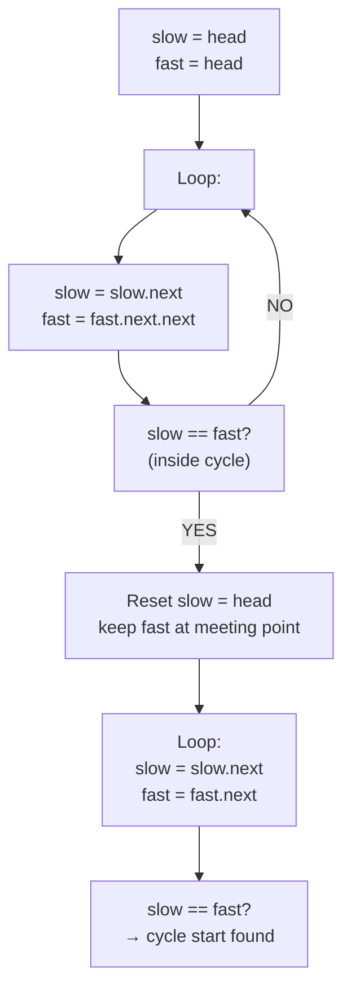

**Mathematical invariant**: If cycle has length `c` and head-to-cycle-entry distance is `d`, when slow enters cycle (after `d` steps), fast is at position `2d mod c` in cycle. They meet after additional `(c - d mod c) mod c` steps. Re-meeting from head converges at cycle entry.

### 3.3 Find K-th from Last — Space-Optimized Two Pointers

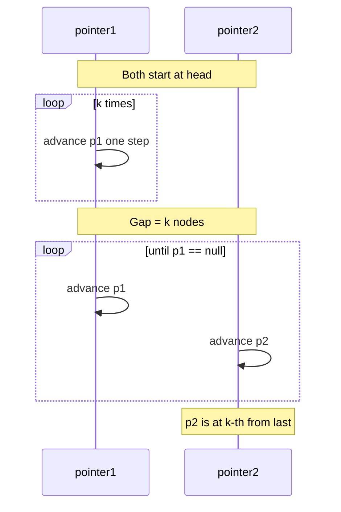

O(N) time, O(1) space — versus storing all nodes in an array which is O(N) space.

---

## 4. Stacks and Queues: Memory and Cache Behavior

### 4.1 Stack via Linked List vs Array

```mermaid
block-byzantine
  columns 2
  block:LL["Linked-List Stack"]:1
    A["Each push: heap-allocate Node (32B)"]
    B["Unlimited size, no resize"]
    C["Cache-UNFRIENDLY: nodes scattered"]
    D["GC pressure: O(N) Node objects"]
  end
  block:Arr["Array Stack (ArrayDeque)"]:1
    E["Pre-allocated array, doubly-indexed"]
    F["Resize doubles array: O(N) amortized"]
    G["Cache-FRIENDLY: contiguous memory"]
    H["One GC root for entire stack"]
  end
```

### 4.2 Queue via Two Stacks — Amortized Analysis

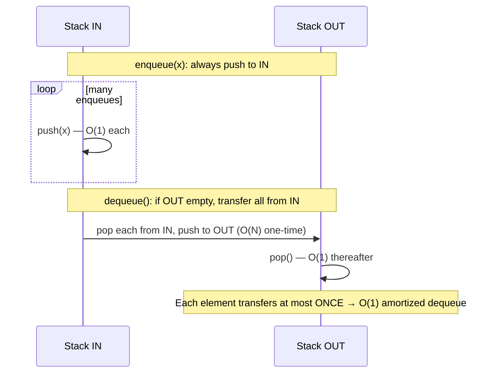

---

## 5. Trees: DFS Recursion Stack, BFS Queue, and Memory

### 5.1 BST Memory per Node in Interview Code

```
class TreeNode {
    int val;
    TreeNode left;
    TreeNode right;
    // JVM: 16B header + 4B int + 2×8B refs + 4B pad = 40 bytes per node
}
// N-node BST: 40N bytes (vs O(N log N) for sorted array equivalent)
```

### 5.2 DFS — Call Stack Depth Analysis

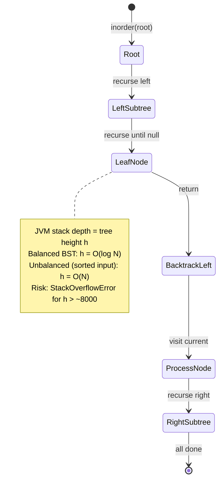

### 5.3 BFS — Level-Order Queue Memory

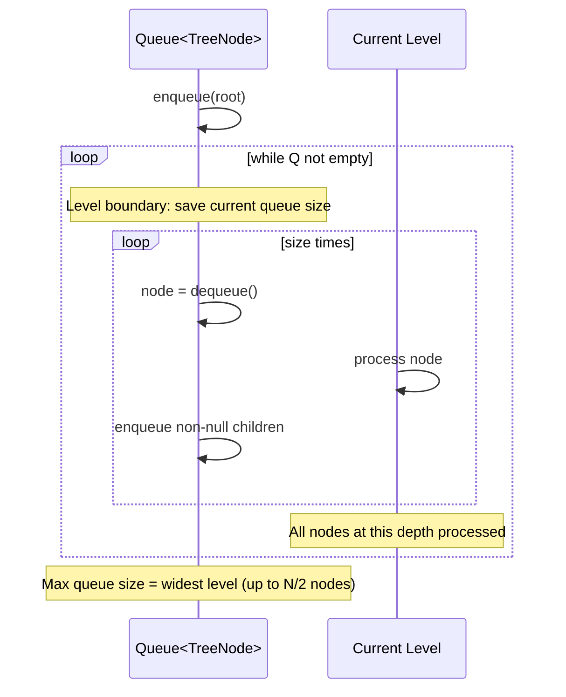

**Memory peak**: at the widest level of a complete binary tree, queue holds `N/2` nodes → O(N) space. DFS uses O(h) stack space = O(log N) for balanced tree.

### 5.4 LCA (Lowest Common Ancestor) — Path Comparison

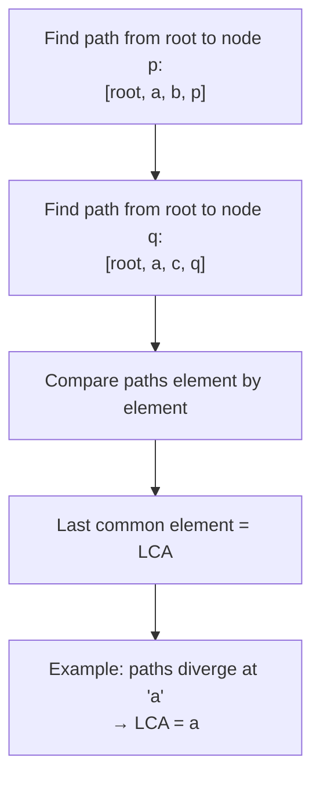

**Space**: O(log N) per path for balanced tree. **Alternative**: track parent pointers and use a HashSet of ancestors — O(h) space, O(h) time.

---

## 6. Dynamic Programming: Memoization vs Tabulation Memory Models

### 6.1 Fibonacci — Exponential vs Linear Memory

**Naive recursion** (call tree):
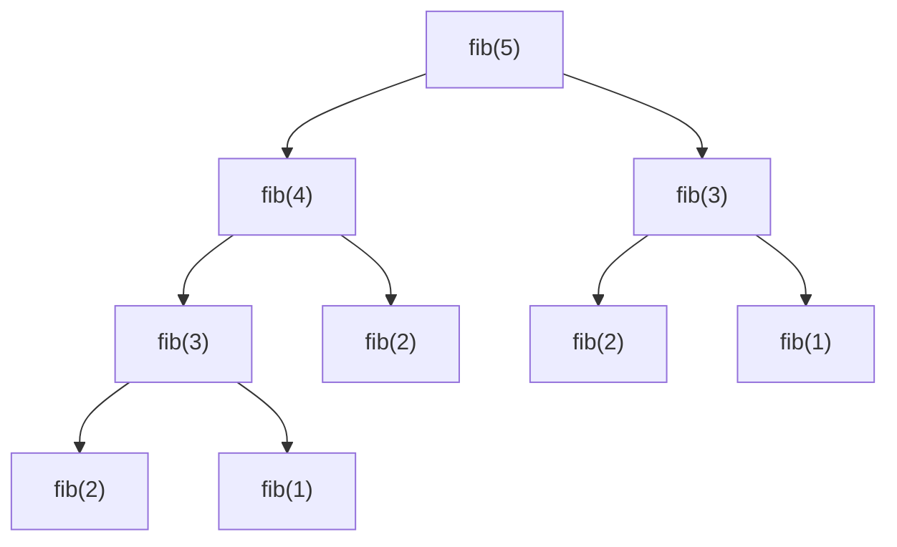

Time: O(2^N), Space: O(N) call stack — but 2^N redundant computations.

**Top-down memoization** (HashMap cache):
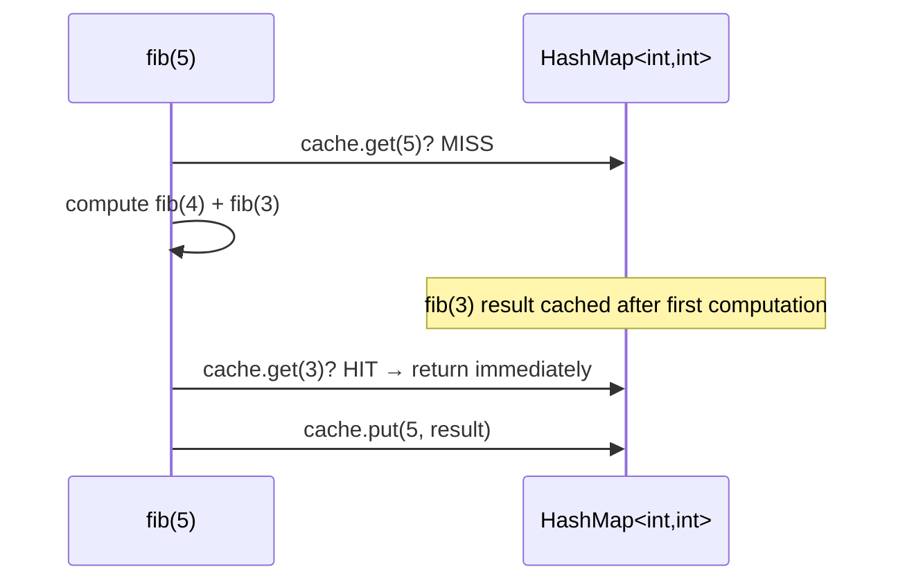

**Bottom-up tabulation** (array):
```
dp[0] = 0, dp[1] = 1
for i = 2..N: dp[i] = dp[i-1] + dp[i-2]
// Further optimized: only keep last 2 values → O(1) space
```

### 6.2 Coin Change DP — Table Filling Pattern

For CTCI-style "number of ways to make change" problems, the DP table `ways[i][j]` = number of ways to make `j` cents using first `i` coin types:

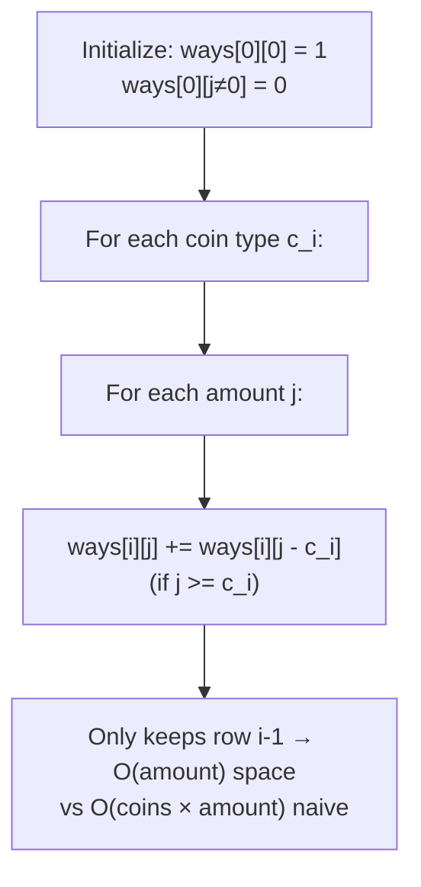

**Space optimization**: Since `ways[i][j]` only depends on `ways[i][j - coin]` (same row!), a single 1D array suffices.

### 6.3 String DP: Edit Distance — 2D Table Layout

```mermaid
block-byzantine
  columns 1
  block:ED["Edit Distance dp[i][j] = edit dist(s1[0..i], s2[0..j])"]:1
    R0["dp[0][j] = j (insert j chars)"]
    R1["dp[i][0] = i (delete i chars)"]
    R2["dp[i][j] = dp[i-1][j-1]  if s1[i]==s2[j]"]
    R3["dp[i][j] = 1 + min(dp[i-1][j], dp[i][j-1], dp[i-1][j-1])  else"]
  end
```

**Cache behavior**: Row-major iteration through `dp[i][j]` → `dp[i+1][j]` accesses stride 1 in C/Java arrays (cache-friendly). Only two rows needed at a time → O(min(m,n)) space.

---

## 7. Recursion: Call Stack Frame Layout and Base Case Analysis

### 7.1 Permutation Generation — Stack Frame Count

For permutations of N characters, the recursion tree has:
- Depth N (one character fixed per level)
- Each level k has `N × (N-1) × ... × (N-k+1)` active calls
- Total frames created: `N! × N / N = N × N!` / N = O(N × N!)... but not all simultaneously

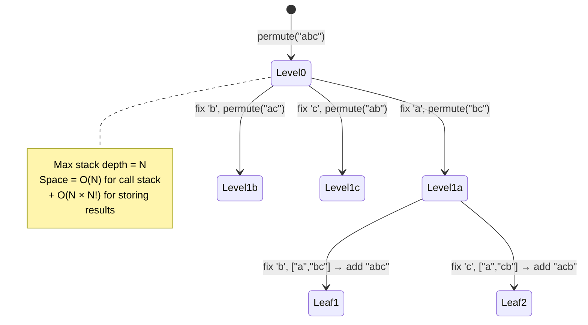

### 7.2 Tower of Hanoi — Exponential Work, Linear Space

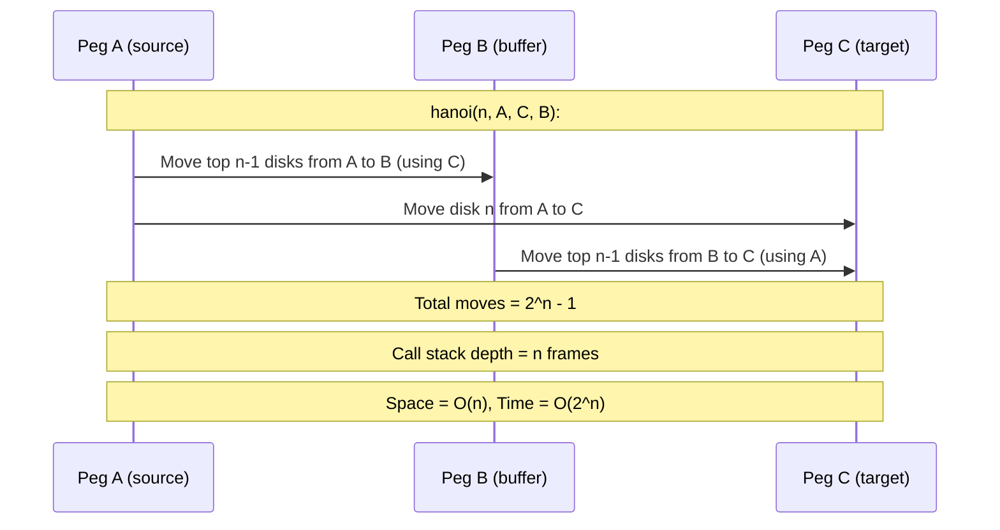

**Why 2^n - 1**: Let T(n) = moves for n disks. T(1)=1, T(n) = 2T(n-1) + 1. Solving: T(n) = 2^n - 1.

---

## 8. Sorting and Searching: Internal Mechanics for Interview Contexts

### 8.1 Quicksort Partition Pointer Dance

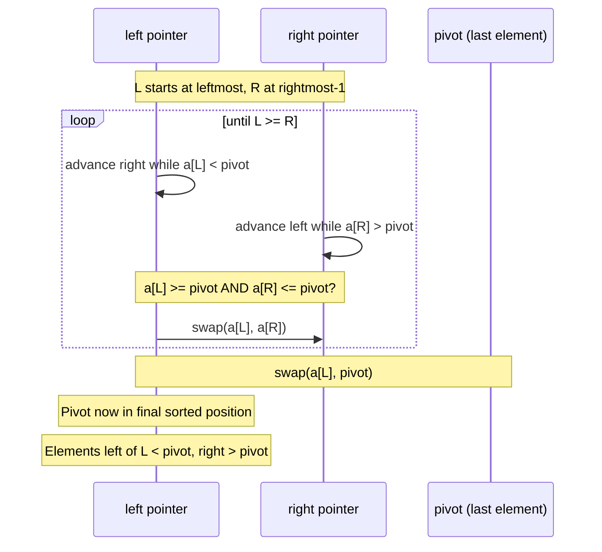

**Worst case** (sorted input, last-element pivot): pivot is always min/max → O(N²). Fix: median-of-three pivot selection.

### 8.2 Binary Search — Integer Overflow Bug

Classic binary search has a famous integer overflow bug:
```java
// BUG: mid = (lo + hi) / 2 — overflows if lo+hi > Integer.MAX_VALUE
// FIX: mid = lo + (hi - lo) / 2
```

```mermaid
flowchart LR
    A["lo = 2^30\nhi = 2^30 + 1"] --> B["lo + hi = 2^31 + 1\n→ INTEGER OVERFLOW → negative!"]
    A --> C["hi - lo = 1\nlo + (hi-lo)/2 = 2^30\n→ CORRECT"]
```

### 8.3 Merge Sorted Arrays In-Place — From Back to Front

Merging array A (with m elements + buffer) and array B (with n elements) — starting from the back avoids extra space:

```mermaid
sequenceDiagram
    participant A as Array A[0..m-1 + n buffer]
    participant B as Array B[0..n-1]
    participant PA as pointer a = m-1
    participant PB as pointer b = n-1
    participant PW as write = m+n-1

    loop until one array exhausted
        Note over PA,PB: Compare A[a] and B[b]
        alt A[a] >= B[b]
            PA->>A: A[write] = A[a], a--, write--
        else
            PB->>A: A[write] = B[b], b--, write--
        end
    end
    Note over A: Copy remaining B elements to front of A
```

Writing **from back to front** means we never overwrite unread elements — O(1) extra space.

---

## 9. System Design: Memory Constraints and Data Partitioning

### 9.1 Bit Array for Duplicate Detection (CTCI Ch.12)

Problem: Given 4GB file with 32-bit integers, find any duplicate using only 1GB RAM.

```mermaid
flowchart TD
    A["4GB file = 10^9 32-bit ints"] --> B["2^32 possible values = 4 billion"]
    B --> C["Bit array: 2^32 bits = 512 MB\n(one bit per possible value)"]
    C --> D["Pass 1: set bit for each int seen"]
    D --> E["Pass 2: if bit already set → DUPLICATE"]
    E --> F["Total memory: 512 MB < 1 GB ✓"]
```

### 9.2 External Sort — Disk I/O Pattern

For sorting a file too large to fit in RAM:

```mermaid
sequenceDiagram
    participant Disk as Disk (input file)
    participant RAM as RAM (1 GB chunks)
    participant Tmp as Temp files (sorted runs)
    participant Out as Output file

    loop until input exhausted
        Disk->>RAM: Load 1GB chunk
        RAM->>RAM: Sort in-memory (quicksort/mergesort)
        RAM->>Tmp: Write sorted run to disk
    end
    Note over Tmp: K sorted runs of 1GB each
    loop K-way merge
        Tmp->>RAM: Read one buffer per run (K buffers)
        RAM->>RAM: K-way merge via min-heap
        RAM->>Out: Write merged output buffer
    end
```

K-way merge uses a min-heap of size K → O(K log K) per element → total O(N log K) where K = number of runs.

---

## 10. Threads and Locks: Monitor Model and Deadlock Mechanics

### 10.1 Java Monitor — Object Header Lock Word

Every Java object has a **2-word object header**: 8 bytes mark word + 4-byte class pointer (compressed OOPs) = 12 bytes. The **mark word** encodes lock state:

```mermaid
stateDiagram-v2
    [*] --> Unlocked : fresh object
    Unlocked --> Biased : first thread claims biased lock\n(thread ID stored in mark word)
    Biased --> Lightweight : second thread contends\n(CAS spin lock, stack-based)
    Lightweight --> Heavyweight : long contention\n(OS mutex, kernel mode)
    Heavyweight --> Unlocked : last thread releases
```

**Deadlock conditions** (all 4 must hold simultaneously):
1. **Mutual exclusion**: resources held exclusively
2. **Hold and wait**: process holds lock while waiting for another
3. **No preemption**: locks cannot be forcibly taken
4. **Circular wait**: process A waits for B, B waits for A

```mermaid
flowchart LR
    T1["Thread 1:\nhas Lock A\nwaiting for Lock B"] --> T2["Thread 2:\nhas Lock B\nwaiting for Lock A"]
    T2 --> T1
    Note["DEADLOCK: circular wait\nneither can proceed"]
```

**Prevention**: always acquire locks in the same global order across all threads.

### 10.2 Producer-Consumer — wait/notify Memory Visibility

```mermaid
sequenceDiagram
    participant Producer
    participant Queue as Shared Queue (synchronized)
    participant Consumer

    Producer->>Queue: synchronized(queue) { queue.add(item) }
    Queue->>Consumer: notifyAll() — wake waiting consumers
    Consumer->>Queue: synchronized(queue) { while(queue.isEmpty()) wait() }
    Note over Queue: Java Memory Model guarantees:\n- All writes before notify() visible after wait() returns
    Note over Queue: volatile field or synchronized block\n= happens-before relationship
```

---

## 11. Algorithm Patterns — Complexity Under the Hood

### 11.1 Five Approaches Mapped to Complexity Classes

CTCI describes 5 approaches. Here's their algorithmic genealogy:

```mermaid
flowchart TD
    P1["Exemplify → Pattern Recognition\n→ O(1) or O(N) with insight"] --> P2["Simplify → Reduce to known problem\n→ amortized same as base algorithm"]
    P2 --> P3["Base Case & Build\n→ Mathematical induction\n→ often O(2^N) naively, O(N!) with memoization"]
    P3 --> P4["Data Structure Brainstorm\n→ Mapping to ADT operations\n→ O(log N) if heap/BST, O(1) amort if hash"]
    P4 --> P5["BUD Optimization\nBottleneck + Unnecessary + Duplicate\n→ Profile inner loop → find dominant term"]
```

### 11.2 Space-Time Tradeoff Map

```mermaid
block-byzantine
  columns 3
  block:h1["Problem"]:1
  block:h2["Time-optimal"]:1
  block:h3["Space-optimal"]:1

  block:r1["Unique characters"]:1
  block:r2["O(N) hash set"]:1
  block:r3["O(1) bit vector\n(if ASCII)"]

  block:r4["Two-sum"]:1
  block:r5["O(N) hash map"]:1
  block:r6["O(N log N) sort\n+ O(1) two-pointer"]

  block:r7["Palindrome check"]:1
  block:r8["O(N) with center expand"]:1
  block:r9["O(1) space, O(N) time\n(no extra array)"]

  block:r10["Anagram detection"]:1
  block:r11["O(N) frequency array"]:1
  block:r12["O(N log N) sort both\nO(1) extra space"]

  block:r13["LRU cache"]:1
  block:r14["O(1) HashMap + DoublyLinkedList"]:1
  block:r15["O(1) space not possible\n(must store N items)"]
```

---

## 12. Data Flow: From Problem Statement to Memory Operations

```mermaid
flowchart TD
    Problem["Interview Problem:\n'Find all subsets of a set'"] --> Recognize["Pattern: Binary number 0..2^N-1\neach bit = include/exclude element"]
    Recognize --> Memory["Memory: List<List<Integer>>\n2^N sublists, average N/2 elements each\n= O(N × 2^N) total"]
    Memory --> Loop["For each i in 0..2^N-1:\n  For each bit j in 0..N-1:\n    if (i >> j) & 1: include element j"]
    Loop --> Cache["Inner loop: test bit j of integer i\n= 2 integer operations\n→ CPU register ops, cache-line irrelevant"]
    Cache --> Result["Total time: O(N × 2^N)\nTotal space: O(N × 2^N)"]
```

This is the **canonical subset enumeration** approach — it avoids recursion entirely, replacing the call stack with the binary bit pattern of the outer loop variable.

---

*Document synthesized from Cracking the Coding Interview, 4th Edition (Gayle Laakmann McDowell) — covering bit manipulation (Ch.5), hash tables (Ch.1), linked lists (Ch.2), stacks/queues (Ch.3), trees/graphs (Ch.4), recursion (Ch.8), dynamic programming, sorting (Ch.9), system design (Ch.12), and threading (Ch.18), with focus on internal memory models and algorithmic invariants.*
