# Erickson & Zingaro: Algorithm Internals — Recursion Trees, Backtracking, DP, Graphs

> Sources: *Algorithms* by Jeff Erickson (CC-BY 4.0, 2019) and *Algorithmic Thinking: A Problem-Based Introduction* by Daniel Zingaro (No Starch Press, 2021)

---

> **Reading contract:** This document combines Erickson 2019 and Zingaro 2021, whose examples and notation are not interchangeable by default. Recurrence trees assume a particular recurrence and base case; graph and DP bounds assume a finite representation and named edge or dependency conditions. Tag statements as theorem, proof sketch, implementation model, or heuristic. A section is complete only when its state definition, invariant, input domain, termination or failure condition, complexity measure, and source are explicit; otherwise do not generalize the diagram beyond its example.

## 1. Recursion Tree Arithmetic — Where Time Complexity Lives

A recurrence of the form T(n) = r·T(n/c) + f(n), with a specified rounding rule and base case, can be represented by a **recursion tree** whose node costs sum to the modeled running time. Unequal subproblem sizes or input-dependent work require the corresponding recurrence rather than this uniform template.

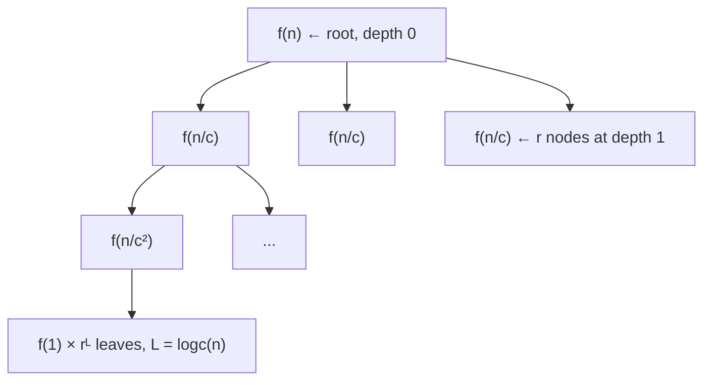

**Level-by-level summation:**

```
T(n) = Σ_{i=0}^{L} rⁱ · f(n/cⁱ),   L = log_c(n)
```

Three master cases for geometric sums:

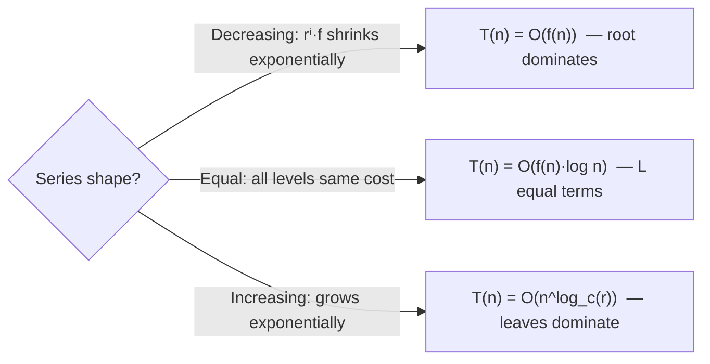

### Mergesort Recursion Tree — Equal Case

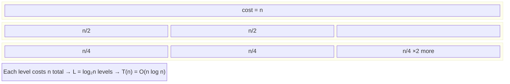

**Unbalanced Quicksort worst case:** T(n) = T(n−1) + T(1) + O(n) → sawtooth tree with n levels each costing ≤ n → O(n²).

---

## 2. Recursion Call Stack — Memory Model

When a recursive algorithm executes, the OS kernel's stack segment grows and shrinks deterministically:

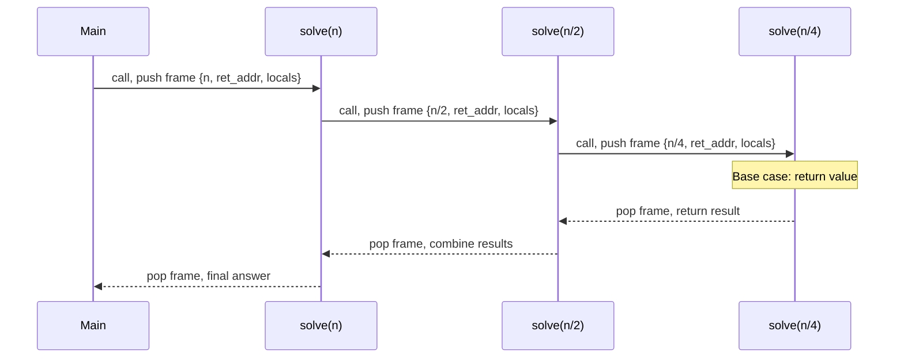

**Stack memory per frame** (x86-64):
- Return address: 8 bytes
- Saved registers: ~48 bytes
- Local variables: problem-dependent
- Total depth × frame_size = peak stack usage

For mergesort on n=10⁶: depth = 20 frames × ~200 bytes ≈ 4 KB stack — negligible.  
For naïve Fibonacci(n): depth = n → stack overflow at n≈100,000 on typical 8 MB stack.

---

## 3. Backtracking — Implicit Search Tree Traversal

Backtracking systematically enumerates a combinatorial search space by DFS on an **implicit** tree of partial solutions.

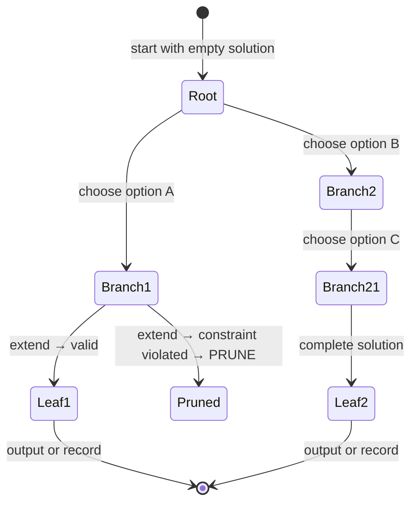

**Pruning power:** A backtracking algorithm with branching factor b and depth d has worst-case O(bᵈ) nodes, but effective pruning can reduce average-case to O(bᵈ/²) or better.

### General Backtracking Template — Call Stack Dynamics

```
BACKTRACK(partial_solution S, choices remaining C):
  if S is complete:
      output S; return
  for each choice c in C:
      if is_valid(S + c):           ← constraint check
          S.push(c)                  ← extend
          BACKTRACK(S, C \ {c})      ← recurse
          S.pop(c)                   ← undo (key operation)
```

The `pop` step is what distinguishes backtracking from greedy — we **undo** the choice and try alternatives:

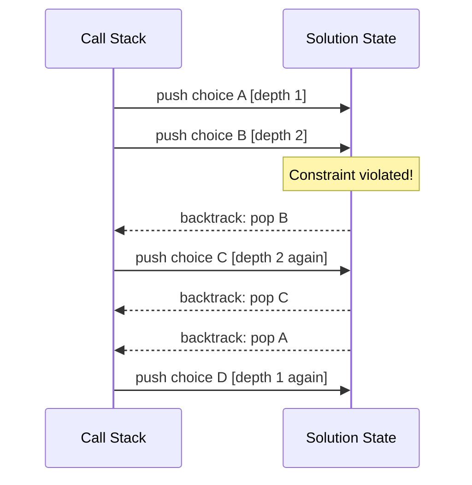

---

## 4. Dynamic Programming — Dependency Graph as DAG

A finite acyclic DP dependency system can be viewed as **topological-order evaluation of a DAG** where:
- Node = subproblem
- Edge u → v = "solving u requires solving v first"
- Node value = optimal subproblem answer

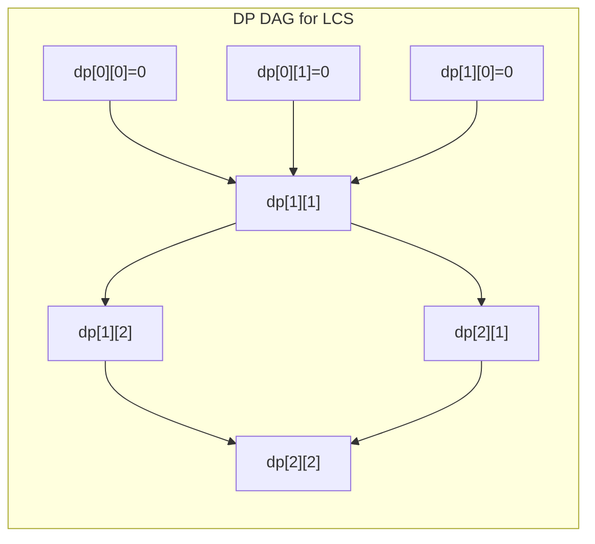

The evaluation order (BFS level-by-level or topological DFS postorder) ensures that when dp[i][j] is computed, all its dependencies dp[i−1][j], dp[i][j−1], dp[i−1][j−1] are already resolved.

### Memoization vs. Bottom-Up — Memory Access Patterns

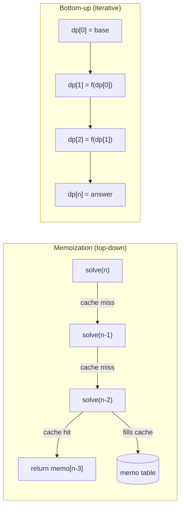

**Cache performance:** Bottom-up writes sequentially to an array → sequential memory access → CPU prefetcher works perfectly.  
Memoization uses hash table or sparse array → random access → more cache misses.

### Interval DP — Memory Layout for Matrix Chain Multiplication

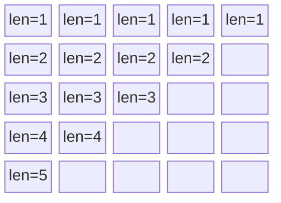

Fill diagonally: length-1 chains first (trivial), then length-2 (one split), up to length-n (full chain). Each cell dp[i][j] reads from dp[i][k] and dp[k+1][j] for all split points k — all previously computed cells.

---

## 5. Depth-First Search — White/Gray/Black Clock Model

Erickson's DFS assigns timestamps: each vertex gets discovery time (pre) and finish time (post).

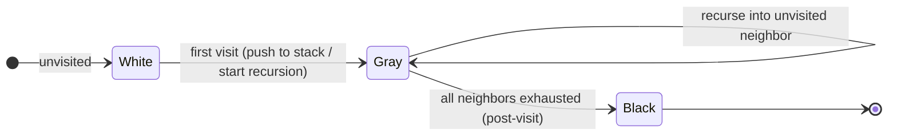

**Edge classification by color at visit time:**

| Edge type | Condition |
|-----------|-----------|
| Tree edge | neighbor is White when visited |
| Back edge | neighbor is Gray (ancestor in DFS tree) |
| Forward edge | neighbor is Black, post(v) < post(u) |
| Cross edge | neighbor is Black, post(v) > post(u) |

Back edges ↔ cycles. A directed graph is a DAG iff DFS finds **no back edges**.

### DFS Call Stack — Frame Contents

```mermaid
sequenceDiagram
    participant Kernel as OS Stack
    participant DFS_A as DFS(A)
    participant DFS_B as DFS(B)
    participant DFS_C as DFS(C)

    DFS_A->>DFS_A: pre[A] = clock++; color[A] = GRAY
    DFS_A->>DFS_B: neighbor B is WHITE → recurse
    DFS_B->>DFS_B: pre[B] = clock++; color[B] = GRAY
    DFS_B->>DFS_C: neighbor C is WHITE → recurse
    DFS_C->>DFS_C: pre[C] = clock++; no unvisited neighbors
    DFS_C->>DFS_C: post[C] = clock++; color[C] = BLACK
    DFS_C-->>DFS_B: return
    DFS_B->>DFS_B: post[B] = clock++; color[B] = BLACK
    DFS_B-->>DFS_A: return
    DFS_A->>DFS_A: post[A] = clock++; color[A] = BLACK
```

**Topological sort = reverse postorder:** vertices are written to output array in order of **decreasing** post time → O(V+E) single DFS pass.

---

## 6. Topological Sort — Internal Mechanics

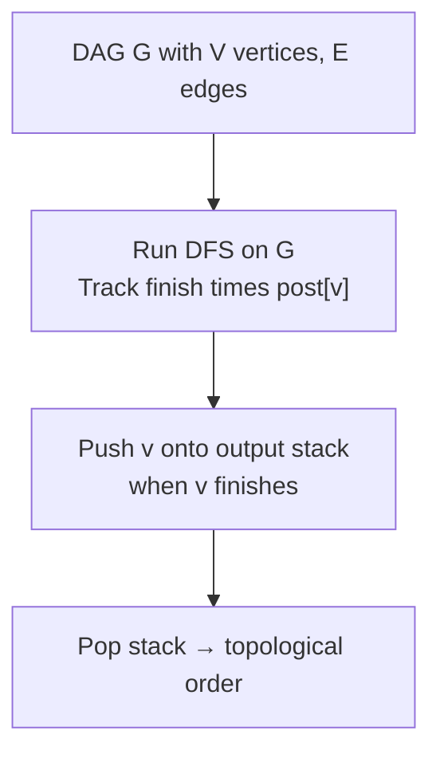

**Why reversal of postorder works:**

For any edge u → v in a DAG, the DFS finishes v before u (because v's subtree is explored while u is still on the stack). Therefore post[v] < post[u]. Reversing postorder (largest post first) yields u before v — i.e., directed edge u→v points left-to-right. QED.

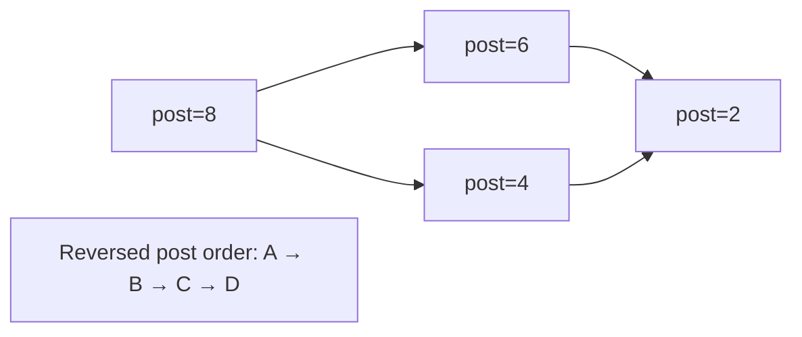

---

## 7. BFS — Wave Frontier and Distance Matrix

Zingaro's BFS model uses two arrays (cur_positions / new_positions) rather than a queue — mechanically identical but more explicit about "rounds":

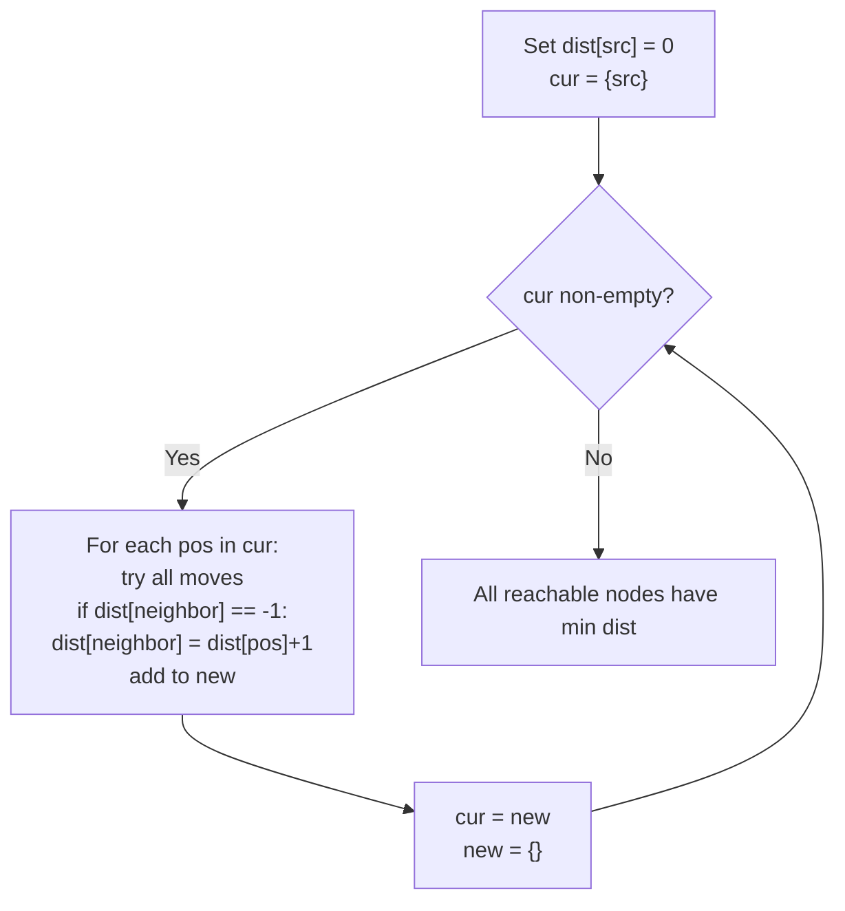

**Memory layout for board-BFS:**

```
min_moves[row][col]  ← 2D array, -1 = unvisited
                        value = min moves to reach cell
```

The `min_moves[to] == -1` guard in `add_position` is the **visited check** — prevents re-adding squares with worse distances. This is BFS's analog of the closed-set in A*.

### BFS vs DFS — When Each Discovers Nodes

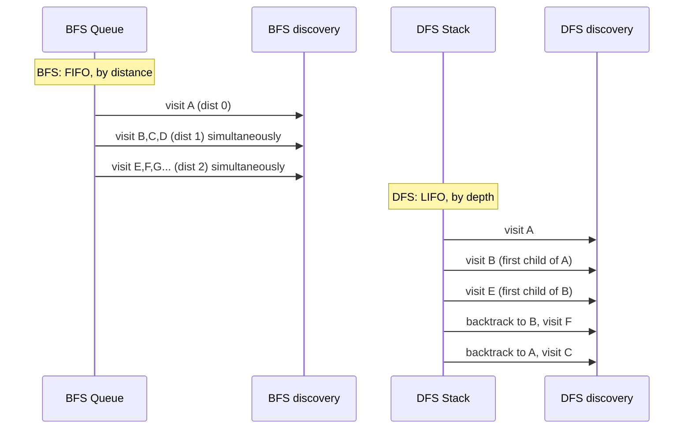

BFS gives **shortest paths in unweighted graphs** because nodes at distance d are fully processed before any node at distance d+1 is visited.

---

## 8. Hash Tables — Collision Resolution Internals (Zingaro)

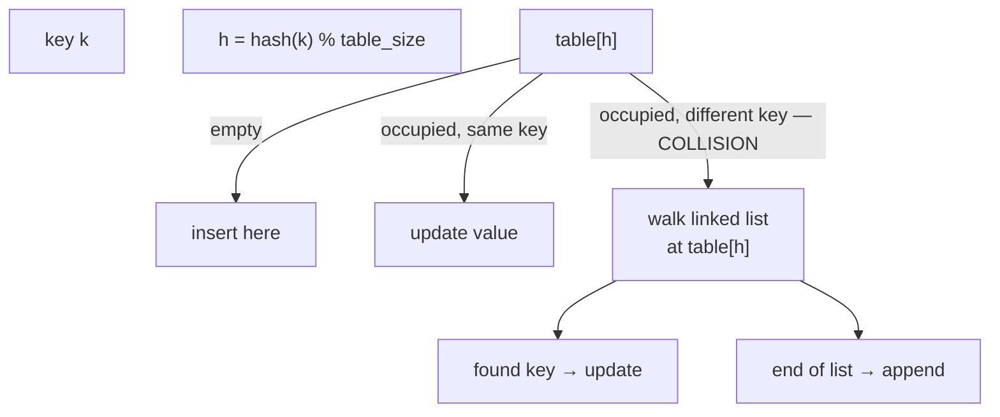

**Chaining internals:**

```
typedef struct node {
    int keys[6];    /* snowflake arms */
    struct node *next;
} node;

table[h] → node → node → node → NULL
```

Each slot holds a pointer to a singly-linked list. Lookup traverses the chain comparing keys byte-by-byte.

**Load factor λ = n/m** (n items, m slots). Expected chain length = λ. For λ=1: O(1) average lookup. For λ>>1: degrades to O(n).

### OAT Hash Function — Bob Jenkins' One-At-A-Time

```
hash = 0
for each byte b in key:
    hash += b
    hash += (hash << 10)
    hash ^= (hash >> 6)
hash += (hash << 3)
hash ^= (hash >> 11)
hash += (hash << 15)
```

Avalanche property: changing 1 bit in key changes ~half the bits in hash. This spreads keys uniformly across table slots, minimizing collisions.

---

## 9. Binary Trees — Memory Layout and Traversal Mechanics

Zingaro's Halloween Haul problem uses binary trees encoded as parenthesized strings — a clever serialization:

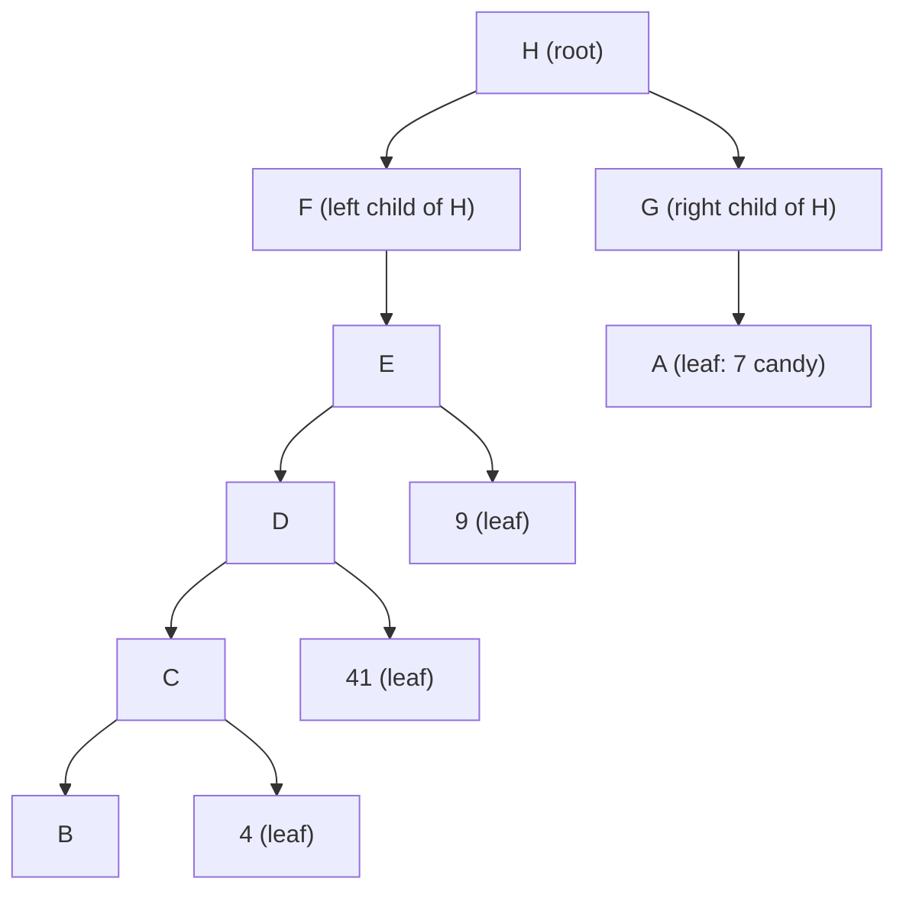

**Recursive traversal mechanics — call stack during postorder DFS:**

Each recursive call pushes a frame onto the OS stack containing:
- Pointer to current node
- Return address
- Local variables (left_result, right_result)

The postorder pattern `(process left) → (process right) → (combine)` means parent node is processed only after both subtrees fully unwind:

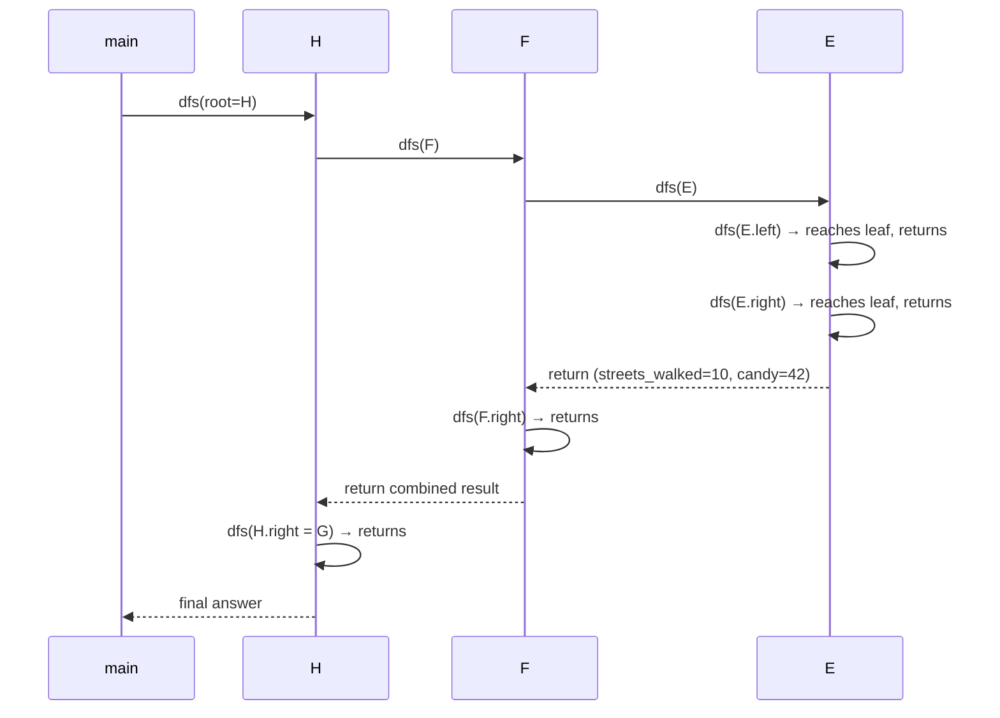

---

## 10. Union-Find — Path Compression and Rank — Memory Evolution

Union-Find maintains a forest of trees in an array. Each element stores only its parent index.

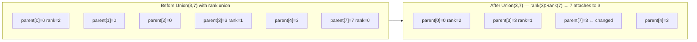

**Path compression during Find:**

```
Find(x):
  if parent[x] != x:
      parent[x] = Find(parent[x])   ← flatten path recursively
  return parent[x]
```

After `Find(4)` in a deep tree 4→3→1→0:

```
Call stack:     Find(4) → Find(3) → Find(1) → Find(0) returns 0
Unwind:         parent[1]=0, parent[3]=0, parent[4]=0
Result: all nodes now point directly to root
```

**Amortized analysis:** With union-by-rank + path compression, any sequence of m Find/Union operations costs O(m · α(n)) where α is the inverse Ackermann function — effectively O(1) per operation for all practical n.

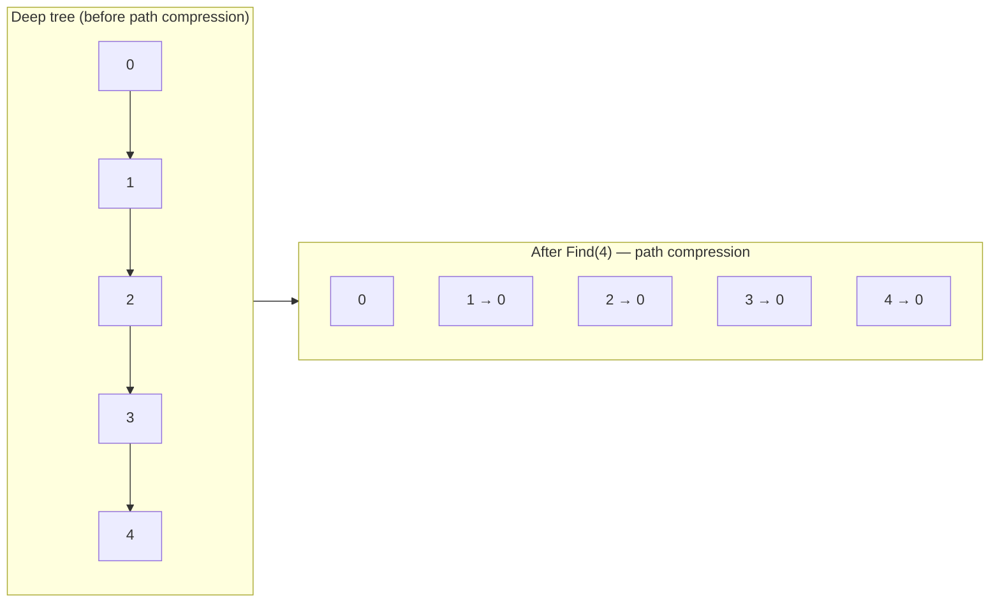

---

## 11. Heaps and Segment Trees — Two Data Structures for Order Statistics

### Binary Heap — Array-Embedded Complete Binary Tree

```mermaid
graph TD
    n1["A[1]=10 (root)"]
    n2["A[2]=8"]
    n3["A[3]=7"]
    n4["A[4]=5"]
    n5["A[5]=6"]
    n6["A[6]=3"]
    n7["A[7]=2"]

    n1 --> n2
    n1 --> n3
    n2 --> n4
    n2 --> n5
    n3 --> n6
    n3 --> n7
```

**Index arithmetic (1-based):**
- Left child of i: `2i`
- Right child of i: `2i+1`
- Parent of i: `⌊i/2⌋`

**Sift-down during extraction:**

```mermaid
sequenceDiagram
    participant Heap
    Note over Heap: Extract max: swap A[1] with A[n], reduce heap size
    Heap->>Heap: i=1: compare A[1] with children A[2], A[3]
    Heap->>Heap: swap A[1] with larger child (A[2])
    Heap->>Heap: i=2: compare A[2] with A[4], A[5]
    Heap->>Heap: swap if needed... continue down
    Note over Heap: O(log n) swaps max = tree height
```

**Heap construction in O(n) (not O(n log n)):** Start from index n/2, call sift-down in reverse. The amortized argument: nodes at height h perform O(h) work; sum over all nodes = Σ_{h=0}^{log n} (n/2^{h+1}) · h = O(n).

### Segment Tree — Range Query with Lazy Propagation

```mermaid
graph TD
    root["[0..7]: max=9"]
    L["[0..3]: max=7"]
    R["[4..7]: max=9"]
    LL["[0..1]: max=5"]
    LR["[2..3]: max=7"]
    RL["[4..5]: max=6"]
    RR["[6..7]: max=9"]

    root --> L
    root --> R
    L --> LL
    L --> LR
    R --> RL
    R --> RR
```

**Range-max query [l, r]:** at each node [a,b], recurse into left child if l≤mid, right child if r>mid, return max of results. O(log n) nodes visited.

**Point update at index i:** traverse root → leaf, update each ancestor. O(log n) updates.

Segment trees store 4n elements in an array (safe upper bound for any n).

---

## 12. Dijkstra — Priority Queue Internals and Relaxation Wave

Dijkstra's algorithm is a **BFS with weighted edges** — instead of FIFO queue, use a min-heap keyed by distance.

```mermaid
flowchart TD
    Init["dist[src]=0, all others=∞\nPush (0, src) into min-heap"]
    Extract["Extract min (d, u) from heap"]
    Dead{"dist[u] < d?\n(stale entry)"}
    Dead -->|Yes — skip| Extract
    Dead -->|No — process| Relax["For each neighbor v of u:\n  if dist[u]+w(u,v) < dist[v]:\n    dist[v] = dist[u]+w(u,v)\n    push (dist[v], v) to heap"]
    Relax --> Extract
    Extract -->|heap empty| Done["dist[] = shortest paths from src"]
```

**Why Dijkstra fails with negative edges:** Once a node is "extracted" (marked settled), its distance is assumed final. A negative edge from a later node could provide a shorter path back, violating this invariant.

```mermaid
sequenceDiagram
    participant Heap as Min-Heap
    participant Dist as dist[]

    Note over Heap,Dist: src=A, edges: A→B:4, A→C:2, C→B:1
    Heap->>Dist: extract (0,A): relax B to 4, C to 2
    Heap->>Dist: extract (2,C): relax B to min(4, 2+1)=3
    Heap->>Dist: extract (3,B): B settled with dist=3
    Note over Dist: Correct! Greedy works because all weights ≥ 0
```

---

## 13. DP on Graphs — Erickson's Memoization = DFS with Cache

Erickson's central insight: **memoized recursion IS DFS on the subproblem dependency DAG**.

```mermaid
graph LR
    subgraph DFS_view["DFS on DAG"]
        direction TB
        v1["subproblem(n)"]
        v2["subproblem(n-1)"]
        v3["subproblem(n-2)"]
        v4["subproblem(0) = base"]
        v1 -->|depends| v2
        v2 -->|depends| v3
        v3 -->|depends| v4
    end

    subgraph Memo_view["Memoized recursion"]
        direction TB
        m1["solve(n)"]
        m2["solve(n-1) — cache miss, recurse"]
        m3["solve(n-2) — cache miss, recurse"]
        m4["solve(0) — base case, cache hit on all re-visits"]
        m1 --> m2
        m2 --> m3
        m3 --> m4
    end
```

The **memo table** is the DFS "visited" array; **computing the answer** is the PostVisit action; **returning the cached value** is the behavior when a node is re-visited (already finished = BLACK in DFS color model).

This unification means:
- A finite acyclic DP can often be implemented as memoized DFS when recursion depth and state storage are safe
- The same dependency DAG can be evaluated bottom-up when a valid topological order and reachable state set are known
- The dependency DAG structure determines both the space complexity (# subproblems) and the time complexity (# edges = work per subproblem × # subproblems)

---

## 14. Algorithm Selection Decision Framework

```mermaid
flowchart TD
    P["Problem type?"]
    P -->|Find ALL solutions| BT["Backtracking\n(DFS on solution space)"]
    P -->|Find OPTIMAL solution| OPT{"Overlapping\nsubproblems?"}
    OPT -->|Yes| DP["Dynamic Programming\n(memoize / bottom-up)"]
    OPT -->|No| GR{"Greedy\nchoice property?"}
    GR -->|Yes| Greedy["Greedy Algorithm"]
    GR -->|No| DC["Divide & Conquer"]
    P -->|Find path / connectivity| GRAPH{"Weighted?"}
    GRAPH -->|No| BFS["BFS — shortest unweighted path"]
    GRAPH -->|Yes, non-negative| DIJ["Dijkstra — O((V+E)logV)"]
    GRAPH -->|Yes, may be negative| BF["Bellman-Ford — O(VE)"]
    GRAPH -->|DAG only| DAGSP["DAG shortest path — topological DP O(V+E)"]
```

**Greedy choice property test:** Can the globally optimal solution always be extended from the locally optimal choice? If yes, greedy works. Proof method: exchange argument (assume greedy differs from OPT at step k, show swapping to greedy's choice doesn't worsen the solution).

**Overlapping subproblems test:** Does naive recursion recompute the same (argument set) → answer pair multiple times? If yes, memoize. The subproblem count times the per-subproblem work gives DP's time complexity.

---

## Summary — Internal Mechanisms Map

| Technique | Internal Mechanism | Memory Structure | Time Complexity |
|-----------|-------------------|------------------|-----------------|
| Divide & Conquer | Recursion tree evaluation | Call stack O(log n) frames | Master theorem |
| Backtracking | DFS on implicit solution tree | Call stack O(depth) | O(bᵈ) worst, pruned |
| Memoization DP | DFS + cache on dependency DAG | Hash table / array O(subproblems) | O(subproblems × work each) |
| Bottom-up DP | Topological order array fill | Array, sequential access | Same as memoization, better cache |
| BFS | FIFO wave frontier | Queue / two arrays O(V) | O(V+E) |
| DFS | LIFO stack / recursion | Stack O(V) | O(V+E) |
| Dijkstra | BFS + min-heap | Min-heap O(V) entries | O((V+E) log V) |
| Union-Find | Forest of parent pointers | Array O(n) | O(α(n)) amortized |
| Binary Heap | Complete tree in array | Array 2n slots | O(log n) push/pop, O(n) build |
| Segment Tree | Binary tree on ranges | Array 4n slots | O(log n) query/update |
