# Sedgewick & Wayne — Algorithms 4th Edition: Under the Hood

> **Source**: *Algorithms, 4th Edition* — Robert Sedgewick & Kevin Wayne, Princeton University (2011, 969 pp.)  
> **Focus**: Internal mechanics of every major data structure and algorithm — memory layout, pointer arithmetic, amortization proofs, cache behavior, and the mathematical invariants that make these algorithms correct.

---

> **Reading contract:** Scope is Sedgewick & Wayne 4th edition (2011) and its Java-oriented implementations. JVM object layout, `String` storage, cache-line size, allocation cost, and collection internals are versioned implementation facts, not Java or algorithm guarantees. Complexity claims must name the algorithm variant and input model; measured layout claims must name JDK, VM, architecture, and flags. A subsection is complete when invariant, preconditions, failure boundary, source chapter, and runtime version are present. If a newer runtime invalidates a layout, retire that example rather than carrying its conclusion forward.

## 1. Union-Find: Weighted Quick-Union with Path Compression

### 1.1 Memory Layout of the `id[]` / `sz[]` Arrays

Union-Find maintains two integer arrays of size N. In one assumed JVM layout, an `int[]` can be estimated as `24 + 4N` bytes after alignment. The header, length field, compression mode, and alignment are VM-specific, so confirm them with a layout tool before using this as a memory bound.

```
int[] id  →  [ heap header (16B) | N (4B) | pad(4B) | id[0] | id[1] | ... | id[N-1] ]
int[] sz  →  [ heap header (16B) | N (4B) | pad(4B) | sz[0] | sz[1] | ... | sz[N-1] ]
```

Every `find(p)` follows the `id` chain until `id[i] == i` (root). **Weighted quick-union** keeps trees flat by always attaching the smaller tree under the larger tree's root.

### 1.2 Path Compression State Machine

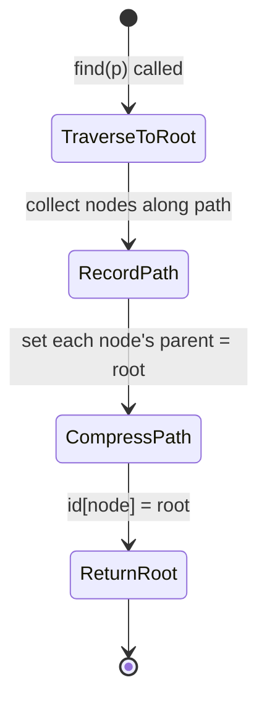

### 1.3 Tree Depth Analysis: Ackermann Inverse

Without path compression, weighted union gives tree depth ≤ lg N. With path compression, amortized cost per operation is O(α(N)) where α is the **inverse Ackermann function** — effectively ≤ 4 for any N that can be stored on Earth.

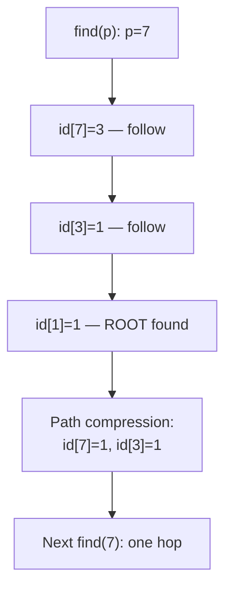

### 1.4 Union by Rank — Structural Invariant

```
union(p, q):
  rootP = find(p)
  rootQ = find(q)
  if rootP == rootQ: return   // already connected
  if sz[rootP] < sz[rootQ]:   // attach smaller under larger
      id[rootP] = rootQ
      sz[rootQ] += sz[rootP]
  else:
      id[rootQ] = rootP
      sz[rootP] += sz[rootQ]
```

This guarantees: any tree of height h has at least 2^h nodes → depth ≤ lg N.

---

## 2. Sorting: Internal Memory and Cache Mechanics

### 2.1 Mergesort — Bottom-Up Iterative Memory Flow

Top-down mergesort suffers from O(log N) recursive call stack frames. Bottom-up mergesort eliminates recursion entirely, merging runs of increasing size 1→2→4→8→...

```mermaid
sequenceDiagram
    participant Stack as Call Stack
    participant Aux as aux[] (heap, N ints)
    participant Arr as a[] (input array)

    Stack->>Arr: pass 0..N-1 reference
    Note over Stack,Aux: Bottom-up: no recursion stack frames
    loop sz = 1, 2, 4, 8, ...
        loop lo = 0; lo < N-sz
            Arr->>Aux: copy a[lo..mid] into aux[lo..mid]
            Aux->>Arr: merge aux[lo..mid] + a[mid+1..hi] → a[lo..hi]
        end
    end
```

**Key memory invariant**: `aux[]` is allocated once (N elements), never reallocated. Each merge pass reads from `a[]`, writes through `aux[]`, then writes back — 2N reads + 2N writes per pass × log N passes = **2N log N total memory operations**.

### 2.2 Mergesort vs Quicksort — Cache Line Behavior

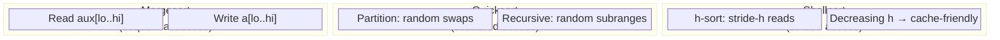

On a machine with 64-byte cache lines and 4-byte integers, a line holds 16 integers. Mergesort's sequential scan generally has strong spatial locality, but alignment, boundaries, and competing traffic prevent an "always full" guarantee. Large quicksort subranges can incur TLB misses; the rate is workload- and machine-dependent.

### 2.3 Quicksort Partition: 3-Way (Dijkstra Dutch Flag)

Standard 2-way partition degrades to O(N²) on equal keys. Sedgewick's 3-way partition maintains three regions:

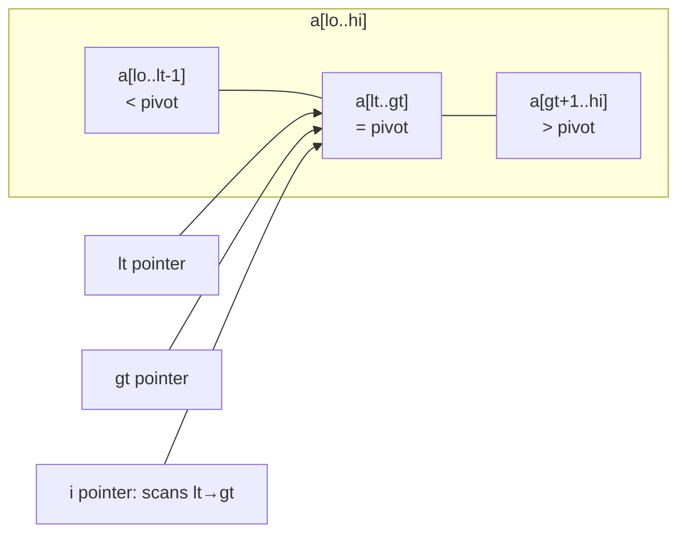

**Pointer invariant after each comparison:**
- `a[i] < pivot` → `swap(lt, i)`, `lt++`, `i++`
- `a[i] == pivot` → `i++` (no swap)
- `a[i] > pivot` → `swap(i, gt)`, `gt--` (i stays)

This reduces the sort of N equal keys from O(N²) to **O(N)**.

### 2.4 Heapsort — Binary Heap Memory Map

The heap stores a complete binary tree in a flat array with 1-based indexing. For node at index `k`: left child = `2k`, right child = `2k+1`, parent = `k/2`.

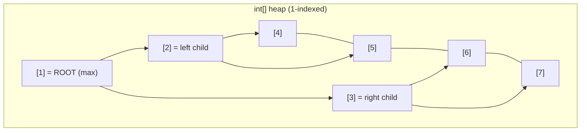

**Sink operation** (`sink(k, N)`): compare `a[k]` with max of `a[2k]`, `a[2k+1]`; swap down if necessary. Repeat until heap order restored. Cost = 2 lg N compares per `delMax()`.

**Heapsort phases:**
1. **Heapify**: Build max-heap bottom-up in O(N) time (not O(N log N)) — sinking from N/2 down to 1
2. **Sortdown**: Repeatedly extract max, shrink heap boundary by 1

---

## 3. Symbol Tables: BSTs and Red-Black Trees

### 3.1 BST Node Memory Layout

Each `Node` in a BST holds: `Key key`, `Value val`, `Node left`, `Node right`, `int N` (subtree size). In a 64-bit JVM with compressed OOPs:

```
Node object (56 bytes):
  ┌─────────────────────────────────────────┐
  │ object header (16 bytes)                │
  │ key reference (8 bytes → heap object)   │
  │ val reference (8 bytes → heap object)   │
  │ left reference (8 bytes → Node or null) │
  │ right reference (8 bytes → Node or null)│
  │ N (int, 4 bytes)                        │
  │ padding (4 bytes)                       │
  └─────────────────────────────────────────┘
```

For N nodes: heap usage = 56N bytes (keys/values excluded).

### 3.2 BST Search — Recursive Call Stack Depth

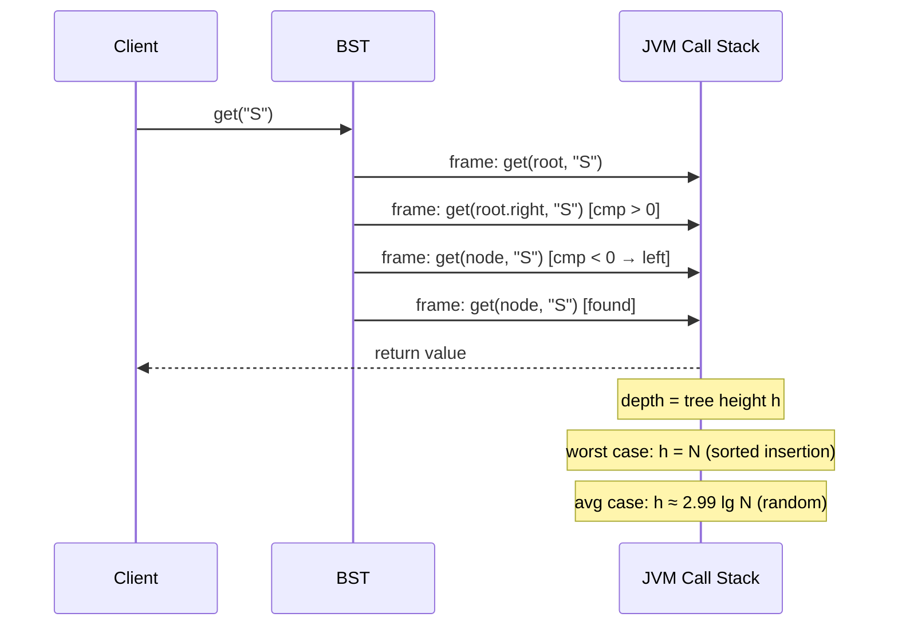

### 3.3 Red-Black BST: 2-3 Tree Encoding

Sedgewick's red-black BST encodes a 2-3 tree where red links represent 3-nodes (a node with two keys). The invariant: no two consecutive red links, all paths from root to null have same number of black links.

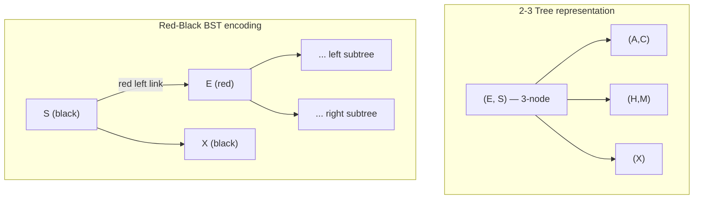

### 3.4 Rotation and Color-Flip Operations

**Left rotation** (`rotateLeft(h)`): transforms a right-leaning red link into left-leaning:

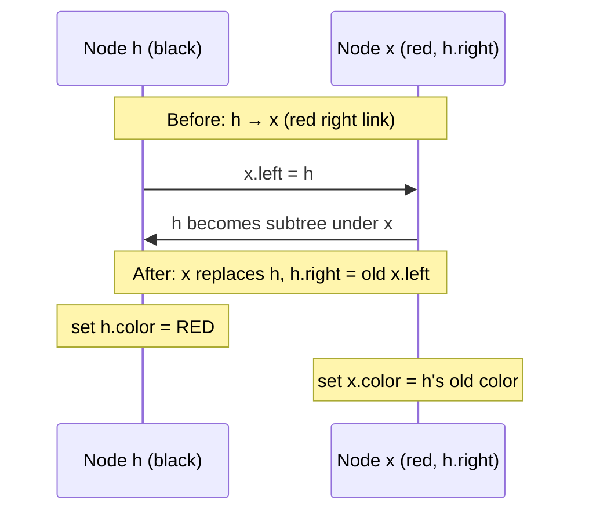

**Color flip**: when both children are red (temporary 4-node), flip colors — children become black, parent becomes red (passes "extra" link up the tree).

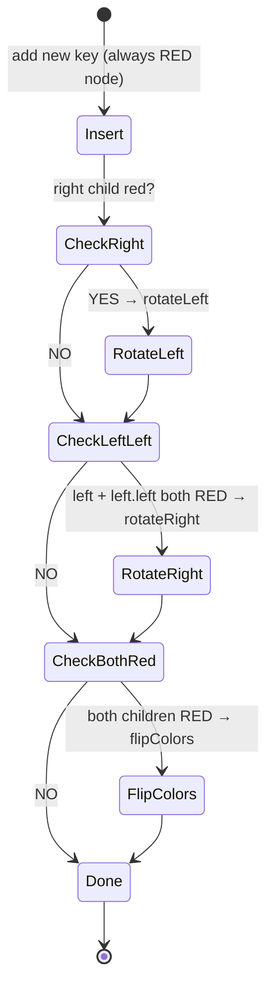

After all rotations, tree height ≤ 2 lg N. Average path length ≈ 1.00 lg N (empirically validated in Sedgewick's experiments on FrequencyCounter).

---

## 4. Hash Tables: Collision Resolution Internals

### 4.1 Separate Chaining Memory Structure

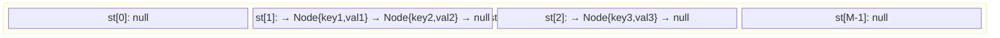

Each `Node` in the chain: `Key key` + `Value val` + `Node next` reference = ~40 bytes on 64-bit JVM.

**Hash function pipeline** for a string key `k`:
```
h = 0
for each char c in k:
    h = (31 * h + c) & 0x7fffffff   // Horner's method, strip sign bit
h = h % M                            // map to [0, M)
```

**Load factor α = N/M**: separate chaining maintains α ≈ 1–10 for O(1) average search.

### 4.2 Linear Probing — Cluster Growth

Linear probing stores key-value pairs in a flat array of size M (must be prime or power of 2). Probe sequence for key `k`: `h(k), h(k)+1, h(k)+2, ...` wrapping at M.

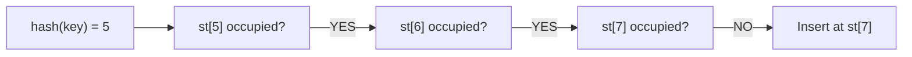

**Primary clustering**: runs of consecutive occupied slots grow, increasing average probe length. When load α > 0.5, **average cluster length** ≈ `1/(1-α)` — at α=0.9, average 10 probes per lookup.

**Resize trigger**: when N/M > 0.5, double M and **rehash all N keys** — O(N) cost amortized O(1) per insert.

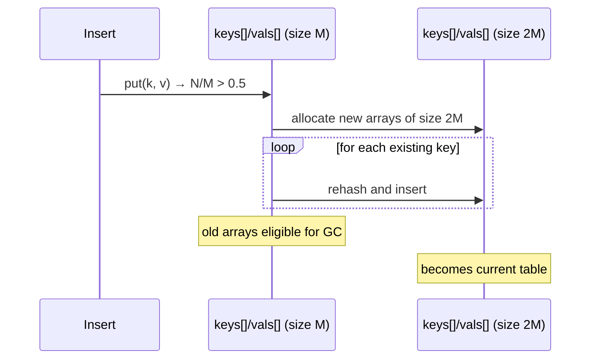

---

## 5. Graph Algorithms: Adjacency-List Memory and DFS/BFS Stack Mechanics

### 5.1 Adjacency-List Representation

```mermaid
block-beta
  columns 2
  block:V["V-element Bag[] array"]:1
    V0["adj[0]: → 2 → 1 → 5 → null"]
    V1["adj[1]: → 0 → 2 → null"]
    V2["adj[2]: → 0 → 1 → 3 → null"]
    VN["..."]
  end
  block:Mem["Memory cost"]:1
    M1["Bag array: 16 + 8V bytes"]
    M2["Each Node: 32 bytes (key+next)"]
    M3["Total edges: 2E nodes (undirected)"]
    M4["= 16 + 8V + 64E bytes"]
  end
```

Sparse graphs (E ≈ V) use O(V) memory. Dense graphs (E ≈ V²) use O(V²).

### 5.2 DFS Recursive Call Stack vs Explicit Stack

**Recursive DFS** — JVM call stack depth = longest DFS path (up to V):

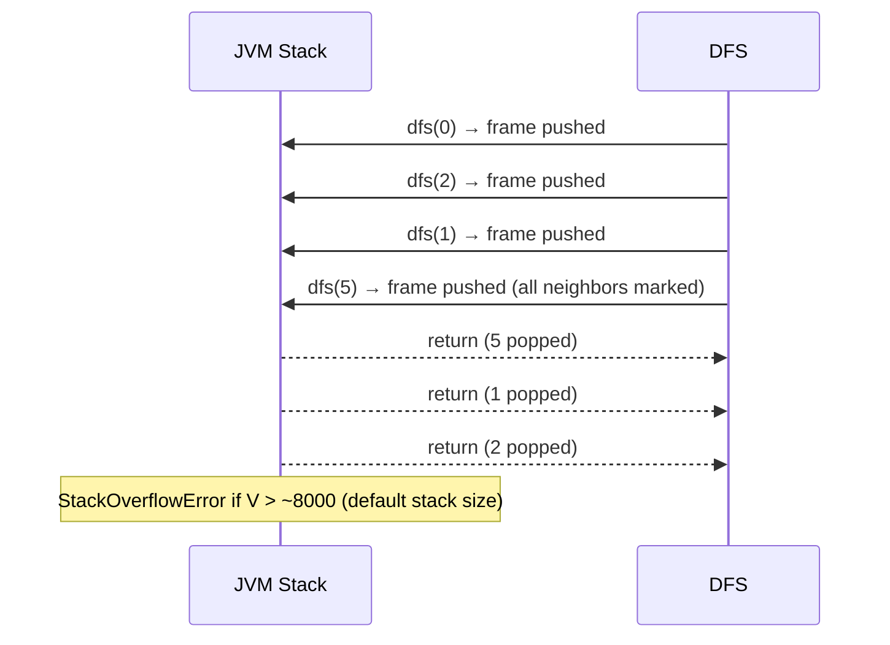

**Iterative DFS** — explicit `Stack<Integer>` on the heap avoids stack overflow:

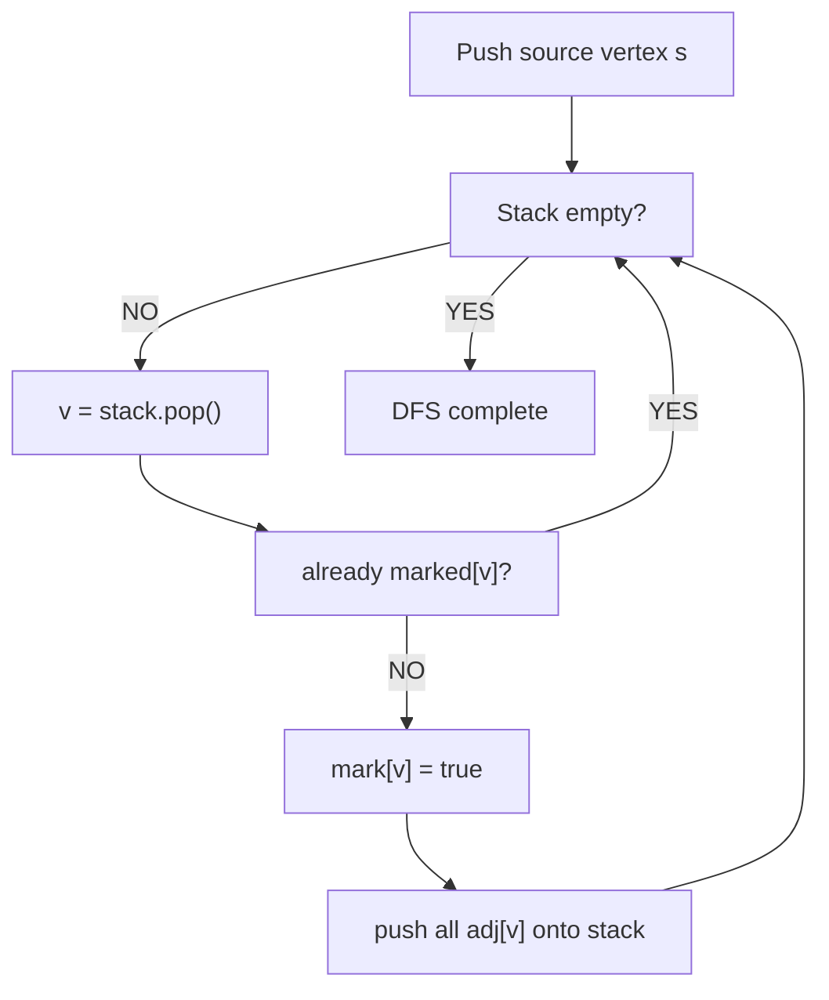

### 5.3 BFS — Queue-Based Level Traversal

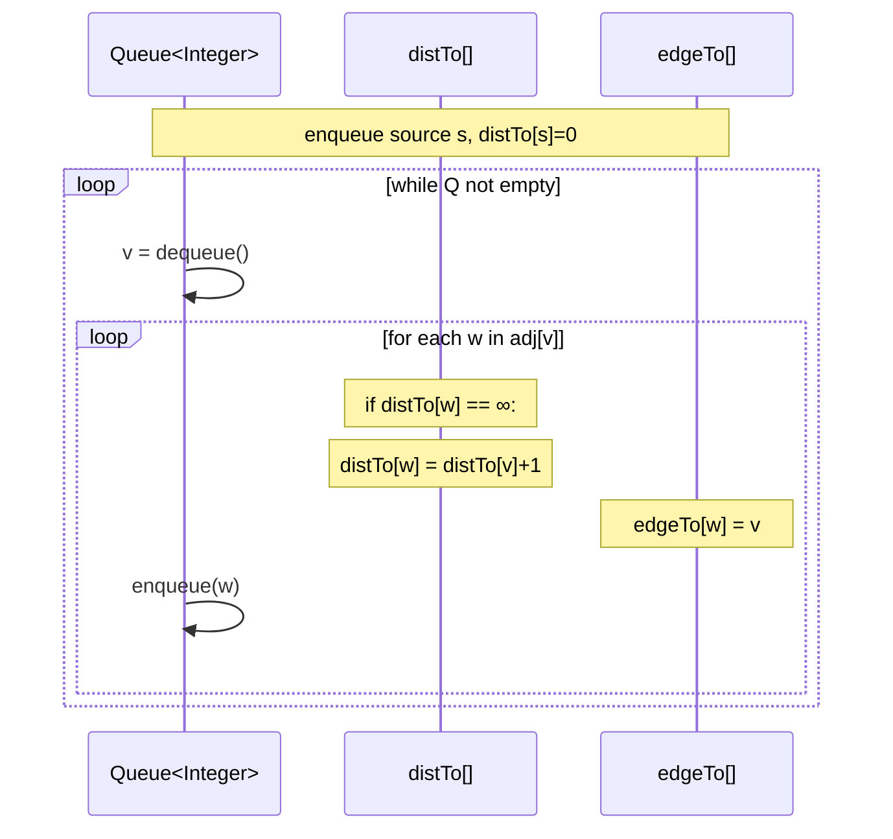

BFS guarantees shortest paths in unweighted graphs because it explores vertices in **non-decreasing distance order** — each distance d is fully explored before d+1.

### 5.4 Topological Sort — DFS Finish-Order Reversal

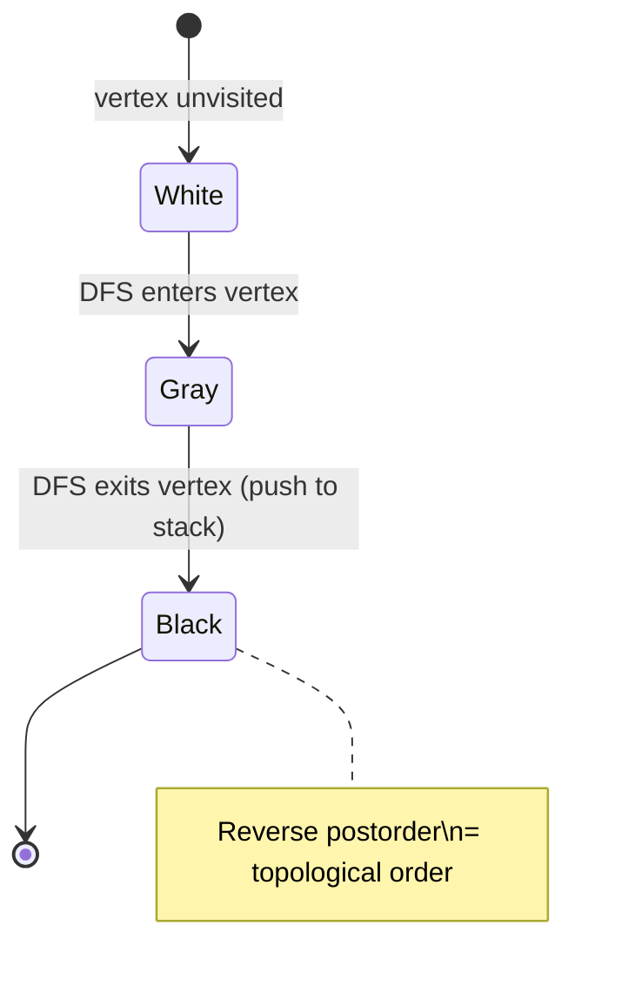

**Cycle detection**: if DFS encounters a gray vertex (back edge), a directed cycle exists → topological sort undefined.

### 5.5 Kosaraju-Sharir SCC Algorithm — Two-Pass DFS

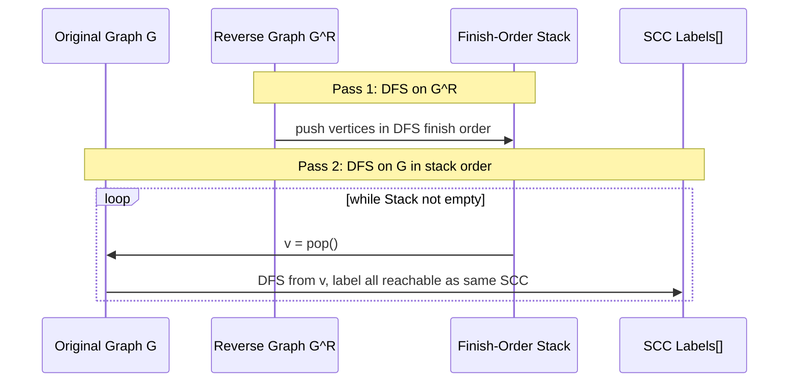

**Why it works**: vertices reachable from v in G^R = vertices that can reach v in G. The finish-order of G^R gives the reverse topological order of the DAG of SCCs.

---

## 6. Minimum Spanning Trees: Prim's and Kruskal's

### 6.1 Lazy Prim — Priority Queue State

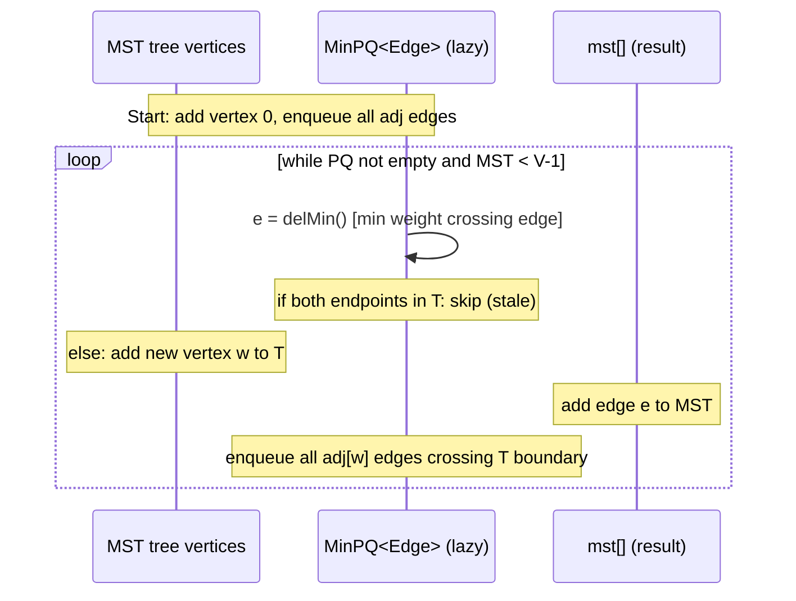

**Lazy vs Eager Prim**: lazy keeps all edges (even stale) on PQ → O(E log E) space/time. Eager Prim replaces stale entries with `decreaseKey()` → O(E log V) time using indexed priority queue.

### 6.2 Indexed Priority Queue — Key Data Structure

Eager Prim requires `decreaseKey(v, weight)` — update the priority of vertex v already on the queue. Standard binary heap cannot do this in O(log V) without knowing v's position.

**Indexed MinPQ internals:**
```
pq[]   : heap-ordered array of vertex indices (pq[i] = vertex at heap position i)
qp[]   : inverse: qp[v] = i means vertex v is at heap position i
keys[] : keys[v] = current best edge weight to reach v
```

```mermaid
flowchart LR
    A["decreaseKey(v, w)"] --> B["keys[v] = w"]
    B --> C["swim(qp[v])"] 
    C --> D["update pq[] and qp[]\nfor swapped positions"]
```

### 6.3 Kruskal's — Union-Find Integration

```mermaid
sequenceDiagram
    participant PQ as MinPQ<Edge> (all E edges)
    participant UF as UnionFind (V components)
    participant MST as Queue<Edge> (result)

    Note over PQ: Initialize: all E edges enqueued
    loop while PQ not empty and MST.size < V-1
        PQ->>PQ: e = delMin()
        Note over UF: v = e.either(), w = e.other(v)
        UF->>UF: uf.connected(v, w)?
        Note over MST: if YES → skip (would create cycle)
        Note over UF: if NO → uf.union(v, w)
        MST->>MST: enqueue e
    end
```

**Space**: O(E) for PQ + O(V) for UF. **Time**: O(E log E) dominated by PQ operations.

---

## 7. Shortest Paths: Dijkstra and Bellman-Ford

### 7.1 Dijkstra — Relaxation-Based State Machine

```mermaid
stateDiagram-v2
    [*] --> Init : distTo[s]=0, all others=∞
    Init --> ExtractMin : dequeue min-dist vertex v
    ExtractMin --> Relax : for each edge v→w, weight w_vw
    Relax --> UpdateDist : if distTo[v] + w_vw < distTo[w]
    UpdateDist --> UpdatePQ : update PQ entry for w
    UpdatePQ --> ExtractMin : continue
    ExtractMin --> [*] : PQ empty
```

**Relaxation invariant**: after processing vertex v, `distTo[v]` is the true shortest path from s to v (assuming no negative edges).

```mermaid
flowchart TD
    A["distTo[s] = 0\nenqueue s with priority 0"] --> B["v = PQ.delMin()"]
    B --> C["for each v→w edge (weight e)"]
    C --> D["distTo[v] + e < distTo[w]?"]
    D -->|YES| E["distTo[w] = distTo[v] + e\nedgeTo[w] = v\nPQ.decreaseKey(w, distTo[w])"]
    D -->|NO| F["skip"]
    E --> B
    F --> B
    B --> G["PQ empty → done"]
```

### 7.2 Bellman-Ford — Negative Edge Handling

Dijkstra fails with negative edges. Bellman-Ford relaxes **all V-1 passes over all E edges**:

```mermaid
sequenceDiagram
    participant Edges as All E edges
    participant Dist as distTo[]
    participant Edge as edgeTo[]

    loop pass = 1 to V-1
        loop for each edge v→w, weight e
            Edges->>Dist: if distTo[v] + e < distTo[w]:
            Dist->>Dist: distTo[w] = distTo[v] + e
            Dist->>Edge: edgeTo[w] = v
        end
    end
    Note over Edges,Edge: Pass V: if any update → negative cycle detected
```

**Queue-based optimization**: only relax edges from vertices whose `distTo` changed in the previous pass → O(EV) worst case but O(E) typical (≈ E/V relaxations per pass).

---

## 8. String Algorithms: Tries and KMP

### 8.1 R-Way Trie — Node Memory Layout

Each trie node holds an array of R references (R = alphabet size, typically 256 for extended ASCII):

```
TrieNode:
  val: Object (null if no key ends here)
  next: Node[R]  (R × 8 bytes references = 256×8 = 2048 bytes per node!)
```

**Memory problem**: for ASCII, each empty node wastes 2048 bytes. A trie with N keys has O(N log_R N) nodes → **O(N log_R N × R) bytes** total — unacceptably large for large R.

**Ternary Search Tries (TST)** solve this: each node has 3 links (left/mid/right) and one character, not R links:

```mermaid
flowchart TD
    subgraph TST["TST Node Structure (32 bytes)"]
        C["char c (2B + 6B pad)"]
        L["left link (8B)"]
        M["mid link (8B)"]
        R["right link (8B)"]
        V["val ref (8B)"]
    end
```

### 8.2 KMP — Failure Function Construction

Knuth-Morris-Pratt builds a deterministic finite automaton (DFA) from the pattern before searching. The DFA `dfa[c][j]` = next state when at state j and reading character c.

```mermaid
sequenceDiagram
    participant Pat as Pattern "ABABAC"
    participant DFA as dfa[256][M] array
    participant X as restart state X

    Note over DFA: Build phase O(RM):
    DFA->>DFA: dfa[pat[0]][0] = 1 (initial)
    loop j = 1 to M-1
        loop c = 0 to R-1
            DFA->>DFA: dfa[c][j] = dfa[c][X]  (mismatch: copy restart state)
        end
        DFA->>DFA: dfa[pat[j]][j] = j+1  (match: advance)
        DFA->>X: X = dfa[pat[j]][X]  (update restart state)
    end
```

**Search phase** O(N): scan text left-to-right, transition DFA states. No backtracking — text pointer never moves backward.

---

## 9. Algorithm Complexity Summary

```mermaid
block-beta
  columns 4
  block:h1["Algorithm"]:1
  block:h2["Time (worst)"]:1
  block:h3["Time (avg)"]:1
  block:h4["Space"]:1
  
  block:r1["Union-Find (weighted+compress)"]:1
  block:r2["O(N α(N))"]:1
  block:r3["O(N α(N))"]:1
  block:r4["O(N)"]:1

  block:r5["Mergesort"]:1
  block:r6["O(N log N)"]:1
  block:r7["O(N log N)"]:1
  block:r8["O(N) aux"]:1

  block:r9["Quicksort (3-way)"]:1
  block:r10["O(N²)"]:1
  block:r11["O(N log N)"]:1
  block:r12["O(log N) stack"]:1

  block:r13["Red-Black BST"]:1
  block:r14["O(log N)"]:1
  block:r15["O(log N)"]:1
  block:r16["O(N)"]:1

  block:r17["Hash (linear probe)"]:1
  block:r18["O(N)"]:1
  block:r19["O(1) amort."]:1
  block:r20["O(N) amort."]:1

  block:r21["Dijkstra (indexed PQ)"]:1
  block:r22["O(E log V)"]:1
  block:r23["O(E log V)"]:1
  block:r24["O(V)"]:1

  block:r25["Bellman-Ford"]:1
  block:r26["O(VE)"]:1
  block:r27["O(E)"]:1
  block:r28["O(V)"]:1

  block:r29["Prim's MST (eager)"]:1
  block:r30["O(E log V)"]:1
  block:r31["O(E log V)"]:1
  block:r32["O(V)"]:1
```

---

## 10. Object Memory Overhead — JVM Internals

Sedgewick explicitly analyzes memory, which requires understanding the JVM object model:

```mermaid
block-beta
  columns 2
  block:prim["Primitive Arrays"]:1
    I["int[N]: 24 + 4N bytes"]
    D["double[N]: 24 + 8N bytes"]
    C["char[N]: 24 + 2N bytes"]
  end
  block:obj["Object Arrays"]:1
    OA["Object[N]: 16 + 8N bytes\n(+ each object's own size)"]
    STR["String: 40 bytes\n(+ char[] backing array)"]
    NODE["BST Node: ~56 bytes"]
  end
```

**Historical `String.substring` layout:** Older JDK implementations could share a backing array through offset/count fields. Modern JDKs copy the requested range, and object size depends on the runtime; use a valid range such as `genome.substring(6, 9)` and verify the target JDK. KMP's O(N) bound follows from its automaton/failure-function invariant, not from substring sharing.

---

## 11. Data Flow: From Client API to Memory Operations

```mermaid
flowchart TD
    Client["Client Code:\nbst.put('S', 42)"] --> API["BST.put(key, val)"]
    API --> Compare["key.compareTo(node.key)"]
    Compare -->|lt| Left["recurse left subtree"]
    Compare -->|gt| Right["recurse right subtree"]
    Compare -->|eq| Update["node.val = val\nnode.N unchanged"]
    Left --> NewNode["if null: allocate Node\n56 bytes on JVM heap"]
    Right --> NewNode
    NewNode --> UpdateN["update N counts\nback up call stack"]
    UpdateN --> RB_Fix["Red-Black: check colors\nrotate/flip if needed"]
    RB_Fix --> GC["unreferenced nodes\neligible for GC"]
```

Every `put()` on a Red-Black BST:
1. Descends the tree (O(log N) pointer dereferences, each potentially a cache miss)
2. Allocates a new 56-byte Node on the JVM heap (if key is new)
3. Unwinds the call stack, updating `N` counts and performing ≤3 rotations
4. Total: ≤ 2 lg N + 3 pointer operations, with predictable memory access patterns

---

*Document synthesized from Sedgewick & Wayne, Algorithms 4th Ed., Princeton University, covering Union-Find (Ch. 1.5), Sorting (Ch. 2), Symbol Tables (Ch. 3), Graphs (Ch. 4), and Strings (Ch. 5).*
