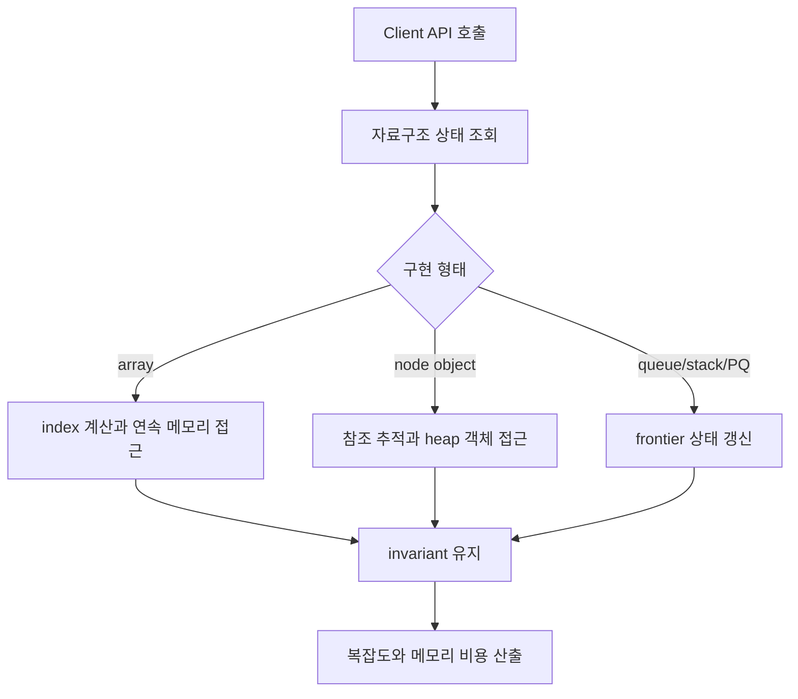
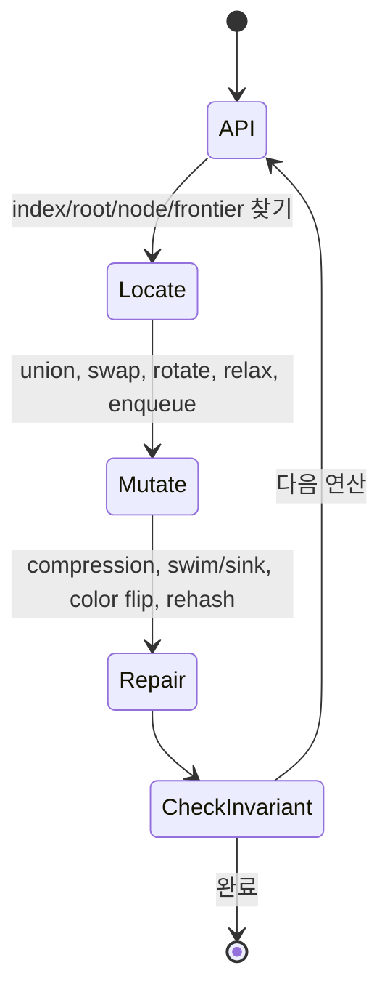

# Sedgewick Algorithms 내부 메커니즘 학습 및 기록 노트

## 1. 왜 필요한가? (Pain Point & Motivation)

Sedgewick & Wayne의 Algorithms는 Java 구현을 통해 알고리즘을 설명한다. 그래서 같은 `O(log N)`이라도 실제로는 배열 접근, 객체 참조, heap allocation, pointer chasing, cache locality, JVM stack depth 같은 실행 비용이 함께 따라온다.

이 문서는 원문의 Union-Find, sorting, symbol table, graph, string 알고리즘을 "API 호출이 메모리 연산으로 어떻게 내려가는가"라는 관점에서 다시 정리한다.

## 2. 현재 나의 상태 (Baseline)

- weighted quick-union, path compression, merge sort, quicksort, red-black tree, hash table, graph search의 기본 원리는 알고 있다.
- Java 배열과 객체 참조가 실제 메모리 비용에 어떤 차이를 만드는지 정리할 필요가 있다.
- Sedgewick의 3-way quicksort, left-leaning red-black tree, indexed priority queue 같은 구현 세부를 각각 따로 외우고 있다.
- DFS/BFS, SCC, MST, shortest path가 모두 adjacency list 위에서 어떤 queue/stack/PQ 상태를 쓰는지 연결이 약하다.
- trie와 KMP의 문자열 처리 방식이 메모리 비용과 어떻게 맞물리는지 더 명확히 해야 한다.

## 3. 도달하고 싶은 목표 (Target State)

- Java 구현 기준으로 배열, 객체, 참조, node 기반 자료구조의 비용을 추정한다.
- Union-Find, sorting, symbol table, graph algorithm의 핵심 invariant를 구현 코드와 연결한다.
- eager Prim의 indexed priority queue처럼 알고리즘 요구사항이 자료구조 형태를 어떻게 결정하는지 설명한다.
- recursive DFS와 iterative DFS의 stack 위치 차이를 이해한다.
- Sedgewick식 알고리즘 엔지니어링 관점에서 이론 복잡도와 실제 메모리 접근 비용을 함께 본다.

## 4. 시스템 번역 (Data Flow)



Sedgewick 문서의 data flow는 API 표면에서 끝나지 않는다. `put`, `find`, `delMin`, `dfs` 같은 호출이 배열 쓰기, 객체 할당, rotation, heap swim/sink로 내려가는 흐름을 추적해야 한다.

## 5. 핵심 구성요소 (Building Blocks)

| 구성요소 | 내부 표현 | 핵심 메커니즘 |
| --- | --- | --- |
| Weighted quick-union | `id[]`, `sz[]` 배열 | 작은 tree를 큰 tree 밑에 붙인다. |
| Path compression | parent pointer 갱신 | `find` 경로의 node를 root에 직접 연결한다. |
| Merge sort | `aux[]` 보조 배열 | sequential merge로 안정 정렬을 수행한다. |
| 3-way quicksort | `< pivot`, `= pivot`, `> pivot` 영역 | 중복 key에서 불필요한 재귀를 제거한다. |
| Red-black BST | color link와 rotation | 2-3 tree를 binary tree로 encoding한다. |
| Hash table | chaining 또는 linear probing | load factor를 관리해 lookup 비용을 낮춘다. |
| Indexed MinPQ | `pq[]`, `qp[]`, `keys[]` | vertex 위치를 알아야 `decreaseKey`가 빠르다. |
| Adjacency list | vertex별 bag/list | sparse graph를 `O(V+E)` 메모리로 표현한다. |
| Trie/TST | 문자별 link 구조 | prefix search를 상태 전이로 처리한다. |
| KMP DFA/failure state | pattern 기반 전이 table | text pointer backtracking을 제거한다. |

## 6. 상태 전이 (State Transition)



Union-Find는 `find`가 root를 찾은 뒤 parent 배열을 고친다. Red-black tree는 삽입 후 rotation과 color flip으로 balance를 복구한다. Indexed PQ는 `decreaseKey` 후 `swim`으로 heap invariant를 되살린다.

## 7. 불변식 (Invariant: 절대 깨지면 안 되는 규칙)

- Union-Find의 root는 `id[root] == root`를 만족해야 한다.
- Weighted union은 component size/rank 정보를 실제 parent 변경과 함께 갱신해야 한다.
- Merge sort의 merge 입력 run은 이미 정렬되어 있어야 한다.
- 3-way quicksort는 `lt`, `i`, `gt` pointer가 세 영역의 경계를 정확히 유지해야 한다.
- Red-black BST는 오른쪽으로 기운 red link와 연속 red link를 정리해야 한다.
- Linear probing hash table은 삭제/resize 후에도 probe chain이 끊기면 안 된다.
- BFS는 `distTo[w] = distTo[v] + 1`이 처음 발견 시점에 확정되어야 한다.
- Dijkstra는 음수 간선이 없고, PQ key가 현재 최단 후보 거리와 일치해야 한다.
- KMP는 mismatch 후 restart state가 이미 일치한 prefix 정보를 보존해야 한다.

## 8. 가장 작은 예제 (Minimal Viable Example)

```java
final class WeightedQuickUnion {
    private final int[] parent;
    private final int[] size;

    WeightedQuickUnion(int n) {
        parent = new int[n];
        size = new int[n];
        for (int i = 0; i < n; i++) {
            parent[i] = i;
            size[i] = 1;
        }
    }

    int find(int x) {
        while (x != parent[x]) {
            parent[x] = parent[parent[x]];
            x = parent[x];
        }
        return x;
    }

    void union(int a, int b) {
        int rootA = find(a);
        int rootB = find(b);
        if (rootA == rootB) {
            return;
        }
        if (size[rootA] < size[rootB]) {
            parent[rootA] = rootB;
            size[rootB] += size[rootA];
        } else {
            parent[rootB] = rootA;
            size[rootA] += size[rootB];
        }
    }
}
```

이 예제는 Sedgewick식 설명의 핵심을 보여준다. 알고리즘의 성능은 추상 수식뿐 아니라 `parent[]`와 `size[]` 배열이 어떤 순서로 갱신되는지에 달려 있다.

## 9. 실패 사례 (What could go wrong?)

- Union-Find에서 size를 갱신하지 않으면 weighted union이 깨져 tree가 깊어진다.
- Recursive DFS는 graph가 깊으면 JVM stack overflow를 일으킬 수 있다.
- Lazy Prim은 stale edge를 많이 PQ에 남기므로 dense graph에서 메모리와 시간이 커질 수 있다.
- Indexed PQ에서 `pq[]`와 `qp[]` inverse 관계가 깨지면 `decreaseKey`가 잘못된 vertex를 이동시킨다.
- Linear probing 삭제를 단순히 `null`로 처리하면 그 뒤에 있는 key를 더 이상 찾지 못할 수 있다.
- 예전 Java substring 구현의 공유 backing array 최적화를 현대 JVM에서도 당연하다고 가정하면 잘못된 메모리 추정이 된다.
- Red-black tree rotation 뒤 subtree size나 color를 갱신하지 않으면 균형 조건 또는 ordered operation이 깨진다.

## 10. 뇌 확장하기 (Evolution & Variants)

- Union-Find는 percolation, Kruskal, dynamic connectivity의 공통 기반으로 확장된다.
- Sorting은 insertion sort cutoff, shuffle before quicksort, 3-way partition, stability 요구를 함께 튜닝한다.
- Symbol table은 ordered operation이 필요하면 red-black BST, 평균 lookup이 중요하면 hash table을 선택한다.
- Graph는 adjacency matrix보다 adjacency list가 sparse graph에서 메모리 효율이 높다.
- MST는 lazy Prim, eager Prim, Kruskal을 graph density와 PQ/UF 비용으로 비교한다.
- String search는 trie/TST/KMP/suffix array처럼 query 종류와 alphabet 크기에 따라 구조가 달라진다.
- Java 객체 비용 분석은 JDK 버전, compressed oops, compact strings, GC 설정에 따라 달라질 수 있으므로 실측으로 확인한다.

## 11. 최종 체크리스트 (Definition of Done)

- [x] Sedgewick & Wayne 원문의 Java 구현 관점을 메모리 상태 중심으로 재정리했다.
- [x] Union-Find, sorting, symbol table, graph, string 알고리즘의 핵심 invariant를 정리했다.
- [x] Weighted quick-union 최소 예제로 배열 상태 갱신을 설명했다.
- [x] indexed priority queue, DFS stack, hash probing, JVM 객체 비용의 실패 사례를 포함했다.
- [x] 오래된 Java substring 최적화처럼 구현 버전에 의존하는 가정을 분리했다.

## 12. 뇌에 새기는 복습 문장 (TL;DR Blank)

Sedgewick식 알고리즘 학습의 핵심은 API가 아니라 그 아래의 배열, 참조, queue, rotation, heap 조작을 보는 것이다. 이론 복잡도는 실제 상태 전이가 올바를 때만 의미가 있다.
